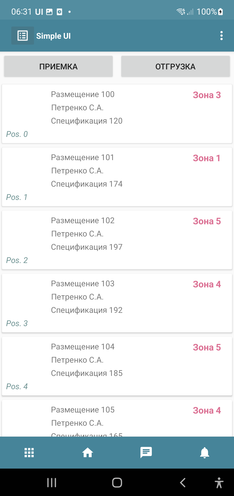
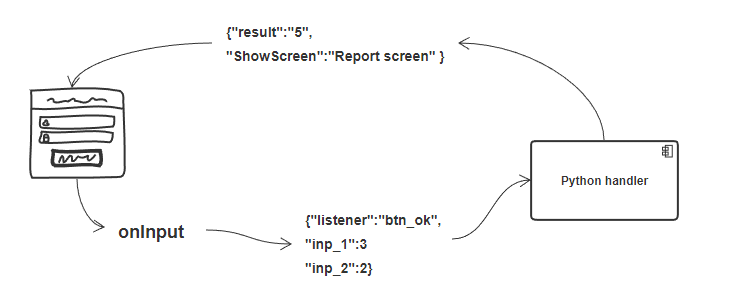
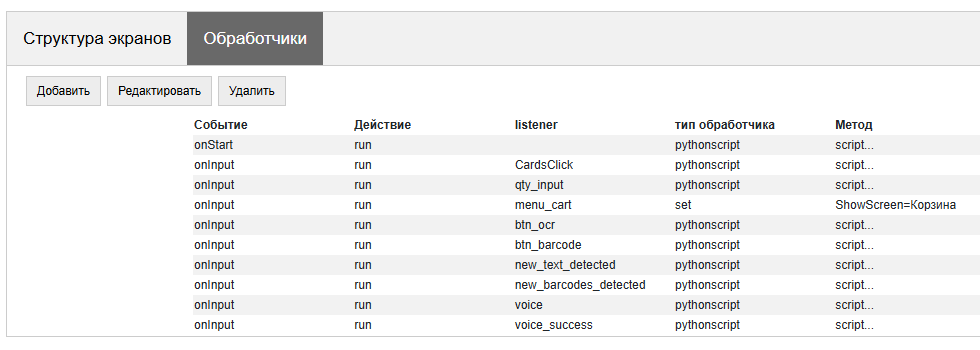
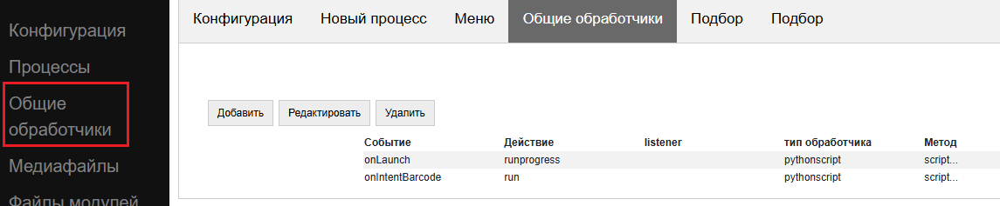
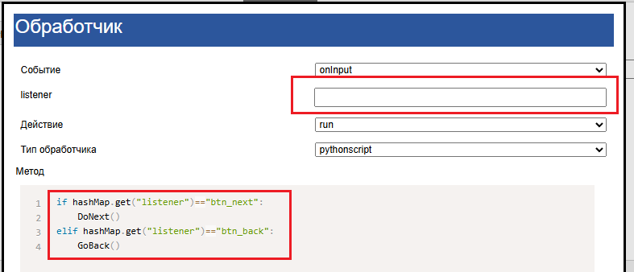
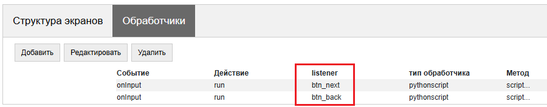
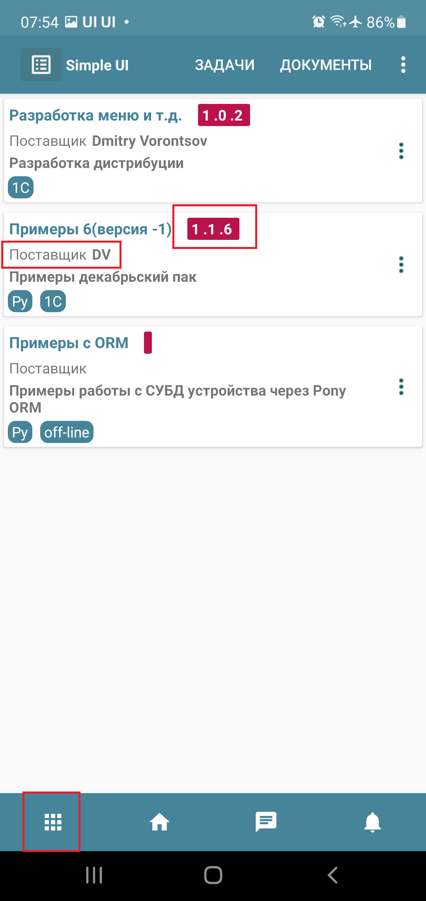
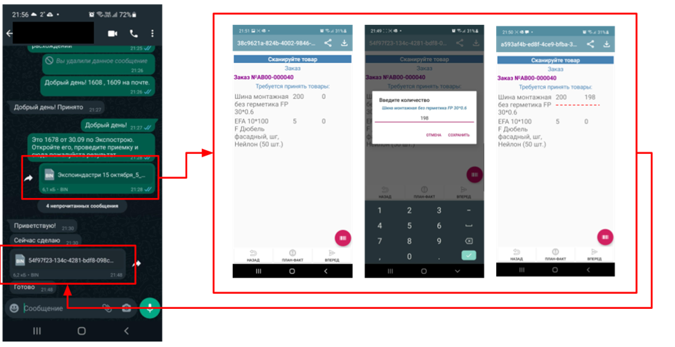
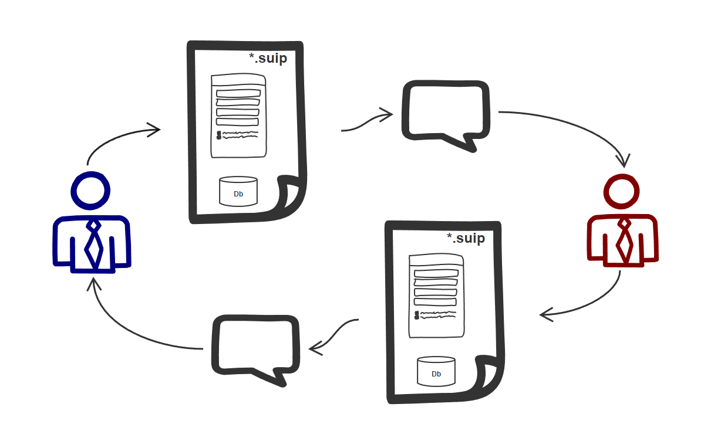

.. SimpleUI documentation master file, created by
   sphinx-quickstart on Sat May 16 14:23:51 2020.
   You can adapt this file completely to your liking, but it should at least
   contain the root `toctree` directive.

Архитектура прикладного решения
=================================

Прикладные решения в SimpleUI, так называемые *конфигурации* – это JSON-объекты определенной структуры описывающие визуальные формы и логику приложения. Обычно это JSON-файлы (формат .ui), но в широком смысле можно сказать что конфигурация – это строка JSON структуры. Она может быть передана на устройство как файлом (в буквальном смысле быть открыта приложением SimpleUI), так и в виде строки (например из переменной в обработчике или через запрос). 

Приложение интерпретирует конфигурацию: создает экраны и прочие элементы интерфейса, выполняет обработчики событий с помощью разных интерпретаторов (локальных и во внешних системах). 

Конфигурации для SimpleUI весьма компактны, благодаря этому развертывание и обновление редко занимает больше 0.5 секунды. Также и с загрузкой прикладного решения. Благодаря свойству компактности также существует особый вид конфигураций- процессов (.suip) https://infostart.ru/1c/articles/1542393/ объединяющий конфигурацию и данные в одном файле, примерно как Excel с макросами

Прикладное решение SimpleUI обычно представляют из себя набор процессов с экранами, содержащие какие-то поля и управляющие элементы. Элементы (и другие события в экранах, и вне экранов генерируют различные события. Эти события обрабатываются в обработчиках – на python и других языках, а данные из форм, из событий передаются в обработчики через стек переменных. Этот раздел посвящен тому, из чего состоит конфигурация и как все устроено с данными и обработчиками.  

Какие объекты есть в конфигурации?
------------------------------------

Процессы
~~~~~~~~~~~

Конфигурации состоят из **процессов**. Обычно процесс – это аналог какого бизнес-процесса, но необязательно, процесс также может иметь вспомогательную или иную роль. Процесс имеет имя. По этому имени к нему можно обратиться из кода.

Процесс состоит из одного или нескольких **экранов**, и по сути является просто контейнером для экранов<ссылка>, который можно вызвать из меню (при старте процесса запускается всегда первый экран). Никакой другой логики на самом процессе нет – она вся сосредоточена на экранах.

Процессы, добавленные в конфигурации по умолчанию, если не переопределять меню, отображаются в меню процессов при запуске конфигурации. Чтобы скрыть процесс из этого меню, можно установить галку «Не показывать в меню»

Также, можно указать что процесс будет запускаться при старте (например для логина)

У процесса можно отключить кнопку «назад», чтобы переопределить логику (при нажатии кнопки Назад, не будет закрываться экран процесса и возврат на главное меню, вместо этого будет генерироваться событие ON_BACK_PRESSED и обработка на стороне разработчика)

И также процесс может быть самостоятельным файл-процессом (галка SUIP). Об этом в главе Самостоятельные процессы

Фоновый сервис
~~~~~~~~~~~~~~~~

.. note:: Фоновый сервис не единственный механизм фоновой и асинхронной работы. Просто один из нескольких в SimpleUI. См. Фоновая работа.

При запуске приложения запускается и постоянно присутствует сервис для фоновых задач. Он не имеет визуального функционала, тем не менее он также может быть источником событий. Через фоновый сервис по умолчанию работают:

 * Чтение штрихкодов через Bluetooth-сканеры
 * Подписка на intents внешних приложений
 * Клиент WebSocket
 * Клиент шины SimpleBus
 * Распознавание речи в фоне (вне запущенных процессов)
 * Прочие обработчики, если управление передано на фоновый сервис командой BackgroundCommand (можно передать на фоновый сервис выыполнение обработчика, это отличатся от асинхронного выполнения, с точки зрения системы – обработка на фоновом сервисе будет резидентной бесконечно. Для передачи надо отправить команду BackgroundCommand с любым строковым параметром (вопринимается как команда), тогда сработает общее событие onBackgroundCommand 

Меню процессов и меню опций
~~~~~~~~~~~~~~~~~~~~~~~~~~~~~~~~

.. image:: _static/menu_pic.png
       :scale: 55%
       :align: center

По умолчанию меню процессов заполняется автоматически всеми процессами (кроме тех, у которых включена галочка "Не показывать в меню"). Процессы запускаются из него, по завершению возвращаются на него. 

Меню процессов также может считаться объектом прикладного решения, потому что помимо просто запуска процессов его можно переопределить в самостоятельный объект. По сути это будет как экран, со своей логикой, но несколько урезанной функциональностью. Запуск процессов (из кнопок, элементов списка и т.д.) придется прописывать самостоятельно используя команды StartProcess)

Через Конфигурация-Начальный экран можно поставить тип меню «Процесс» и выбрать процесс (указать в поле «Процесс для меню»), который будет отображаться в качестве меню при запуске конфигурации (на который будут возвращаться все процессы). Отображается первый экран в процессе.

.. note:: Меню не поддерживает весь доступный функционал экрана в процессе. Такие вещи как работа с оборудованием, чтение клавиатуры экрана и т.д. – не работают. Функционал примерно соответствует содержимому окна диалога или списка карточек.

События возникающие на экране (например нажатие кнопок, загрузка меню) обрабатываются не в процессе, который определен для меню (он только для отрисовки), а в Общих обработчиках onInputMenu, onStartMenu

Меню опций (справа вверху) содержит набор стандартных пунктов, но может быть переопределено на закладке Главное меню

 * Если на закладке Главное меню выбрать хотябы один элемент, то меню считается переопределенным и отобразятся только выбранные элементы. Так можно настроить состав стандартных элементов
 * Можно добавить свои пункты меню (Custom menu item) у которых надо обязательно задать числовой ID и по желанию можно соделать отображение в тулбаре (можно задавать в виде Awesome-иконки, см. в разделе общие функции). В случае добавления своих пунктов на Фоновом сервисе будет вызвано общее событие onBackgroundCommand c c listener="menu_<ИД пункта меню>")

Чат и задачи
~~~~~~~~~~~~~~~

описание готовится

События и обработчики
----------------------------

Элементы форм, внешнее оборудование (например сканеры штрихкодов) и другие механизмы (например таймеры) порождают события. События обрабатываются в обработчиках либо онлайн (на стороне бек-системы) либо локально в приложении и в результате обработки в стек переменных помещаются переменные, которые отображаются на экранах, команды, управляющие приложением (переключение экранов, вывод списков, звуки и озвучка голосом и т.д.)

.. note:: Чтобы понять логику обработчиков, какие переменные помещаются в тех или иных событиях, можно воспользоваться режимом отладки через шину (см. раздел Отладка)

На каждое событие можно подписать:

 * Любое количество любых обработчиков. Т.е. можно например, выполнить Python, потом онлайн, потом снова Python
 * Каждому из событий массива может по завершению (postExecute) назначить свой массив обработчиков
 * Если на событие определено в массиве несколько обработчиков, то они вызываются в порядке расположения в массиве друг за другом
 * Асинхронные обработчики также будут запускаться друг за другом, но порядок их завершения зависит от длительности каждого обработчика

Таким образом можно реализовать бесконечную цепочку параллельных и последовательных обработчиков, привязанных к событию

Обработчики событий указываются в виде массива обработчиков – либо в конструкторе либо в коде. В обоих случаях архитектура одинакова – это JSON массив объектов. Массив привязывает (или подписывает) к событиям их обработчики

Обработчики задаются в экране (в ключе экрана Handlers)

Существуют общие обработчики системы в целом (вне экранов) (в ключе конфигурации CommonHandlers)

И также обработчики в виде массива можно запускать в коде (командой RunEvent)

.. code-block:: Python

 handlers = [{"action": "run", "type": "python", "method": "button_1_handler"}]   
 
 hashMap.put("RunEvent",json.dumps(handlers))       
 
 #или тоже самое
 RunEvent(json_to_str(handlers))

Структура массива обработчиков
~~~~~~~~~~~~~~~~~~~~~~~~~~~~~~~~~~~

Пример массива из одного простого синхронного обработчика в строковом виде:

.. code-block:: JSON

 [{"action": "run", "type": "python", "method": "post_online"}]

В общем случае синтаксис состоит из следующих элементов:

.. code-block:: JSON

 [
             {
                 "event":/*<фильтр по типу события>*/,
                 "action":/*<вид выполнения>*/,
                 "listener":/*фильтр по названию события*/,
                 "type": /*тип обработчика*/,
                 "method": /*имя метода/текст метода*/,
               "postExecute": /*массив обработчиков по завершению*/,
                 "alias": /*псевдоним строки обработчиков*/
             }
 ]

Где:
 
 **event (<фильтр по типу события>)**.Тип события. 

Для экранов event может быть:
 
 * **onStart** – событие при запуске экрана
 * **onPostStart** – событие после запуска экрана и отрисовки всех элементов
 * **onInput** – событие ввода на экране

Для Общих обработчиков:

 * **onLaunch** - при запуске перед формированием главного меню. Так как вызывается до формирования меню, то в этом обработчике например можно перерисовать меню или заполнить плитки. По сути заменяет таймер с периодом -1, который также можно использовать для этой цели.
 * **onLaunchMenu** - событие возникает после полной загрузки приложения при запуске
 * *onIntentBarcode* – получение штрихкода через подписку на Intent на уровне платформы в целом(до экрана). Например может использоваться для работы со сканером без экранов либо для пред проверки штрихкодов. В переменные помещается: listener="barcode", barcode=<штрихкод>
 * **onBluetoothBarcode** – получение штрихкода от подключенного Bluetooth-сканера на уровне платформы в целом. В переменные помещается: ``listener="barcode", barcode=<штрихкод>``
 * **onBackgroundCommand** – получение события onBackgroundCommand в сервисе событий, отправленного из какого то обработчика (командой-переменной BackgroundCommand ) . В   listener помещается аргумент команды BackgroundCommand
 * **onRecognitionListenerResult** – события по результату распознавания речи после использования команды voice в сервисе. В переменные помещается: ``listener="voice_success", voice_result=<распознанная фраза>``
 * **onIntent** – получения сообщения от другого Андроид-приложения (подписка на Intent). Из сообщения извлекаются поле “body” и помещается в переменную. Через него можно передавать данные от другого приложения.
 * **onWebServiceSyncCommand** – получения команды через встроенный веб-сервер приложения. На адрес веб-сервиса ``<адрес устройства>:8095` можно послать запрос GET или POST (если нужно передать данные то POST) вида ``http://<адрес устройства>:8095?mode=SyncCommand&listener=<произвольное название обработчика>``. В эжтот момент срабатывает данное событие. Обработчик может что то поместить в переменные и все переменные отправляются назад в виде JSON объекта. Но, можно также не отправлять все переменные а переопределить ответ(напрмиер сделать не JSON а строковый) с помощью команды WSResponse
 * **onSQLDataChange** и **onError** возникают при выполнении любой записи в SQL если запрос идёт через SQL-провайдера (onError в случае ошибки). Таким образом можно например перехватывать записываемые данные централизованно и помещать их в очередь на отправку.
 * **onOpenFile** – событие, в котором можно получить файл, открытый приложением. С приложением можно поделиться текстовым файлом любым способом (через Поделиться… и через Открыть с помощью…) даже если приложение не открыто. При этом срабатывает обработчик и в переменные content и extra_text помещается содержимое файла и ссылка на файл.
 * **onHandlerError** - любую run-time ошибку можно перехватить в общем событии onHandlerError, а сообщение об ошибке пишется в переменную **HandlerErrorMessage**. И написать свой обработчик для этой ошибки.
 * **onProcessClose** - на закрытие любого процесса возникает событие **onProcessClose** , а имя закрытого процесса помещается в переменную **_closed_process**
 * **onCloseApp** - событие закрытия приложения
 * **WSIncomeMessage** - событие входящего сообщения (WebSocket)
 * **onDirectWIFIMessage** - получение сообщения DirectWIFI
 * **onSimpleBusMessage**, **onSimpleBusRenponse**, **onSimpleBusMessageDownload**,**onSimpleBusError**, **onSimpleBusConfirmation** – события шины SimpleBus, описанные в разделе SimpleBus
 * **onNFC** – событие распознавания определенной NFC метки приложением (не экраном), см. раздел NFC
 * **onInputMenu** – событие ввода переопределенного меню конфигурации
 * **onStartMenu** – событие запуска переопределенного меню конфигурации
 * **onPelicanInitAction** – доступны переменные PelicanInitDatabase и PelicanInitAction – событие по каждой базы из списка инициализации и для каждого шага. Например можно выводить уведомления об этом
 * **onPelicanInitialized** – событие, когда вся инициализаци завершена
 * **onPelicanInitError** – ошибка в процессе инициализации

**listener (<фильтр по названию события>)** (необязательный)- события ввода экрана и некоторые общие события дополнительно делятся по названию события (по сути – источник), оно указывается в стеке переменных в переменной listener. В некоторых случаях разработчик может задавать его сам – например можно вызвать модальный диалог и указать listener, который будет в событии ввода по завершению. Можно не прописывать фильтр по listener, тогда в обработчик в этой строке будут попадать все события данного типа с разными listener. В таком варианте логика переключения по типам источников событий находится внутри обработчика

Если указать listener то будет попадать только нужный источник события. Обычно listener лучше указывать – так конфигурация более читаемая

**action(<вид выполнения>)** – указывает как нужно выполнять обработчик: 

 * *run* -синхронное выполнение
 * *runasync* (асинхронное выполнение) – обработчик запускается в фоне, не блокируя основной UI-поток, 
 * *runprogress* – выполнение с индикатором выполнения, экран перекрывает вращающийся индикатор долгого процесса, интерфейс заблокирован от действий пользователя. 

Для обработчиков, предполагающих быстрое выполнение, следует использовать run. В случае предполагаемых долгих процессов (например большой запрос к внешней системе) лучше использовать либо runasync либо runprogress, иначе Андроид воспринимает это как зависание приложения и генерирует ошибку ANR

**type (<тип обработчика>)** – тип выполняемого обработчика события. 

Доступны следующие типы:

 * *online* или *onlinews* – обработчик выполняется в рамках выполнения синхронного HTTP-запроса (online) либо через WebSocket-шину (onlinews) на стороне внешней системы. Подробнее в разделе Связь
 * *pythonscript* – python-обработчик события, который упакован в строку массива обработчиков в виде base64-строки. Можно редактировать прямо в конструкторе. Подробнее в разделе Python-обработчики
 * *python*, *pythonbytes*, *pythonargs* – Python-обработчики событий, которые вызываются по имени функции, а сами функции находятся в подключаемом файле. Они подключаются при сборке конфигурации в виде внешних py-файлов и  упакованы в виде base64-строки в ключе конфигурации PyHandlers. Подробнее в разделе Python-обработчики
 * *js* – интерпретатор JavaScript-скрипта. Подробнее в разделе JavaScript-обработчики
 * *set* – обработчик записи в стек переменных переменных и команд-переменных. Используется наряду с прочими обработчиками потому что наиболее быстрый со всех точек зрения обработчик. Кроме того это «нативный» метод, т.е. он будет выполнен всегда(python, например будет выполнен только если приложение резидентно в памяти) Может содержать одно или несколько выражений установки переменных в стек переменных, разделенных ";" Можно писать переменную без параметра. Например "beep" в стек перменных будет помещена и выполнена команда beep без параметра. А beep=65 – будет помещена команда beep с параметром "65". Также команда может брать переменную из стека через @. Например ShowScreen=@current_screen
 * *pelican* – выполнение пакетного запроса к Pelican-СУБД. Подробнее в разделе <>
 
**method (<метод>)** – в случае с python,pythonargs,pythonbytes – имя функции, в случае с js, pythonscript – base64 текст функции (кодируется конструктором), для set и pelican – текст метода в явном виде.

**postExecute** (необязательный) – это JSON-строка (т.е. стерилизованный JSON-массив) с массивом обработчиков (имеющих вышеописанную структуру). Актуально прежде всего для runasync-обработчиков, если нужно отследить их завершение и выполнить что то в конце (например обновить экран). Также применяется для runprogress так как несмотря на то, что для пользователя он создает ощущение синхронно-выполняемой задачи внутри это асинхронная задача.

Например, запуск асинхронного обработчика при открытии экрана, и по завершении в другом обработчике - обновление экрана

.. code-block:: JSON

 [{"event": "onStart",
   "action": "runasync",
   "listener": "",
   "type": "python",
   "method": "start_screen",
   "postExecute": "[{\"action\": \"run\", \"type\": \"set\", \"method\": \"RefreshScreen\"}]"
 }]

**alias(необязательный)** – имя строки обработчиков для обращения из других инструментов. Например из таймера можно вызвать обработчик из Общих обработчиков, указав alias и там и там.

Запуск обработчиков вручную
~~~~~~~~~~~~~~~~~~~~~~~~~~~~~~~

Через стек переменных можно запустить на выполнение произвольный массив обработчиков командой **RunEvent**, в качестве параметра – JSON- строка с упакованным массивом обработчиков

.. code-block:: Python

 hashMap.put("RunEvent",json_to_str([{"action": "run", "type": "set", "method": "beep"}]))

Аналогичная команда есть в модуле android (автоматически подключён в pythonscript, поэтому RunEvent можно указывать без импорта). В отличии от команд-переменных, которые выполняются по завершении обработчика (стек читается в конце обработчика), процедуры из импортируемых модулей выполняются непосредственно и синхронно.

.. code-block:: Python

 RunEvent(json_to_str([{"action": "run", "type": "set", "method": "beep"}]))

В pythonscript можно делать массивы обработчиков не толкьо сериализуя списки и словари, но и с помощью функций make_handler. Например

Пример

.. code-block:: Python

 
 def run_after():
 	toast("Я тут")

 def long_routine():
 	import time
 	time.sleep(1)
 	beep()		

 handlers_after = [make_handler("run","pythonscript",get_body(run_after),"")]	
 handlers = [make_handler("runasync","pythonscript",get_body(long_routine),json_to_str(handlers_after))]
		
 RunEvent(json_to_str(handlers))
 RunEvent(json_to_str(handlers))

Прерывание массива обработчиков
~~~~~~~~~~~~~~~~~~~~~~~~~~~~~~~~~~~~~

Если несколько обработчиков (допустим синхронных) расположены друг за другом на одно событие и выполяются последовательно, то можно использовать команду **BreakHandlers** 
для прерывания обхода обработчиков из другого обработчика (допустим есть обработчики A, B и C, если в обработчике A поместить BreakHandlers то B и C не выполнятся. И также есть команда BreakHandlersIfError, которая прерывает выполнение в случае ошибки.

Ошибка
~~~~~~~~~

.. image:: _static/2025_arch_7.png
       :scale: 55%
       :align: center

В случае если в процессе возникает run-time ошибка в переменную стека ErrorMessage записывается сообщение об ошибке. Оно выводится снизу экрана. Дальнейшее выполнение останавливается. Разработчик сам может инициировать ошибку. Это можно сделать в соответсвующей среде рахработки, например так

.. code-block:: Python

 raise ValueError('A very specific bad thing happened.')

Либо, можно просто присвоить **ErrorMessage** какое то строковое значение

Также, если присваивать **ErrroMessage** значение, то можно использвать HTML разметку как и в других надписях. Также можно использовать дополнительный ключ **_ErrorMessage** для форматирования ошибки (совместно с ErrorMessage). Например: _ErrorMessage="Ошибка выполнения: %s", ErrorMessage= "Division by zero". Будет  : ="Ошибка выполнения: Division by zero "

Переменные. Стек переменных.
-------------------------------

Переменные могут быть в модулях обработчиков, каких то общим модулях, но в данном разделе речь о переменных системы, которые используют механизмы системы, такие как экраны, события и т.д. Эти переменные находятся в стеке переменных. 

Если разместить на экране надпись, у которой в значении указано @label, то при отрисовке экран будет читать из стека переменных переменную label. Если ее нет, то надпись будет пустая. Есть в обработчике onStart поместить в переменную label какое то значение, например "Hello world" то оно будет выведено. Так работает стек переменных при взаимодействии например с экранами. То есть на экранах, для извлечения переменной нужно добавить префикс **@** к имени переменной.

Еще пример. Вы сканируете сканером штрихкода штрихкод, возникает событие ввода. В обработчике вы можете достать из стека переменных переменную barcode в которой значение считанного штрихкода

Еще пример. Вы помещаете в стек переменных переменную “speak”, “Привет мир” и устройство произносит фразу. Это так называемая команда-переменная. Т.е. переменная, которая системой воспринимается как команда с параметром или без. Почти все команды переменные, помещенные в стек после использования удаляются. Т.е. выполняется обработчик, система читает стек, находит команду, выполняет и удаляет из стека. Но есть исключения, где команды работают как флаги. Команды переменные описаны в соответствующих разделах, а также в разделе «Справочник по всем командам-переменным»

Стек переменных это условное понятие, в разных обработчиках он будет выглядеть по-разному. Но у него есть общие свойства:

 * Это коллекция с уникальными ключами (как например словарь в Python)
 * Это коллекция с чисто строковыми значениями

В онлайн-обработчиках это блок тела запроса в виде JSON-объекта. Но в конкретной реализации, например в 1С, разработчик может работать к примеру со структурой Переменные (которая потом, при отправке ответа, упаковывается в JSON) и писать например:

.. code-block:: Python
 
 Переменные.Вставить("ShowScreen","Экран 2 стандартные кнопки");

В python-обработчиках это переменная **hashMap**, которая представляет из себя Java-объект HashMap, с методами 
 * put(ключ,значение) – поместить переменную
 * get(ключ) – получить переменную
 * remove(ключ) – удалить переменную
 * containsKey(ключ) – проверить, есть ли такой ключ в коллекции

И для всех python-обработчиков запись переменных и команд-переменных будет:

.. code-block:: Python
 
 hashMap.put("ShowScreen","Экран 2 стандартные кнопки")

В js-обработчике это будет предустановленный список data:

.. code-block:: JavaScript
 
 data["ShowScreen"] = "Экран 2 стандартные кнопки"

.. note:: Бывают команды без параметров, например FinishProcess или флаги например. При вызове таких команд, все равно нужно писать в стек пустую строку (не null). Например ``hashMap.put("FinishProcess","")``

Помимо переменных и команд, которые помещает в стек разработчик, есть список переменных, которые помещает в стек сама система. Актуальные переменные:

 * **ANDROID_ID** – ID устройства
 * **DEVICE_LOCALE** – язык устройства
 * **USER_LOCALE** – язык, установленный в системе
 * **BUS_ID,BUS_PASSWORD,BUS_URL,BUS_URL_HTTP,BUS_TOKEN** – настройки шины SimpleBus
 * **_configurationVersion** – номер версии конфигурации
 * **_configurationUID** – ID конфигурации

Также различные события и команды могут помещать в стек свои переменные по результатам выполнения. Это описано в описании соответствующих команд.

Контекст выполнения
~~~~~~~~~~~~~~~~~~~~~~~

На самом деле стеков переменных несколько. Самый главный – стек процесса, он выполняется когда на экране открыт процесс. Стек существует, пока существует процесс. Елси ничего не открыто (какой то процесс выполняется в фоне) то стек переменных, это стек фонового сервиса. На самом деле логика выбора стека автоматическая. Т.е. когда в обработчике вы пишете что то вроде hashMap.put() система сама выбирает в какой стек писать, в зависимости от контекста выполнения и логики. 
Но в модуле android есть ряд функций, для управления теком напрямую:

 * put_process_hashMap(key,value)
 * remove_process_hashMap(key)
 * put_service_hashMap(key,value):
 * remove_service_hashMap(key):

Глобальные переменные
~~~~~~~~~~~~~~~~~~~~~~~~~~~~

Глобальные переменные позволяют организовать общий стек переменных между процессами. Т.е. переменная может быть записана в одном процессе, а прочитана в другом, либо в том же при повторном открытии. Они существуют пока запущено приложение. Работать с ними точно также только название самой переменной должно начинаться с "_", напрмиер "_var1", "_var2". Обращаться к ним по тому же имени. При обращении через экран это будет соотвественно "@_var1", "@_var2". Т.е. программа, если видит что название переменной начинается с символа подчеркивания – просто помещает их в отдельный стек переменных.

Слайсы
~~~~~~~~~~~~~~

В обработчике pythonscript добавлены «слайсы». Это по сути альтернатива стеку переменных, где данные передаются в обработчик/из обработчика в виде обычного словаря python и поля не в виде только строки а в базовых типах. Т.е. система анализирует поля ввода, записывает в словарь/json строку/целое/дробное/логическое/дату. Таким образом, разработчику сразу доступен словарь с нормальными типами без необходимости извлекать его из стека переменных и преобразовывать типы.

Например, результат возвращается в слайс в таком виде:

.. code-block:: JSON
 
 {"age":28, "name":"John", "employed":true} 

Так как большое количество взаимодействий в Simple осуществляется через именно json(словари) то этот механизм призван существенно экономить время. Например, через словари работает – офлайн СУБД Pelican/SimpleBase, онлайн – MongoDB, шина SimpleBus, различные сервисы и т.д. 

Для того, чтобы поле писало в слайс, надо поставить галочку «Писать в слайс». Для чтения поля из слайса на экране можно использовать префикс "#" (это аналог префикса @ для чтения и стека переменных) . Сами слайсы доступны в переменных process_slice (слайс, существующий на протяжении всего процесса) и screen_slice (слайс экрана).

Конфигурация и репозиторий
---------------------------------

Конфигурация – это JSON-файл с расширением *.ui  определенного формата (формат описан в разделе <>). Конфигурация активна если в данный момент она открыта в приложении (прописаны настройки ее хостинга, при необходимости настройки онлайн-обработчиков). Если она открыта то выполняются все предусмотренные фоновые процессы. 

Открыть конфигурацию можно несколькими способами:

 * Прописать настройки в меню настроек и перезагрузить приложение (либо выбрать в меню опций Обновить конфигурации). Сделать это можно и вручную, но обычно это делается с помощью QR-кода либо тех же настроек в виде текстового файла настроек. Настройки: Разделенный режим конструктора и обработчиков, Произвольная авторизация, URL конфигурации. Что касается хостинга, то это может быть любой REST сервис, отдающий по запросу (котрый вы укажете в настройках) JSON-строку конфигурации. Формат запроса get_conf_text можно посмотреть как образец в исходнике конструктора. Этот способ основной – если вы пользуетесь конструктором, то вы уже прописали конфигурацию на устройство таким способом
 * Можно записать конфигурацию в виде ui-файла и открыть на устройстве приложением (именно через Открыть а не Поделиться). Конфигурация откроется, будет работать но настроек хостинга не будет.
 * Можно хостить конфигурацию через GitHub (дополнительно прописывается Формат GitHub и при необходимости Заголовок Authorization. Также можно указать URL для коммитов для ). Настройки можно посмотреть тут: https://infostart.ru/1c/articles/1597030/
 * Конфигурацию можно загрузить из репозитория, если она там установлена

Репозиторий конфигураций

Есть механизм который позволяет хранить, обновлять конфигурации, быстро переключаться между ними, выполнять их фоновые задачи. Каждая конфигурация может иметь Поставщика, у поставщика может быть свой хостинг (Url) на который он выкладывает обновления. Таким образом конфигурация может быть «установлена» в репозиторий, где она всегда доступна в локальном виде без связи с сервером.

У нее может быть исполняемая фоновая часть (например, доставка сообщений к конкретной конфигурации). Например если приложение подключено к шине SimpleBus и в шину попадает сообщение с UID конфигурации, которая в данный момент не активна, но при этом находится в репозитории, то у данной конфигурации сработает событие onSimpleBusMessage и выполнится соответствующий обработчик. Даже при том, что она неактивна. Подробнее о доставке сообщений в разделе SimpleBus. 

При выпуске обновлений они будут проверяться для каждой конфигурации при запуске приложения (и при нажатии Обновить конфигурации) если поставщик публикует их на своем URL (и у конфигурации в репозитории прописан этот URL)

Добавить конфигурацию в репозиторий можно вручную – иконка скрепки в тулбаре. Удалить можно из репозитория (через контекстное меню). Обновляется уже установленная конфигурация в репозитории при обновлении версии конфигурации в загруженной конфигурации. Предположим у вас в репозитории стоит конфигурация 0.0.1 и вы хотите ее обновить. Запишите в своей конфигурации номер версии 0.0.2 и откройте ее любым способом – конфигурация обновится.

Также можно установить и обновить активную конфигурацию из кода, если применить из активной конфигурации команды-переменные (без параметров) **InstallConfiguration** и **UpdateConfiguration**. 

Самостоятельные файлы-процессы (suip-файлы)
-----------------------------------------------

Одна из особенностей Simple — конфигурации очень маленькие, легкие. Это открывает необычные возможности. Одна из таких — возможность выделить любой процесс в виде самостоятельного файла (такой мини конфигурации), которая сразу содержит в себе данные по этому процессу, т. е. автономная конфигурация с хранилищем внутри себя.

Так, например, можно послать содержимое накладной вместе с процессом в виде suip файла стороннему контрагенту любым способом, например по почте. Он откроет это на своем устройстве (приложение SimpleUI открывает SUIP-файлы) сразу же так, как если бы у него была ваша корпоративная конфигурация и сможет работать с ней без подключения к вашим ресурсам: необходимые данные — берутся из фала, а результат его деятельности также сразу пишется в файл, который может быть отослан обратно для обработки. 

**Никаких настроек, никакой связи с вашими ресурсами — только установленное приложение и файл.**

Использование существующей инфраструктуры хранения и доставки – это главное удобство такой архитектуры. Например можно использовать мессенджеры или почту где помимо самого suip-файла может быть в произвольном виде описаны пояснения по работе процесса, получена обратная связь

Файлы можно передавать различными способами – как через Интернет, так и например через Bluetooth, при этом не надо пробрасывать вебсервис основной системы наружу.

Например, вы можете отослать электронный упаковочный лист и suip фалом проверки приемки у внешнего покупателя, а он откроет это у себя на телефоне или ТСД, просканирует и отошлет обратно.

Статьи о suip: https://infostart.ru/1c/articles/1542393/ и https://infostart.ru/1c/tools/1875406/

Сделать SUIP файл можно **скомпоновав JSON по определенному формату**:

.. code-block:: JSON

 {
 "SimpleUIProcess": {
 "type": "Process",
 "SC": true
  /*далее содержимое процесса: экраны, обработчики, настройки*/
 },
 "data": {
 /*любые данные*/
 },
 "PyHandlers": /*base64 текст python-обработчиков*/
 }

Предполагается, что подобные файлы выгружаются в учетной системе и каким-то образом отсылаются на устройство, затем после обработки загружаются, с тем чтобы проанализировать раздел data

**Второй вариант создания suip** – создать его непосредственно в приложении. Есть у процесса стоит галочка Самостоятельный процесс (SC:true) то при открытии такого процесса на устройстве появляются иконки Скачать и Поделиться. Таким образом процесс может выгрузиться в файл. При этом при выгрузке записывается текущий процесс. А если хочется из текущего процесса выгрузить в файл другой процесс, то нужно использовать команду **OverrideProcessSUIP**, параметра – имя процесса, который надо записать в файл. Также можно записать suip без процесса (это уже будет не suip, а просто файл данных) с помощью ключа **NoProcessSUIP** (и таже использовать **NoPyHandlersSUIP** для отключения записи обработчиков)

В обработчиках, данные раздела data доступны через словарь **_data** (в python) либо через переменную **_data** стека переменных. Никаких дополнительных действий с _data делать не нужно – она сама записывается в файл. 

Также в файл сами добавляются поля **last_update** и **last_update_millis** – даты последнего изменения файла.

Таким образом, поработав с открытым файлом SUIP и записав что то в **_data**, достаточно выгрузить его через сохранение и послать отправителю.

Сами файлы, присланные на устройство, хранятся где то на устройстве (их можно открывать прямо из коммуникационных приложений, как вариант) и также, открытые файлы хранятся в приложении SimpleUI (иконка SimpleUI (слева, сверху) , раздел Документы)

