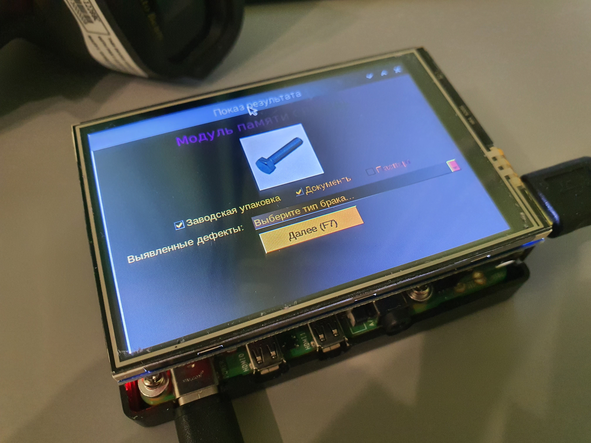

.. SimpleUI documentation master file, created by
   sphinx-quickstart on Sat May 16 14:23:51 2020.
   You can adapt this file completely to your liking, but it should at least
   contain the root `toctree` directive.

Стационарные рабочие места 
==================================

Платформа Simple представлена в виде Android-клиента (SimpleUI), web-платформы и небольшого скрипта "для слабых устройств". Все они работают на одной семантике, архитектуре и едином формате конфигурации. Но имеют свои особенности и ограничения относительно Андроид-платформы.

Веб-платформа SimpleWEB
------------------------------------

Веб платформа предназначена для создания стационарных(декстоп) рабочих мест, другими словами - создание фронта для не-Андроил устройств.

Подробно описана в статье: https://infostart.ru/1c/articles/1777420/

GitHub проекта: https://github.com/dvdocumentation/simpleweb

Решение для слабых устройств
--------------------------------------------

GitHub проекта: https://github.com/dvdocumentation/simpleui_desktop

.. note:: Отдельнной документации для клиентов Linux/Win64 не планируется, ввиду того что общие принципы конструирования интерфейса - те же самые что и для мобильных устройств. Вместо этого описаны отличия, а также в конфигурации (Комплект разработчика от Январь 2021) встроен механизм контроля ограничений и подготовлены демо примеры для Raspberri Pi и Windows

 

На том же самом контрукторе и формате конфигурации Simple UI выпущены клиенты для Raspbery Pi/Windows которые работают в режиме онлайн. Актуальные версии доступны для скачивания на simpleui.ru - это клиенты для raspbian(Debian-based) и Win64. По запросу могу скомпиллировать пакеты для других ОС/разрядностей. 

.. note:: Начиная с версии 4.20.00 мобильная платформа Simple UI поддерживает полноценный интерпретатор Python последней версии. В стационарной версии будет полноценная поддержка скриптов на Python со всеми библиотеками и подключаемыми модулями. В связи с этим альтернативные способы связи с бекендами отличными от варианта "он-лайн с 1С" (команды интерпретируются  в веб-сервисе) могут быть реализованы в скриптах Python.

Отличия и ограничения
-----------------------

 *  Только контейнеры. Экраны размечаются только через контейнеры, причем уровень вложенности – 2. Т.е. вертикальный контейнер с любым количеством строк, в каждой стоке либо один горизонтальный контейнер с любым количеством элементов либо просто элемент. Т.е. получается эдакая 2D таблица. 
 *  Размеры если указывать их числами – в «символах», т.е. высота = 2- это 2 строки
 *  Только "произвольный запуск экранов" – все переключения через ShowScreen
 *  Высота в таблице -это количество строк, ширина – высота строки
 *  В настоящее время не все элементы контейнера доступны, перечень элементов органичен в конструкторе
 *  Прокрутка корневого контейнера/без прокрутки – работает немного не так как в Андроиде (появляется скролл-бар для мыши), лучше посмотреть в демке
 *  Пока только «он-лайн» режим через 1С, офлайн не нужен, так как это стационарное рабочее место, позже появится поддержка скриптов Python как в мобильной платформе и на них уже можно делать requests и т.д. и т.п. куда надо, парсить и отображать на экранах - хоть в PostgREST, хоть в свой бэкенд
