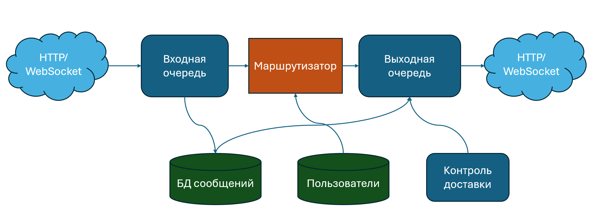
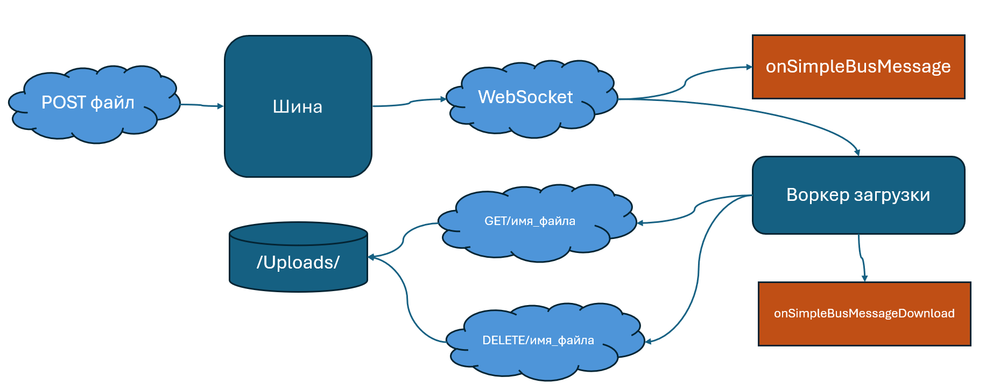
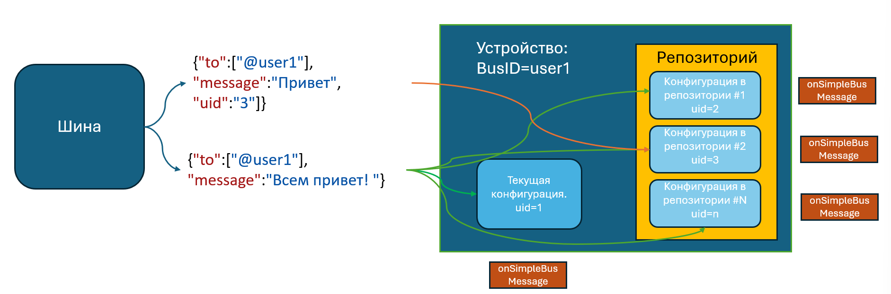
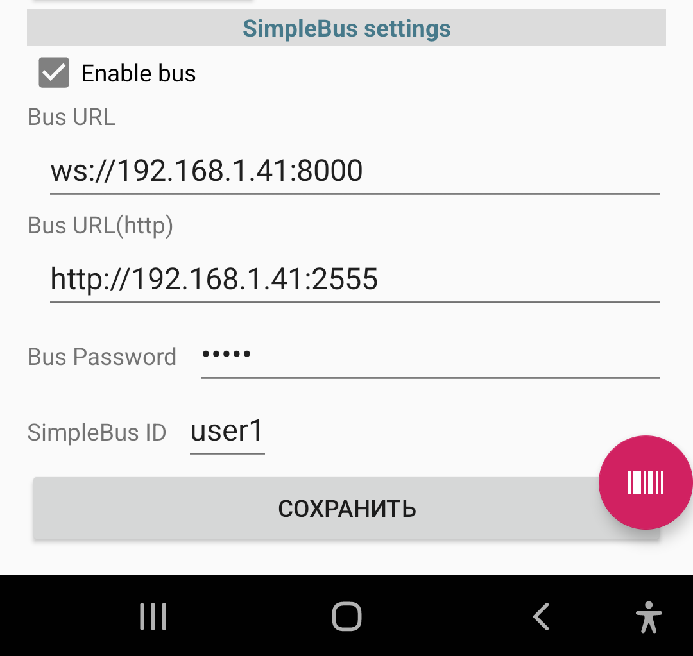

.. SimpleUI documentation master file, created by
   sphinx-quickstart on Sat May 16 14:23:51 2020.
   You can adapt this file completely to your liking, but it should at least
   contain the root `toctree` directive.

Синхронизация данных между клиентами SimpleUI и бек-системами через «шину»
=====================================================================================

Шина представляет из себя простейший python-скрипт, запускаемый на каком то внешнем ресурсе через который посредством WebSocket и HTTP происходит взаимодействие участников обмена. 

Скрипт реализует следующие сценарии работы:

1.	Гарантированный обмен сообщениями с маршрутизацией, контролем доставки, хранением сообщений одному или нескольким получателям

2.	Прямой обмен сообщениями p2p без кеширования и контроля, для быстрейшей доставки плотного трафика

3.	Гарантированная доставка больших файлов или просто файлов с поддержкой докачки, воркерами с прогрессбаром не зависящая от активности приложения

Указанные сценарии заменяют push- сообщения (и даже быстрее пуш, но, правда менее энергоэффекивны, т.к. вынуждают держать сокет открытым) и покрывают весь спектр потребностей без необходимости какой либо разработки: можно отправлять просто уведомления, модно отправлять документы и распоряжения, фотографии и какие то большие массивы данных для начального заполнения например. Т.е. для работы достаточно запустить шину, завести пользователей и вбить настройки. После этого можно обмениваться информацией.

Преимущества такого способа обмена:

1.	Самое главное преимущество – возможность вынести эндпоинт во внешний интернет (например на внешний vps- линукс сервер) не вынося туда бек и таким образом связать в одну сеть и клиенты(не имеющие прямых ip-адресов) и бек, не подвергая последний угрозам извне

2.	Написан на питоне, может дорабатываться например для создания логики промежуточного слоя, например промежуточного хранения в СУБД, 

3.	разгрузки бека от большого трафика запросов, от приема файлов и т.д.

Ссылки
--------------

GitHub, откуда взять скрипт: https://github.com/dvdocumentation/simplebus

Адрес тестовой шины (рекомендуется разворачивать свою): 

ws://45.141.79.130:8000

http://45.141.79.130:2555

Как это работает?
-------------------------

Обычный режим
~~~~~~~~~~~~~~~~~~~~~

Основной режим – обычная отправка JSON-сообщений. Входом на шину может быть как HTTP-запрос/ WebSocket-запрос (из бек системы, например) так и команда отправки через WebSocket с клиента. В JSON указывается адресаты или подписки, на которые адресуется сообщение и само сообщение. После чего сообщение доставляется через шину и в клиенте возникает событие доставки. Если клиентом является HTTP-сервер, то шина отправляет на него запрос. Клиент отправляет подтверждение, после чего доставка считается завершенной.

Клиенты Simple получают событие, содержащее сообщение: **onSimpleBusMessage**, **onSimpleBusMessageDownload**

Технически это устроено так:

 1.	Сообщение попадает на шину через HTTP или WebSocket и помещается во входную очередь

 2.	Также сообщение помещается в хранимый словарь (условно БД)

 3.	Маршрутизатор на основе адресации помещает в выходную очередь для каждого адресата ссылку на сообщение

 4.	Также работает задание, которое анализирует подтверждения доставки и если сообщение не доставлено (получатель не на связи), то помещает его повторно нужным адресатам 

 5.	Периодически клиенты сокета пингуются для поддержки связи

Сообщение представляет из себя JSON-объект с обязательными полями **to** (подробнее в разделе адресация) и **message**

В сообщении можно указать _id в явном виде, при его отсутствии шина сама добавит ключ _id

Также шина добавляет в сообщение поле **sender** – отправителя сообщения

При поступлении сообщения возникает общее событие **onSimpleBusMessage**, в стеке переменных содержится переменная **SBMessage**

Для отправки в обычном режиме через HTTP-запрос в поле Message-Type нужно либо ничего ен указывать либо указать **queue**

Формат HTTP-запроса:

	POST <url-сервера>:<порт>/put в body:JSON сообщение

В запросе необходимо использовать базовую авторизацию – имя пользователя и пароль (см. раздел «Как начать работать»)

Команда Simple:

**SendBus**, <сообщение> - отправлет сообщение в шину

Например:

.. code-block:: Python

 import json
 message = {"to":["@user2"],"message":"Привет Android"}
 hashMap.put("SendBus",json.dumps(message,ensure_ascii=False))

Соответственно, так как команда отправляется через стек, она также доступна из онлайн-режима

Получив сообщение, клиент высылает подтвеждение на шину (сообщение с type=confirmation) Также при получении подтверждения доставки возникает событие **onSimpleBusConfirmation**, в стек переменных помещается **SB_id** -  ид сообщения по которому происходит подтверждение. Каждый адресат (в сообщении поле sender) должен прислать свое подтверждение

Прямой режим
~~~~~~~~~~~~~~~~~

Также между двумя устройствами можно наладить прямой обмен сообщениями, где не будет не гарантированной доставки, ни кеширования, но будет быстрейшая скорость доставки. Шина в данном случае выполняет роль зеркалирования сообщений. Для того чтобы отправить сообщение прямым способом нужно указать в сообщении ключ **direct:true** либо в Message-Type указать **direct**

Доставка файлов.
~~~~~~~~~~~~~~~~~~~~~~~

Если нужно передать картинки, видео и просто большой например JSON то это лучше делать не через JSON а обычным HTTP-запросом с вложенным файлом. Файлы при этом кешируются на сервере (на диске), пока не будут доставлены адресату. А WebSocket выполняет функцию мгновенного уведомления клиента.

Алгоритм работы такой:

 1.	Отправляется POST-запрос по тому же адресу и эндпоинту что и обычно но с form-data вложением одного или нескольких файлов. Пример запроса на python есть в примерах к релизу. Имена файлов указываются такие, в каком виде нужно отображать и сохранять файлы при скачивании на устройстве

 2.	Получив запрос, скрипт-шина оповещает клиентов-получателей и размещает для них файлы
 
 3.	Клиенты после получения оповещения запускают скачивание файла (при получении сообщения возникает **onSimpleBusMessage**) Оно запускается в виде воркера, независящего от перезагрузки устройства с прогресс-баром
 
 4.	По окончанию загрузки, клиент отправляет подтверждение о приеме и файл удаляется а на клиенте возникает событие **onSimpleBusMessageDownload**, а в стеке переменных содержится путь к скачанному файлу в переменной **DownloadedFile**

Адресация до устройств и внутри приложения SimpleUI
----------------------------------------------------------

Адресация на мобильные устройства как минимум состоит из адреса до пользователя шины (устройства, в настройках котрого определен Bus ID и пароль) , а также может включать в себя подписку на конкретные конфигурации, которые должны быть активны или находиться в репозитории устройства для обработки сообщения. Также может быть адресация до конкретного получателя внутри конфигурации. Сейчас доступен **recipient:feed** означающий передачу команды feed получателю – СУБД Pelicane внутри клиента, который по результату своей работы отправляет сообщение о результате (Подробнее в главе Прямое общение с механизмами конфигурации)

Адресация до устройства задается в поле **to**. Возможны варианты:

 * Конкретные получатели – массив имен пользователей через собаку. Например [“@user1”,”@user2”]. В таком случае сообщение просто будет доставлено пользователям напрямую
 * Массив тегов подписки через #. Сообщение будет доставлено тем пользователям, которые подписаны на теги (подробнее в разделе Как начать работать). Например [“orders”]
 * Тег $all – все пользователи

Адресация до конкретной конфигурации может быть установлена в поле uid:<uid конфигурации> либо в виде массива uid:[<uid конфигурации 1>,<uid конфигурации 2>]

Если uid не установлен, то сообщение будет передаваться текущей конфигурации (котрая в данный момент выполняется) затем всем конфигурациям в репо. Если uid задан то в том же порядке будут отбираться конфигурации, которым нужно передать сообщение. Таким образом платформа пытается найти конфигураций получателей и передать им сообщение, если оно найдено, то возникает соытие onSimpleBusMessage и высылается подтверждение. Возможна ситуация когда клиент на связи, но сообщение передается с uid и на устройстве не установлена конфигурация с данным uid. Тогда сообщение не будет доставлено.

Как начать работать?
--------------------------

 1.	Нужно скачать и запустить скрипт simple_bus.py

 2.	Нужно зайти в браузере по адресу машины на котрой установлен скрипт (http:\\<адрес машины>:2555) нажать Зарегистрироваться и завести первого пользователя

 3.	Далее пользователей можно заводить POST-запросом **\put_users** на тот же адрес

 4.	В настройках клиентов прописать настройки подключения вручную или через файл или QR-настроек. Обратите внимание что надо указывать и адрес WebSocket и адрес HTTP-сервера

Пример запроса **put_users** для добавления 2х пользователей в шину:

.. code-block:: JSON

 [{"_id":"user2", "password":"12345"},{"_id":"user1", "password":"12345"}]

В последствии пользователей можно обновлять этим же запросом. Например можно добавить теги:

.. code-block:: JSON

 [{"_id":"user2", "password":"12345","tags":["orders"]}]

Если пользователь – не SimpleUI и использует HTTP (например 1С) то для отправки сообщения в него шина должна знать куда слать запрос и как авторизоваться. Поэтому у такого пользователя должен быть объект в JSON connection_properties в котором должно быть:

Объект authorization с полями type:basic , user и password

Т.е. например текст запроса \put_users:

.. code-block:: JSON

 [{"_id":"user1c", "password":"12345","tags":["orders"],"connection_properties":{"authorization":{"type":"basic","user":"usr","password":""}}}]

Прописать настройки можно вручную, либо через QR-код или файл настроек.

Имена полей для автоматизированной установки настроек:

 * BusURL
 * BusURLHttp
 * BusID
 * BusPassword
