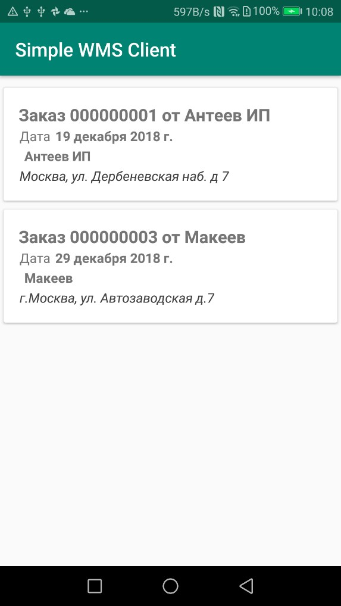
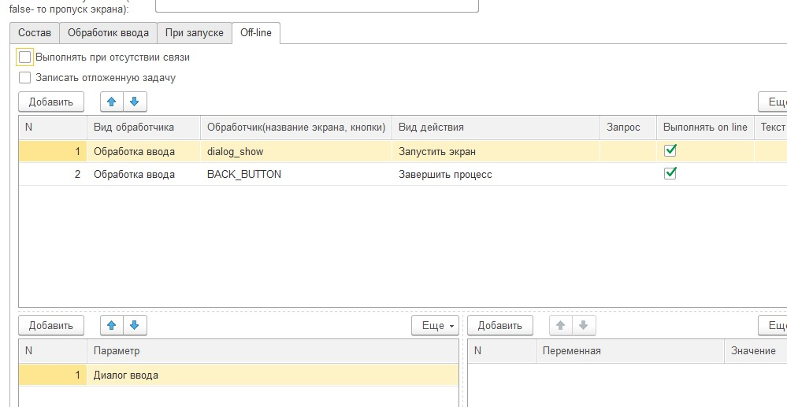
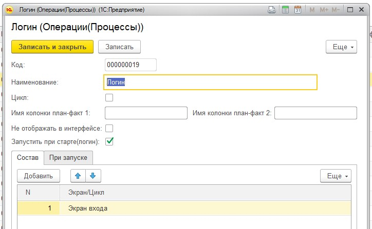
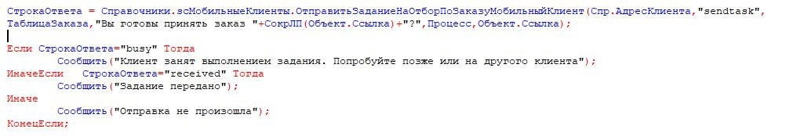
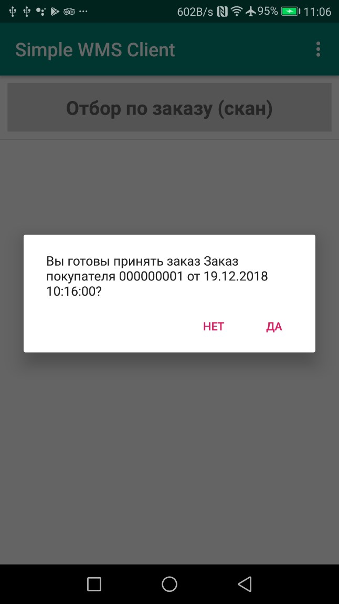
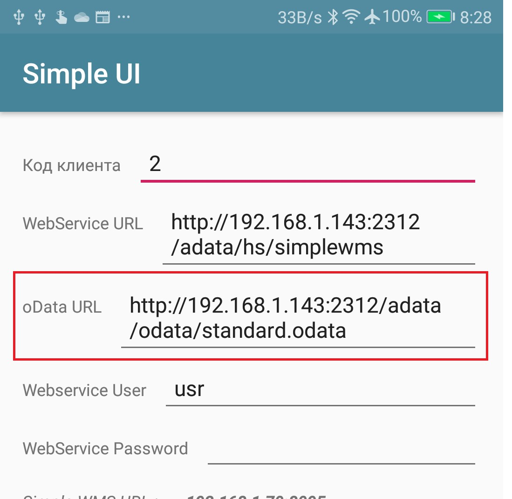
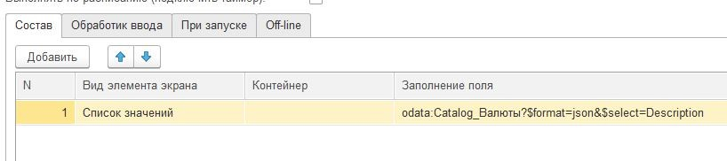
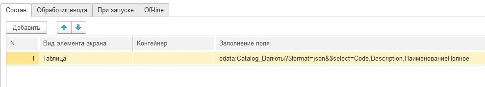
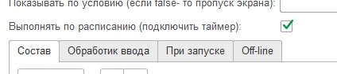

.. SimpleUI documentation master file, created by
   sphinx-quickstart on Sat May 16 14:23:51 2020.
   You can adapt this file completely to your liking, but it should at least
   contain the root `toctree` directive.

Общие функции платформы
========================

Список Задачи (для он-лайн)
-----------------------------
 

По кнопке «Задачи» теперь можно запросить учетную систему не предмет какого то списка задач, заказов и т.д. Например это могут быть «Текущие заказы к доставке для определенного пользователя»

В момент нажатии кнопки приложение делает запрос к сервису (/get_tasklist/), и он возвращает некий список. Этот список представляется пользователю как список карточек с определенным оформлением

Вместе со списком можно передать наименование операции которую надо запустить при клике на задачу, ID задачи, некий параметр который записывается в orderRef и который потом можно прочитать в обработчике.

При клике на задачу передается запрос на специальный сервис (taskcommit) с ID задачи. Это можно использовать для биллинга например.

Все это рабоатет через 2 сервиса:

 

 
В обработчике get_tasklist приведен пример заполнения списка. Для каждой карточки можно заполнить 4 поля: заголовок, 2 реквизита (при этом установив заголовок поля) и поле примечание внизу. Также в примере показано какие еще специальные поля передаются в список и как они обрабатываются.

В демо базе пример в рабочем месте «Отгрузка» процесс «Отгрузка по заказу (из списка)» демонстрирует обработку заказа из списка.

.. tip:: Список задач также рабоатет и в самостоятельном режиме (в случае если бекенд - не 1С). Это описано в разделе REST самостоятельного режима.

Работа с таблицами и план-факт
-------------------------------

Через переменные в виде строки json можно передавать произвольные таблицы и размещать их в разных местах программы.

Произвольная таблица может быть представлена в виде:
 * **Элемента экрана**, вместе с другими элементами. Для этого нужно использовать элемент экрана «Таблица» и в переменной передать строку json в специальном формате
 * Переопределить нажатие центральной кнопки **План-факт**. Старый формат также действует, но если задана произвольная таблица то это имеет приоритет. Для этого нужно вставить переменную **central_table**.	Например : ``Переменные.Вставить("central_table",CтpoкaJSON);``
 * Вызвать отдельное окно с таблицей по какому то событию (например по нажатию кнопки) с заполненной таблицей на весь экран. Для этого нужно использовать переменную **report_table**  Например: ``Переменные.Вставить("report_table",CтpoкaJSON);``

В структуре json можно описывать :

 * столбцы таблицы – имя, заголовок, ширину колонки
 * Общие опции таблицы – размер шрифта, скрыть заголовок, отключить подсветку линий через строку
 * Непосредственно данные в ячейках
 * Раскраску отдельных ячеек произвольными цветами

Структура формата таблицы не зависит от места использования таблицы – она общая.

Пример формата:

.. code-block:: JSON

  {
  "type": "table",
  "textsize": "25",
  "hidecaption": "true",
  "hideinterline": "true",
  "columns": [
    {
      "name": "nom",
      "header": "Товар",
      "weight": "2"
    },
    {
      "name": "qty",
      "header": "Кол-во",
      "weight": "1"
    },
    {
      "name": "price",
      "header": "Цена",
      "weight": "1"
    }
  ],
  "rows": [
    {
      "name": "Процессов Intel Core 9 OEM",
      "qty": "5",
      "price": "15500.00"
    },
    {
      "name": "Процессов Intel Core 5 BOX",
      "qty": "-2",
      "price": "12500.00"
    },
    {
      "name": "Процессов Intel Core 5 (OEM)",
      "qty": "2",
      "price": "11500.00"
    }
  ],
  "colorcells": [
    {
      "row": "1",
      "column": "1",
      "color": "#d81b60"
    }
  ]
  }

Атрибут type обязательный он должен быть всегда значение «table»

**textsize** -необязательный – отвечает за размер текста

**hidecaption** – необязательный – не выводить шапку таблицы

**hideinterline** – необязательный – не выводить раскраску строк

**columns**  *обязательный* массив в котором описываются колонки. name – внутреннее имя, header -отображаетмый заголовок, weight – ширина колонки в виде относительного веса. Если задать все колонки в 1 то они будут равны.

**rows**  *обязательный*  массив в котором описываются строки. Каждый элемент имеет имя, совпадающее с именем столбца и значение

**colorcells** *необязательный** массив– подсветка произвольных ячеек нужным цветом. Строка и столбец задаются номерами начиная с 0. Цвет (color) – в HEX виде.

Нажатие на строку таблицы таблицы  вызывает *событие ввода* и передачи данных на сервер. Выбранная строка  - объект JSON сериализуется в переменную **selected_line**

Обработка ввода по таблице.
~~~~~~~~~~~~~~~~~~~~~~~~~~~

В версии «Pro» доступно получение события о выбранной строке таблицы. Пример помещен в конфигурацию «Примеры #2». При нажатии на таблицу в переменную «selected_line» пишется json с выбранной строкой

Для «самостоятельно режима» при клике по таблице возвращается не json. Программа ищет в выделенной строке поля **id**, **order** и **orderRef** и если они есть, записывает в переменные значения ``selected_line_id``, ``order`` и ``orderRef``

Запуск процессов из процессов и другие управляющие команды
-----------------------------------------------------------

Можно немедленно запустить процесс из другого процесса, если в присвоить переменной ``StartProcessHashMap`` строку, содержащую имя вызываемого процесса. Это вызовет запуск нового окна с другим процессом– туда скопируются переменные из вызывающего окна и выполнятся все процессы. После того как работа с новым процессом будет закончена – в старом процессе работа продолжится с текущего шага. С помощью этого приема удобно организовывать цикл в цикле. Пример в демо базе: «Цикл в цикле»

Также есть другая аналогичная функция - StartProcess. Вызов: присваивание переменной  ``StartProcess`` строку, содержащую имя вызываемого процесса. Это будет просто переключение процесса без возврата на вызывающий процесс.

GPS
-----

В настройках есть галочка «Отправлять координаты» если ее включить то в люом процессе который запущен будут добавляться специальные переменные относящиеся к службе геопозиционирования. 

.. attention:: Необходимо в настройках дать приложению разрешение на определение местоположения. Также необходимо убедиться, что в устройстве включено определение местоположения.

Устройство запрашивает данные каждые 5 секунд и отправка происходит каждый раз когда отправляются переменные. Сразу в момент запуск апроцесса данных может не быть, нужно чуть-чуть подождать.

Данные запрашиваются и поступают с 2х провайдеров – gps и network (сети или wi-fi) – в обработчике можно фильтровать по факту.

Специальные переменные, в котрые устройство передает данные: 

 * **Latitude** – широта
 * **Longitude** – долгота
 * **gps_city** – город, если есть в адресе
 * **gps_postal_code** – индекс
 * **gps_addres_string** – полная неразобранная информация , которую можно разобрать по тегам
 * **gps_provider** – источник данных
 * **gps_accuracy** -  точность

Экран диалога
----------------

Можно запустить модальный экран для ввода значений с кнопками «ОК» и «Отмена» и перехватывать событие этого экрана. В случае нажатия на ОК будет вызвано событие ввода и переменные этого экрана могут быть обработаны. 

Состав экрана вы определяете сами – это обычный экран

Вызов экрана через обработчик – ``Переменные.Вставить(«StartScreen», «Имя экрана»)``. Вызываемый экран должен быть в составе процесса.

Получение события через обработчик: переменная event установлена в ``“OnResult”``

 
Запуск экрана Offline: вид действия для запуска «Запустить экран», параметр – **точное** название экрана диалога который есть в составе процесса

Событие ввода : Вид обработчика – «Закрытие экрана», в Обработчике указываете название экрана диалога. Пример есть в демо.

Логин и запуск конфигурации
------------------------------------

Можно организовать экран входа в систему котрый будет запускаться при запуске приложения и пункт основного меню для перелогинивания.  Для того чтобы процесс запускался при входе в приложение нужно поставить галочку **«Запустить при старте»**

 

Для того, чтобы произошла загрузка нужной конфигурации нужно заполнить переменную ``ID``  кодом справочника Мобильные клиенты, нужного клиента. Это тот же код который указывается в настройках. Если с терминалом будут работать несколько человек, можно создать конфигурацию, содержащую толкьо процесс «Логин» , и другие клиенты будут подгружаться из нее. 
Также процесс с логином можно добавить во все конфигурации клиентов, в которых нужно перелогиниваться (совместное использование одного терминала)

Печать на мобильном устройстве
-------------------------------

На мобильном устройстве доступна печать PDF-документа сформированного на стороне сервера. Например это может быть печатаная форма, сохраненная в 1С. В демо базе есть пример создания печатной формы и экрана для печати – см. команду print_pdf HTTP сервиса SimpleWMS.

Принцип работы следующий:

 * Обработчик события (кнопки или иного события) на устройстве инициирует запрос в сервис /print_pdf/*. Передавая при этом строку параметров ктоорые нужны для печати формы. Разработчик сам формирует эту строку и сам предусматривает параметры
 * Обработчик команды находит нужный документ или объект, формирует печатную форму и сохраняет в PDF отправляет в ответе
 * На стороне устройства читается ответ, извлекается PDF и отправляется менеджеру печати.

Для онлайн-режима:

Команда печати передается через переменную PrintService. Например так. В качестве значения нужно передать строку параметров запроса который пойдет на сервер

``Переменные.Вставить("PrintService","operation=print&barcode="+Переменные.barcode);``

Далее в модуле команды print_pdf параметры извлекаются и на основании этой информации формируется ответ с печатной формой
В operation можно передать либо **print** либо **view** – и это же должно пойти в ответе. На основании этого параметра откроется либо сразу менеджер печати либо программа просмотра PDF

.. hint:: если print не работает - попробуйте view. Это зависит от устройства и софта.

**Для документов**:

В отличии от экранов строка параметров формируется автоматически и в ней идет команда doc_print и предопределенный параметр uid – в котором содержится УИД Экземпляра документа. Также идет параметр template – с названием печатной формы.

Для определения списка печатных форм документа нужно добавить необходимо добавить их в табличную часть «Печать». Вид печати – «Печать через сервис». Остальное можно не заполнять.

Веб-сервис на клиенте. Возможности
-----------------------------------

Передача задания напрямую на устройство
~~~~~~~~~~~~~~~~~~~~~~~~~~~~~~~~~~~~~~~~

На клиент может быть отправлено задание (пример есть в форме документа «Заказ покупателя»). Это не просто отправка и не просто отправка напрмую, а еще и прямое взаимодействие - так как пользователь может быть занят или отказаться от задания и это все в режиме реального времени будет видно в учетной системе в процессе.

 

Для этого достаточно указать адрес клиента (это адрес веб-сервера на мобильном устройстве, которых храниться в справочнике «Мобильные клиенты»),ТаблицаЗаказа (заполненную как указано ранее), сообщение, которое будет отображено в диалоге, имя процесса.

``Функция ОтправитьЗаданиеНаОтборПоЗаказуМобильныйКлиент(АдресТерминала,Команда,ТаблицаДанных,Сообщение,Процесс,Заказ )   Экспорт``

Также при передаче такого сообщения передаются переменные **order** и **orderRef** содержащие ссылку на заказ (параметр Заказ) и представление заказа
При приеме сообщения веб-сервер клиента проверяет, не занят ли клиент выполнением какого то другого процесса и если занят отправляет ответ **busy, если нет то ответ будет **recieved**. Если же произошла ошибка при доставке то ответ будет другой. Также состаояние загрузки мобильного клиента можно прочитать в регистре сведений scСтатусыИсполненияПроцессов

При доставке сообщения на главном экране будет показан диалог и прозвучит звук приема сообщения (даже если экран выключен, так как веб-сервер рабоатет как сервис)

 

Если пользователь нажимает «Да», то запускается процесс котрый был указан в методе. Важно: в конфигурации пользователя должен присутствовать этот процесс.

Передача голосового сообщения на устройство 
~~~~~~~~~~~~~~~~~~~~~~~~~~~~~~~~~~~~~~~~~~~~~

Можно отправить текст на конкретное устройство, и оно будет произнесено с помощью синтеза речи даже если программа свернута или выключен экран блокировки. 

Для этого нужно использовать команду ``Voice`` с параметром ``text``. Например так:

``Справочники.scМобильныеКлиенты.ОтправитьSQLЗапросМобильныйКлиент(URLМобильногоУстройства,"Voice","text","&text=Ваша фраза на языке по умолчанию”)``

Команды SQL и Передача конфигурации
~~~~~~~~~~~~~~~~~~~~~~~~~~~~~~~~~~~~

Данные команды описаны в разделее Самостоятельный режим

Odata
-------

Если в серверной части параллельно с веб-сервисом опубликован интерфейс Odata то можно вместо заполнения источников данных запросами через обработчики просто указать запрос к OData в конструкторе.
Для этого необходимо в настройках программы указать адрес сервера Odata

После чего можно использовать OData запросы для таблицы или списка как показано на рисунках. Обратите внимание что для списка нужен толкьо одно поле – берется первое поле. Поэтому его лучше определить оператором select
Для таблицы выводятся все поля, но их тоже лучше определять select чтобы не было лишних столбцов

Запуск/Переключение экранов с сервера напямую и таймер событий экрана/обработчик ожидания (только для Pro-версии)
------------------------------------------------------------------------------------------------------------------

Возможно с сервера передавать на конкретное устройство команду переключения экрана (после которой устройство шлет запрос send_input и отрисовывает экран по новой). Это может понадобится например для организации информационных табло на телевизорах с Андроид. Т.е. для любого открытого процесса выполнится переключение экрана.

Это можно сделать например строкой ``Справочники.scМобильныеКлиенты.ОтправитьSQLЗапросМобильныйКлиент(URLМобильногоУстройства,"Run","txt","&text=blob");``

Пример есть в демо базе в обработке «Примеры взаимодействия с сервером»

Также можно подписать экран на выполнение периодической команды переключения экрана. Это может понадобится для той же цели – периодического показа например какого то информационного экрана. Таймер задается в настройках приложения. Признак того что экран будет выполниться по расписанию – вот эта галочка. В демо базе можно посмотреть пример с Индикаторами. Будет работать толкьо если у вас – Pro-версия.
 

Замеры производительности
--------------------------

Для того чтобы изменить время выполнения экрана (допустим операций, перечисленный в ПриОткрытии) нужно запустить его с помощью установки переменной ``RunTestScreen`` а значение – имя экрана. После загрузки в переменную ``TestResult`` будет помещено время выполнения в миллисекундах.

Отправка статусов
------------------

Как уже было описано выше, при запуске процесса и при его окончании, отправляется запрос set_status. Данные пишутся в регистр «scСтатусыИсполненияПроцессов». По этому регистру можно мониторить состояние загруженности кладовщиков . Эти данные можно использовать для диспетчеризации отправки заданий кладовщикам (отправлять на незанятые клиенты). Ну и так как туда пишется время начала и окончания процесса, то легко посчитать длительность выполнения операций, что обычно используется в отчетах по эффективности работы. 

