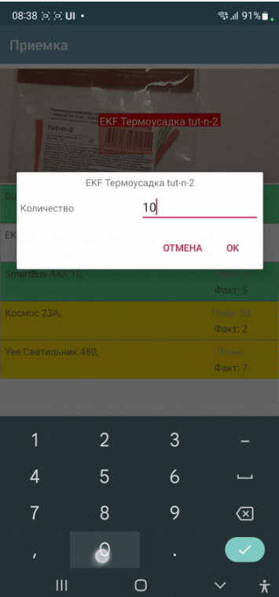
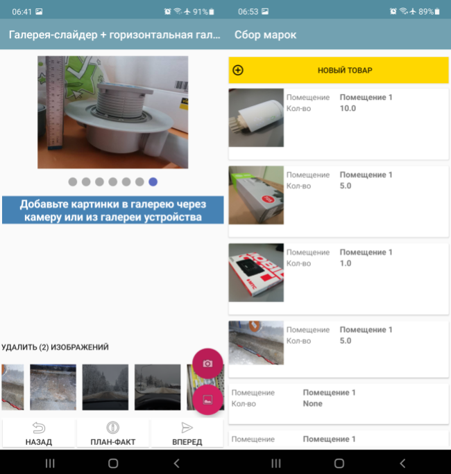
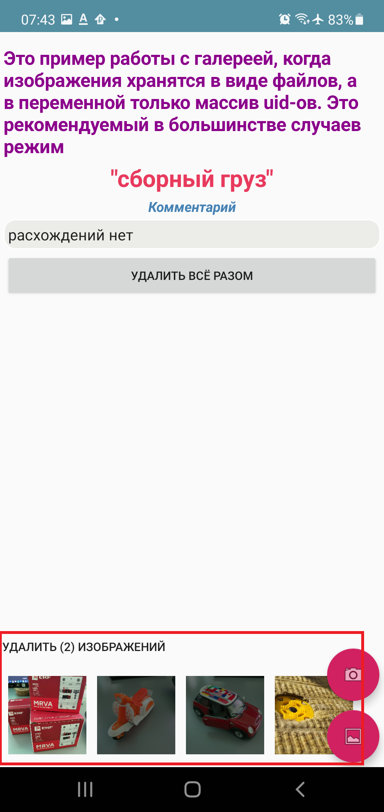
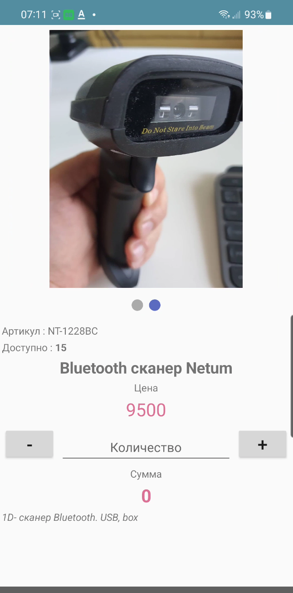
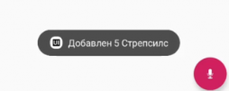
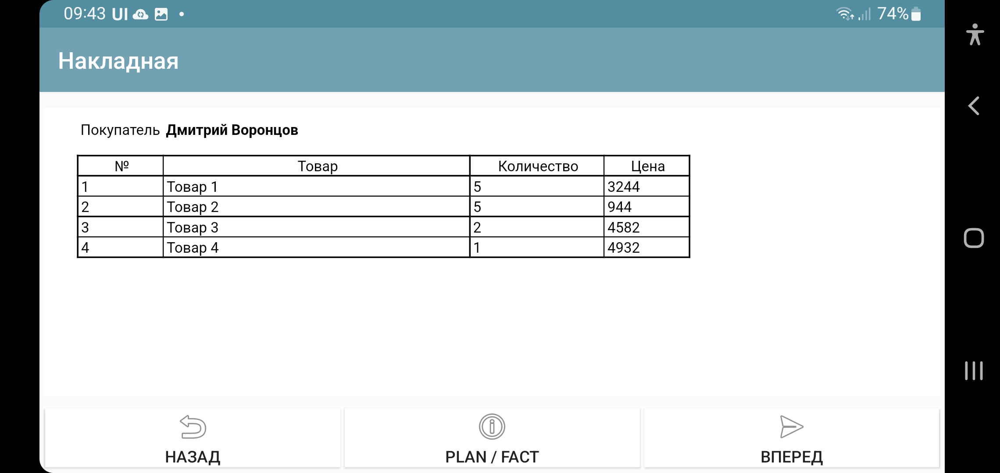

.. SimpleUI documentation master file, created by
   sphinx-quickstart on Sat May 16 14:23:51 2020.
   You can adapt this file completely to your liking, but it should at least
   contain the root `toctree` directive.

Общие функции платформы
========================

Диалоги
---------------

Модальный диалог в визуальном стиле стандартных диалогов и с возможностью переопределения кнопок и заголовка. Для этого испольуется команда **ShowDialog** На нем можно разместить свои элементы ввода. Для вызова и кастомизации диалога понадобится одна или несколько команд:

 * **ShowDialog**, <текст диалога> - Обязательная команда для собственно запуска диалога. Если не указывать остальные команды, то диалог будет просто вопросом (заголовок диалога) к кнопками Да/Нет
 * **ShowDialogLayout**, <JSON-структура контейнера/ссылка на контейнер> - определяет содержимое окна диалога, в случае когда требуется его переопределить (добавить свои элементы). Используется совместно с командой ShowDialog. В качестве параметра лучше указывать ссылку на контейнер в разделе Контейнеры через ^ (аналогично например setRootLayout или контейнеру в списке), но можно и указать просто JSON-строку контейнера. 
 * **ShowDialogStyle**,  ``{"title":"<заголовок>","yes":"<кнопка Да>","no":"<кнопка Нет>"}``    определяет кнопки и заголовок
 * **ShowDialogListener**, <имя события> – определяет имя события (listener) при срабатывании диалога
 * **ShowDialogSilent**, без параметра – диалог не вызывает события перерисовки экрана(и onStart/onPostStart)

При этом диалог возвращает события **onResultPositive** и **onResultNegative** в зависимости от того, что выбрал пользователь. Событие возвращается в переменную стека action. listener при этом можно определить командой **ShowDialogListener**

Пример:

.. code-block:: Python

 hashMap.put("ShowDialog","")
 hashMap.put("ShowDialogStyle",json.dumps({"title": "Добавление записи", "yes": "Сохранить",   "no": "Отмена" }))
 hashMap.put("ShowDialogLayout","^my_dialog")
 hashMap.put("ShowDialogListener","dialog_result")

Работа с изображениями
--------------------------------

Изображения в элементах интерфейса могут быть размещены в виде:

 * Ссылки на файл (в Значении указывается ~<абсолютный путь к файлу>). Подробнее см. в разделе Файлы
 * Ссылки на медиаресурс(в Значении указывается ^<ключ медиаресурса>). Подробнее см. в разделе Файлы
 * Base64- строки

Base64 не очень рекомендуемый способ, так как кодирование/декодирование ресурсоемкая операция. Рекомендуется, особенно в списках пользоваться ссылками на файлы (~/^)

Ссылка на медиаресурс – это иконки и пиктограммы, которое можно прикрепить в конфигурацию в раздел Медиафайлы. Надо понимать, что они в конфигурации присутствуют в виде того же base64, котрый сохраняется во временные файлы в момент загрузки конфигурации. Если таких файлов очень много или они большие, то имеет смысл реализовать в прикладном решении загрузку ресурсов отдельным алгоритмом с вашего сервера или облачного хранения и обращаться к ним потом уже через ~.

Для ввода изображения используется:

 * Элемент экрана Фото камерой 
 * Элемент экрана Фото из Галереи 
 * ActiveCV (детектор PHOTO)

Для Фото камерой и Фото из галереи, есть переменная-флаг **mm_local** которую нужно установить до запуска камеры, которая переключает камеру в режим сохранения изображений в файлы. У подобных файлов при сохранении генерируется uuid, по которому к нему можно обратиться. Этот uuid равен имени файла. Можно просто работать с именем файла, запоминая его в своих структурах данных. Например при фотографировании в режиме mm_local в переменную камеры (допустим переменная камеры называется photo) сохраняется абсолютный путь с приставкой _path, то есть в данном случае будет переменная photo_path.
Если не использовать этот флаг, то будет сохраняться в base64

Также, для этих режимой есть команды:

 * **mm_compression** – сжатие изображения в процентах от 100 до 0
 * **mm_size** – сжатие размера от исходного разрешения в процентах от 100 до 0

Например:

.. code-block:: Python

 hashMap.put("mm_local","")
 hashMap.put("mm_size","50")
 hashMap.put("mm_compression","70")

Горизонтальная галерея мультимедиа
~~~~~~~~~~~~~~~~~~~~~~~~~~~~~~~~~~~~~

Элемент управления «Горизонтальная галерея мультимедиа» это и визуальный и активный элемент, который позволяет упростить работу с изображениями. Он предназначен для визуализации в виде миниатюр массива мультимедиа. Входная переменная - это JSON массив либо идентификаторов файлов (в случае флага mm_local) типа ``["id1","id2"…]``  либо JSON массив вида ``[{"uid":"id1","base64": "данные картинки 1"},{"uid":"id2","base64":»данные картинки 2"}]`` то есть массив, содержащий непосредственно данные в виде base64. Сам массив формируется, когда добавляются мультимедиа с камеры или из галереи, либо удаляются. То есть для функционирования достаточно разместить элемент галереи и «Фото с камеры» или «Фото с галереи» и указать любую переменную. При работе с мультимедиа или удалении будут возникать события ввода c listener=имя переменной, при которых переменную с массивом можно получить в обработчике и получить таким образом доступ к файлам. Для удаление нужно пометить миниатюры долгим тапом.

Галерея слайдер
~~~~~~~~~~~~~~~~~~~~

Элемент управления «Галерея слайдер» это еще один визуальный элемент для отображения набора картинок с возможностью пролистывания (но в отличии от Горизонтальной галереи нет удаления). Она занимает часть экрана сверху. Нельзя разместить более одной, т.к. она не в контейнере. В качестве источника данных используется точно такая же переменная как горизонтальной галерее, т.е. массив uid-ссылок на картинки либо массив с данными.

Всплывающие сообщения (toast)
--------------------------------

Команда-переменная **toast**,<сообщение> - всплывающее внизу экрана уведомление. В качестве параметра просто текст сообщения. Работает в любом контексте. 

Например 

.. code-block:: Python

 hashMap.put("toast", "Привет мир! ");

В python-обработчиках более удобным является функция toast(message) модуля android(в pythonscript он уже импортирован, поэтому можно писать просто toast("Hello world"))

.. code-block:: Python

 toast("Hello world")

Уведомления
-----------------

Базовые уведомления
~~~~~~~~~~~~~~~~~~~~~~

Команда-переменная  basic_notification - простое уведомление на экран блокировки c темой и текстом. Работает отовсюду, в том числе из фона. Можно передавать несколько сразу, поэтому в качестве параметра передается JSON- массив. Каждое уведомление может иметь свой номер(если номер не задан явно, то он присваивается по порядку). По номеру можно обновлять уже выведенные обновления. Например можно вывести уведомление «Началась обработка» с номером 1, а потом послать еще одно уведомление «Обработка завершена» с номером 1 и ОС обновит на экране существующее уведомление елси его еще не смахнул пользователь, если его нет – выведет новое. Пример запуска уведомления:

``hashMap.put("basic_notification",json_to_str([{ "number":1, "title":"Информация","message":"Привет мир!"}]))``

Тут в JSON ключи  **number**, **title** и **message** - номер, тема и сам текст сообщения

Аналог этой команды для базовых уведомлений – функция модуля android для python **notification(text,title=None,number=None)**. Преимущество использования функций вместо команд-переменных в python-обработчиках заключаются в том, что действие выполняется сразу, а не в конце обработчика, что важно для долгих процедур
например 

.. code-block:: Python

 notification("Hello world!")

Отмена сообщения
~~~~~~~~~~~~~~~~~~~~

**notification_cancel(number)** – функция в модуле android (в python-обработчиках) для удаления уведомления из шторки. Может не работать в некоторых случаях (зависит от системы)

Уведомление с прогресс-баром
~~~~~~~~~~~~~~~~~~~~~~~~~~~~~~~~~

**notification_progress(text,title,number,progress)** - фунция в модуле android для вывода уведомления с прогресс-баром в шторке, чтобы показать прогресс выполнения длительных задач. Доступна только из python-обработчиков, потому что имеет смысл только при обновлении внутри обработчика. Text,title -текст и тема сообщения, number(обязательный, так как по нему будет обновляться)- номер сообщения, progress – числовое значение прогресса от 0 до 100

Синтез речи
----------------

Можно воспроизводить речь, используя команду-переменную **speak** , например ``hashMap.put("speak","Привет, мир! ")``. Данная команда работает как в контексте экранов так и в контексте фонового Сервиса событий

В python- обработчиках, можно использвоать функцию speak модуля android (в pythonscript она уже импортирована и можно просто обращаться speak("Hello world"))

.. code-block:: Python

 speak("Hello world")

Звуковой сигнал
-------------------

Можно воспроизвести короткий звуковой сигнал - один из 100, заложенный в Андроиде, если присвоить в переменную **beep** значение от 1 до 99, либо оставить пустой - тогда будет звук по умолчанию. Это работает и в онлайн и в оффлайн (через присвоение переменных). Пример в базе. Примеры звуков есть тут:https://developer.android.com/reference/android/media/ToneGenerator#TONE_CDMA_ABBR_REORDER В онлайн:

.. code-block:: Python

 hashMap.put("beep","")

В python- обработчиках, можно использовать функцию beep модуля android (в pythonscript она уже импортирована и можно просто обращаться beep())

.. code-block:: Python

 beep()

Голосовой ввод
--------------------

Можно запустить установленное распознавание речи от Google используя команду-переменную **listen** либо функцию listen() (модуля android в python). В зависимости от контекста вызова результат будет возвращен либо в общие события либо в экран
 * Если вызвано из экрана (либо экран открыт) то в экране будет сгенерировано событие listener=**voice_success** (в случае ошибки "voice_error"), а распознанный текст будет добавлен в переменную **voice_result**
 * Если вызвано в фоне, то будет вызвано общее событие onRecognitionListenerResult

PrintPreview, подготовка макетов для печати
------------------------------------------------

Данный раздел несколько повторяет раздел “Поле HTML”, потому что и там и тут используются одни и те же технологии

Любые печатные формы (документов, счетов, этикеток) можно оффлайн готовить в виде html-макетов и заполнять шаблонизатором в python. В дальнейшем печать осуществляется через менеджер печати Android.
Данный способ с демо примером описан в статье https://infostart.ru/1c/articles/1716745/

Для того чтобы открыть готовый макет в отдельном окне в режиме предпросмотра, печати используется команда **PrintPreview,<html-строка>**

Подготовка PDF-макетов на стороне внешней системы
~~~~~~~~~~~~~~~~~~~~~~~~~~~~~~~~~~~~~~~~~~~~~~~~~~~~~~

На мобильном устройстве доступна печать PDF-документа сформированного на стороне сервера. Например, это может быть печатаная форма, сохраненная в 1С. 

Принцип работы следующий:

 * Обработчик события (кнопки или иного события) на устройстве инициирует запрос в сервис /print_pdf. Передавая при этом строку параметров которые нужны для печати формы. Разработчик сам формирует эту строку и сам предусматривает параметры
 * Обработчик команды находит нужный документ или объект, формирует печатную форму и сохраняет в PDF отправляет в ответе запроса
 * На стороне устройства читается ответ, извлекается PDF и отправляется менеджеру печати.

Команда печати передается через команду-переменную PrintService. Например так. В качестве значения нужно передать строку параметров запроса который пойдет на сервер

``Переменные.Вставить("PrintService","operation=print&barcode="+Переменные.barcode);``

Далее в модуле команды print_pdf параметры извлекаются и на основании этой информации формируется ответ с печатной формой В operation можно передать либо print либо view – и это же должно пойти в ответе. На основании этого параметра откроется либо сразу менеджер печати (если параметр print) либо программа просмотра PDF (если параметр view)

.. note:: Если print не работает - попробуйте view. Это зависит от устройства и софта.

Вывод данных макета в png
~~~~~~~~~~~~~~~~~~~~~~~~~~~~~

В дополнению к подготовке макета в виде html, также можно сохранить этот html-документ в виде png-файла с целью дальнейшего вывода на печать не через менеджер печати. Это делается с помощью команды-переменной **PrintToBitmap** совместно с PrintPreview. Эта команда переопределяет кнопку печати (которая по умолчанию вызывает менеджер печати) таким образом, что происходит сохранение картинки в файл (она помещается в PrintBitmapPath) и вызывается обработчик события с listener=PrintBitmap . Т.е. перехватив данный обработчик можно получить картинку из файла и продолжить с ней работу.

Работа с готовым PDF либо подготовка онлайн
~~~~~~~~~~~~~~~~~~~~~~~~~~~~~~~~~~~~~~~~~~~~~

В случае, если необходимо напечатать или вывести на предпросмотр PDF файл можно воспользоваться командами-переменными **PrintPDF**,<путь к PDF> и **ViewPDF**,<путь к PDF>  передав в качестве параметра путь к PDF-файлу. 

Экран проверки биометрических данных и экран ПИН-кода
--------------------------------------------------------

Если устройство поддерживает датчик отпечатка пальца или распознавание лиц, то можно вызвать стандартный диалог проверки биометрических данных. Причем, можно сделать это при запуске (в событии onLaunch),а можно просто запустить из процесса.

Запуск производится командой ShowBiometric, с параметром - json-строка. В JSON поля: title заголовок, body - текст, handlers - массив обработчиков для отлова событий по биометрии. Воозможны следующие события (listener):

 * BiometricAuthenticationSucceeded - пользователь успешно прошел проверку
 * BiometricAuthenticationFailed - проверка либо прошла, но неуспешно, либо пользователь закрыл окно аутентификации
 * BiometricAuthenticationError - ошибка создания объекта аутентификации. Скорее всего, функция не поддерживается на устройстве. Дополнительную информация можно прочитать в BiometricError

Проверку биометрии можно вызвать из процесса командой **ShowBiometricProcess**, возврат и событие будут уже на вашем процессе.

Конфигурация с примерами из процесса тут https://disk.yandex.ru/d/UmoMRPR9e2BaJA

Экран ПИН-кода
~~~~~~~~~~~~~~~~

Из процесса или на старте системы можно вывести диалог ПИН-кода. Команда **ShowPIN** с параметром - json-строка. В JSON поля: title заголовок, **block_cancel** - запретить закытие окна (невозможно будет отказаться от ввода ПИН), handlers - массив обработчиков событий. Проверка ПИН-кода и реакция системы полностью определяется разработчиком на основе соытий и введенного пин-кода. Пин-код в случае успешного ввода (успешный - значит введено 4 символа) передается через переменную pin. Возможные события:

 * pin_success - пользователь ввел 4 знака, записалась переменная pin
 * pin_cancel - пользователь закрыл окно ввода (в случае такой возможности)

Для запуска экрана ввода ПИН из процесса можно запустить командой **ShowPINProcess** , после ввода 4х знаков ПИН-кода в экране будет сгенерировано событие pin. Т.е. при возврате из экрана ПИН на процесс, далее вы работаете уже с процессом как обычно.

Конфигурация с примерами из процесса тут https://disk.yandex.ru/d/UmoMRPR9e2BaJA

Чтение клавиш в главном меню
--------------------------------

Для запуска например процессов с клавиатуры в главном меню можно организовать чтение клавиш. Обработка реализована через «Фоновый сервис» и требует включение галки «Подключить сервис» и написание обработчика. Регистрируются только нажатия клавиш. При нажатии происходит генерация общего события в сервисе onBackgroundCommand (команда onKeyDown) и далее в сервисе можно прочитать переменную _keyDown и таким образом разместить свою логику (например запуск процесса)

Сканер документов
----------------------

Для запуска сканера от Google используйте команду **ShowDocumentScanner** , после сканирования документов и нажатия Готово возникает событие **DocumentScannerResult** и в переменную **DocumentScannerResult** попадает список отсканированных изображений: либо в виде base64 либо в виде абсолютных путей к файлам (в зависимости от флага mm_local)
