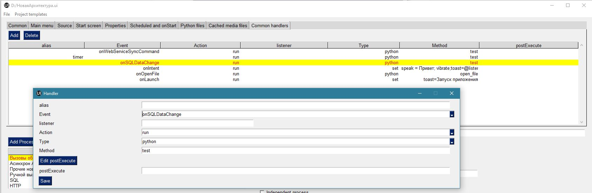

.. SimpleUI documentation master file, created by
   sphinx-quickstart on Sat May 16 14:23:51 2020.
   You can adapt this file completely to your liking, but it should at least
   contain the root `toctree` directive.

Общие функции платформы
========================

Таблицы. Работа с таблицами и план-факт
-----------------------------------------

Через переменные в виде строки json можно передавать произвольные таблицы и размещать их в разных местах программы. Под таблицей подразумевается табличная форма - колонки и строки. Также через элемент "Таблица" можно отпределить список, аналогичный списку карточек- подробнее в "Список карточек"

Произвольная таблица может быть представлена в виде:
 * **Элемента экрана**, вместе с другими элементами. Для этого нужно использовать элемент экрана «Таблица» и в переменной передать строку json в специальном формате
 * Переопределить нажатие центральной кнопки **План-факт**. Старый формат также действует, но если задана произвольная таблица то это имеет приоритет. Для этого нужно вставить переменную **central_table**.	Например : ``Переменные.Вставить("central_table",CтpoкaJSON);``
 * Вызвать отдельное окно с таблицей по какому то событию (например по нажатию кнопки) с заполненной таблицей на весь экран. Для этого нужно использовать переменную **report_table**  Например: ``Переменные.Вставить("report_table",CтpoкaJSON);``

В структуре json можно описывать :

 * столбцы таблицы – имя, заголовок, ширину колонки
 * Общие опции таблицы – размер шрифта, скрыть заголовок, отключить подсветку линий через строку
 * Непосредственно данные в ячейках
 * Раскраску отдельных ячеек произвольными цветами

Структура формата таблицы не зависит от места использования таблицы – она общая.

Пример формата:

.. code-block:: JSON

  {
  "type": "table",
  "textsize": "25",
  "hidecaption": "true",
  "hideinterline": "true",
  "columns": [
    {
      "name": "nom",
      "header": "Товар",
      "weight": "2"
    },
    {
      "name": "qty",
      "header": "Кол-во",
      "weight": "1"
    },
    {
      "name": "price",
      "header": "Цена",
      "weight": "1"
    }
  ],
  "rows": [
    {
      "nom": "Процессов Intel Core 9 OEM",
      "qty": "5",
      "price": "15500.00"
    },
    {
      "nom": "Процессов Intel Core 5 BOX",
      "qty": "-2",
      "price": "12500.00"
    },
    {
      "nom": "Процессов Intel Core 5 (OEM)",
      "qty": "2",
      "price": "11500.00"
    }
  ],
  "colorcells": [
    {
      "row": "1",
      "column": "1",
      "color": "#d81b60"
    }
  ]
  }

Атрибут type обязательный он должен быть всегда значение «table»

**textsize** -необязательный – отвечает за размер текста

**hidecaption** – необязательный – не выводить шапку таблицы

**hideinterline** – необязательный – не выводить раскраску строк

**borders** – необязательный – выводит границы ячеек таблицы

**columns**  *обязательный* массив в котором описываются колонки. **name** – внутреннее имя, **header** -отображаетмый заголовок, **weight** – ширина колонки в виде относительного веса, **gravity** - выравнивание текста (left,right,center). Если задать все колонки в 1 то они будут равны.

**rows**  *обязательный*  массив в котором описываются строки. Каждый элемент имеет имя, совпадающее с именем столбца и значение

**colorcells** *необязательный** массив– подсветка произвольных ячеек нужным цветом. Строка и столбец задаются номерами начиная с 0. Цвет (color) – в HEX виде.

Нажатие на строку таблицы таблицы  вызывает *событие ввода* и передачи данных на сервер. Выбранная строка  - объект JSON сериализуется в переменную **selected_line**

Для «самостоятельно режима» при клике по таблице возвращается не json. Программа ищет в выделенной строке поля **id**, **order** и **orderRef** и если они есть, записывает в переменные значения ``selected_line_id``, ``order`` и ``orderRef``

Адаптер таблицы (для закладки offline&rest)
~~~~~~~~~~~~~~~~~~~~~~~~~~~~~~~~~~~~~~~~~~~~~~~~

При работе через закладку Offline&REST в самостоятельном режиме источником данных могут служить либо запрос к SQL либо GET-запрос. Для того чтобы оформить колонки таблицы в строке запроса указывается *адаптер* - справоник в котором прописываются видимые заголовки колонок, ширина колонок и ключ(значение которое будет возвращаться по клику). В демо базе можно посмотреть пример в конфигурации "Примеры Simple UI #3"

Списки карточек
----------------

.. image:: _static/cards_list.png
       :scale: 35%
       :align: center

Списки карточек являются наиболее удобным видом представления табличных данных на мобильном устройстве. С их помощью можно организовать список выбора, таблицу или например меню.  

Существует 2 подхода: более старый ("предопределенный") описан в графе "Предопределенные списки" е и новый, позволящий полностью переопределить структуру карточки - в "Кастомные списки"

Кастомные списки
~~~~~~~~~~~~~~~~~~~~~~~~~~~~~~~~

Можно определить любую разметку для элемента списка на основе структуры контейнера. Для этого используется либо элемент «Список карточек» с структурой списка 

{ "customcards": "layout": { {..контейнер..}, "cardsdata":[{данные},{},{}]}

-для отображения в виде «карточек»

, либо элемент «Таблица» с переменной типа 

{ "customtable": "layout": { {..контейнер..}, "tabledata":[{данные},{},{}]}

-для отображения в виде сплошного списка без выделения карточек.

.. note:: Для мобильной платформы, с целью повышения производительности рекомендуется использовать customtable вместо обычной таблицы. Начиная с релиза 10.35 можно в контейнере использвоать padding и обводку, что даст визуальное сходство с таблицей, при гораздо больших возможностях и гораздо лучшей производительности

Контейнер можно разработать в «редакторе» и перенести через буфер обмена в код переменной

Данные в обоих случаях – массив JSON -объектов по одному на каждый элемент списка. В которых перечисляются переменные, отображаемые в контейнере. Также могут быть добавлены любые другие.

Также отдельно нужно выделить key – ключ, возвращаемый при нажатии

Пример определения такой переменной в python:

.. code-block:: Python

    j = { "customcards":         {
	    "options":{
              "search_enabled":True,
              "save_position":True
            },
            
            "layout": {
            "type": "LinearLayout",
            "orientation": "vertical",
            "height": "match_parent",
            "width": "match_parent",
            "weight": "0",
            "Elements": [
            {
                "type": "LinearLayout",
                "orientation": "horizontal",
                "height": "wrap_content",
                "width": "match_parent",
                "weight": "0",
                "Elements": [
                {
                "type": "Picture",
                "show_by_condition": "",
                "Value": "@pic1",
                "NoRefresh": False,
                "document_type": "",
                "mask": "",
                "Variable": "",
                "TextSize": "16",
                "TextColor": "#DB7093",
                "TextBold": True,
                "TextItalic": False,
                "BackgroundColor": "",
                "width": "match_parent",
                "height": "wrap_content",
                "weight": 2
                },
                {
                "type": "LinearLayout",
                "orientation": "vertical",
                "height": "wrap_content",
                "width": "match_parent",
                "weight": "1",
                "Elements": [
                {
                    "type": "TextView",
                    "show_by_condition": "",
                    "Value": "@string1",
                    "NoRefresh": False,
                    "document_type": "",
                    "mask": "",
                    "Variable": ""
                },
                {
                    "type": "TextView",
                    "show_by_condition": "",
                    "Value": "@string2",
                    "NoRefresh": False,
                    "document_type": "",
                    "mask": "",
                    "Variable": ""
                },
                {
                    "type": "TextView",
                    "show_by_condition": "",
                    "Value": "@string3",
                    "NoRefresh": False,
                    "document_type": "",
                    "mask": "",
                    "Variable": ""
                }
                ]
                },
                {
                "type": "TextView",
                "show_by_condition": "",
                "Value": "@val",
                "NoRefresh": False,
                "document_type": "",
                "mask": "",
                "Variable": "",
                "TextSize": "16",
                "TextColor": "#DB7093",
                "TextBold": True,
                "TextItalic": False,
                "BackgroundColor": "",
                "width": "match_parent",
                "height": "wrap_content",
                "weight": 2
                }
                ]
            },
            {
                "type": "TextView",
                "show_by_condition": "",
                "Value": "@descr",
                "NoRefresh": False,
                "document_type": "",
                "mask": "",
                "Variable": "",
                "TextSize": "-1",
                "TextColor": "#6F9393",
                "TextBold": False,
                "TextItalic": True,
                "BackgroundColor": "",
                "width": "wrap_content",
                "height": "wrap_content",
                "weight": 0
            }
            ]
        }

    }
    }
   
    j["customcards"]["cardsdata"]=[]
    for i in range(0,2):
        c =  {
        "key": str(i),
        "descr": "Pos. "+str(i),
        "val": str(random.randint(10, 10000))+" руб.",
        "string1": "Материнская плата ASUS ROG MAXIMUS Z690 APEX",
        "string2": "Гнездо процессора LGA 1700",
        "string3": "Частотная спецификация памяти 4800 МГц"
      }
        j["customcards"]["cardsdata"].append(c)

    hashMap.put("cards",json.dumps(j,ensure_ascii=False).encode('utf8').decode())
    
    return hashMap

Переопределение макета любого элемента списка
"""""""""""""""""""""""""""""""""""""""""""""""""""

С релиза 10.35 можно для любого элемента customcards и customtable сделать свой дизайн на основе отдельного контейнера (например выделить цветом), абсолютно любого содержания. Для этого в rows в конкретном элементе надо использовать _layout и передать туда нужный макет. Таким образом, можно сделать каждый элемент со своим дизайном.

Использование активных элементов в кастомных списках
""""""""""""""""""""""""""""""""""""""""""""""""""""""""""

По состоянии на релиз 9.50 в карточках списков доступно использование активных элементов: Кнопки, Меню и Флажки. Для этого их нужно разместить в контейнере в любом количестве и любом месте. При нажатии они будут порождать отдельное от нажатия на саму карточку событие с listener=LayoutAction, также помещается переменные layout_listener и card_data. В первой содержится переменная элмента, породившего событие (кнопки, пункта меню, флажка). Во второй - данные карточки, включая позицию в виде JSON-строки.
Для добавления меню нужно поместить в контейнер элемент PopupMenuButton, в качестве значения передать список пунктов меню, разделенных точкой с запятой. Например "Первый;Второй"
Флажок ведет себя как обычный флажок, плюс выполняет необходимое действие - при изменении состояния, он прописывает значение состояния в датасет переменной списка, чтобы при обновлении списка показать текущее состояние.

Использование поиска, переопределение поиска
""""""""""""""""""""""""""""""""""""""""""""""

Для того, чтобы на экране появился автоматический поиск по таблице в тулбаре, необходимо добавить в JSON списка в раздел "options" поле "search_enabled" с значением True. Также по желанию, можно передать поле, по котору будет вестись поиск "search_string" - это строка, в которую для каждой карточки можно поместить строку с данными поиска. Поиск будет весьтись по вхождению подстроки поиска в эту строку. Если такого поля нет в карточке, то будет вестись поиск по всем полям объекта данных.
Этот поиск можно переопределить - пустить вводимый текст на события. Для этого в раздел "options" необходимо добавить "override_search" с значением True, тогда при вводе текста в поле поиска будет генерироваться событие "Search", а в переменную "SearchString" введенный текст

Горизонтальные списки
""""""""""""""""""""""""""""

Опция **"horizontal":True** делает список горизонтальным. Также, если требуется чтобы карточка была не на всю ширину экрана, а допустим на какую то его часть, нужно указать опцию **"width_ratio"** – с процентом от ширины экрана, например 50 - будет половина экрана. Если не указать, то карточка будет на всю ширину

Сохранение позиции в списке
""""""""""""""""""""""""""""

Для того, чтобы на экране появился автоматический поиск по таблице в тулбаре, необходимо добавить в JSON списка в раздел "options" поле "save_position" с значением True. При наступлении события и перерисовке списка, списто останется на том же месте.

Использование групп
"""""""""""""""""""""""

Можно сгруппировать список карточек (работает только со списком карточек). Для этого в нужных местах датасета нужно вставить объекты с полем "group" (предопределенное поле)

Догрузка данных при промотке 
"""""""""""""""""""""""""""""""""

Для больших списков можно сделать догрузку – получение порций данных, когда пользователь промотал до конца. При промотке дальше возникает событие **LoadMoreItems**, оформленное прогресс баром, в котором разработчик может определить обработчик добавления новой порции строк в переменную **AdditionalItemsData**.

Позиционирование на позицию в списке карточек и таблице
"""""""""""""""""""""""""""""""""""""""""""""""""""""""""""

Теперь можно мгновенно или плавно переместиться на выбранную позицию двумя простыми командами:

 * **ListGoTo, номер позиции** – мгновенное перемещение на позицию
 * **ListGoToSmooth, номер позиции** – анимированное перемещение на позицию

Предопределенные списки (устаревшее)
~~~~~~~~~~~~~~~~~~~~~~~~~~~~~~~~~~~~~~~~~~~~~

Карточки могут содержать 1 картинку либо, если ее нет то ее место сдвигается и остаются поля. Полей может быть сколько угодно. Они состоят из пар "Заголовок"-"Значение", но заголовка опять же может не быть. При этом можно менять размер и цвет текста, а в самих полях писать HTML-текст.

Списки карточек могут работать в он-лайн режиме, офф-лайн режиме и режиме связи с бекендом. В демо базе можно посмотреть пример в конфигурации "Примеры Simple UI#3" 

В он-лайн режиме источник данных и правла оформления задаются в виде JSON-строки на сервере.Например это может быть так (картинка отсутствует для компактности):

.. code-block:: JSON

  {
    "cards": [
    {
      "key": "key_00320055",
      "picture": "",
      "description": "какой то комментарий",
      "items": [
        {
          "key": "",
          "value": "Материнская плата GIGABYTE B450M DS3H",
          "size": "15",
          "color": "#1b31c2",
          "caption_size": "12",
          "caption_color": "#1b31c2"
        },
        {
          "key": "Цена",
          "value": 5500,
          "size": "25",
          "color": "#131e61"
        }
      ]
    },
    {
      "key": "key_00320023",
      "items": [
        {
          "key": "",
          "value": "Процессор intel i7",
          "size": "15",
          "color": "#1b31c2",
          "caption_size": "12",
          "caption_color": "#1b31c2"
        },
        {
          "key": "Цена",
          "value": 17500,
          "size": "25",
          "color": "#131e61",
          "caption_size": "12",
          "caption_color": "#1b31c2"
        },
        {
          "key": "Скидка",
          "value": 1500,
          "size": "25",
          "color": "#DC143C",
          "caption_size": "15",
          "caption_color": "#DC143C"
        }
      ]
    }
  ]
  }

В каждой карточке присутствует ключевое поле. В JSON это- "key". По нему в дальнейшем идет обработка клика по карточке.

Клик по карточке порождает событие "CardsClick" и добавляет в структуру переменных переменные "selected_card_key" и "selected_card_position" содержащие ключ и позицию карточки.

Плитки и плиточное главное меню
---------------------------------------------------

.. image:: _static/tiles_screen.png
       :scale: 35%
       :align: center

Плитки - это элемент контейнера который можно вывести на экран, либо использовать как главное меню программы (стартовый экран). Структура карточки может быть любая - она задается в контейнере точно также как в контейнере задаются элементы экрана. При этом можно использовать все те же визуальные элементы что и в экранах - надписи, картинки, диаграммы, индикатор а также кэшированные картинки. Поля ввода и другие элементы ввода использовать нельзя. 

Плитки могут визуально заменить список карточек при не очень большом количестве элементов (построение каждой плитки по шаблону занимает некоторое время и например 1000 плиток будут несколько притормаживать)

Размер (высота) плиток зависит от количества карточек в горизонтальном ряду. Есть 3 вида размера:

 *  средний размер - при количестве плиток от 2 до 3 в ряду. Высота = ширина экрана/3.14
 *  мелкий размер - количество от 4 и выше. Высота - средний размер/2
 *  большой размер - при одной плитке в ряду. Высота - минимально - такая же как у среднего размера, при необходимости - увеличивается.

Плитки задаются в JSON переменной как массив рядов, а каждый ряд - тоже массив, содержащий список плиток в ряду. 

При этом каждая плитка в обязательном порядке содержит:

 * поле **template** - имя экрана, содержащего контейнер с шаблоном - то есть экран в составе конфигурации в котором определена структура плитки. Он может быть один на все плитки, но хотя бы один шаблон должен быть обязательно. Т.е. из экрана берется корневой контейнер и его структура является структурой плитки	
 * объект **data** - объект содержащий значения переменных плитки. Т.е. в шаблоне определяется привязка переменных через @ , а в data для каждой плитки передаются данные
 * поле **color** - цвет плитки
 * поля **start_screen** и **start_process** - запуск экрана и процесса. При нажатии на плитку будет запущен процесс, указанный в плитке в поле start_process либо экран текущего процесса в поле start_screen. Вообще плиточный экран по умолчанию воспринимается как некое меню для запуска процессов – т.е. при нажатии должен стартовать процесс, а при завершении процесса возвращаться на меню. Для этого нужно указывать start_process в плитке. Но также можно использовать его для как шаг процесса как например используется таблица или список плиток – для запуска экрана с закрытием текущего шага. Для этого используется start_screen
 * плитка может содержать поле **key** которое передается в обработчик при нажатии

Также в общем объекте определено поле **background_color** - в нем задается фон под плитками.

.. note:: Начиная с версии 9.35.00 плитки можно задавать без указания экрана в template. В template указывается контейнер плитки. Примеры можно посмотреть в конфигурации Samples_may_22.ui 

.. code-block:: JSON

  {
    "tiles": [
      [
        {
          "template": "Узкая плитка 1",
          "data": {
            "room": "котельная",
            "temp": "23°C",
            "rate": "11°C...28°C",
            "port": "N1"
        },
        "color": "#78002e",
        "start_screen": "",
        "start_process": "Процесс 1"
      },
      {
        "template": "Узкая плитка 1",
        "data": {
          "room": "водоподготовка",
          "temp": "24°C",
          "rate": "11°C...29°C",
          "port": "N1"
          },
          "color": "#78002e",
          "start_screen": "",
          "start_process": "Процесс 2"
        }
      ],
      [
        {
          "template": "Широкая плитка 1",
          "data": {
            "room": "Отопление",
            "default_temp": "23°C",
            "temp": "20 °C",
            "state_pic": "^flame"
          },
          "color": "#4b830d",
          "start_screen": "",
          "start_process": "Редактирование процесс"
        }
      ],
      [
        {
          "template": "Маленькая плитка",
          "data": {
            "pic": "home"
          },
          "color": "#26a69a",
          "start_screen": "",
          "start_process": "Процесс 1"
        },
        {
          "template": "Маленькая плитка",
          "data": {
            "pic": "mail"
          },
          "color": "#00acc1",
          "start_screen": "",
          "start_process": "Процесс 2"
        },
        {
          "template": "Маленькая плитка",
          "data": {
            "pic": "notification"
          },
          "color": "#320b86",
          "start_screen": "",
          "start_process": "Процесс 2"
        },
        {
          "template": "Маленькая плитка",
          "data": {
            "pic": "notification"
          },
          "color": "#320b86",
          "start_screen": "",
          "start_process": "Процесс 2"
        }
      ]
    ],
    "background_color": "#f5f5f5"
  }

При нажатии на плитку происходит запуск либо экрана либо процесса (в зависимости от того, что определено в качестве действия) в который передаются переменные, состав объекта data а также если определен ключ то передается **selected_tile_key**. Событие ввода называется **TilesClick**

Переопределение стартового меню
~~~~~~~~~~~~~~~~~~~~~~~~~~~~~~~~

.. image:: _static/tiles_menu.png
       :scale: 35%
       :align: center

Меню можно сделать красивым и информативным используя плитки. Дело не только в эстетике - на плитки можно выводить оперативную информацию сразу, не погружаясь в процесс. Например количество текущих заказов или задач. Для этого плитка должна обновляться в фоновом процессе (например По расписанию Python), но чтобы происходила отрисовка нужно еще добавлять команду **UpdateMenu**. Таким образом меняя переменные в JSON будут менять данные на плитках в фоне, независимо от состояния приложения (даже в режиме сна).

Чтобы переключить режим меню нужно в конфигурации выбрать "Вид стартового экрана" - "Плитки", а также заполнить "Плиточный контейнер для запуска" (откуда будут браться шаблоны) и задать какую то глобальную переменную , например "_tiles" через которую из обработчиков будет передаваться состав плиток. Как минимум нужно определить эту переменную в обработчике "При запуске Python" конфигурации.

Корзина
---------

.. image:: _static/cart.png
       :scale: 35%
       :align: center

 

Корзина - это организация списка в виде карточек (не в виде таблицы) с обработкой изменения количества и удаления, как в приложениях интернет-магазинов. Корзину можно использовать для заказов, Scan&Go розницы и много чего еще. Ввиду ограничений ОС, в контейнерах корзина не доступна - она может занимать только весь экран. Поэтому ее следует разместить на экране без контейнера.

Корзина состоит из карточек и итогов внизу. В карточках доступно изменение количества дискретно и удаление. Эти действия обрабатываются на устройстве - пересчитываются итоги, меняется список + возникает событие которые можно обработать он-лайн. 

Карточки могут содержать 1 картинку либо, если ее нет то ее место сдвигается и остаются поля. Полей может быть сколько угодно. Они состоят из пар "Заголовок"-"Значение", но заголовка опять же может не быть. При этом можно менять размер и цвет текста, а в самих полях писать HTML-текст.

Принцип работы с корзиной такой: структура корзины - это карточки и итоги. Карточки - это JSON - массив. Сначала например можно описать пустую корзину, это будет пустой массив, а также описанный формат итогов. В итогах задается:

 * заголовки итогов
 * по каким переменным каточек их считать (у карточки есть видимые поля, а есть невидимые - они нужны например для дальнейшей обработки состава корзины и для подстчета итогов) а также формат текста и округление

.. code-block:: JSON

  {
  "cart": [],
  "totals": [
    {
      "caption": "Итого:",
      "var": "sum"
    },
    {
      "caption": "Экономия:",
      "var": "discount"
    }
  ]
  }

За формат текста отвечает поле **format** (напрмер "0.0" - один знак после запятой), за цвет и размер **size**, **color** (для значений) и  **caption_size**, **caption_color** (для заголовков). В демо базе есть пример Scan&Go - лучше иметь его перед глазами чтобы ознакомиться

Для добавления в корзину карточек (это можно прописать например при сканировании) в массив "cart" добавляется новый JSON объект. Это карточка. Она может содержать следующие поля:

 * **qty** - колчиество. Должно быть какое то начальное количество. Например 1
 * **picture** - base64-строка с картинкой. Лучше не слишком большие.
 * **массив items** - массив видимых текстовых данных карточки. Поля key, value - заголовок и текст (причем оба значения необязательны), цвета и размеры **size**, **color** (для значений) и  **caption_size**, **caption_color** (для заголовков). Доступен html-текст
 * **массив values** - массив невидимых данных карточки. Тут могут быть числовые поля для того, чтобы рассчитать итоги (они упоминаются в totals) и просто какие то поля для дальнейшей обработки, напрмиер ссылка на номенклатуру. Структура JSON объекта не предопределённая - просто любые поля и значения.

Современное поле ввода 
--------------------------

Поле ввода, в котором размещается заголовок/подсказка в зависимости от того, заполнено оно или нет. Если в поле присутствует информация, подсказка смещается в область заголовка. Таким образом достаточно размещать только один элемент, что экономит место и упрощает разработку.

Значение задается в виде JSON. Обязательными является hint – подсказка. Например  

.. code-block:: JSON

  {
  "hint":"Логин",
  "default_text":"default_login"
  } 

– задает подсказку, и если поле уже должно содержать данные то они задаются в default_text

По умолчанию – это текстовое поле, но можно задать любой тип имеющийся на Андроиде через input_type. Варианты – тут: https://developer.android.com/reference/android/text/InputType

Также, можно задать counter – счетчик введенных символов внизу и counter_max – максимальное количество символов.

Ключом events можно подключить генерацию событий с каждым введенным символом в поле, чтобы например записывать в БД сразу же введенный текст. Зачение должно быть "true"

Например:

.. code-block:: JSON
 
  {
  "hint":"Пароль",
  "default_text":"default_password",
  "counter":"true",
  "counter_max":15,
  "input_type":145,
  "password":"true"
  }

Кнопки с прогресс-баром
--------------------------

Элемент управления «Кнопка с прогрессом» предназначен для управления длительными процессами в фоне. Он запускает обработчик в отдельном асинхронном процессе (не перекрывающим пользовательский интерфейс), а пока он выполняется показывается анимация прогресса. Работа с ними полностью аналогична обычной Кнопке, но следует понимать что каждая такая кнопка автоматически порождает свой поток, что позволяет например разместить и выполнять несколкьо кнопок на одном экране, одновременно запуская несколько длительных задач – загрузка, отправка и т.д.

Запуск кода, блокирующего экран с прогресс-баром
----------------------------------------------------

Если требуется заблокировать интерфейс для длительной операции и показывать анимацию прогресса, то такой процесс следует запускать с помощью команды RunPyThreadProgress

.. code-block:: Python

  
  py ="""import time
  time.sleep(5)
  hashMap.put("beep","")"""

    hashMap.put("RunPyThreadProgress",base64.b64encode(py.encode('utf-8')).decode('utf-8'))

Картинки из кеша
--------------------

Для повышения быстродействия интерфейса, особенно для повторяющихся элементов, например в карточках, рекомендуется передавать картинки не через base64 а указывать их в конфигурации на странице "Медиаресурсы". Так, картинки передаются вместе с конфигурацией и загружаются на устройство в виде файлов (в папке приложения). 

Дальнейшая работа с ними происходит в формате **^имя ресурса** , где имя ресурса вы определяете на странице "Медиаресурсы". Такое обращение доступно везде где есть объект "Картинка" - экраны, карточки и т.д. Также для плиток можно указывать не явную ссылку а ссылку на переменную, а явная ссылка указывается в объекте **data** плитки. Проще всего посмотреть пример в демо базе "Примеры работы с плитками и главным меню" , переменную плиток главного меню, где у маленьких плиток шаблон один и тот же, а картинки - разные.

Также использование таких картинок более удобно для структурирования проекта.

Чтение клавиатуры
--------------------

На экране (начиная с версии 3.50.10) можно задать флаг "Подключить чтение клавиатуры". Это не требует настройки в конфигурации. Просто, когда происходит нажатие одного из сочетаний клавиш генерируется событие listener= **keyboard** и в переменную keyboard возвращается считанная клавиша. Список клавиш такой (в обычном режиме):

 * сочетания с Ctrl
 * сочетания с Alt
 * сочетания с Shift
 * F1-F12

Также можно в настройках приложения установить галку "Перехватывать все клавиши" тогда будут возвращаться абсолютно все клавиши причем еще в виде 2х событий - нажатие и отпускание. Важно помнить - в таком режиме коды клавиш пишутся в с префикасами #up и #down - это нужно учитывать в обработчиках

Чтение клавиш в главном меню
~~~~~~~~~~~~~~~~~~~~~~~~~~~~~~~

Для запуска например  процессов с клавиатуры в главном меню можно организовать четние клавиш. Обработка реализована через "Фоновый сервис" и требует включение галки "Подключить сервис" и написание обработчика. Регистрируются только нажатия клавиш. При нажатии происходит генерация события в сервисе onKeyDown и далее в сервисе можно прочитать перменную ._keyDown и таким образом разместить свою логику (например запуск процесса)

Запуск процессов из процессов и другие управляющие команды
-----------------------------------------------------------

Можно немедленно запустить процесс из другого процесса, если в присвоить переменной ``StartProcessHashMap`` строку, содержащую имя вызываемого процесса. Это вызовет запуск нового окна с другим процессом– туда скопируются переменные из вызывающего окна и выполнятся все процессы. После того как работа с новым процессом будет закончена – в старом процессе работа продолжится с текущего шага. С помощью этого приема удобно организовывать цикл в цикле. Пример в демо базе: «Цикл в цикле»

Также есть другая аналогичная функция - StartProcess. Вызов: присваивание переменной  ``StartProcess`` строку, содержащую имя вызываемого процесса. Это будет просто переключение процесса без возврата на вызывающий процесс.

GPS
-----

В настройках есть галочка «Отправлять координаты» если ее включить то в люом процессе который запущен будут добавляться специальные переменные относящиеся к службе геопозиционирования. 

.. attention:: Необходимо в настройках дать приложению разрешение на определение местоположения. Также необходимо убедиться, что в устройстве включено определение местоположения.

Устройство запрашивает данные каждые 5 секунд и отправка происходит каждый раз когда отправляются переменные. Сразу в момент запуск апроцесса данных может не быть, нужно чуть-чуть подождать.

Данные запрашиваются и поступают с 2х провайдеров – gps и network (сети или wi-fi) – в обработчике можно фильтровать по факту.

Специальные переменные, в котрые устройство передает данные: 

 * **Latitude** – широта
 * **Longitude** – долгота
 * **gps_city** – город, если есть в адресе
 * **gps_postal_code** – индекс
 * **gps_addres_string** – полная неразобранная информация , которую можно разобрать по тегам
 * **gps_provider** – источник данных
 * **gps_accuracy** -  точность

Уведомления и тосты
--------------------

Команды уведомлений работают из любого контекста вызова, не только на экранах, но и из фона и команд по расписанию.

**toast** - всплывающее внизу экрана уведомление. В качестве параметра просто текст сообщения. Работает в любом контексте. Например Переменные.Вставить("toast","Привет мир!");

.. image:: _static/basic_notification.jpg
       :scale: 35%
       :align: center

**basic_notification** - простое уведомление на экран блокировки c темой и текстом. Работает отовсюду, в том числе из фона. Совместно с сервисом по расписанию можно использовать как замену push. Можно передавать несколько сразу, поэтому в качестве параметра передается JSON- массив. Каждое уведомление должно иметь свой номер. По номеру можно обновлять уже выведенные обновления. Например можно вывести уведомление «Началась обработка» с номером 1, а потом послать еще одно уведомление «Обработка завершена» с номером 1 и ОС обновит на экране существующее уведомление елси его еще не смахнул пользователь, если его нет – выведет новое. Пример запуска уведомления Переменные.Вставить("basic_notification","[{""number"":1,""title"":""Информация"",""message"":""Привет мир!""}]"); 

Тут в JSON зарезервированные слова «number», «title» и «message» - номер, тема и сам текст сообщения

**UpdateProgressNotification** - фунция в классе SimpleUtilites для вывода уведомления с прогресс-баром в шторке, чтобы показать прогресс выполнения длительных задач. Доступна только из python-обработчиков, потому что имеет смысл только при обновлении внутри обработчика. В качестве параметра передается json-строка с полями: **id**(число) -идентификатор уведомления, по которому происзодит обновление уведомления; **progress** (число) - прогресс от 0 до 100; **title** - заголовок; **body** - текст уведомления

**reply_notification** - частный случай обычного уведомления с такими же параметрами запуска, только в уведомлении можно нажать кнопку «Ответить» , ввести текст ответа и отправить его. При ответе сработает специальный обработчик конфигурации на котором можно прописать свою логику. В обработчике доступна переменная reply с текстом, который ввел пользователь. Таким образом можно например отправить текст http-запросом. Этот вид уведомлений поддерживается Android начиная с Oreo. 

Экран диалога в двух вариантах
--------------------------------

Модальный экран
~~~~~~~~~~~~~~~~~

Можно запустить модальный экран(обычный экран со всем функционалом обычных экранов) для ввода значений с кнопками «ОК» и «Отмена» и перехватывать событие этого экрана. В случае нажатия на ОК будет вызвано событие ввода и переменные этого экрана могут быть обработаны. 

Состав экрана вы определяете сами – это обычный экран

Вызов экрана через обработчик – ``Переменные.Вставить(«StartScreen», «Имя экрана»)``. Вызываемый экран должен быть в составе процесса.

Получение события через обработчик: переменная event установлена в ``“OnResult”``

.. image:: _static/common_pic10.jpg
       :scale: 80%
       :align: center

 
Запуск экрана Offline: вид действия для запуска «Запустить экран», параметр – **точное** название экрана диалога который есть в составе процесса

Событие ввода : Вид обработчика – «Закрытие экрана», в Обработчике указываете название экрана диалога. Пример есть в демо.

Диалог
~~~~~~~~~~~~

Также доступен модальный диалог в визуальном стиле стандартных диалогов и с возможностью переопределения кнопок и заголовка. Для этого испольуется команда **ShowDialog** На нем можно разместить свои элементы ввода. С помощью команды:

**ShowDialogLayout**, <JSON-структура котнейнера> - определяет содержимое окна диалога. Используется совместно с командой ShowDialog

Также можно определить загловок и название кнопок ОК/Отмена, передав переменную **ShowDialogStyle** {"title":<заголовок>,"yes":<кнопка Да>,"no":<кнопка Нет>}. 

Например так: ``Переменные.Вставить("ShowDialog","Диалог ввода по-новому"); Переменные.Вставить("ShowDialogStyle","{  ""title"": ""Авторизируйтесь"",   ""yes"": ""Войти"",   ""no"": ""Отмена"" }");``

При этом диалог возращает события onResultPositive и onResultNegative в зависимости от того, что выбрал пользователь.

В случае запуска диалога из ActiveCV или сервиса событий, т.е. не обычных процессов, имеющих в своем составе экраны, следует указаь переменную **ShowDialogProcess** содержащую имя процесса в котором следует искать экран с контейнером, указанный в ShowDialog либо использовать **ShowDialogLayout**

Логин и запуск конфигурации
------------------------------------

Можно организовать экран входа в систему котрый будет запускаться при запуске приложения и пункт основного меню для перелогинивания.  Для того чтобы процесс запускался при входе в приложение нужно поставить галочку **«Запустить при старте»**

 
.. image:: _static/common_pic9.jpg
       :scale: 100%
       :align: center

Начиная с версии 4.2 появились новые функции логина - доступ к настройкам севиса(экран "Настройки") и перезапуску конфигурации. В Переменные по умолчанию записываются переменные CLIENT_CODE, WS_URL, WS_USER, WS_PASS с настройками онлай-подключения по умолчанию. Также появился элемент контейнера "Поле ввода пароля". Также появились команды RunLogin или RunSaveLogin - первая просто загружает с настройками - вторая- сохраняет настройки. Этим командам надо передать JSON типа {"code":"code","user":"user","password":"pass"} Также в JSON можно передавать  "backendURL" и "backendUser"

Для того, чтобы произошла загрузка нужной конфигурации нужно заполнить переменную ``ID``  кодом справочника Мобильные клиенты, нужного клиента. Это тот же код который указывается в настройках. Если с терминалом будут работать несколько человек, можно создать конфигурацию, содержащую толкьо процесс «Логин» , и другие клиенты будут подгружаться из нее. 
Также процесс с логином можно добавить во все конфигурации клиентов, в которых нужно перелогиниваться (совместное использование одного терминала)

Проверка отпечатков пальцев и лица (биометрия)
--------------------------------------------------

Если устройство поддерживает датчик отпечатка пальца или распознавание лиц, то можно вызвать стандартный диалог проверки биометрических данных. Причем, можно сделать это при запуске (в событии onLaunch),а можно просто запустить из процесса.

Запуск производится командой **ShowBiometric**, с параметром - json-строка. В JSON поля: **title** заголовок, **body** - текст, **handlers** - массив обработчиков для отлова событий по биометрии. Воозможны следующие события (listener):

 * BiometricAuthenticationSucceeded - пользователь успешно прошел проверку
 * BiometricAuthenticationFailed - проверка либо прошла, но неуспешно, либо пользователь закрыл окно аутентификации
 * BiometricAuthenticationError - ошибка создания объекта аутентификации. Скорее всего, функция не поддерживается на устройстве. Дополнительную информация можно прочитать в BiometricError

Диалог ПИН-кода
----------------------

Из процесса или на старте системы можно вывести диалог ПИН-кода.
Команда **ShowPIN** с параметром - json-строка. В JSON поля:  **title** заголовок,**block_cancel** - запретить закытие окна (невозможно будет отказаться от ввода ПИН), **handlers** - массив обработчиков событий.
Проверка ПИН-кода и реакция системы полностью определяется разработчиком на основе соытий и введенного пин-кода. Пин-код в случае успешного ввода (успешный - значит введено 4 символа) передается через переменную **pin**.
Возможные события:

 * pin_success - пользователь ввел 4 знака, записалась переменная pin
 * pin_cancel - пользователь закрыл окно ввода (в случае такой возможности)

Печать на мобильном устройстве
-------------------------------

На мобильном устройстве доступна печать PDF-документа сформированного на стороне сервера. Например это может быть печатаная форма, сохраненная в 1С. В демо базе есть пример создания печатной формы и экрана для печати – см. команду print_pdf HTTP сервиса SimpleWMS.

Принцип работы следующий:

 * Обработчик события (кнопки или иного события) на устройстве инициирует запрос в сервис /print_pdf. Передавая при этом строку параметров ктоорые нужны для печати формы. Разработчик сам формирует эту строку и сам предусматривает параметры
 * Обработчик команды находит нужный документ или объект, формирует печатную форму и сохраняет в PDF отправляет в ответе
 * На стороне устройства читается ответ, извлекается PDF и отправляется менеджеру печати.

Для онлайн-режима:

Команда печати передается через переменную PrintService. Например так. В качестве значения нужно передать строку параметров запроса который пойдет на сервер

``Переменные.Вставить("PrintService","operation=print&barcode="+Переменные.barcode);``

Далее в модуле команды print_pdf параметры извлекаются и на основании этой информации формируется ответ с печатной формой
В operation можно передать либо **print** либо **view** – и это же должно пойти в ответе. На основании этого параметра откроется либо сразу менеджер печати либо программа просмотра PDF

.. hint:: если print не работает - попробуйте view. Это зависит от устройства и софта.

**Для документов**:

В отличии от экранов строка параметров формируется автоматически и в ней идет команда doc_print и предопределенный параметр uid – в котором содержится УИД Экземпляра документа. Также идет параметр template – с названием печатной формы.

Для определения списка печатных форм документа нужно добавить необходимо добавить их в табличную часть «Печать». Вид печати – «Печать через сервис». Остальное можно не заполнять.

Веб-сервис на клиенте. Возможности
-----------------------------------

.. attention:: Начиная с версии 5.90 возможности веб сервиса существенно расширены за счет передачи команд на "фоновый сервис", см. следующий раздел "Фоновый сервис". То есть теперь через веб сервис можно получить любую команду и передать управление в обработчик фонового сервиса, где уже будет работать ваш алгоритм для этой команды. В частности перечисленные ниже "Передача задания", "Передача голосового сообщения" могут быть вопросизведены в обрабтчике фонового сервиса с любыми настройками

Передача голосового сообщения на устройство 
~~~~~~~~~~~~~~~~~~~~~~~~~~~~~~~~~~~~~~~~~~~~~

Можно отправить текст на конкретное устройство, и оно будет произнесено с помощью синтеза речи даже если программа свернута или выключен экран блокировки. 

Для этого нужно использовать команду ``Voice`` с параметром ``text``. Например так:

``Справочники.scМобильныеКлиенты.ОтправитьSQLЗапросМобильныйКлиент(URLМобильногоУстройства,"Voice","text","&text=Ваша фраза на языке по умолчанию”)``

Фоновый сервис
---------------

Параллельно с приложением может быть запущен постоянный фоновый процесс (сервис), который не выключается даже когда приложение свернуто или закрыто (в зависимости от настроек). Назначение данного сервиса – постоянно слушать внешние и внутренние события (штрих-коды, голос и т.д.) и выполнять некоторые действия внутри процессов интерфейса либо поверх них. Например, по некоторому событию (например сканированию штрихкода) может быть активирован голосовой ввод, по окончанию которого результат распознавания будет отправлен в экран как событие ввода.
Чтобы сервис запускался параллельно с приложением в конфигурации надо поставить галку «Подключить сервис». Также можно поставить галку «Завершать сервис при выходе». Если эта галка стоит, то сервис будет завершен когда приложение завершено (именно завершено принудительно, а не свернуто или перекрыто). Если эта галка не стоит, то завершить сервис можно только из уведомления в панели уведомлений.

.. tip:: Сервис также запускается независимо от этой галки если в настройках используется режим взаимодействия с ТСД «Подписка на сообщения сканера»

События которые регистрирует сервис:

 * события штрихкода Bluetooth в режиме SPP, сканер ТСД через подписку на интент
 * Голосовой ввод команд в фоне. См. далее голосовой ввод.
 * Подписка на другую программу. Для того чтобы принимать интенты от другого приложения необходимо в настройках конфигурации указать имя интента «Подписка на произвольные сообщения intent” и имя переменной которую будет отправлять другое приложение. При получении такого сообщения в обработчике сервиса появится команда с listener  = «broadcast_intent» и в стеке переменных будет содержаться переменная broadcast_variable из который можно достать данные, переданные другой программой
 * Команда через веб сервис. Для этого на веб-сервис приложения можно отправить запрос вида mode=BackgroundCommand&command=название команды, где название команды – произвольное название которое потом будет использовано в обработчике сервиса. При получении сообщения в обработчике сервиса возникнет событие с этой командой. 
 * команда из экрана или ActiveCV, события из обработчиков например по расписанию, например опрос сервиса и вывод уведомления. Для того, чтобы отправить такое сообщение нужно в люом обработчике вставить переменную «BackgroundCommand» , а в качестве значения – любое название, которое потом будет использовано в обработчике сервиса.

События обрабатываются в обработчике сервиса на 1С или Python на соответствующей закладке. 

Виды управления доступные из сервиса:

 * исполнить общую команду без контекста : озвучка текста, звук, тост и т.д. См. «Общие команды» . Все что без контекста будет исполнено даже если приложение закрыто, заснуло. Например Переменные.Вставить("toast","Привет мир") выведет это сообщение поверх других программ
 * диалог поверх любых окон. В любом режиме (во время работы с процессом, в Active CV, просто в меню) будет выведен кастомный модальный диалог, результат нажатия вернется в сервис «onResultPositive», «onResultNegative». Работа с диалогом стандартная. 
 * запуск голосового ассистента. См. далее Голосовой ассистент.
 * Запустить процесс и экран. Запускает любой процесс и любой экран процесса командой "ShowProcessScreen" в значении надо указать JSON с процессом и экраном. Например так: Переменные.Вставить("ShowProcessScreen","{""process"":""Некий процесс"",""screen"":""Экран 1""}");
 * Сгенерировать событие ввода для экрана или ActiveCV или например для плиточного главного экрана. Аналогично получению команды от экрана или от веб сервиса, сам сервис может генерировать события ввода. Это можно сделать командой на сервисе «SendIntent» со значение = «вашему названию события». Т.е. туда, куда вы отправляете событие сработает обработчик ввода с listener = вашему событию

Взаимодействие с СУБД  устройства через текстовые файлы
~~~~~~~~~~~~~~~~~~~~~~~~~~~~~~~~~~~~~~~~~~~~~~~~~~~~~~~~

В случае, если с устройством невозможно взаимодействовать через веб-сервер приложения (нет сети вообще) предлагается режим взаимодействия через файлы. Все команды взаимодействия с СУБД приложения, описанные в предыдущем примере могут быть записаны в файлы и переданы приложению через папку, определенную в настройках. Ответы (результаты запросов и ошибки и статусы исполнения запросов) также записываются в папку и могут быть прочитаны. В таком случа учетная система будет работать через запись/чтение файлов в устройство, подключенное в режиме флешки.

В папке обмена нужно положить 2 текстовых файла select.txt и execute.txt примеры котрых есть в комплекте разработчика. Это просто файлы с разделителем строк с обычными SQL-запросами

Более подробно можно посмотреть в этом видео: <https://youtu.be/aKVWIEfqi0c>`_

Голосовой ввод в фоне
~~~~~~~~~~~~~~~~~~~~~~

.. attention:: Голосовой ввод в фоне (когда экран выключен и приложение нактивно) на Android выше 8.0 может зависеть от работы Doze. А именно при неактивном приложении она выключает запись с микрофона для экономии заряда. До 8.0 такой проблемы нет. На некоторых устройствах отключена Doze и после 8.0 в прошивке или в руте. Но в большинстве устройств после 8.0 она работает и не настраивается. В таком случае именно голосовой ассистент будет работать пока работает приложение.

Запуск осуществляется командой SpeechRecognitionListener, в качестве значения можно указать количество миллисекунд отсрочки. Дело в том, что обычно запуск ввода осуществляется после озвучки голосом какого то вопроса, а эта звучка может длится какое то время, причем асинхронно. Поэтому надо примерно поставить время оторочки пока ваш вопрос звучит, чтобы прослушивание не запустилось раньше

В случае успешного распознавания генерируется событие ввода voice_success и в переменную voice_result возвращается результат

Odata
-------

Если в серверной части параллельно с веб-сервисом опубликован интерфейс Odata то можно вместо заполнения источников данных запросами через обработчики просто указать запрос к OData в конструкторе.
Для этого необходимо в настройках программы указать адрес сервера Odata

.. image:: _static/common_pic4.jpg
       :scale: 50%
       :align: center

После чего можно использовать OData запросы для таблицы или списка как показано на рисунках. Обратите внимание что для списка нужен толкьо одно поле – берется первое поле. Поэтому его лучше определить оператором select
Для таблицы выводятся все поля, но их тоже лучше определять select чтобы не было лишних столбцов

.. image:: _static/common_pic5.jpg
       :scale: 100%
       :align: center

.. image:: _static/common_pic6.jpg
       :scale: 100%
       :align: center

Запуск/Переключение экранов с сервера напямую и таймер событий экрана/обработчик ожидания 
-----------------------------------------------------------------------------------------------

Возможно с сервера передавать на конкретное устройство команду переключения экрана (после которой устройство шлет запрос send_input и отрисовывает экран по новой). Это может понадобится например для организации информационных табло на телевизорах с Андроид. Т.е. для любого открытого процесса выполнится переключение экрана.

Это можно сделать например строкой ``Справочники.scМобильныеКлиенты.ОтправитьSQLЗапросМобильныйКлиент(URLМобильногоУстройства,"Run","txt","&text=blob");``

Пример есть в демо базе в обработке «Примеры взаимодействия с сервером»

Также можно подписать экран на выполнение периодической команды переключения экрана. Это может понадобится для той же цели – периодического показа например какого то информационного экрана. Таймер задается в настройках приложения. Признак того что экран будет выполниться по расписанию – вот эта галочка. В демо базе можно посмотреть пример с Индикаторами. Будет работать толкьо если у вас – Pro-версия.
 
.. image:: _static/common_pic1.jpg
       :scale: 80%
       :align: center

Динамическое изменение элементов экрана
-----------------------------------------

Вся конфигурация, и экран не исключение, представляет из себя JSON-объект, поэтому можно динамически (т.е. не постоянно, а только на момент вызова) менять содержимое экрана – добавлять кнопки поля ввода и т.д., просто изменяя JSON-структуру экрана. Нет необходимости в каких-то специальных методах – только JSON. Также экран может быть полностью пустой и генерироваться полностью в «При открытии». Это не так удобно, как в конструкторе, но в некоторых случаях (например добавить кнопку в зависимости от условия) это сделать проще чем рисовать отдельную форму. Также, может быть, неких элемент наследования – взяли форму, что то убрали, что то добавили не меняя исходную форму.
JSON можно формировать любым способом – заготовить заранее варианты, менять существующий. Для применения конечного варианта используется команда **setJSONScreen**
В качестве параметра передается JSON-структура
Командой **getJSONScreen** в переменную **JSONScreen** можно запросить исходную структуру текущего экрана. Это удобно когда нужно чтото поменять – например убрать какие то элементы
В демо базе, в конфигурации «Примеры элементов 5» есть пример динамического добавления кнопок. Тут сначала читается JSON-структура экрана,  а потом копируется одна кнопка и делается 5 кнопок и применяется:

Динамическое изменение конфигурации на лету
----------------------------------------------

Можно менять конфигурацию динамически, то есть на время вызова до следующего считывания – добавлять или убирать процессы, заменять обработчики, формы – полностью все что есть (включая например пример из предыдущего абзаца). То есть конфигурация будет работать с вашими изменениями до тех пор, пока не загрузится из источника. Но дело в том, что изменения можно устанавливать и «При запуске», таким образом изменения будут столько сколько нужно.  Это может быть полезным для того чтобы к примеру отключить из меню какие то процессы, не доступные пользователю.

Команды:

**getJSONConfiguration**  - считывает в переменную _configuration текущую конфигурацию

**setJSONConfiguration** - применяет измененную конфигурацию немедленно.

**SetRootLayout** - замена содержимого экрана (контейнера) на другой контейнер, переданный в качестве параметра. Это не замена экрана, толкьо визуального содержимого. 

Замеры производительности
---------------------------

Для того чтобы изменить время выполнения экрана (допустим операций, перечисленный в ПриОткрытии) нужно запустить его с помощью установки переменной ``RunTestScreen`` а значение – имя экрана. После загрузки в переменную ``TestResult`` будет помещено время выполнения в миллисекундах.

Общие обработчики системы
----------------------------------

Система порождает и отлавливает множество событий которые имеют теперь единую точку входа и единый формат обработчиков. В новой архитектуре добавилось несколько новых событий и на базе этого механизма будут появляться новые другие события. 

Вот перечень этих событий:

**onLaunch**  - при запуске перед формированием главного меню. Так как вызывается до формирования меню, то в этом обработчике например можно перерисовать меню или заполнить плитки. По сути заменяет таймер с периодом -1, который также можно использовать для этой цели.

**onLaunchMenu** - событие возникает после полной загрузки приложения при запуске

**onIntentBarcode** – получение штрихкода через подписку на Intent на уровне платформы в целом(до экрана). Например может использоваться для работы со сканером без экранов либо для пред проверки штрихкодов. В переменные помещается: listener=”barcode”, barcode=<штрихкод>

**onBluetoothBarcode** – получение штрихкода от подключенного Bluetooth-сканера на уровне платформы в целом. В переменные помещается: listener=”barcode”, barcode=<штрихкод>

**onBackgroundCommand** – получение события onBackgroundCommand в сервисе событий, отправленного из какого то обработчика (командой-переменной BackgroundCommand ) . В listener помещается аргумент команды BackgroundCommand

**onRecognitionListenerResult** – события по результату распознавания речи после использования команды voice в сервисе. В переменные помещается: listener=”voice_success”, voice_result=<распознанная фраза>

**onIntent** – получения сообщения от другого Андроид-приложения (подписка на Intent). Из сообщения извлекаются поле “body” и помещается в переменную. Через него можно передавать данные от другого приложения.

**onWebServiceSyncCommand** – получения команды через встроенный веб-сервер приложения. На адрес веб-сервиса <адрес устройства>:8095 можно послать запрос GET или POST (если нужно передать данные то POST) вида http://<адрес устройства>:8095?mode=SyncCommand&listener=<произвольное название обработчика>. В эжтот момент срабатывает данное событие. Обработчик может что то поместить в переменные и все переменные отправляются назад в виде JSON объекта. Но, можно также не отправлять все переменные а переопределить ответ(напрмиер сделать не JSON а строковый) с помощью команды WSResponse

**onSQLDataChange** и **onError** возникают при выполнении любой записи в SQL если запрос идёт через SQL-провайдера (onError в случае ошибки). Таким образом можно например перехватывать записываемые данные централизованно и помещать их в очередь на отправку.

**onOpenFile** – событие, в котором можно получить файл, открытый приложением. С приложением можно поделиться текстовым файлом любым способом (через Поделиться… и через Открыть с помощью…) даже если приложение не открыто. При этом срабатывает обработчик и в переменные content и extra_text помещается содержимое файла и ссылка на файл.

**onHandlerError** - любую run-time ошибку можно перехватить в общем событии **onHandlerError**, а сообщение об ошибке пишется в переменную **HandlerErrorMessage**. И написать свой обработчик для этой ошибки.

**onProcessClose** - на закрытие любого процесса возникает событие **onProcessClose** , а имя закрытого процесса помещается в переменную **_closed_process**

**onCloseApp** - событие закрытия приложения

**WSIncomeMessage** - событие входящего сообщения (WebSocket)

**onDirectWIFIMessage** - получение сообщения DirectWIFI
