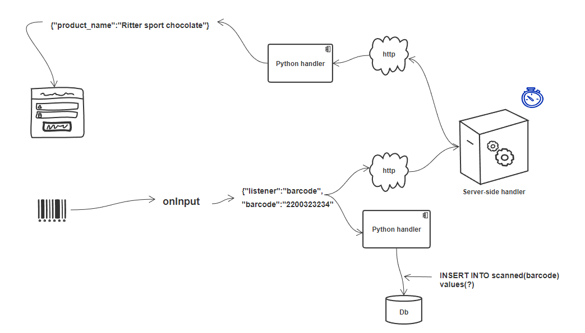
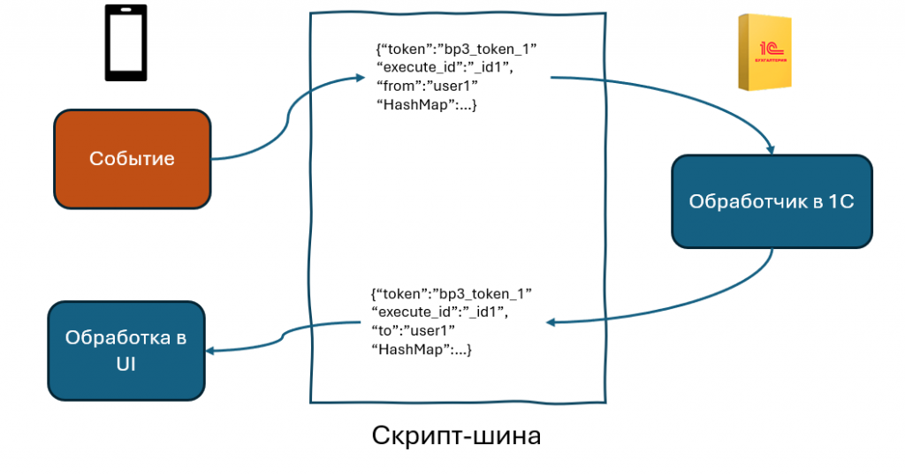

.. SimpleUI documentation master file, created by
   sphinx-quickstart on Sat May 16 14:23:51 2020.
   You can adapt this file completely to your liking, but it should at least
   contain the root `toctree` directive.

Коммуникации
===================

Онлайн-обработчики online и onlinews
--------------------------------------

Онлайн обработчики с одной стороны исполняют логику приложения (посредством команд-переменных и просто переменных). С другой стороны, их можно считать средством коммуникации, т.к. через них можно передавать данные, поэтому они в этом разделе.

SimpleUI выполняет код онлайн на стороне вашей учетной системы либо через HTTP-запрос либо через шину. Команды и переменные курсируют между устройством и бек-системой в запросах в виде стека переменных (HashMap). Синтаксис и принципы в обоих случаях для разработчика – идентичны.

Вариант через HTTP-сервис (обработчик online)
~~~~~~~~~~~~~~~~~~~~~~~~~~~~~~~~~~~~~~~~~~~~~~

В этом варианте потребуется со стороны учетной системы публикация http-сервиса. Тип обработчика в SimpleUI – online.

Необходимо прописать в настройках URL, имя пользователя, пароль веб-сервиса, куда будут приходить запросы при обработке обработчика online

Для 1С это есть расширение SimpleUISplit (скачать https://disk.yandex.ru/d/4tDOY5SjhmQrxQ) нужно установить его, опубликовать http-сервис и прописать настройки как указано на картинке (настройки также можно передавать например через QR-код)

Приложение отправляет POST-запрос вида /set_input_direct/<method> и ожидает ответ. В теле запроса – JSON с обязательными ключами:

 * hashmap – массив JSON- объектов с ключами key, value. Например, ``[{"key":"ShowScreen","value":"Screen 1" }]``
 * ErrorMessage – пустая строка или строка с ошибкой

В ответ приходит сообщение в том же формате из которого собирается стек переменных.

Можно использовать сжатие заголовков с флагом **_GZIP** (нужно поместить его где то вначале, до онлайн-обработчиков). Входящие запросы она автоматом распаковывает по заголовку Accept-encoding: gzip , а чтобы она упаковывала исходящие json нужно где ни будь в инициализации добавить переменную _GZIP . Это именно компрессия/декомпрессия JSON, рассчитанная на слабые каналы (3G, плохой WiFi).

При приеме такого запроса на стороне сервера надо соотвественно траффик распаковывать. Например в Python:

.. code-block:: Python

 inputdata = gzip.decompress(request.data)

Бывают ситуации когда метод удобно передввать в теле запроса, а не в параметрах. К примеру, функция типа pythonargs some_function(a,1,?) Вот только при передача через set_input_direct в виде параметра запроса (в URL) могут быть накладки (это же все таки HTTP-запрос). Поэтому логично что название функции надо прятать в тело запроса. Чтобы все вручную не переделывать, сделал флаг **_ENCODE_ONLINE** который переделывает запросы онлайн-обработчиков. Запрос отправляется **set_input_direct/hashMap** (вместо имени метода всегда hashMap), имя метода внутри hashMap в переменной **online_method**. т.е. имя функции - в стеке переменных. Теперь можно в обработчиках типа онлайн писать не просто имя функции а задавать параметры. 

Вариант через шину, через WebSocket
~~~~~~~~~~~~~~~~~~~~~~~~~~~~~~~~~~~~~~~~

Также, если нет желания или возможности публиковать веб-сервис наружу в Интернет и ваша система умеет работать с веб-сокетами, то можно работать через шину (тип обработчиков onlinews) 

Достоинства такого подхода:

 * Возможность не публиковать 1С HTTP-сервис во внешний интернет. Вместо этого публикуется маленький скрипт, по желанию - либо на собственном сервере/компьютере, либо на VPS. Это позволяет работать даже тем клиентам, у кого нет ни серверной 1С, ни как такового сервера, при этом не нужно выносить данные в облако. Безопасность остается на уровне.
 * Повышение производительности за счет архитектуры и технологии. Отзывчивость таких запросов значительно выше, чем у HTTP-запроса, за счет того, что не нужно устанавливать соединение. Также архитектура выполнения обработчиков не синхронная, как в случае обычного online, а всегда асинхронная, что позволяет разгрузить приложение.Можно разгрузить бек систему за счет распределения нагрузки на шину
 * Приложение может работать с бесконечным количеством серверов, либо распределенных серверов

Принцип работы:

 * Публикуется скрипт «шина». Для целей именно обработчиков полноценная шина SimpleBus не нужна, поэтому я сделал упрощенный скрипт из полутора сотен строчек. Оттуда убраны очереди, кеширование данных, http-интерфейс и все что не нужно, осталось только необходимое. GitHub тут https://github.com/dvdocumentation/simplebuslite
По умолчанию авторизация отключена, но можно завести пользователей (в СУБД на шине) и включить авторизацию.
 * Вся адресация работает на «токенах». Например, у вас есть конфигурация 1С: ERP , вы публикуете от нее токен SimpleConnect_erp_692f4a8d_2c68_40be_82df_4f4b9224ee1e (имя сгенерировано автоматически) и шина теперь «знает», что владелец токена – это вот этот клиент SimpleConnect_erp_692f4a8d_2c68_40be_82df_4f4b9224ee1e. Но клиенты, подключенные к шине (Simple), не знают такой длинный токен, у них в конфигурации прописано просто “erp” – это псевдоним токена. На клиенте хранится БД соответствия токенов и их псевдонимов. Клиент, например, через QR считывает настройки вашей ERP и теперь его Simple запомнил, что erp это  SimpleConnect_erp_692f4a8d_2c68_40be_82df_4f4b9224ee1e. Теперь, когда он передает запрос, он в назначении указывает именно это токен. Звучит сложновато? На самом деле это все делается автоматически. А нужно это для того, чтобы: 1) клиент мог работать с несколькими базами одновременно в рамках одной конфигурации 2) чтобы можно было работать в облаке с одной конфой, но разными серверами (например, эти примеры к статье – у всех прописано bp, шина допустим одна (моя на VPS) но токены у всех разные, за счет такой архитектуры каждый работает в рамках своего токена)
 * В Simple один раз сканируются настройки (их также можно установить из кода) и он начинает отправлять синхронные и асинхронные запросы. Работает это так. Возникает событие, запускается обработчик onlinews. Он может быть синхронным, асинхронным или «с прогресс-баром». Для каждого вызова приваривается уникальный номер execute_id, который уходит в запросе на шину, а потом в бек-систему, а потом возвращается в виде «ответа». Ответ в кавычках, потому что в архитектуре веб-сервисов нет ответов, это просто сообщения. Все это время Simple терпеливо ждет сообщения от шины с таким execute_id. В случае синхронного запуска он блокирует UI и «подвешивает» систему. В случае runprogress показывает крутилку. В случае асинхронного обработчика ничего не блокируется, но когда будет получен ответ, может быть выполнен обработчик postExecute
 * Вместе с запросом туда-сюда ходит стек переменных/команд. Ожидание ограничено временем ожидания (по умолчанию 10сек, задается в настройках) 
 * Таким образом вся обработка выполняется на стороне внешней системы. Отладка, естественно, тоже доступна на стороне внешней системы.

Расширения для 1С можно скачать тут https://infostart.ru/1c/articles/2305445/

SimpleBUS
-----------

Специально написанный для SimpleUI open source проект для синхронизации между SimpleUI и другими решениями. Описан в разделе SimpleBus

.. note:: Для обработчиков и отладки есть упрощенный вариант этого скрипта, см. раздел Онлайн обработчики

WebSocket
-----------

Также можно организовать работу WebSocket клиента не прибегая к использованию шины SimpleBus и не используя ее стандарты. Для этого есть альтернатиыный вариант с WebSocket. Примеры можно посмотреть тут: https://infostart.ru/1c/tools/1901884/

Команды:

 * **ConnectWebSocket** – соединиться с веб сокетом. Пример: ``hashMap.put("ConnectWebSocket","ws://192.168.1.41:8765")``

 * **WSOnConnectHandlers** – подключить обработчики события успешного соединения с сокетом в формате архитектуры 2.0. 

Пример: 

``hashMap.put("WSOnConnectHandlers",json.dumps([{"action":"run","type":"python","method":"ws_connect"}] ))``

 * **WSOnMessageHandlers** - подключить обработчики события получения сообщения в формате архитектуры 2.0. Само сообщение приходит в переменной  *WebSocketMessage*

 * **WSOnCloseHandlers** -  подключить обработчики события нормального завершения соединения  в формате архитектуры 2.0.

 * **WSOnFailureHandlers** -   подключить обработчики события потери соединения  в формате архитектуры 2.0.

 * **WebSocketSend** – команда отправки сообщения в сокет. 

 * **CloseWebSocket** – команда завершения соединения. Также можно закрывать соединения со стороны сервера например.

Особенности работы:

 1. При разрыве соединения автоматически происходит переподключение каждую секунду. Чтобы остановить попытки надо удалить переменную *ConnectWebSocket*

 2. При начальном соединении автоматически посылается сообщение в формате ``id:<AndroidID>`` . Это можно использовать для идентификации пользователей например

HTTP-запросы
----------------

Если не достаточно онлайн-обработчиков (которые по сути являются HTTP-запросами) и шины и нужно именно отправлять http-запросы, то можно это сделать:

 * Из Python-обработчиков, модуль **requests**
 * Из JavaScript-обработчиков, **XMLHttpRequest**

Работа с Bluetooth устройствами, TCP/IP, USB
----------------------------------------------

Описано в разделе Работа с оборудованием

GPS
------

В настройках есть галочка «Отправлять координаты» если ее включить, то в любом процессе, который запущен будут добавляться специальные переменные, относящиеся к службе геопозиционирования.

.. note:: Необходимо в настройках дать приложению разрешение на определение местоположения. Также необходимо убедиться, что в устройстве включено определение местоположения.

Устройство запрашивает данные каждые 5 секунд и отправка происходит каждый раз когда отправляются переменные. Сразу в момент запуска процесса данных может не быть, нужно чуть-чуть подождать.

Данные запрашиваются и поступают с 2х провайдеров – gps и network (сети или wi-fi) – в обработчике можно фильтровать по факту.

Специальные переменные, в котрые устройство передает данные:

 * **Latitude** – широта
 * **Longitude** – долгота
 * **gps_city** – город, если есть в адресе
 * **gps_postal_code** – индекс
 * **gps_addres_string** – полная неразобранная информация , которую можно разобрать по тегам
 * **gps_provider** – источник данных
 * **gps_accuracy** - точность

NFC
-------

Можно использовать NFC-метки в своих решениях для идентификации. С меток сканируется:
 
 * ID(serial number) – в переменную **NFC_ID**
 * Записанный текст, если есть, – в переменную **NFC_TEXT**

Доступно 2 режима:

 * Режим сканирования записанных NDEF-меток отовсюду. Только метки, записанные, содержащие информацию в текстовом виде (mimeType: text/plain) – событие придет на сервис приложения и обработается в общем обработчике даже если приложение выключено. Зачем именно такие ограничения? Потому что на это сочетание (NDEF+text/plain) рассчитан фильтр приложения. Т.е. Андроид знает, что у него установлено приложение (SimpleUI), которое умеет обрабатывать такие метки. И когда подносишь метку, он это распознает, запускает приложение и дальше генерируется общее событие onNFC. Т.е. это доступно без процесса, в любом режиме. В принципе можно использовать для запуска процессов из андроида.

 * Режим сканирования в любых технологиях, любых типов меток. Запускается на экране, если на экране есть элемент NFC (либо в переменные добавлен флаг **onNCF**). Экран должен быть открыт(активен). Генерируется событие ввода с listener=**onNFC** Также считывается ID и, если есть, текст.

Примеры можно посмотреть тут: https://infostart.ru/1c/tools/2251192/

p2p передача данных в отсутствии связи
-----------------------------------------

**DirectWIFI** в полнодуплексном режиме (каждое устройство и клиент и сервер) https://t.me/devsimpleui/136

**Оптическая передача p2p данных** между устройствами https://t.me/devsimpleui/136

Оптическая передача данных ActiveCV Видео: https://youtu.be/9Gwho6bWeKk Исходники: https://github.com/dvdocumentation/simpleui_samples/tree/main/QR%20data%20sending и https://github.com/dvdocumentation/simpleui_samples/tree/main/QR%20data%20sending
