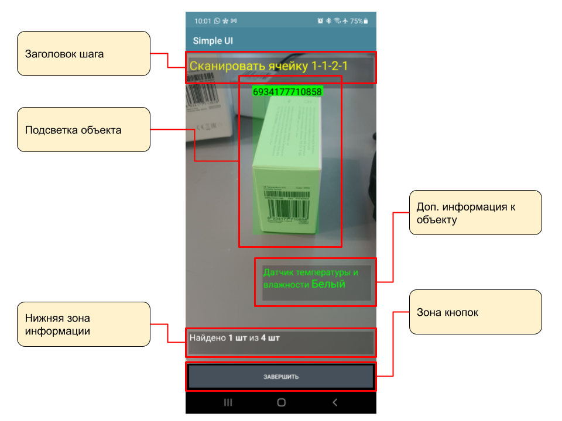

.. SimpleUI documentation master file, created by
   sphinx-quickstart on Sat May 16 14:23:51 2020.
   You can adapt this file completely to your liking, but it should at least
   contain the root `toctree` directive.

Компьютерное зрение и дополненная реальность ActiveCV
========================================================

Режим дополненной реальности ActiveCV
----------------------------------------

В систему добавлены самостоятельные объекты, которые совмещают различные AI-детекоры с визуализацией в видеопотоке и взаимодействие с обработчиками Python/1C по событиям, которые происходят в видеопотоке. Таким образом в режиме камеры происходит вывод информации в графической форме и сканирование объектов различными детекторами - это создает эффект дополненной реальности. Этот режим может дополнять существующий традиционный интерфейс или полностью заменить его. Например в кадре можно вывести информацию по объекту или подкрашивать разными цветами объекты которые нужно учитывать или которые уже учтены (например если по товару уже проведена инвентаризация то он может быть окрашен желтым цветом, а ненужный товар - красным)

В конструкторе добавлены объекты CV-Операция и CV-Шаг. Операция состоит из шагов. Каждый шаг отвечает за какой то процесс. Например 1й шаг - выбор ячейки, а второй шаг - сканирование товара. Но ничего не мешает использовать всего один шаг и не переключаться между ними. Операция может быть добавлена в основное меню конфигурации и запускаться самостоятельно. Либо она может быть вызвана из обычного процесса с помощью команды **"RunCV"** , в значении - название операции. Например Переменные.Вставить("RunCV","Просто сканирование всего");  После закрытия операции любым способом она порождает событие **"onResult"** и передает в пул переменных переменные cv_detected и cv_drawn со списками отсканированных и подсвеченных на экране объектов. Также передаются все остальные текущие переменные процесса. Например current_object - текущий распознанный объект. В сочетании с командой FinishProcess может работать как вызываемый (старый) режим распознавания: запустили RunCV-распознали-закрыли FinishProcess-получили результат.

Вся логика визуализации и распознавания находится в CV-Шаге. Тут же задаются и обработчики всех событий.

.. image:: _static/cv_step.PNG
       :scale: 100%
       :align: center

Тут задается (для каждого шага):

 *  тип детектора - детекторы подробно описаны ниже
 *  режим отображения объектов. Логика отображения управляется списками - зеленый, красный, серый, желтый список + невидимые объекты. Списки задаются через специальные переменные при запуске либо по ходу действия. В этом свойстве выбирается вариант отображения.
 *  разрешение - один из 4х вариантов - от 360*240 до FullHD. Разрешение влияет на производительность и FPS - т.е. на плавность работы и нагрузку на процессор.
 *  Настройки распознавания - для детекторов OCR
 *  Кнопки действия под экраном - горизонтальный список кнопок, разделенный ";". Можно не задавать кнопки вообще.
 *  Заголовок действия - текст или переменная (через @) в которой задается текст сверху экрана (обязательный)
 *  Инфо - текст или переменная (через @)  в которой задается текст внизу экрана (необязательный)

Виды событий и обработчиков (для Python и 1С одинаковый набор):

 *  **OnCreate** При открытии - вызывается при запуске каждого **шага**. Т.е. при переключении шагов будет выполняться этот обработчик. При запуске операции вызывается обработчик первого шага.
 *  **OnObjectDetected** Найден новый объект - вызывается когда в камеру попал новый объект один раз (т.е. последующие попадания этого объекта не будут восприниматься). Новый объект помещается в переменную **current_object**
 *  **OnTouch** Нажатие на объект - вызывается при таче на объект. Нажатый объект попадает в переменную **touched_object**
 *  **OnInput** Обработка действия - сюда попадают нажатие кнопок под экраном и события диалога

Входные переменные, задающие отображение объектов:

 *  Списки по цветам: **green_list**, **red_list**, **yellow_list**, **gray_list**,**blue_list**, **hidden_list**. Разделитель - ";". Значения  - текстовый идентификатор или штрихкод. 
 *  Список информации к объектам(доступен html) - нижний: **object_info_list** - JSON-массив типа [{"object":"6934177713958","info":"Датчик температуры <b>Белый</b>"},...] Данные список выводит табличку под объектом, с некой инерционностью, для более плавного отображения
*  Список информации к объектам (доступен html в Мультисканер) – в заголовке: **object_caption_list** - JSON-массив типа [{"object":"6934177713958","caption":"Датчик температуры <b>Белый</b>"},...] Данные список переопределяет заголовки объекта
 * Список пропуска обработки объектов (отключает обработчики новых объектов): stop_listener_list, разделитель – “;”

Команды, доступные в режиме ActiveCV:

 *  Все, стандартные команды без контекста - toast, beep и т.д.
 *  **NextStep** - переключить на следующий шаг. Указывается имя шага
 *  **FinishProcecc** - переключить на следующий шаг
 *  **ShowDialog** - полностью аналогично этой же команде в обычных экранах, за исключением того, что в случае размещения на диалоге контейнера с элементами следует указать процесс через **ShowDialogProcess**
 *  **remove_drawn** - убирает объект из списка "новых объектов", таким образом если на него еще раз навести то будет снова сгенерировано событие "Новый объект".

Общее (настройки распознавания) 
-----------------------------------

Распознавание текста 
~~~~~~~~~~~~~~~~~~~~~~~~~~~~~~~~~

Поиск по SQL
"""""""""""""""

На экран можно добавить элемент «Распознавание текста» (в ActiveCV это является детектором), при этом необходимо указать настройку распознавания (справочник «Настройки распознавания») с видом распознавания «Распознавание текста». Данный вид распознавания предполагает что будет вестись поиск заданной текстовой строки из некой базы строк. Например, у вас есть справочник товаров с артикулами, таким образом, в настройке нужно определить запрос к справочнику товары и в реквизите проверяемое поле определить артикул, а также указать соответствие полей таблицы и переменных. Так как этот процессинг выполняется в видеопотоке запрос должен быть быстрым, поэтому это прямой SQL запрос и таблица должна быть на устройстве (см. варианты синхронизации SQL таблиц). 

Данный способ обеспечивает почти 100% точность работы  в целом, так как алгоритм точно знает какие образцы требуется найти (выбирает из списка), а не выдает просто наиболее вероятные гипотезы как в обычном OCR.

.. note::  Возможно, потребуется организовать отдельное поле таблицы, где будут текстовые идентификаторы, преобразованные к виду, удобном для распознавания. Например указана только значащая часть текстового идентификатора.

.. note:: Распознавание ведется в латинском алфавите, поэтому если артикулы содержат русские буквы, их надо преобразовать в латинские. 

Также следует учесть, что OCR часто путает «O» и «0» поэтому возможно потребуется включить галку «Преобразовать O в ноль» если например нужно распознавать только цифры.

Возможно, увеличить эффективность можно будет если поставить галку «Привести в верхний регистр», тогда артикулы в поисковом поле таблицы также нужно привести в верхний регистр.

Минимальное количество символов лучше указать если оно известно (например известно что все артикулы длиннее 3х символов)

Повышение показателя «Количество измерений» повышает точность, но снижает скорость. Также совместно с этим полем можно задать минимальную среднюю частоту. Например на 10 измерений 75% - считать верным.

Настройки подбираются под условия распознавания индивидуально - от этого зависит успешность проекта.

Распознавание текста в режиме поиска образцов, где образцы передаются в списке а не SQL (в ActiveCV)
"""""""""""""""""""""""""""""""""""""""""""""""""""""""""""""""""""""""""""""""""""""""""""""""""""""

Можно не прописывать SQL-запрос для идентификации образцов(и не заниматься синхронизацией таблицы на устройствах), а передать список возможных вариантов через переменную из обработчика в виде списка с разделителями - ";". Т.е. например установить переменную @list в поле настройки распознавания "Список возможных значений" и в этой переменной передать артикулы "DK00022;SK02111" - по этим значениям будет осуществляться распознавание.

Распознавание текста в режиме обработки образцов в обработчике
""""""""""""""""""""""""""""""""""""""""""""""""""""""""""""""""""""""

В "Распознавании текста" (не ActiveCV, только обычные экраны) можно указать вместо "Список значений" массив обработчиков с префиксом ~[массив обработчиков]. Таким образом при детектирования текста, весь найденный текст будет попадать в обработчик в переменную **ocr_text**. Далее в обработчике анализируется текст (например ищется товар по артикулу). И для окончания цикла распознавания нужно поместить переменную **ocr_result**

Распознавание дат и чисел.
~~~~~~~~~~~~~~~~~~~~~~~~~~~~

Распознавание дат может пригодиться для проверки сроков годности, приемки серий товара путем сканирования даты производства в упаковке и т.д.  Распознавание чисел может быть альтернативой «Распознаванию текста» для поиска числовых артикулов или для других целей.

В отличии от варианта «Распознавание текста», варианты «Распознавание дат» и «Распознавание чисел» не знают точно что искать (нет конечного набора артикулов), но знают **формат искомого образца** – это различные форматы написания дат (для распознавания дат) и форматы чисел. Для этих способов не требуется готовить таблицу SQL и запрос.

Данные виды распознавания возвращают ВСЕ найденные в кадре объекты через точку с запятой в переменную, указанную в настройках (Переменная результат).

Все настройки сводятся к выбору Вида распознавания в «Настройках распознавания», а также настроек:

 *  Количество объектов в кадре. Например, на упаковке «Дата производства» и «Срок годности» - нужно указать что требуется 2 объекта 
 *  Количество измерений – имеет смысл в использовании совместно с предыдущим параметром. Например, требуется найти 2 даты, за 10 измерений найдено 4 гипотезы, отсортированы по частоте и топ этого списка – 2 первых записи, как раз и будут 2 искомые даты. Это значительно повышает точность.
 *  Минимальное и максимальное количество символов – если известны границы количества символов в искомой метке.

Распознавание автомобильных номеров (в ActiveCV) 
~~~~~~~~~~~~~~~~~~~~~~~~~~~~~~~~~~~~~~~~~~~~~~~~~~~~

Еще один вид "распознавания по шаблону". В настройке нужно выбрать вид распознавания "Автомобильные номера". Больше никаких настроек. В настоящий момент доступны только российские номера. Потом будут добавлены другие.

Распознавание материальных объектов/предметов (в ActiveCV) 
~~~~~~~~~~~~~~~~~~~~~~~~~~~~~~~~~~~~~~~~~~~~~~~~~~~~~~~~~~~~

.. note:: Рекомендуется использовать Мультисканер

В этом виде детектора происходит выделение границ материальных объектов в кадре и захват объекта в целом. При этом выделяюся только те объекты в которых есть учетная информация - штрихкод или объект OCR. Система связывает физический объект с его идентификатором и воспринимает как целостный объект. Т.е. например система захватит и покажет границы коробки, если на этой коробке есть серийный номер или штрихкод. При этом даже если штрихкод или текст уже не распознаются, но объект остается захвачен в кадре для системы это остается прежним объектом - она его ведет и знает что это искомый идентифицированный объект. Работает более плавно чем OCR/чтение штрихкодов так как не ищет новые гипотезы при разных условиях видимости текста/штрихкода. Существует 3 настройки: Объекты с OCR и штрихкодом/Объекты только с OCR и Объекты тлько с штрихкодом

Распознавание материальных объектов/предметов в режиме Мультисканер
~~~~~~~~~~~~~~~~~~~~~~~~~~~~~~~~~~~~~~~~~~~~~~~~~~~~~~~~~~~~~~~~~~~~~~~~~~~

Специальный детектор ActiveCV работа которого заключается в следующем: в каждре распознаются материальные объекты, внутри каждого объекта можно подключить разные детекторы - штрихкод, OCR и, после того как объект идентифицирован - отключить (режим stop). Таким образом, детектор оптимизирован под максимальную производительность, т.к. постоянное детектирование (особенно OCR) требует больших ресурсов. Для этого детектора также доступны специальные режимы OCR. Документация пока не готова, более подробно можно посмотреть в статьях и примерах тут https://infostart.ru/1c/tools/1882131/

Распознавание лиц
~~~~~~~~~~~~~~~~~~~~~~~~~

Распознавание лиц возможна двумя детекторами: Распознавание лиц (подробности в статье: https://infostart.ru/1c/articles/1486598/) и face_opencv

Идентификация материальных 2D-объектов без идентификационных знаков и текста (по фичам)
~~~~~~~~~~~~~~~~~~~~~~~~~~~~~~~~~~~~~~~~~~~~~~~~~~~~~~~~~~~~~~~~~~~~~~~~~~~~~~~~~~~~~~~~~~~

Документация в стадии разработки. Подробности в статье: https://telegra.ph/OpenCV-v-relize-SimpleUI-1150-04-20

Работа с OpenCV
~~~~~~~~~~~~~~~~~~~~~

Доступна интеграция с локальной библиотекой OpenCV для Python. Документация в стадии разработки. Подробности в статье: https://telegra.ph/OpenCV-v-relize-SimpleUI-1150-04-20

Шаблоны и рамки областей сканирования
~~~~~~~~~~~~~~~~~~~~~~~~~~~~~~~~~~~~~~~~~~

Документация в стадии разработки. Подробности в статье: https://infostart.ru/1c/tools/1882131/

Фотографирование видеопотока в ActiveCV
~~~~~~~~~~~~~~~~~~~~~~~~~~~~~~~~~~~~~~~~~~

Можно снимать снимок всего, что есть в кадре параллельно с любым режимом детектирования. Полученный результат запишется в файл. 
Это доступно с помощью команды-переменной:

**CVCaptureImage** - делает снимок, само фото пишется в файл, а ссылку на файл можно получить в событии **CVCaptureResult** в переменной **CVCaptureFile**

Настройки OCR
~~~~~~~~~~~~~~~~~~~~~

Настройки распознавания (поле VisionSettings) можно задавать в конструкторе и также можно задать настройки из кода перед началом распознавания (для экранов и ActiveCV) с помощью команды-переменной:

**SetVisionSettings(<{словарь с настройками}>)** – команда для экранов и ActiveCV которая, если ее выполнить до запуска распознавания, задаст настройки детектора

Доступны следующие настройки:

Для варианта «опорная выборка – SQL»:

 * **query** - SQL запрос для варианта поиска по SQL-таблице с одним параметром(в который передается распознанный текст ) Например: select * from SW_Goods where product_number like  ?
 * **control_field** - поле таблицы по которому проверяется OCR , условно Артикул (несмотря на то, что в query оно скорее всего также участвует)
 * массив **cursor** с объектами {"field":<поле таблицы>,"var":<переменная результат>}

Для варианта «опорная выборка – список значений/обработчик):

 * **values_list** (строка) - режим поиска по списку, либо обработчиком. В случае, если опорная выборка – список значений, то он передается строкой с разделителями «;» . Если на событие распознавания текста нужно назначить обработчик, в который передастся весь распознанный текст, то в этот параметр передается строка вида ~<массив обработчиков> . В обработчик попадает распознанный текст в переменную ocr_text. В случае успешного распознавания необходимо поместить что то в переменную ocr_res. Этот вариант только для «Распознавание текста» на экранах, для ActiveCV есть подобное - Мультисканер

Настройки параметров фильтрации:

 * **min_length** (число) - минимальная длина текста
 * **max_length** (число) - максимальная длина текста
 * **ReplaceO** (булево) - заменить буквы О на 0 (нули)
 * **ToUpcase**  (булево) - преобразование в верхний регистр
 * **mesure_qty** (число) - количество измерений (по умолчанию 1 и частота не анализируется)
 * **min_freq** (число) - число от 0 до 100 - вероятность (в процентах для удобства ввода)
 * **OnlyNumbers** (булево) - только для Мультисканер - фильтрация только тех объектов, которые - числа

Специальные режимы:

 * **PlateNumberRecognition** (булево) – режим распознавания автомобильных номеров российские номера (только для ActiveCV)
 * **NumberRecognition** (булево) - распознавание чисел
 * **DateRecognition** (булево) - распознавние дат
 * **result_field** (строка) - для распознвания дат и номеров, туда помещается результаты особым образом (смотря что ищем)
 * **count_objects** (число) – только для NumberRecognition количество циклов измерений. Чем больше циклов тем больше точность
