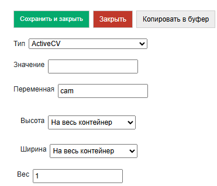

.. SimpleUI documentation master file, created by
   sphinx-quickstart on Sat May 16 14:23:51 2020.
   You can adapt this file completely to your liking, but it should at least
   contain the root `toctree` directive.

Компьютерное зрение и дополненная реальность ActiveCV
========================================================

.. image:: _static/2025_cv_1.PNG
       :scale: 75%
       :align: center

ActiveCV – это технология автоматизации бизнес-процесса, когда все необходимые данные бизнес-процесса выводятся не на экран, а сразу в видеопоток, при этом с камерой работают различные детекторы: штрихкодов, OCR, лиц и т.д. Также смысл сего действия в беспрерывной работе оператора без необходимости каких то переключений. Например, запустил ActiveCV – отсканировал код помещения, не прерываясь и ничего не нажимая переключился на сканирование инвентарных кодов оборудования, VIN-ов, далее серии фото этого оборудования и все это, не переключаясь на обычные экраны с кнопками. И пошел дальше к другим объектам.  

Важным свойством технологии является подсветка объектов разными цветами – цветовая маркировка. Примеры цветовой маркировки:

 * объект находится там, где надо — зеленый цвет, там, где не надо — красный.
 * объект проинвентаризирован — зеленый цвет, не проинвентаризирован — желтый.
 * заказ просрочен по дедлайну — красный, подходит срок — желтый, не просрочен — зеленый

.. image:: _static/2025_cv_3.PNG
       :scale: 75%
       :align: center

Примеры (лучше смотреть видео или GIFы) по технологии собраны в этих статьях (на платформе было 2 генерации ActiveCV: первая, в виде самостоятельно процесса - устарела, в виде элмента экрана - актуальная):

 * https://habr.com/ru/articles/874560/
 * (устар.) https://infostart.ru/1c/articles/1427287/
 * (устар.) https://infostart.ru/1c/articles/1486598/
 * (устар.) https://infostart.ru/1c/tools/1882131/

Обзор механизмов работы.
-----------------------------

Размещение визуального элемента.
~~~~~~~~~~~~~~~~~~~~~~~~~~~~~~~~~

Размещение на экране ничем не отличается от других элементов контейнера, но как и например HTML-поле требует чтобы была **отключена прокрутка корневого контейнера**. Сам визуальный элемент контейнера называется ActiveCV. Можно разместить на часть контейнера, весь экран. И также с помощью команды RunCV2 можно запустить полноэкранный режим без каких либо дополнительных элементов в отдельном окне.

Разрешение
~~~~~~~~~~~~

Можно задавать разрешение для детектора **CameraSetResolutionAnalysis** и для фото **CameraSetResolutionImage**. Разрешение предпросмотра меняться не будет – оно подстраивается автоматически. Также заданное разренеие может не поддерживаться (особенно для детектора) – будет выставлено максимально возможное

Возможные разрешения: ``"4K"(4096*2160))``, ``"2K"(2048*1080)``, ``"1080"(1920*1080)``, ``"720"(1280*720)``, ``"640"(640*480)``, ``"360"(360*240)``, ``"200"(200*200)``, ``"100"(100*100)``

Соответственно, чем меньше разрешение (особенно детектора) тем быстрее и плавнее работает визуальная составляющая. 

Цикл работы детекторов. Общее.
~~~~~~~~~~~~~~~~~~~~~~~~~~~~~~~~~

Детектор включается/переключается командой **CameraSetDetector**, где параметром указывается тип или типы детекторов. Сейчас доступны ``BARCODE``, ``OCR`` и ``PHOTO``. 

Если нужно совместить несколько – то через нижнее подчеркивание. Например, ``BARCODE_PHOTO``

Когда появляется новый объект в кадре, который еще не был распознан срабатывает событие (listener) **new_text_detected** или **new_barcodes_detected** в зависимости от детектора. В стеке доступна строка с JSON-массивом объектов кадра - **detected_values**. Наполнение распознанных элементов зависит от детектора. В обработчике этого события возможно задать внешний вид распознанных объектов.

Отображение объектов
~~~~~~~~~~~~~~~~~~~~~~~~

Можно переопределять заголовки распознанных объектов и задавать цвет рамки над ними. Это все хранится в одном списке **SetObjectsView** в виде JSON-массива объектов с полями id, color (HEX-формат) и caption. Id – это соответственно штрихкод или текст.
Для медленных устройств отображение упрощенное. Для быстрых доступна HTML-строки в заголовках объектов с помощью команды **CameraSetPrettyView**. Т.е. можно например написать в caption ``"Товар такой то, <b> остаток такой то </b>"``. Также в PrettyView секции заголовка выстраивается по размеру объекта, а не текста, т.е. происходят переносы. Для такого отображения дополнительно с SetObjectsView нужно добавить команду  CameraSetPrettyView

Ручное управление списком детектированных объектов.
~~~~~~~~~~~~~~~~~~~~~~~~~~~~~~~~~~~~~~~~~~~~~~~~~~~~~~

По умолчанию на новые объекты вызывается обработчик **new_..._detected** (**new_barcodes_detected***, **new_text_detected**) и после этого они уже перестают считаться «новыми», на них события не вызываются. Но можно управлять этим вручную с помощью флага **CameraSetOCRDetectedListManual**, пустой параметр, затем ручная регистрация с помощью **CameraOCRAddDetected**, параметр – список ID. Также доступно **CameraClearDetected**, пустой параметр для того, чтобы просто сбросить список всех детектированных объектов.

Подключение валидатора
~~~~~~~~~~~~~~~~~~~~~~~~~~

Принцип работы один для все детекторов, но вызывается разными командами, чтобы совместить в одном датасете поля, подлежащие валидации. Например, в примерах в одном датасете артикул и штрихкод. Для штрихкодов команда **CameraSetBarcodeValidator** для OCR **CameraSetOCRValidator**

В качестве параметра – объект типа ``{"dataserver":<имя датасета>,"keys":[массив имен hash-индексов]}`` Записи в датасете имеют поле _Id (если оно не задано, то задается автоматически, но можно записывать сразу с _id) – это первый индекс. Также можно добавить хаш-индексы для любых полей в настроки датасете при создании. Например 

``CreateDataSet("goods",json_to_str({"hash_keys":["article","barcode"]}))``

По этим полям и будет производиться поиск и валидация. Когда подключен валидатор, то события возникают только если запись найдена в валидаторе. Также в случае с валидатором при нахождении записи в выдаваемое значение будет добавлена сама запись датасета целиков в поле result.

Зум
~~~~~

**CameraSetZoom**, <параметр> – число требуемого приближения (стек перменных строковый, поэтому и числа и другие параметры в виде строки).

Остановка видеопотока.
~~~~~~~~~~~~~~~~~~~~~~~~

**CameraStopDetectorOnNewObjects* - включение режима, когда предпросмотр камеры встает на паузу автоматически при обнаружении объекта.

Альтернатива – использование из кода обработчика команды **CameraStop**.

Возобновляется – обновлением экрана.

Фонарик
~~~~~~~~~

**CameraTorchTurnOn** – включает подсветку камеры (если есть аппаратная возможность)

Запуск в отдельном экране с возвратом значения
~~~~~~~~~~~~~~~~~~~~~~~~~~~~~~~~~~~~~~~~~~~~~~~~~

**RunCV2, <listener>** - запускает из экрана ActiveCV на весь экран до считывания первого результата, после чего закрывает камеру и генерирует событие с указанным в параметре именем события. Эта возможность для ситуаций, когда что-то нужно быстро считать, а размещать на экране элемент ActiveCV не хочется или нет возможности (экран маленький). В примере ниже я использую чисто для распознавания OCR на новом движке ActiveCV2 для ТСД-варианта. На ТСД не нужен сканер через камеру (свой есть), а вот OCR нужен, но размещать на экране ActiveCV негде (экран маленький). 

Особенности детектора штрихкодов
~~~~~~~~~~~~~~~~~~~~~~~~~~~~~~~~~~~

**CameraSetSupportedBarcodes** задает список доступных штрихкодов через нижнее подчеркивание. Например: ``hashMap.put("CameraSetSupportedBarcodes","QR_EAN13")``

Если не задано, либо задано ALL то сканируются все.

Список доступных форматов: ``QR``, ``EAN13``, ``AZTEC``, ``CODABAR``, ``CODE_93``, ``CODE_39``, ``CODE_128``, ``DATA_MATRIX``, ``EAN_8``, ``ITF``, ``UPC_A``, ``UPC_E``

**CameraSetCurrentBarcodeDetector**  задает список текущих форматов штрихкодов при динамическом переключении. Формат аналогичен CameraSetSupportedBarcodes. При этом
CameraSetSupportedBarcodes задает форматы которые камера вообще способна считывать. Это так сказать – для ускорения работы и отсечки возможных ошибок. А CameraSetCurrentBarcodeDetector   для переключения между форматами в процессе работы.

Массив штрихкодов в **detected_values** включает в себя объекты с полями: **value** – штрихкод как есть (со спецсимволами если они есть), **display_value** – отображаемое значение, **format** – формат штрихкода. Ну и **result** ,если используется валидатор, с непосредственно записью датасета.

Особенности OCR
~~~~~~~~~~~~~~~~~

Цикл обработки блоков текста включает в себя несколько этапов. Все они происходят очень быстро так как выполняются платформой. Поэтому крайне рекомендую не отдавать в обработчики сырой текст, пропущенный через слабые фильтры и обрабатывать его как есть там – это будет гораздо более тормозящий вариант чем использование масок, валидаторов и предобработки.
 
Обработка текста в ActiveCV
~~~~~~~~~~~~~~~~~~~~~~~~~~~~~~~

Итак, текст может быть подвергнут предобработке, после чего к нему применяются Regex-маски, после чего могут выполниться еще процедуры предобработки (часть настроек работает до масок- часть после), после чего он либо попадает на валидатор либо отдается в обработчик new_text_detected как есть. Если задача к примеру выделить все даты в кадре то валидатор не нужен, а если сверить инвентарные номера - то подключаем валидатор.

Команда CameraSetOCRFormatOptions задает опции предобработки текста. Она может включать в себя несколько действий через нижнее подчеркивание:

 * CLEARSPACES – убирает различные пробелы
 * LOWER -преобразует к нижнему регистру
 * UPPER – преобразует к верхнему регистру
 * TOZERO – преобразует букву О в ноль

И часть опций, которая выполняется уже после отбора Regex:

 * DATE, INT, FLOAT – нативная проверка текста на соответствующий тип

Команда **CameraSetOCRMask** – задает JSON массив строк-масок. Каждая  маска представляет из себя Regex-выражение. Например, "([a-zA-Z0-9-.]{5,10})" - это маска, для поиска подстрок включающих в себя символы латинского алфавита и цифры общей длиной от 5 до 10 символов. Удобно проверять маски через редакторы regex-выражений, например https://regex101.com/ Каждая маска последовательно применяется, приоритет имеет та, которая стоит раньше в массиве.

**CameraOCRListOnly** флаг чтобы выводились не только текст после валидатора, если он есть.

**detected_values** в OCR содержат в себе поля:

 * value - текст после всех преобразований
 * confidence - точность определения
 * result - запись валидатора

Примеры обработчика new_<barcodes|text>_detected + SetObjectsView:

.. code-block:: Python

 jvalues = str_to_json(hashMap.get("detected_values")) #получим массив распознанных объектов

 #читаем ранее созданнуюю раскраску объектов или создаем новую
 if hashMap.containsKey("SetObjectsView"): 
     objects = json.loads(hashMap.get("SetObjectsView"))
 else:   
     objects = []
     
 for item in jvalues :
     res = item["result"]
     #Такой цвет(color) и заголовок(caption) будет у новых объектов 
     cv = {"id":item["value"],"color":"#82e0aa","caption":res.get("name")}
     id = item["value"]
     #Ищем в уже существующей раскраске такие объекты (у них может быть другой цвет)
     itemarr = next((itemo for itemo in objects if itemo["id"] == id), None)
     if itemarr == None:  
         objects.append(cv) #если нет, то добавляем
     else: #если есть, то перекрашиваем
         itemarr["color"] = cv["color"]
         itemarr["caption"] = cv["caption"]
 
 hashMap.put("SetObjectsView",json_to_str(objects)) #применяем раскраску
 hashMap.put("noRefresh","") #запрещаем перерисовку экрана
