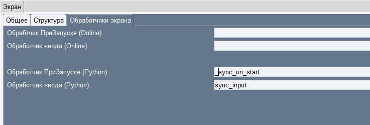
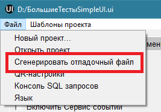

.. SimpleUI documentation master file, created by
   sphinx-quickstart on Sat May 16 14:23:51 2020.
   You can adapt this file completely to your liking, but it should at least
   contain the root `toctree` directive.

Про отладку
=============

Отладка в он-лайн режиме
--------------------------

Онлайн режим означает что код обработчиков выполняется на стороне бека, то есть на сервере. Соотвественно без труда можно задействовать отладку средствами сервера. Например если в качестве бек-системы используется 1С то для отладки надо:

 * В серверном общем модуле (например ОтладкаПроцессов) вынести код обработчиков в отдельные процедуры. Например ``Обработчик1(Переменные,ТаблицаСтрок,Ошибка,СообщениеОбОшибке) Экспорт``
 * В соотвествующих обработчиках добавить вызов этой процедуры ``ОтладкаПроцессов .Обработчик1(Переменные,ТаблицаСтрок,Ошибка,СообщениеОбОшибке)``
 * Включить режим отладки на сервере, включить Автоматическое подключение к HTTP-сервисы и пройти обработчик в режиме отладки

Также для понимания работы и того что передается Ингода нелишним может быть перехватывать обработчик метода set_input HTTP-сервиса SimpleWMS – там можно посмотреть какие данные приходят кроме переменных в ответе JSON

Отладка в самостоятельном режиме
------------------------------------

Разработка оффлайн скриптов предполагает использование нескольких инструментов и методик для просмотра содержимого переменных, СУБД и отладки.

Консоль запросов
~~~~~~~~~~~~~~~~~

Прежде всего, если для хранения используется SQL СУБД, для просмотра содержимого таблиц, проверки работы запросов, которые используются в скриптах рекомендуется использовать «Консоль SQL запросов». Устройство и вызывающая обработка должны использовать одну подсеть, так как отправка запросов идет на веб-сервис приложения. В запросах можно передать параметры. Можно использовать все возможности SQLlite – служебные таблицы и т.д.

Логирование
~~~~~~~~~~~~

Для получения промежуточных данных можно использовать логирование и выводить тосты особым способом (внутри кода обработчика). Таким образом можно получать как значения переменных так и напрмиер логировать датасеты запросов не в начале/конце обработчика а именно внутри кода. 
Записи логов отправляются http-запросами, в демо базе есть сервис python_debug и регистр сведений scЛогPython куда пишутся значения.
Вот пример общего модуля сервисных процедур для этого:

.. code-block:: Python

  import sqlite3
  from sqlite3.dbapi2 import Error
  import requests
  import json
  import java
  from requests.auth import HTTPBasicAuth
  from com.chaquo.python import Python

  # Процедуры для отадки python-скриптов
  def query_to_json(query, args=()):
      conn = sqlite3.connect('//data/data/ru.travelfood.simple_ui/databases/SimpleWMS')
      cursor =  conn.cursor()
      cursor.execute(query, args)
      r = [dict((cursor.description[i][0], value) \
                 for i, value in enumerate(row)) for row in cursor.fetchall()]
      cursor.connection.close()
      return r
  
  def send_debug_msg(hashMap,tag,message):
      username=hashMap.get("WS_USER")
      password=hashMap.get("WS_PASS")
      url = hashMap.get("WS_URL")
  
      py_toast( url)
  
      r = requests.get(url+"/python_debug?tag="+tag+"&message="+message, auth=HTTPBasicAuth(username, password),
	     headers={'Content-type': 'application/json', 'Accept': 'text/plain'})
  
  def send_debug_query(hashMap,tag,message,query, args):
      username=hashMap.get("WS_USER")
      password=hashMap.get("WS_PASS")
      url = hashMap.get("WS_URL")
  
      r = requests.get(url+"/python_debug?tag="+tag+"&message="+message, auth=HTTPBasicAuth(username, password),
  	   headers={'Content-type': 'application/json', 'Accept': 'text/plain'},data=json.dumps(query_to_json(query, args=())))
  
  
  def py_toast( msg):
          from android.widget import Toast
          Toast.makeText(Python.getPlatform().getApplication(), msg,
                         Toast.LENGTH_SHORT).show()
  
  Описание:

**send_debug_msg** – отсылает сообщения в лог

**send_debug_query** – выполняет произвольный запрос с параметрами, результат упаковывает в датасет JSON

**py_toast** – выводит тост внутри скрипта средствами Android SDK. Работает только из обработчиков Python

Пример использования:

.. code-block:: Python

  import sys
  sys.path.append("/data/user/0/ru.travelfood.simple_ui/files")
  import ui_global
  import json
  a = 2
  hashMap.put("a","1")
  ui_global.py_toast(hashMap.get("a"))
  ui_global.send_debug_msg(hashMap,"line 3",str(a))
  a+=1
  ui_global.send_debug_msg(hashMap,"line 4",str(a))
  ui_global.send_debug_query(hashMap,"sql","SELECT * FROM goods_bp","SELECT * FROM goods_bp",None)
  
Разработка и отладка через HTTP сервис
~~~~~~~~~~~~~~~~~~~~~~~~~~~~~~~~~~~~~~~

Идея очень простая – отлаживать локальные python-скрипты в IDE Python (PyCharm, Thonny, Studio Code и др.) через HTTP сервер– Flask. При этом доступны события устройства, текущий стек переменных, отладка ну и прочие средства IDE (контроль синтаксиса и т.д.). Т.е. обработчик Python переносится на веб сервер и отлаживается там.

Порядок работы начиная с релиза 9.35 такой (в папке редактора должен лежать шаблон _debug_template.py ):

1.В наименовании Python-обработчиков, которые нужно отладить временно ставится префикс "_"

2.Вызывается пункт меню "Сгенерировать отладочный файл"

3.Полученный скрипт помещается в папку редактора в debug_handlers.py надо запустить его в режиме отладки и поставить точки останова
4.В настройках приложения должен стоять Разделенный режим, произвольная авторизация, в Параметры доступа к обработчикам в URL - <адрес сервера отладки>:2075, Лимит попытки подключения надо либо увеличить либо поставить "0" (без лимита)