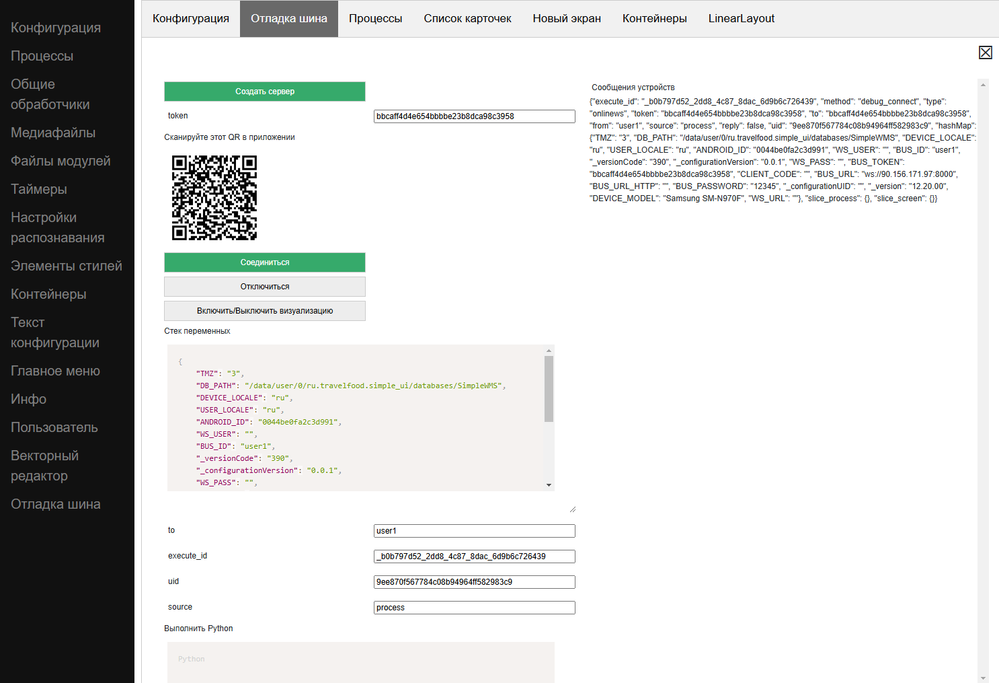

.. SimpleUI documentation master file, created by
   sphinx-quickstart on Sat May 16 14:23:51 2020.
   You can adapt this file completely to your liking, but it should at least
   contain the root `toctree` directive.

Про отладку
=============

Отладка в он-лайн режиме
--------------------------

Онлайн режим означает что код обработчиков выполняется на стороне бека, то есть на сервере. Соотвественно без труда можно задействовать отладку средствами сервера. Например если в качестве бек-системы используется 1С то для отладки надо:

 * В серверном общем модуле (например ОтладкаПроцессов) вынести код обработчиков в отдельные процедуры. Например ``Обработчик1(Переменные,ТаблицаСтрок,Ошибка,СообщениеОбОшибке) Экспорт``
 * В соотвествующих обработчиках добавить вызов этой процедуры ``ОтладкаПроцессов .Обработчик1(Переменные,ТаблицаСтрок,Ошибка,СообщениеОбОшибке)``
 * Включить режим отладки на сервере, включить Автоматическое подключение к HTTP-сервисы и пройти обработчик в режиме отладки

Также для понимания работы и того что передается Ингода нелишним может быть перехватывать обработчик метода set_input HTTP-сервиса SimpleWMS – там можно посмотреть какие данные приходят кроме переменных в ответе JSON

Отладка и управление устройством в самостоятельном режиме
-----------------------------------------------------------------------------------------------

Устройством можно полностью управлять – получать полный доступ к его стекам переменных (и устанавливать команды через стек/редактировать стек), выполнять python-обработчики и получать доступ к СУБД, файлам, оборудованию на устройстве в онлайн режиме через шину SimpleBus.

.. note:: Далее примеры будут с https://seditor.ru:1555/ , там уже развернута шина, но желательно скачать и развернуть свой конструктор и шину https://github.com/dvdocumentation/web_simple_editor и https://github.com/dvdocumentation/simplebus

Получение событий, выполнение команд, python-кода
~~~~~~~~~~~~~~~~~~~~~~~~~~~~~~~~~~~~~~~~~~~~~~~~~

 1. В конструкторе перейти на вкладку «Отладка шина»
 2. Есть пустое поле token нажать «Создать сервер»
 3. Нажать Соединиться. Должно появиться уведомление о соединении.
 4. На устройстве в настройка нужно проверить чтобы было заполнено SimpleBus ID, есть нет – заполнить. Должна быть открыта какая то конфигурация на устройстве и в конструкторе.
 5. В меню устройства выбрать Онлайн/Отладка QR и отсканировать код. Должно появиться сообщение с устройства и тек переменных
 6. Стеком переменных можно управлять, передавать свои команды, устанавливать переменные. Например можно установить переменную на экране и добавить RefreshScreen чтобы открытый экран перерисовался. 
 7. Можно выполнять свой код python в поле Выполнить python, он соответствует pythonscript
 8. Для того чтобы после выполнения стека или пайтон читать стек на устройстве поставьте галочку «Ответ»
 9. (не обязательно) можно в стек добавить "_DisableParameters"
 10. И для того чтобы получать события с устройства в событии должен быть тип обработчика onlinews. Если вам нужно держать событие на паузе пока вы его просматриваете либо меняете код, должен быть обработчик run, если не нужно – runasync. Помните, что обработчик run – это бесконечный цикл ожидания который подвешивает устройство. Для начала я рекомендую runasync. Тайминг ожидания обработчиков по умолчанию стоит 10сек, если нужно бесконечно – поставьте 0 в настройках в поле «Лимит попытки подключения»

Таким образом можно получать любые события с устройства (с экранов, оборудования, ActiveCV, фонового сервиса), менять стек переменных в ответ, выполнять любые команды (например запускать экраны , диалоги и т.д.), в этой же транзакции выполнять python код и получать состояние стека в ответ

Видео о онлайн-режиме и отладке: https://youtu.be/rjEnX8NpF3Y

Про доступ к СУБД на устройстве
~~~~~~~~~~~~~~~~~~~~~~~~~~~~~~~~~~~~~

Идея заключается в том, что т.к. в режиме отладки можно выполнять python-код и просматривать содержимое стека после выполнения (а в стек можно положить нужные результаты) то можно выполнять код работы с например СУБД SQLite, NoSQL, взаимодействовать с файлами и делать другие вещи, доступные только на устройстве (например взаимодействовать с оборудованием)

Таким образом, чтобы организовать себе песочницу для управления СУБД нужно просто подключиться в режиме отладки из предыдущего пункта и выполнить код python 
Пример кода для работы с SQLite:

.. code-block:: Python

   import sqlite3
   
   try:
     connection = sqlite3.connect('/data/data/ru.travelfood.simple_ui/databases/my_database.db')
     cursor = connection.cursor()
     
     # Создаем таблицу Users
     cursor.execute('''
     CREATE TABLE IF NOT EXISTS Users (
    id INTEGER PRIMARY KEY,
    username TEXT NOT NULL,
    email TEXT NOT NULL,
    age INTEGER
    )
    ''')

      # Сохраняем изменения и закрываем соединение
      connection.commit()

      # Добавляем нового пользователя
      cursor.execute('INSERT INTO Users (username, email, age) VALUES (?, ?, ?)', ('newuser',     'newuser@example.com', 28))

      # Сохраняем изменения и закрываем соединение
      connection.commit()
  
      cursor.execute('SELECT * FROM Users')
      users = cursor.fetchall()
  
      res=""
      for user in users:
        res+=str(user)
  
      connection.close()
  
      hashMap.put("result",res)
    except Exception as e:
      toast(str(e))

Визуализация экранов и контейнеров
~~~~~~~~~~~~~~~~~~~~~~~~~~~~~~~~~~~~~

Пользуясь вышеуказанной отладкой можно также предпросматривать содержимое экранов и контейнеров при разработке конфигурации онлайн. Все изменения стразу же отражаются на экране устройства. Таким образом разработчик видит, как изменяется дизайн сразу на устройстве. 

Видео о процессе работы тут: https://youtu.be/1V1YX5bElMs

Для того, чтобы это настроить нужно:

 1. Подключиться к отладке по описанию из первого раздела
 2. Нажать кнопку Включить/Выключить визуализацию
 3. На устройстве открыть любой доступный экран, на котрый будет выводиться трансляция

После этого можно работать как обычно, устройство будет выполнять роль дополнительного монитора для предпросмотра экранов.
