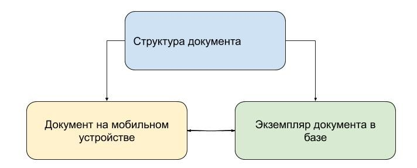
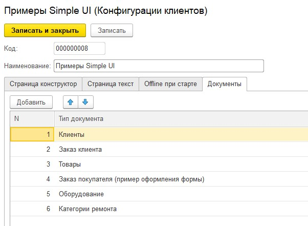
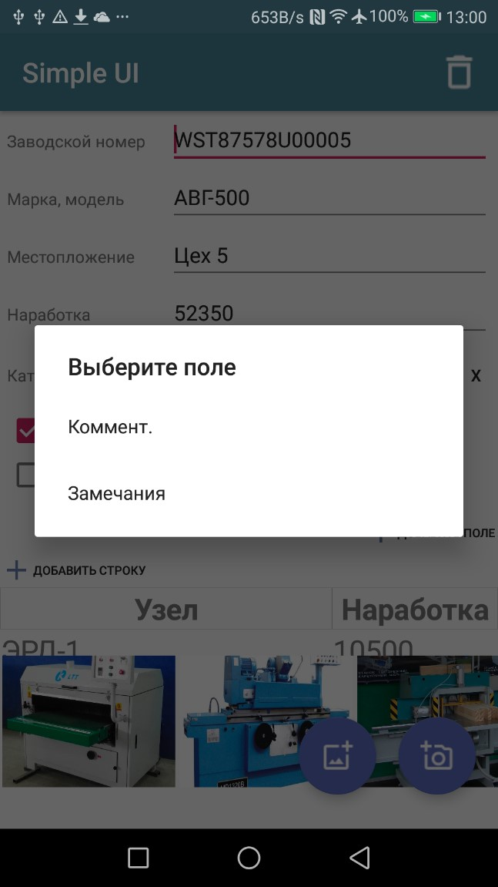
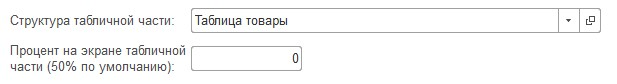
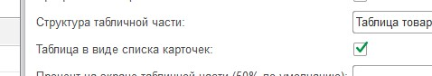
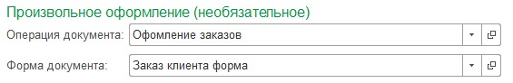
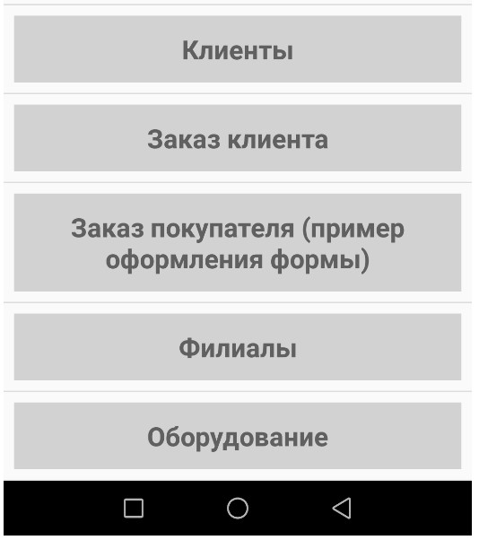
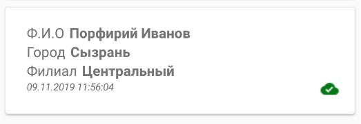
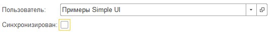
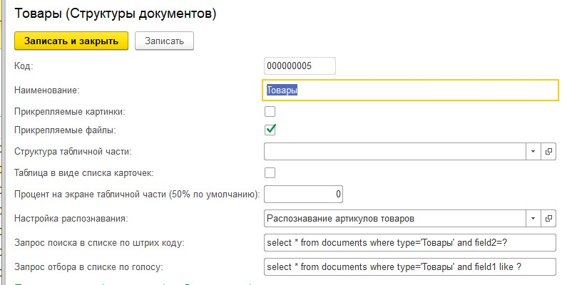

.. SimpleUI documentation master file, created by
   sphinx-quickstart on Sat May 16 14:23:51 2020.
   You can adapt this file completely to your liking, but it should at least
   contain the root `toctree` directive.

Документы
============

.. note:: Данный раздел написан для варианта когда Документы хранятся на стороне 1С, но по большей части это соответствует и варианту когда они хранятс янапример в PostgreSQL. В разделе REST написано как это организовать в облаке Postgre.

Помимо off-line режима в виде работы с SQL таблицами есть еще один способ организации off-line хранения, обработки и синхронизации – **Документы**

Документы – это любые структуры данных разделенных по видам. Это могут быть справочники, перечисления, документы. Документы могут делиться по видам но внутри вида могут быть различной структуры.

Документы одновременно являются средством хранения и объектом синхронизации.

Жизненный цикл документов состоит из экземпляров документов на мобильном устройстве и их двойников в базе 1С и определяется структурой

 

Структура документов
---------------------

Структура документа задается в  конфигурации, в справочнике «Структуры документов». Чтобы документ был доступен в приложении его надо включить в конфигурацию на закладке «Документы»

После синхронизации с приложением структура храниться автономно и в случае отсутствия связи приложение берет данные из хранилища. В БД приложения это таблица templates
Документы могут содержать различное количество постоянных и переменных полей. Постоянные поля всегда присутствуют на экране, переменные – добавляются пользователем по необходимости. На экране есть кнопка котрая позволяет добавлять поле

Также у полей можно выбрать «Выводить в списке» - эта галка отвечает за вывод поля в карточку документа в списке документов. Всего может быть до 5 полей в карточке списка.

Также в карточке списка выводится дата создания документа и признак синхронизации

Поля документа – справочник. Их можно использовать между разными типами документов. Это сделано просто для удобства. Значение имеет «имя поля» - английскими буквами и «Заголовок поля» - заголовок в приложении

Поля могут быть типов:

 * Строка
 * Число
 * Галочка
 * Документ

Если выбирается «Документ», то необходимо указать тип документа. Таким образом в документе можно указывать другие документы. Например в Заказе можно выбирать «покупателя»

В документе можно задать поле типа Флажок с именем done (заголовок может быть любой) – это поле сейчас используется для того чтобы подкрасить карточку в списке в серый цвет. В дальнейшем будут добавляться другие сценарии использования.

В документе можно использовать одну таблицу

Для этого нужно задать структуру табличной части документа и указать в поле «Структура табличной части»

Также можно указать процент занимаемый таблицей на форме (по умолчанию она занимает половину экрана)

В структуре табличной части можно задать ширину колонок в закладке «Настройка таблицы»

Таблицу документа можно будет вывести в виде списка карточек. При этом названия полей если задана настройка таблицы будут взяты из нее. Такой режим удобен с таблицами с большим количеством колонок

Также у документа можно включить возможность иметь коллекцию прикрепляемых изображений – горизонтальный список прокрутки. Изображения можно добавлять с камеры или из галереи

Для этого надо включить галку «Прикрепляемые картинки»

Также к документу можно добавлять список прикрепляемых файлов (галочка «Прикрепляемые файлы»)

У документа могут обрабатываться события. В данный момент событие только одно – ввод штрихкода. Оно обрабатывается только оффлайн.

При этом оно может использоваться для добавления строки таблицы и для установки реквизита. Например можно открыть документ в котром есть реквизит сотрудник и его можно сосканировать в этот реквизит. Либо в примере в структуре Таблица товары определено действие для заполнение переменной товара – тут подразумевается что строка будет добавлена или открыта на редактирование и в форме строки произойдет сканирование (не в форме документа а в форме строки)

В данном случае для реализации использованы команды «SQLЧтение в переменные» - полностью аналогична команде из OFFline режима. При этому в примере я использую запрос к таблице documents – это запрос где хранятся все документы. Т.е. выбираю товар из списка товаров по штрихкоду

При этом есть такой нюанс: можно  написать в запросе конкретное поле где храниться штрихкод

А можно написать select * from documents where type=? and doc like ? – тут идет поиск по подстроке в поле doc  а в поле doc храниться весь json всего объекта – т.е. штрихкод ищется среди всех полей документа.

И «Заполнение атрибута документа» - устанавливается конкретная переменная(переменные) из выборки по таблице. 

А команда «Добавление строки документа» добавляет строку.

Для документа можно определить свою  форму вместо автогенерируемой (этот режим на данный момент несколько ограничен)

Для этого надо указать процесс и экран который будет являться оформлением. При открытии/редактировании/создании будет запускаться эта форма

Создание формы экрана – как обычно, единственное – нужно помнить о двух нюансах:

 * Поля ввода должны называться также как поля документа (переменные)
 * Работа происходит в offline и поведение такое же как в документах – данные пишутся сразу в базу
 * Поля надо сделать через контейнер (это естественно)

Т.е. это не экран в привычном понимании а такое представление формы. 

В такой форме может происходить работа с событиями экрана в том числе – работа с JSON переменными оффлайн. Данную информацию я не включаю в описание так как этот режим еще не до конца проработан и информация может быть предоставлена по запросу.

Документы могут быть добавлены в основное меню операций наряду с процессами

Работа с документами и синхронизация
-------------------------------------

Если на устройство передана структура (она скачивается вместе с конфигурацией) то на устройстве можно работать с документами – создавать, редактировать.

.. tip:: Сами документы хранятся в базе в таблице documents и в принципе с ними можно работать через веб сервис , через консоль как и с остальными таблицами. Например что то подправить. Документ представляет из себя запись json записанную в строку в поле doc таблицы. Эта запись включает в себя все что есть в документе включая картинки. Поля filed1-5 и captionfield1-5 это выносные поля для реквизитов отображения в списке и поиска. Для быстроты, чтобы не распаковывать json
Поле send – отвечает за состояние синхронизации
Поле done – признак «выполнения» - необязательный реквизит
Поле type – тип документа

Работа ведется оффлайн. Попытка отправки данных о документе происходит в фоне при закрытии карточки документа. Также можно запустить синхронизацию вручную. Также можно в настройках отключить попытки синхронизации при закрытии карточки
При изменении любого поля данные сразу же пишутся в базу. При этом признак синхронизации сбрасывается. Если синхронизация прошла успешно – тучка окрасится в зеленый цвет

При запуске программы и при ручной синхронизации происходит скачивание документов с сервера

Вообще есть 2 направления синхронизации:

 * Получение документов с сервера (команда documents_download)
 * Отправка документов (команда documents_upload)

Отправка как было написано выше происходит либо вручную либо при люом изменении. Отправляется все что не синхронизировано

Получение (загрузка) также происходит по несинхронизированным экземплярам документов. 

Документы в базе хранятся в экземплярах документов. Их можно создавать в 1С (в демо базе есть подписка на справочник номенклатура которая создает экземпляры при записи Номенклатуры) либо их можно получать из мобильного приложения.

В каждом экземпляре есть реквизит для связи с элементом – в нем устанавливается связь через УИД. Таким образом если элемент создан в 1С то устройство получит его УИД при первом скачивании, если он создан на устройстве то при первой отправке в ответе об успешной доставке он получить УИД.

Чтобы экземпляры  попали на устройство нужно чтобы не стояла галка Синхронизирован и Пользователь был равен пользователю мобильного устройства. Кстати данную особенность можно использовать чтобы рассылать пользователям адресную корреспонденцию

Для взаимодействия с данными учетной системы нужно читать/записывать json реквизита ДанныеJSON – там храниться все, включая дату создания.

Если данные будут отправляться на устройство (создаются в 1С) то нужно не забыть поставить поля и заголовки иначе в списке они будут выглядеть некрасиво.

Т.е. другими словами взаимодействие c мобильным устройством через Документы сводится к взаимодействию с документами «Экземпляр документа». Все остальное полностью автоматическое.

Функции списка документов
---------------------------

В списке документов возможен поиск различными способами:
 * По подстроке в строке поиска
 * По штрихкоду (для этого необходимо определить запрос поиска по штрихкоду)
 * По голосу (для этого необходимо определить запрос поиска по голосу). При этом если в выдачи будет несколкьо похожих объектов то будут выведены они все, если толкьо один – открыта карточка
 * Распознавание текста. Для этого необходимо определить настройку распознавания (описана в разделе «Распознавание текста»)

