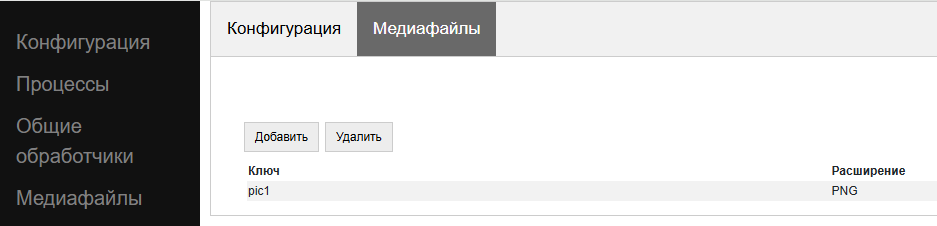

.. SimpleUI documentation master file, created by
   sphinx-quickstart on Sat May 16 14:23:51 2020.
   You can adapt this file completely to your liking, but it should at least
   contain the root `toctree` directive.

.. SimpleUI documentation master file, created by
   sphinx-quickstart on Sat May 16 14:23:51 2020.
   You can adapt this file completely to your liking, but it should at least
   contain the root `toctree` directive.

Файлы. Статические ресурсы. Файлы картинок.
=====================================================

Все файлы хранятся во внутренней папки приложения SimpleUI, которая полностью доступна из самого приложения, но недоступна для других приложений (кроме как через root). С файлами можно выполнять любые операции из обработчиков python  - читать содержимое папки, читать файлы, записывать и т.д. Т.е. например, можно перехватить картинку, сделанную с камеры и выполнить кроп, сжатие в обработчике python а потом отправить на ресурс.
Например, зная путь к файлу можно его открыть:

.. code-block:: Python

 with open(filename, "rb") as image_file:
       image = image_file.read()

Каждой конфигарации выделена папка, равная UID-у этой конфигурации (который записан в объекте ConfigurationSettings), в которой по необходимости создаются 3 подпапки **Data** (для своих файлов), **Downloads** (для загрузок) и **Datasets** (для датасетов). Базы данных (Pelican, SQLite) размещаются в папках по умолчанию (без разделения на конфигурации), но их можно разместить в Data конфы, указав путь принудительно. Для Pelican в строке инициализации можно указать опциональный параметр **data_folder** если его поставить в True то БД Pelican будет размещаться в подпапке Data\Pelican

Для получения папки в SimpleUtilites (в pythonscript она уже импортирована как se) добавлены методы **get_downloads_dir()**, **get_data_dir()**, **get_datasets_dir()** также в pythonscript чтобы не утруждаться уже предзаполнены константы **_data_dir** и **_downloads_dir**.
Также в SimpleUtilites есть метод **delete_root_dir()** для удаления всех папок конфигурации.

Диалоги открытия и сохранения файла из экрана
--------------------------------------------------------------

Открытие файла через диалог(пикер) состоит из комманды-переменной и обработчика события. 

.. hint:: Можно открывать файлы и не через диалог, а через открытие файла приложением Simple через Открыть (доступен соответствующий общий обработчик). 

**OpenExternalFile** , пустой параметр  – команда запуска диалога, при открытии файла генерируется событие **FileOpen** которое можно перехватить в обработчике типа *pythonbytes* в который попадает байт-массив открытого файла. 

Также доступно сохранение файла.

**SaveExternalFile** , параметр: {"path":<путь к внутреннему файлу>,"default":<имя по умолчанию>} – команда запуска диалога выбора локации сохранения файла и имени файла (можно выбрать имя по умолчанию). При успешном сохранении генерируется событие onInput listener = **FileSave**

Сохранение в Загрузки(Downloads)
------------------------------------------------

В Java классе SimpleUtilites есть метод **download_file(<имя файла>)** которая сохраняет файл (сформированный в папке приложения) во внешнюю папку Downloads (коллекция Загрузки). 

Таким образом можно экспортировать информацию в виде файлов.

Закачка больших файлов
-----------------------------------------
В SimpleUtilites есть воркер для скачивания больших файлов. Он использует докачку, работает даже после перезапуска устройства (если не успел докачать), показывает прогресс и в конце кладет в папку Downloads конфигурации файл и вызывает событие. Метод download(String url,String user,String password,String filename,String postExecute) делает в общем все что нужно. 
Вот пример скачивания больших файлов с Яндекс-диска. Это сделано в pythonscript, а обработчик postExecute написан там же, а пакуется с помощью функции **get_body**

.. code-block:: Python

 import requests
 from urllib.parse import urlencode
 from ru.travelfood.simple_ui import SimpleUtilites as su
 import os

 base_url = 'https://cloud-api.yandex.net/v1/disk/public/resources/download?'
 public_key = 'https://disk.yandex.ru/d/U6YrMsXQmMbfOA' 
 
 # Получаем загрузочную ссылку
 final_url = base_url + urlencode(dict(public_key=public_key))
 response = requests.get(final_url)
 download_url = response.json()['href']
 
 # Вариант 1 - для маленьких файлов
 #download_response = requests.get(download_url)
 #with open(su.get_downloads_dir()+os.sep+'p_menu.txt', 'wb') as f:   # Здесь укажите нужный путь к  файлу
 #    f.write(download_response.content)
 
 # Вариант 2 - для больших файлов
 def after_download_1():
     with open(hashMap.get("DownloadedFile"), encoding='utf-8-sig') as f:
         toast("Загрузили файл : "+hashMap.get("DownloadedFile"))
         hashMap.put("RestartScreen","")
 	
 postExecute = json_to_str([{"action": "run", "type":  "pythonscript","method":get_body(after_download_1) }])
 su.download(download_url,None,None,'goods.txt',postExecute)
 
Сразу скажу, использование именно этого воркера не обязательно. Можно просто скачивать например requests и писать в файл, тем более что в симпле есть runasync и runprogress, но Гугл рекомендует воркеры. Также удобно тем, что можно стартануть сразу несколько закачек и видеть прогресс в шторке уведомлений.

Статические ресурсы
-----------------------------

Различные статические декорации (картинки, выводимые в экранах или меню, макеты html, небольшие библиотеки python) имеет смысл передавать вместе с конфигурацией. При загрузке конфигурации они сохраняются во временные файлы под определенным uuid, а для обращения к ним требуется ключ, указанный на закладке Медиафайлы

Если статический ресурс – картинка, то для вывода на форму достаточно указать ее ключ c префиксом **^** . Т.е. у элемента Картинка в «Заполнении поля» будет стоять ``^pic1`` , где pic1 – ключ картинки на закладке Медиафайлы

К любому статическому ресурсу можно обратиться по ключу, получить его абсолютное имя и далее делать с ним все что нужно:

.. code-block:: Python

  from ru.travelfood.simple_ui import SimpleUtilites as suClass
  filename = suClass.get_stored_file("key")

Изображения через файлы.
----------------------------------------------

Файлы, генерируемые на устройстве, это в том числе изображения с камеры или медиагалереи устройства, загружаемые с ключом **mm_local**, работа с которыми описана в соответствующих разделах. У подобных файлов при сохранении генерируется uuid, по которому к нему можно обратиться. Этот uuid равен имени файла. Можно просто работать с именем файла, запоминая его в своих структурах данных. Например при фотографировании в режиме mm_local в переменную (допустим переменная камеры называется photo) сохраняется абсолютный путь с приставкой _path, то есть в данном случае будет переменная photo_path.
Обращаться к файлам в контейнерах следует через **~<абсолютный путь к файлу>** чтобы система поняла что вы передаете картинку в виде файла. Дело в том, что по умолчанию она ожидает base64 строку. По возможности используйте файлы, а не base64, особенно в карточках списков – это более производительно. Более подробнее это описано в графе «Режим работы с файлами изображений напрямую по абсолютному пути (через ~)»
В пакет приложения включен Pillow которая дает возможность работать с картинками – ресайз и т.д. Вот пример открытия файла, и отправки его запросом

.. code-block:: Python
  
  import json
  import requests
  import base64
  from PIL import Image
  import os
  from pathlib import Path
  from io import BytesIO
  from requests.auth import HTTPBasicAuth

  #...

  filename="path_to_file.jpg"
  if os.path.exists(filename): 
        image = Image.open(filename)
      
        image.resize((500, 500))
        buffered = BytesIO()
        image.save(buffered, format="JPEG")
        img_str = base64.b64encode(buffered.getvalue()).decode('utf-8')

        username=hashMap.get("WS_USER")
        password=hashMap.get("WS_PASS")
        url = hashMap.get("WS_URL")

        r = requests.post(url+'/data_upload', auth=HTTPBasicAuth(username, password,),
	   headers={'Content-type': 'application/json', 'Accept':     'text/plain'},data=json.dumps({"file":filename,"base64":img_str}))

Приведенный выше пример передает содержимое в виде строки base64, однако в случае с файлами, особенно большими лучше использовать вариант с потоковой передачей, которую поддерживает requests:

.. code-block:: Python

  with open('image-1.png', 'rb') as img_1:
      r = requests.post(url, auth=basic, data=img_1, headers=headers)

Временные файлы
--------------------

Для удобства есть возможность генерировать временные файлы нужного расширения методом **get_temp_file**

.. code-block:: Python

 from ru.travelfood.simple_ui import SimpleUtilites as subclass
 output_file = suClass.get_temp_file("txt")

