.. SimpleUI documentation master file, created by
   sphinx-quickstart on Sat May 16 14:23:51 2020.
   You can adapt this file completely to your liking, but it should at least
   contain the root `toctree` directive.

Быстрый старт
=================

Пример 1. Начало разработки, разметка экрана и обработчики на Python.
---------------------------------------------------------------------------------

*Создадим новый проект, проверим что он запускается на устройстве и создадим процесс, состоящий из одного экрана, на котором будут вводиться 2 числа и вычисляться результат их сложения по кнопке.*

Развертывание
~~~~~~~~~~~~~~~~~

.. image:: _static/starting_page.png
       :scale: 55%
       :align: center

Запускаем конструктор https://seditor.ru:1555/, выбираем Конфигурация-Новый проект… после чего создается примитивная конфигурация, состоящая из одного процесса и экрана. Это уже можно посмотреть на устройстве и самое время проверить связь с устройством. Сервис транслирует файл конфигурации по запросу устройства в сети, это удобно на этапе разработки, чтобы не передавать файл вручную

.. note:: Можно скачать этот конструктор локально(https://github.com/dvdocumentation/web_simple_editor) и запустить у себя (для отладки и связи с бек-системой, если это требуется также можно скачать скрипт связи https://github.com/dvdocumentation/simplebuslite). Можно ничего специально не ставить на компьютер, но можно код обработчиков писать в своей IDE, связав с конфигурацией через GitHub

.. note:: Передавать файл конфигурации через веб-сервис не обязательно, это можно сделать любым способом через файл, отправив его, например по почте или выложив на GitHub либо другой свой хостинг. Но это удобно на этапе разработки чтобы быстро доставлять изменения, поэтому конструктор также транслирует файл конфигурации.

Нам нужно передать настройки подключения к сервису конструктора на устройстве. Это можно сделать через QR-код, который сгенерирован на странице Конфигурация. Запустите Simple UI на устройстве и выберите в меню QR-настройки, сканируйте код и перезапустите приложение (либо нажать в главном меню Обновить конфигурации). На устройстве должно появиться меню конфигурации – развертывание прошло успешно.

Собственно, разработка...
~~~~~~~~~~~~~~~~~~~~~~~~~~~~~~

Переименуем имя процесс и имя экрана на что то осмысленное. Можно еще поставить «Скрывать нижние кнопки» так как они не нужны. В экране, в Структуре добавим новый элемент «Контейнер», поставим ориентацию -вертикально и Длину и Ширину – на весь контейнер. Это будет корневой контейнер экрана.

Добавим несколько элементов – надписи, поле ввода и кнопку. У всех ставим ширину – на весь контейнер. У надписей мы определяем Значение, у полей ввода – переменные, в котрые будут попадать введенные значения. У кнопки в Значение пишем надпись кнопки, а в переменную - некую переменную, по которой обработчик будет понимать, что нажата именно эта кнопка.

.. image:: _static/container_content.png
       :scale: 55%
       :align: center

.. note:: Можно создавать разметку любой сложности вписывая в контейнер другие контейнеры – горизонтальные и вертикальные любой сложности.
 
Теперь можно перезапустить конфигурацию на устройстве и посмотреть что получилось.

Все переменные, события, команды  передаются через стек hashMap и возвращаются через него же. Помещать в hashMap нужно функцией put(key,value), читать функцией get(key), проверять существование функцией containsKey(key) а удалять remove(key). 

.. attention:: Все переменные в этом стеке строго строковые! Нельзя помещать например число.

Переменные a и b, которые связаны с полями ввода помещаются в стек переменных автоматически. Вывести результат можно на экран в виде Надпись, но для простоты мы выведем в всплывающее сообщение командой toast.

Все события помещаются в переменную listener, соответвенно при нажатии кнопки будет сгенерировано событие равное переменной этой кнопки как мы задали ее в структуре экрана.

Для этого в экране перейдем на закладку Обработчики и добавим новый обработчик со следующими полями:

 * Событие=**onInput**
 * listener=**btn_res** (Это переменная нашей кнопки, его можно не писать, а выбрать из вариантов)
 * Действие = **run** (что означает синхронное выполнение)
 * Тип обработчика **pythonscript** (что означает, что можно писать тест прямо в редакторе)

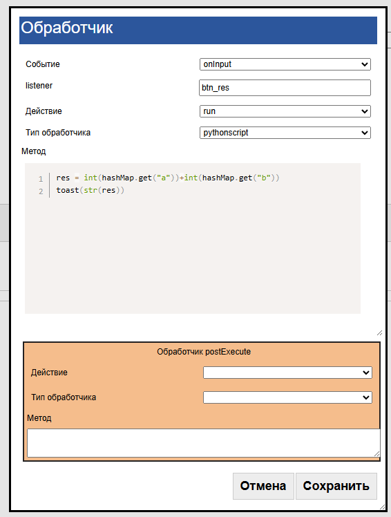

И напишем в тексте обработчика следующий текст:

.. code-block:: Python

 res = int(hashMap.get("a"))+int(hashMap.get("b"))
 toast(str(res)) 

Преобразования int() мы делаем потому, что в стеке значения – строковые. toast() – выводит строку сообщения.

Сохраняем, проверяем.

Пример 2. Сканирование штрихкодов в таблицу на устройстве.
--------------------------------------------------------------

*В этом примере мы не будем распознавать номенклатуру по штрихкоду, у нас не будет связи с внешней программой. Будут только штрихкоды, которые будут сохраняться в табличку на устройстве и отображаться в виде списка.*

Внимание. Этот пример можно реализовать множеством разных способов. Например, для хранения можно выбрать noSQL, SQL или файлы. Тут показан один из возможных способов реализации – на «датасетах»

**Шаг 1.** Создадим новую конфигурацию и развернем, как показано в Примере 1

**Шаг 2.** Первым делом зайдем в Общие обработчики и добавим событие onLaunch (при запуске конфигурации) . Добавим создание датасета, в который будут попадать наши штрихкоды. 

.. code-block:: Python
 
 datasrv = CreateDataSet("barcodes")

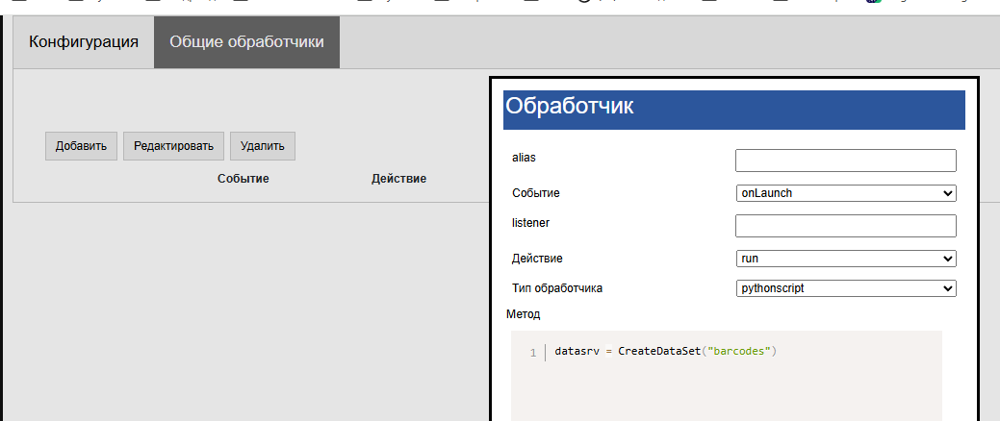

**Шаг 3.** Зайдем в процесс (можно переименовать Процесс и экран как вам нравится). В экране добавим элемент Штрихкод, с переменной barcode

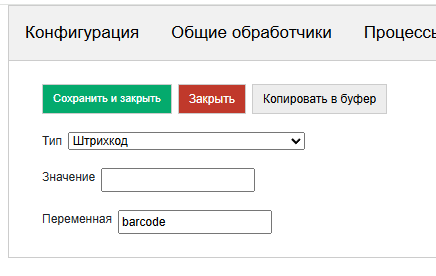

Также создадим корневой контейнер, а в нем разместим только один элемент Список карточек со значением @cards (через **@** указывается что значение должно быть взято из стека переменных)

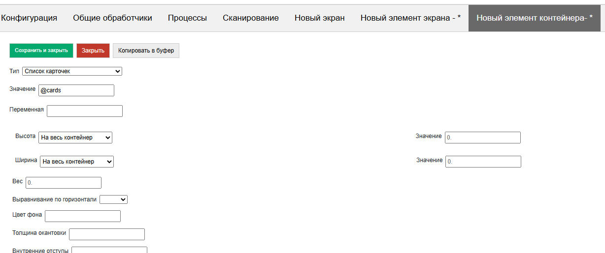

Также отключим прокрутку корневого контейнера (у списка своя прокрутка) и отключим панель нижних кнопок

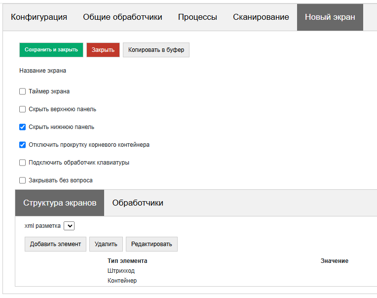

 
**Шаг 4.** Добавим обработчик onStart (при запуске экрана), также как и везде тип обработчика – pythonscript. И добавим в него текст:

.. code-block:: Python
 
  j = { "customcards":         {
  "layout": "^AUTO",
  "cardsdata":"~barcodes"}
  }
 hashMap.put("cards",json_to_str(j))

Разберем что мы только что сделали. Словарь j имеет определенную структуру – **customcards**, **layout**, **cardsdata** – это структура переменной списка карточек. В ней определяется вид, поведение и опции (их в данном случае нет) и данные списка. 

В **layout** указывается макет элементов списка, но если неохота их рисовать, то можно указать зарезервированное слово **AUTO** – тогда макет будет генерироваться автоматически. 

В **cardsdata** указывается датасет в явном виде, либо ссылка на объект типа «датасеты» (через префикс ~) как в данном случае (датасет мы инициализировали при запуске конфигурации)

Далее нам нужно этот словарь преобразовать в JSON и упаковать в переменную. Делается это функцией **json_to_str** (обертка для json.dumps(,ensure_ascii=False))

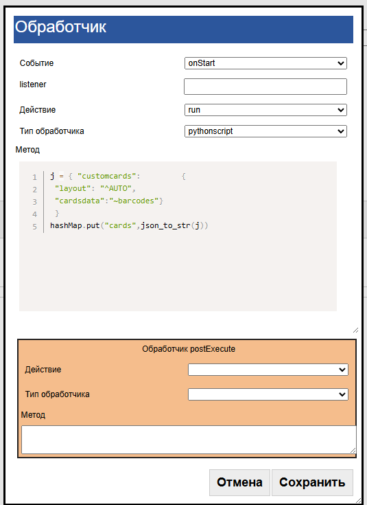

**Шаг 5.** Теперь добавим еще один обработчик – onInput, listener=barcode (можно выбрать из списка)

И добавим туда текст

.. code-block:: Python
 
 ds= GetDataSet("barcodes")
 data = [{"barcode":hashMap.get("barcode")}]
 ds.put(json_to_str(data))

Что мы написали? GetDataSet("barcodes") – получаем объект ранее созданного датасета. put() – добавляем данные. В виде массива – такой формат.

Сохраняем, проверяем. Посканируйте штрихкоды. Они добавляются.

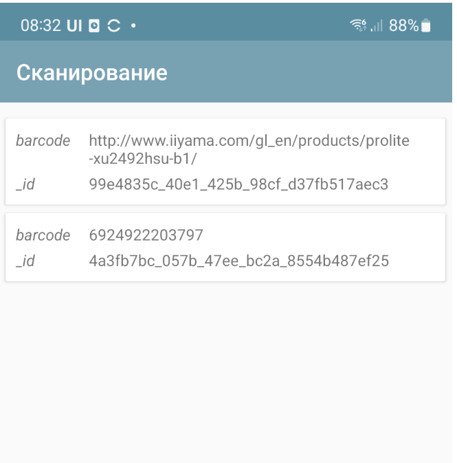

Пример 2+
--------------

*Добавим примитивное хранение*

Попробуйте закрыть/открыть процесс. Ранее отсканированные штрихкоды сохранились, потому что датасет хранится в памяти в системе. Но если мы перезагрузим приложение (или Обновить конфигурации) все исчезнет. 

Добавим в onLaunch пару новых строк:

.. code-block:: Python
 
 datasrv = CreateDataSet("barcodes")
 if datasrv.isSaved():
 	datasrv.load()

Тут мы проверяем что, если датасет сохранен – загружаем его с диска.

Теперь нам надо добавить само сохранение. Добавим в экран пункт меню Сохранить (как вариант можно добавить кнопку). Пункт меню будет располагаться в меню опций экрана (справа, сверху)

И добавим для него обработчик:

.. code-block:: Python
 
 ds= GetDataSet("barcodes")
 ds.save()

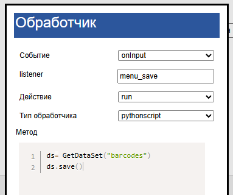

Теперь у нас работает сохранение. Можно проверить.

 .. note:: Строго говоря, датасеты не очень хороши для такого сценария, это всетаки не полноценная СУБД. Для примера в несколько тысяч штрихкодов это годится, но если их будет несколько миллионов, уже будет ощущаться потеря производительности. Их использование в примере обусловлено чуть более простым кодом, чем для СУБД Pelican. В следующем примере аналогичные действия (сохранение того, что было введено в устройстве будет сделано уже на СУБД), а датасеты будут использованы по их прямому назначению – для хранения справочников внешней системы.

Пример 3. Инвентаризация товара строго онлайн (1С)
-----------------------------------------------------

*Конфигурация является тонким клиентом для 1С - вся логика обработчиков исполняется в 1С, на стороне устройства только отрисовка. Для 1С:Комплексная автоматизация 2.4 (подойдет для УТ 11.4). Функционал:*
 * *Выборка документов, выводится список документов.* 
 * *При клике на документ открывается состав строк. Можно вводить количество вручную*
 * *При сканировании ищется подходящий товар, выводится диалог ввода количества*
 * *Факт по инвентаризации записывается в ту же строку*

Файлы конфигурации можно скачать тут:
 
 1. Файл ui: https://disk.yandex.ru/d/B7THHKppviYWag
 2. Расширение с обработчиками: https://disk.yandex.ru/d/BwiFTG5i4CXKjg

**Шаг 1.** Первым делом надо развернуть расширение, http-сервис со стороны 1С, сделать настройки на устройстве и убедиться что запросы доходят со стороны 1С. 	

Писать будем на варианте online (через http-сервис), так как для onlinews нужна работа с вебсокетом, а она в 1С есть только на 8.3.27, а на момент написания статьи этот релиз не очень распространён. Поэтому нужно проделать следующие шаги:

1.Скачиваем расширение SimpleUISplit https://disk.yandex.ru/d/4tDOY5SjhmQrxQ , ставим на вашу 1С, публикуем http-сервис (нужно поставить галку "Публиковать http-сервисы расширений по умолчанию"). Не лишним будет подключить отладку http-сервисов.

2.Заполняем настройки в разделе "Параметры доступа к обработчикам SimpleUI" в Настройках. Описано тут: https://uitxt.readthedocs.io/ru/latest/communications.html#http-online

3.Создаем в конструкторе конфигурацию с одним процессом, с одной кнопкой "Тест". В обработчиках на эту кнопку прописываем  обработчик online с вызовом функции тест

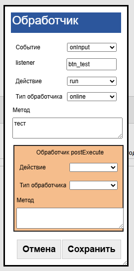

 
4.Далее в расширении заходим и добавляем в общий модуль splt_Обработчики функцию тест. Сохраняем. Обратите внимание на оформление функций: у вызываемый функций должен быть параметр Переменные (это стек переменных) и она должна быть экспортной.

.. code-block::
 
 Процедура тест(Переменные) Экспорт
	Переменные.Вставить("toast","ТЕСТ");
 КонецПроцедуры

 
5.Итогом данного шага должно быть: при нажатии на кнопку Тест, должен появляться тост "ТЕСТ". Если всплывающего сообщения нет, выходит сообщение об ошибке связи нужно разбираться со связью. Что еще может быть? 1С может долго обрабатывать загрузку сеанса 1й раз. По умолчанию в настройках стоит время ожидания сеанса - 10 секунд, можно его увеличить. Либо запустить еще раз - со второго раза 1С работает быстрее, так как сеанс уже загружен.

**Шаг 2.** Создадим экран со списком документов.

Прежде чем создавать список, зайдем в раздел Контейнеры и создадим макет для элемента списка - documents. Просто добавим надписей, чтобы было понятно какие это документы. Оформление при желании можно потом улучшить, в примере все по минимуму.

.. image:: _static/2025_quickstart_3_2.png
       :scale: 60%
       :align: center	

Далее создадим процесс "Инвентаризация" добавим экран "Список документов" и нам нужно прописать обработчик при открытии

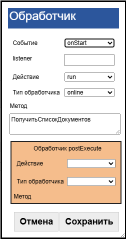

Прописываем сам обработчик в 1С. В данном примере мы не используем механизм Датасетов платформы, но нам нужно строки таблицы. Делаем это через массив. Документация по работе со списками тут: https://uitxt.readthedocs.io/ru/latest/screens.html#id40
В  обработчике следует отметить следующие моменты:

 * В строках списка добавляем key - зарезервированное слово, этот ключ будет помещаться в selected_card_key когда пользователь кликнет на строке списка (событие CardsClick)
 * Ключ "return_selected_data" указывает что при выборе списка в переменную будет возвращаться все данные выбранной записи (а не только ключ). 

.. code-block::
 
  Процедура ПолучитьСписокДокументов(Переменные) Экспорт
	
	З = Новый Запрос;
	З.Текст =  "ВЫБРАТЬ
	          |	ПересчетТоваров.Номер КАК number,
	          |	ПересчетТоваров.Комментарий КАК description,
	          |	ПРЕДСТАВЛЕНИЕ(ПересчетТоваров.Склад) КАК warehouse,
	          |	УНИКАЛЬНЫЙИДЕНТИФИКАТОР(ПересчетТоваров.Ссылка) КАК docRef
	          |ИЗ
	          |	Документ.ПересчетТоваров КАК ПересчетТоваров";
	Выб = З.Выполнить().Выбрать();

	ПеременнаяСписка = Новый Структура;

	МассивДокументов = Новый Массив;
	Пока Выб.Следующий() Цикл
		СтрукутраДокумента = Новый Структура;
		СтрукутраДокумента.Вставить("docRef",СокрЛП(Выб.docRef));
		СтрукутраДокумента.Вставить("description",Выб.description);
		СтрукутраДокумента.Вставить("warehouse",Выб.warehouse);
		СтрукутраДокумента.Вставить("number",Выб.number);   
		СтрукутраДокумента.Вставить("key",СокрЛП(Выб.docRef));  //В ключе будет храниться ссылка на документ
		МассивДокументов.Добавить(СтрукутраДокумента);
	КонецЦикла;

	СтруктураСписка = Новый Структура;
	СтруктураСписка.Вставить("layout","^documents");
	СтруктураСписка.Вставить("cardsdata",МассивДокументов);
	ПеременнаяСписка.Вставить("customcards",СтруктураСписка);     

	ЗаписьJSON = Новый ЗаписьJSON;			
	ЗаписьJSON.УстановитьСтроку();
	ЗаписатьJSON(ЗаписьJSON,ПеременнаяСписка);			

	Переменные.Вставить("docs",ЗаписьJSON.Закрыть());
	Переменные.Вставить("return_selected_data","");
	
 КонецПроцедуры

**Шаг 3.** Делаем обработчик на событие CardsClick.

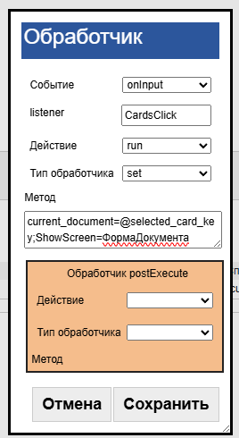

На этот раз не онлайн, обработчик будет выполняться локально. Его можно сделать и онлайн, но это лишнее, он очень простой, тип обработчика - set, текст : ``current_document=@selected_card_key;ShowScreen=ФормаДокумента``. Он делает 2 вещи:

 * сохраняет в переменную current_document выбранную ссылку на документ (дело в том, что дальше у нас будет еще один список и в нем selected_card_key перезапишется выбранной строкой товара)
 * ``ShowScreen=ФормаДокумента`` - открываем следующий экран

**Шаг 4.** Добавляем еще один экран "ФормаДокумента"

В нем вместо списка карточек - таблица, с которой работа аналогична. Также анлогично current_document мы храним ссылку на выбранную строку current_line. В экране есть штрихкод, с ним работа разобрана в предыдущем примере. В данном экране также добавился модальный диалог. Для него нужно также создать макет(также как для строки списка, только там поле ввода количества). У диалога мы прописываем listener, который Будет возвращаться при выборе пользователя в диалоге командой ShowDialogListener. 
Обратите внимание, что сам документ при необходимости мы получаем по ссылке:

``ТекущийДокумент= Документы.ПересчетТоваров.ПолучитьСсылку(Новый УникальныйИдентификатор(Переменные.current_document));``

 В остальном все аналогично, поэтому просто ознакомьтесь с прилагаемой конфигурацией. 

 

Пример 4. Инвентаризация товара оффлайн, связь с внешней системой
---------------------------------------------------------------------

*В этом примере мы рассмотрим такой сценарий:*

 * *Справочники (товары, штрихкоды) и документы скачиваются с внешней системы и хранятся на устройстве локально (в датасетах).* 
 * *При сканировании определяется товар, вводится количество. Все работает оффлайн. Заполняется факт наличия товара по документам.*
 * *При нахождении в зоне покрытия, те данные, что хранятся на устройстве, передаются во внешнюю систему онлайн.*

Пример будет опубликован позже.

