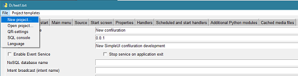
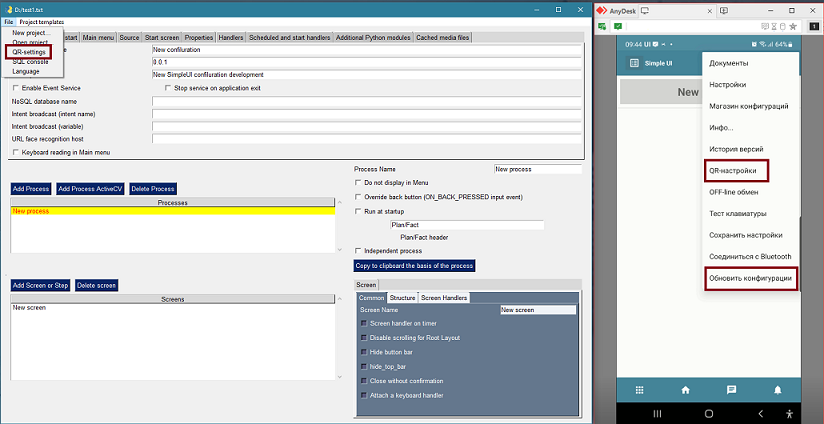
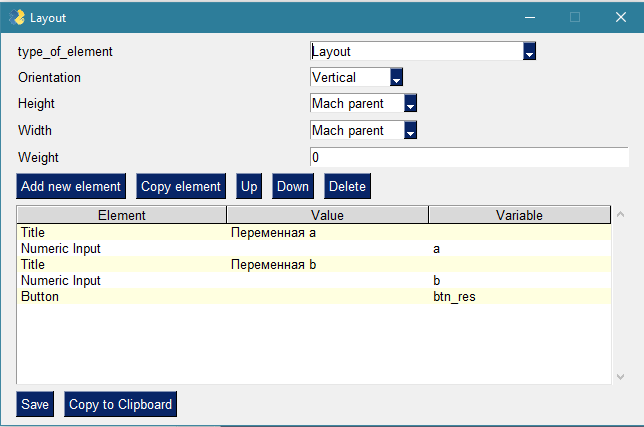
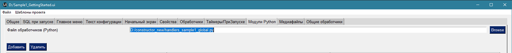
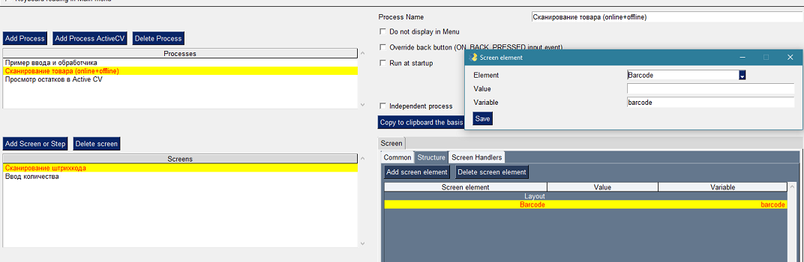
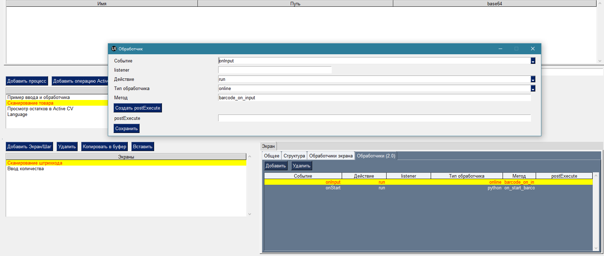
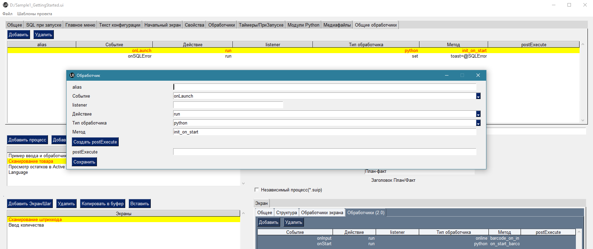
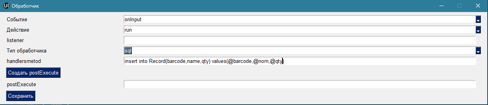
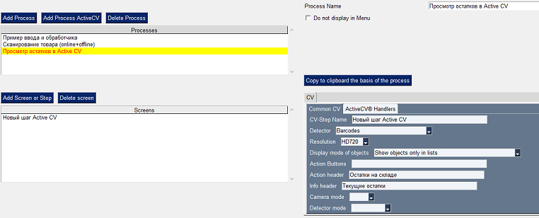
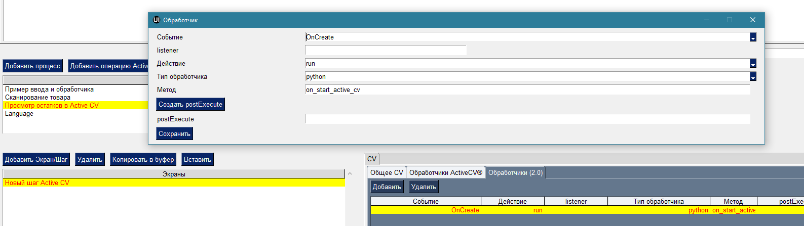

.. SimpleUI documentation master file, created by
   sphinx-quickstart on Sat May 16 14:23:51 2020.
   You can adapt this file completely to your liking, but it should at least
   contain the root `toctree` directive.

Быстрый старт
=================

Примеры, указанные в этой статье содержатся в конфигурации «Быстрый старт», которую можно найти в комплекте разработчика(папка Конфигурация 1 Быстрый старт) или на GitHub https://github.com/dvdocumentation/simpleui_samples/tree/main/Sample1_GettingStarted

Пример 1. Развертывание системы, разметка экрана и обработчики на Python.
---------------------------------------------------------------------------------

*Создадим новый проект, проверим что он запускается на устройстве и создадим процесс, состоящий из одного экрана, на котором будут вводиться 2 числа и вычисляться результат их сложения по кнопке.*

Развертывание
~~~~~~~~~~~~~~~~~

Запускаем конструктор simple_editor.exe, выбираем Файл-Новый проект… после чего создается примитивная конфигурация, состоящая из одного процесса и экрана. Это уже можно посмотреть на устройстве и самое время проверить связь с устройством. В конструкторе используется Flask который транслирует файл конфигурации по запросу устройства в сети, это удобно на этапе разработки, чтобы не передавать файл вручную

.. note:: Внимание! Передавать файл конфигурации через веб-сервис не обязательно, это можно сделать любым способом через файл, отправив его, например по почте. Но это удобно на этапе разработки чтобы быстро доставлять изменения, поэтому конструктор содержит flask сервер.

Нам нужно передать настройки подключения к сервису конструктора на устройстве. Это можно сделать через QR-код, который генерирует конструктор – Файл- QR-настройки. Запустите Simple UI на устройстве и выберите в меню QR-настройки, сканируйте код и перезапустите приложение (либо нажать в главном меню Обновить конфигурации). На устройстве должно появиться меню конфигурации – развертывание прошло успешно.

Cобственно, разработка...
~~~~~~~~~~~~~~~~~~~~~~~~~~~~~~~~

Переименуем имя процесс и имя экрана на что то осмысленное. Можно еще поставить «Скрывать нижние кнопки» так как они не нужны. В экране, в Структуре добавим новый элемент «Контейнер», поставим ориентацию -вертикально и Длину и Ширину – на весь контейнер. Это будет корневой контейнер экрана.

Добавим несколько элементов – надписи, поле ввода и кнопку. У всех ставим ширину – на весь контейнер. У надписей мы определяем Значение, у полей ввода – переменные, в котрые будут попадать введенные значения. У кнопки в Значение пишем надпись кнопки, а в переменную - некую переменную, по которой обработчик будет понимать, что нажата именно эта кнопка.

.. note:: Можно создавать разметку любой сложности вписывая в контейнер другие контейнеры – горизонтальные и вертикальные любой сложности.

Теперь можно перезапустить конфигурацию на устройстве и посмотреть что получилось.

Теперь нужно сделать чтобы работала кнопка. Для этого нужны обработчики либо онлайн(на стороне вашей учетной системы) либо оффлайн. В рамках этого примера мы сделаем оффлайн обработчик на Python. Для этого нужно открыть любую IDE Python и сделать так какой то файл где будут содержаться все обработчики проекта, например handlers.py и указать путь к нему на странице Модули Python.

Каждый обработчик должен иметь определенную структуры вызовов, такого формата:

.. code-block:: Python

  def sample1_on_create(hashMap,_files=None,_data=None):
    
    return hashMap

Все переменные, события, команды  передаются через стек hashMap и возвращаются через него же. Помещать в hashMap нужно функцией put(key,value), читать функцией get(key), проверять существование функцией containsKey(key) а удалять remove(key). Имейте ввиду что это не словарь Python а Java-объект, вызываемый из Python.

.. attention:: Все переменные в этом стеке строго строковые! Нельзя помещать например число.

Переменные a и b, которые связаны с полями ввода помещаются в стек переменных автоматически. Вывести результат можно на экран в виде Надпись, но для простоты мы выведем в тост командой toast. Все команды также помещаются в стек переменных - hashMap.put("toast",”Hello wolrld”)

Все события помещаются в переменную listener, соответвенно при нажатии кнопки будет сгенерировано событие равное переменной этой кнопки как мы задали ее в структуре экрана.

Обладая этими знаниями заведем новую функцию которая будет обрабатывать события ввода этом экране:

.. code-block:: Python

  def sample1_on_input(hashMap,_files=None,_data=None):
    if hashMap.get("listener")=="btn_res":
        hashMap.put("toast",str(int(hashMap.get("a"))+int(hashMap.get("b"))))    
    
    return hashMap

.. attention:: Открыв UI-файл на своем компьютере нужно заново перепривязать файлы обработчиков, они сохраняться в настройке для этого рабочего места

.. note:: Кстати после привязки, изменения в IDE в файлах py автоматически подтягиваются в UI-файл (в base64), т.е. больше ничего делать не надо

Важно понимать, что после нажатия кнопки будет сгенерировано событие ввода и потом экран будет перерисован и то что введено в полях ввода пропадет, что не очень хорошо. Поэтому нужно зайти в структуры экрана и добавить в Значения в полях ввода переменные a и b через @. Значение – это значения по умолчанию для полей ввода, а символ «@» в SimpleUI означает привязку переменных к элементам. С помощью него можно выводить например надпись на экран. 

Например, можно вывести результат не через тост а через Надпись, указав в значении @result , тогда в обработчике над будет заполнить переменную result

.. code-block:: Python

  hashMap.put("result",str(int(hashMap.get("a"))+int(hashMap.get("b"))))    

Но, при первом запуске экрана, до нажатия кнопок, переменные a и b – пусты и это не очень красиво будет смотреться на экране, поэтому нужен еще один обработчик, который их заполнит:

.. code-block:: Python

  def sample1_on_create(hashMap,_files=None,_data=None):
    if not hashMap.containsKey("a"):
        hashMap.put("a","")    
    if not hashMap.containsKey("b"):
        hashMap.put("b","")        
    return hashMap

Обратите внимание обработчик заполняет пустую строку в a и b только тогда, когда они отсутствуют в стеке переменных

Все, теперь осталось только указать эти функции в конструкторе на закладке Обработчики, чтобы связать их с соответствующими событиями экрана. Поэтому нужно добавить 2 обработчика события на событие onInput(событие ввода) и событие onStart(событие при запуске экрана). В обоих обработчиках выбираем run – синхронный запуск, python и указываем имена функций.

.. image:: _static/handlers_start_1.png
       :width: 900
       :align: center

Далее можно перезапустить конфигурацию и запустить процесс и проверить. Перезапустить конфигурацию можно перезапустив приложение или через меню:

Пример 2. Работа с сканером, несколькими экранами, SQL, онлайн и оффлайн обработчиками.
-----------------------------------------------------------------------------------------------------------------------

*Этот процесс будет содержать два экрана. На первом происходит сканирование штрихкода. На нем же отображаются ранее отсканированные записи, в виде таблицы. На втором экране будет происходить ввод количества и добавление записей в SQL СУБД приложения.* 

.. image:: _static/task2_result.PNG
       :scale: 40%
       :align: center

Добавляем процесс, переименовываем первый экран в «Сканирование штрихкода». Он будет просто содержать надпись-подсказку и таблицу. Таблицу можно пока не добавлять, добавить после того как закончим второй экран. Надпись имеет смысл оформить более ярко, чтобы она выделялась на экране.

Также на этом экране размещаем элемент Штрихкод который будет сканировать в переменную barcode.

Если это устройство – терминал сбора данных или подключен сканер штрих кодов, то сканирование будет происходить на аппаратном уровне в соответствии с настройками, если такого сканера нет то камерой устройства при нажатии на кнопку сканирования внизу справа. 

Обязательно указывать переменную в которую будет сканироваться штрихкод, иначе управляющий элемент просто не будет размещен на экране.

Этого достаточно, теперь нужно написать обработчик ввода. Обработчик будет выполняться онлайн – в учетной системе. Это может например ваша WMS-система, из которой опубликован веб-сервис, который будет принимать команды обработчиков. Но так, как неизвестно какая система используется у вас и ее невозможно включить в комплект разработчика, пример будет написан также на Python и Flask, важно показать принцип построения http-сервиса, чтобы вы могли воспроизвести его в своей учетной системе.

Пример сервиса находится в комплекте разработчика back_service_sample.py

Структурно, ваш сервис должен принять и обработать запрос /set_input_direct/<method>

Где method – имя вызываемой функции, на стороне учётной системы и должен содержать эту функцию. Так, в примере он содержит одну функцию barcode_on_input()  и соотвественно платформа при наступлении события ввода шлет ему запрос /set_input_direct/ barcode_on_input

Пропишем ее в обработчике Онлайн , При Открытии экрана:

Все переменные которые есть на этот момент также как и с обработчиком на python заходят в виде стека и выходят в виде стека, толкьо в данном случае это происходит в виде секции hashmap в json запросе. Для работы со стеком переменных тут сделан класс hashMap, который работает также как и на python

Еще в json ответа есть переменная ErrorMessage которую также можно заполнить в случае ошибки – она отобразит какую то ошибку на экране. Остальные поля добавлены для совместимости со старыми версиями и не используются сейчас.

Сам обработчик barcode_on_input ловит событие сканирования, читает штрихкод и ищет по массиву товаров goods_sample нужный штрихкод (конечно в реальной системе он будет искать в базе данных, но тут это сделано для примера).

Результат он записывает в переменную nom.

Также, поскольку у нас есть второй экран, его нужно показать после того как штрихкод будет обработан и товар определен. Делается это командой ShowScreen где в качестве аргумента используется имя экрана. Можно например не переключать экран если товар не найден (а в примере он переключается в люом случае по сканированию). Т.е. пока команды не будет – экран не переключится сам.

Структуру второго экрана можно посмотреть в примере. 

.. attention:: Сервис, который будет обрабатывать обработчики онлайн (back_service_sample.py) необходимо запустить, чтобы он работал, после чего нужно в настройках приложения происать в Параметры доступа к обработчикам WebService URL вида http://<IP-адрес сервиса>:2075 (если сервис запускается на том же компьютере что и конструктор то IP-адрес будет тот же, другой порт)

Второй экран содержит логику работы с СУБД. В приложении есть стандартная SQLite на устройстве и с ней можно работать из любых обработчиков через команды-переменные(через стек переменных), а в Python дополнительно к этому можно еще работать через импортируемые Java-фунции как в примере ниже. Также в Python можно работать через библиотеку sqlite3 или ORM Pony, но данный способ не рекомендуется.

Для начала нам нужно создать таблицу в СУБД в которой будут храниться добавляемые штрихкоды и количество.  Добавим обработчик который будет запускаться на старте конфигурации(событие onLaunch) в Общих обработчиках. 

Нужно написать и привязать такую функцию . В этой функции всего 2 строки в 1й мы делаем привязку к базе данных. Если указать имя как в примере то создастся отдельная СУБД(если ее не было до этого). Если указать пустую строку то будет СУБД по умолчанию “SimpleWMS”. Кстати, не все инфструменты работают с несколькими БД, некоторые, такие как «Консоль запросов работает только с СУБД по умолчанию. Поэтому если хотите просматривать таблицы, используйте БД по умолчанию.

.. code-block:: Python

 def init_on_start(hashMap,_files=None,_data=None):
    
    hashMap.put("SQLConnectDatabase","test1.DB")
    hashMap.put("SQLExec",json.dumps({"query":"create table IF NOT EXISTS Record(id integer primary key autoincrement,art text, barcode text, name text, qty real)","params":""}))

    return hashMap

На этом этапе у нас по идее при запуске приложения должна создаться таблица Record 

Проверим это - перезапустим конфигурацию. Мы можем зайти в консоль SQL-запросов в Файл-Консоль SQL и выполнить например Select * from Record или выполнив запрос 

.. code-block:: SQL

 SELECT name FROM sqlite_master WHERE type='table'
 
который выводит список всех таблиц в СУБД – среди них должна быть Record

Дальше все просто. Нам нужно написать обработчик на Python который будет записывать введенные ранее переменные barcode, nom (из онлайн обработчика) и qty в таблицу

Это делается очень просто :

.. code-block:: Python

 def input_qty(hashMap,_files=None,_data=None):

    sql = sqlClass()
    success=sql.SQLExec("insert into Record(barcode,name,qty) values(?,?,?)",hashMap.get('barcode')+","+hashMap.get("nom")+","+str(hashMap.get("qty")))
        
    if success:    
            hashMap.put("ShowScreen","Сканирование штрихкода")
            hashMap.put("toast","Добавлено")

    
    return hashMap

Обработчик, как видно помимо добавления записи, также выводит тост и переключает на предыдущий экран, замыкая цикл.

Кстати, можно ли было сделать это еще проще? Вы не поверите, но да, можно было сделать это не залезая в Python:

Остается толкьо прописать обработчики на закладке Обработчики и проверить работу.

У нас остался еще один обработчик, который будет выводить таблицу Record на форме (кстати после того как вы добавите хотя бы один товар можно снова зайти в SQL-консоль и еще раз попробовать сделать Select * from Record – там будут записи)

Для этого мы размещаем на первом экране таблицу и пишем обработчик on_start_barcode который прочитает записи в Record. Переменная таблицы (как и других сложных экранных форм) – это JSON объект, описывающий структуру и данные. Это лучше брать из справки и адаптировать под себя. В нашем случае мы добавляем таблицу с тремя столбцами (штрихкод, наименование  и количество) – массив columns и добавляем в rows записи из базы данных.

.. code-block:: Python

 def on_start_barcode(hashMap,_files=None,_data=None):
 
     rows=[]    
 
     table  = {
     "type": "table",
     "textsize": "20",
 
     "columns": [
     {
         "name": "barcode",
         "header": "[Barcode]",
         "weight": "2"
     },
     {
         "name": "name",
         "header": "Name",
         "weight": "2"
     },
       {
         "name": "qty",
         "header": "[Qty]",
         "weight": "1"
     }
     ]
     }
     
     sql = sqlClass()
     res = sql.SQLQuery("select * from Record","")
 
     records = json.loads(res)
     for record in records:
         rows.append({"barcode":record['barcode'],"name":record['name'],"qty":str(record['qty'])})
 
     table['rows'] =rows   
     hashMap.put("table",json.dumps(table))
 
     return hashMap

Пример 3. Показ остатков товара в Active CV (дополненной реальности), работа с SQL напрямую
-----------------------------------------------------------------------------------------------------

*Этот пример самый простой, поскольку основное уже сделано в предыдущем пункте. Active CV – читает информацию в видеопотоке, детектирует различными детекторами (шрихкод, OCR и т.д.) и накладывает ее на видеоток в реальном времени. Можно было бы сделать показ остатков через экраны – сканировать товар, запрашивать остаток в таблице и показывать на экране. Но с Active CV этот процесс бесшовный – можно обрабатывать различные процессы ничего не нажимая на устройстве.*

Для этого создадим процесс Active CV, создадим и заполним один новый шаг

Данное заполнение означает что картинка будет выводиться в 720p, в кадре будут детектироваться штрихкоды и будут показываться объекты только из списков.

По шагу возникают различные события, например, «обнаружен новый объект» , но нас интересует только начальное заполнение данных, которое в ActiveCV происходит через списки и только событие  «При запуске». Списки делятся по цветам (зеленый, красный и т.д.) и есть другие списки, передающие информацию. Простейший пример – «зеленый список» - объекты из него будут подсвечиваться зеленым, например нужные на складе товары, а в красный попадут товары с истекающим сроком годности. Нас для примера интересует только зеленый список  специальная переменная **green_list**

И обработчик будет один  on_start_active_cv В нем мы прочитаем из СУБД эту таблицу и заполним **green_list** и в дополнении заполним еще один регламентированный список - **object_info_list** (в нем будет выведена дополнительная информация по объекту -название и остаток)

При этом можно было бы скопировать обработчик из предыдущего примера на ORM или сделать произвольный запрос на ORM, но в качестве примера приводится работа с базой напрямую.

В итоге в стек переменных попадают 2 переменные – green_list (список штрихкодов с разделителем “;”) и object_info_list – json массив описаний объектов (кстати тут как и везде в Simple UI можно указывать html-строки вместо обычных чтобы выделить внешний вид)

.. code-block:: Python
 
 def on_start_active_cv(hashMap,_files=None,_data=None):
     
     
     sql = sqlClass()
     res = sql.SQLQuery("select * from Record","") 
 
     results = json.loads(res)
     
 
     green_list = []
     red_list= []
     info_list = []
     for link in results:
         job = {"object":str(link['barcode']),"info":str(link['name'])+" </n> Остаток: <big>"+str(link['qty'])+"</big>"}
         info_list.append(job)
         green_list.append(link['barcode'])    
             
      
 
     hashMap.put("object_info_list",json.dumps(info_list,ensure_ascii=False))
     hashMap.put("green_list",';'.join(green_list))
     
     return hashMap

После того как списки заполнены, при запуске этого процесса открывается видеопоток в котором при наведении на объект показывается его название и остаток.

