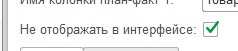
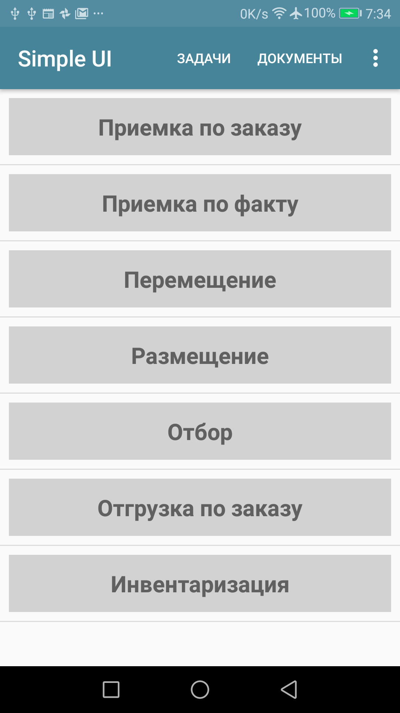
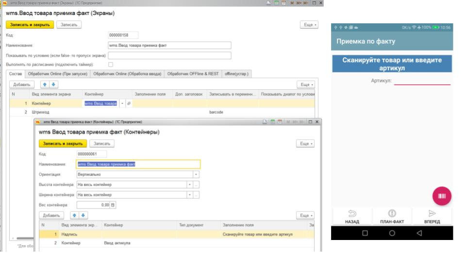
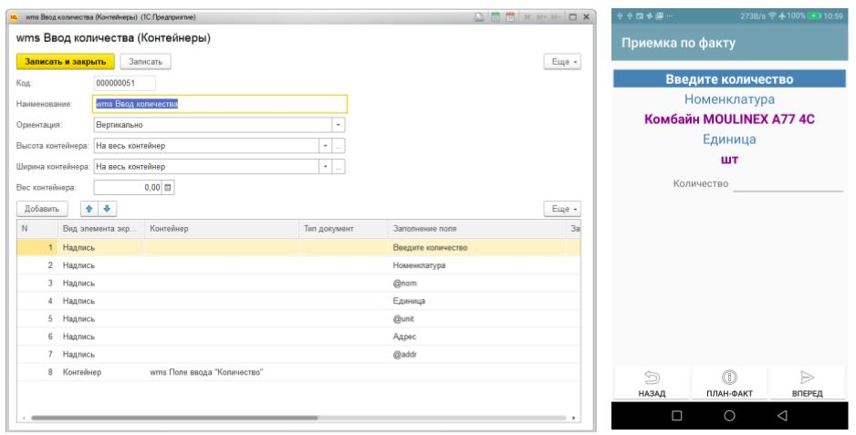
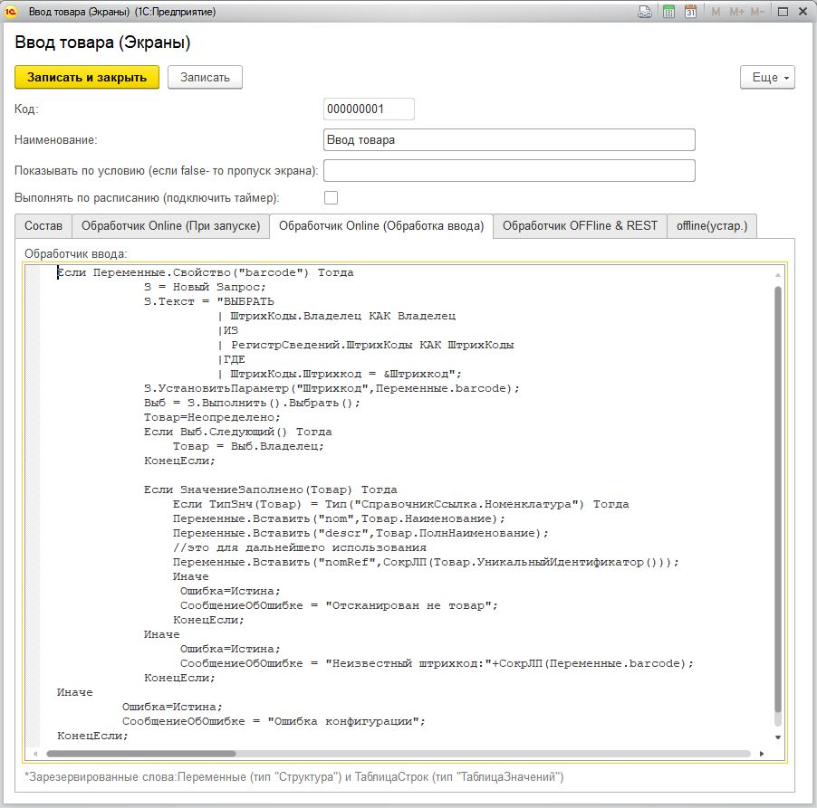

Как это работает?
======================
 
Конфигурации, процессы, экраны
------------------------------
В конструкторе создаются **Конфигурации клиента**. Конфигурации определяет состав **Процессов**, доступных на мобильном клиенте. **Процесс** – это набор экранов, который запускается со списка процессов (главного меню) или запускается отправкой сообщения с сервера или из другого процесса. 
Цель процесса – произвести какие то действия в базе: добавить строки документа, создать документ и т.д. Т.е. в случае учетных систем можно сказать что это соответствует бизнес-процессу или части какого то бизнес-процесса. Например это может быть «Приемка товара». 

.. note:: Процесс может быть скрытый (галочка «Не отображать в интерфейсе). Это можно поставить для процессов, которые запускаются с сервера. В демо базе это например процесс «Прием заказа с сервера»

Таким образом Конфигурация состоит из набора процессов, отображаемый или не отображаемых в главном меню. 
Вот так это выглядит в конструкторе:

.. figure:: _static/how_pic2.PNG
       :scale: 80%
       :align: center

А вот так в меню:

При этом каждый Процесс состоит из **Экранов**. А каждый экран -это набор из **элементов экрана**. Элементы экрана – это надписи, поля ввода, таблицы, галочки и т.д. – т.е. то что создает на экране картинку и взаимодействует с пользователем. Также есть *управляющие элементы* в виде парящих кнопок (они не вписаны в структуру элементов, а как бы парят сверху) – это например сканирование штрих-кода камерой, фотографирование и т.д. При этом элементы могут что то записывать в **Переменные** либо отображать Переменные, а переменные в свою очередь могут отображаться на экране. 

Вот так это выглядит в конфигураторе и на экране устройства. 

Переменные в которые идет запись указываются у элементов. Для получения данных из переменной ее надо просто упомянуть с префиксом “@”. В он-лайн режиме Переменные синхронизируются с сервером. 

Разметка экрана может быть произвольной с помощью **Контейнеров** либо может быть *упрощённая предопределенная разметка*. С помощью контейнером можно сделать экран любой сложности – расположить в нем любое количество любых элементов. В упрощенном режиме экраны больше заточены под стиль WMS-систем. 
Экран может содержать преопределенную нижнюю панель навигации, либо ее можно отключить и заменить своими кнопками.

Обработка событий
------------------
 
Нажатие на кнопки, ввод в полях, выбор из списка и.д. – порождает события ввода. Также событие возникают при открытии экрана и других случаях. Это привозит к запуску обработчиков событий.
В **он-лайн режиме** происходит http-запрос который передает  серверу состояние переменных и обработка происходит на сервере. Например в 1С вот так выглядит обработчик ввода. Вы просто пишете в контексте своей системы что нужно сделать с перемеренными и что приложение должно делать дальше.

В  **самостоятельном режиме** логика примерно такая же – нужно определить команды по этому событию, они выполнятся на устройстве.

.. image:: _static/listener_offline.jpg

Переключение экранов определяется в обработчиках. Т.е. когда надо запустить экран, вы просто вставляете в переменную название нужного экрана (для онлайн) 

 ``Переменные.Вставить("ShowScreen","Экран ввода количества");``

либо вот такую команду для самостоятельного режима

.. figure:: _static/command_showscreen.jpg
       :scale: 80%
       :align: center

.. hint:: Таким образом можно создавать зацикливание экранов, вложенные циклы, переходы между блоками логики. Т.е. любые конструкции с условиями и без условий.

Также есть *«Упрощенный режим»* где последовательность переключения задается последовательностью экранов в процессе и Элементом типа «Цикл». Он включается если снять галочку «Произвольный запуск экранов»

Передача конфигурации на устройства
-----------------------------------

Таким образом **Конфигурация** состоит из **Процессов**, процессы из **Экранов** а экраны из **Элементов**.  Все вместе это представляет из себя XML-строку. Чтобы устройство могло ее запустить ее надо передать на него. Это можно сделать разыми способами:

* **Для онлайн режима тонкого клиента** это делается так (если на 1С): В справочнике **«Мобильные клиенты»** создаются пользователи мобильного приложения. У каждого пользователя есть Код(цифровой) и ему сопоставляется конфигурация. В настройках приложения указывается код пользователя. И каждый раз при запуске приложения конфигурация скачивается на устройство с веб-сервиса. Таким образом если что то изменили в конфигурации – надо просто перезапустить приложение.
* **В оффлайн режиме** веб-сервиса со стороны учетной системы может не быть(или не быть доступа к нему). Тогда конфигурацию можно переслать прямо на устройсво (когда оно на связи) и она сохраниться там. Делается это специальным http-запросом. Также можно просто завести пользователя и сделать все как для онлайн, а потом переключитсья в офф-лайн режим или просто отключить связть – последняя скачанная конфигурация всегда храниться на устройстве и указывается время ее обновления:
* **Распространение конфигурации через «Магазин приложений»** Самым удобным для самостоятельно режима является **«Магазин приложений»**. Его можно организовать на своем сервере или использовать облачный сервис по умолчанию. По сути – это просто таблица где хранятся конфигурации и описания. Туда можно послать конфигурацию через REST А клиент может скачать ее

Вот как в целом все устроено на текущий момент. Остальное руководство раскрывает детали использование экранов, команд и других управляющих элементов. Хорошим подспорьем может послужить демо-база с примерами и примеры готовых решений. 

Также вот тут есть видео с процессом создания простых конфигураций и обзором функционала(также на канале периодически появляются другие видео):

Видео для Simple WMS (предыдущая версия), но актуально для понимания процесса: https://www.youtube.com/watch?v=T_OY-fqyJQ8

Видео по Simple UI: https://www.youtube.com/watch?v=kInzsWLFJFM&t=225s