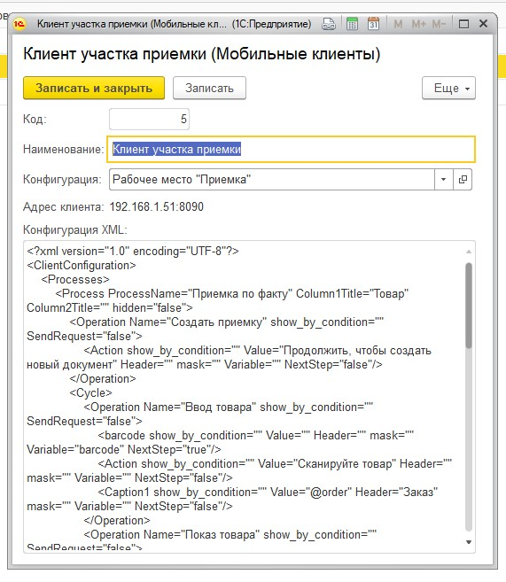
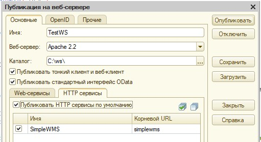

.. SimpleUI documentation master file, created by
   sphinx-quickstart on Sat May 16 14:23:51 2020.
   You can adapt this file completely to your liking, but it should at least
   contain the root `toctree` directive.

Установка, ресурсы, начало работы
==================================

Ссылки на ресурсы:

Вопросы и ответы, комьюнити на «Инфостарте»: https://forum.infostart.ru/forum104/topic211360/

**Комплект разработчика (демо-база 1С с примерами, конфигурация для интеграции (конструктор) а также все что нужно для «Микро-WMS») тут, там же ссылка на apk-файл**: https://infostart.ru/public/1153616/

Готовые решения: https://infostart.ru/public/1201444/ и https://infostart.ru/public/1234475/

Просто мои публикации на Инфостарте: https://infostart.ru/profile/129563/

Само приложение в Google Play: https://play.google.com/store/apps/details?id=ru.travelfood.simple_ui&hl=ru

Если нужно только разработка самостоятельного приложения (без он-лайн режима с 1С)
-----------------------------------------------------------------------------------

В этом случае нужно просто скачать Комплект разработчика, развернуть демо базу (она же конструктор), посмотреть демо и создать свою конфигурацию. Публиковать сервис в 1С или другой в таком случае не нужно. Демо базу можно использовать как конструктор для разработки своих конфигураций. Сами конфигурации будут переданы на мобильные устройства следующим способом:

 * Через магазин приложений в облаке (т.е. через таблицу ui_configurations) для режима работы Simple UI+PostgREST. В приложении по умолчанию прописан адрес тестового облака и магазин с приложениями с готовыми примерами. Если будете публиковать - просьба через свое облако (есть в описании как это сделать)
 * Прямым REST запросом на адрес мобильного устройства для OFF-line режима (т.е. без облака). Это можно сделать в конструкторе из справочника "Мобильные клиенты". Кнопка "Послать конфигурацию"

.. hint:: Также рекомендую посмотреть готовые решения как образец или базу для переделки под свои нужды

Если нужна работа в режиме он-лайн через веб-сервис 1С (тонкий клиент)
------------------------------------------------------------------------

После сохранения необходимо опубликовать веб-сервис SimpleWMS.
В клиентском приложении необходимо прописать код клиента. Код клиента – это код справочника «Мобильные клиенты». Например, для этого клиента в приложении надо установить 5, так как код справочника – 5.

 
Также нужно прописать адрес опубликованного сервиса в формате http://<адрес сервера: порт>/<алиас_сервера>/hs/simplewms
Такой формат ссылки будет актуален для настройки, показанной на рисунке:

Взаимодействие с мобильным клиентом осуществляется через 3 метода веб-сервиса:

**get_conf** : GET запрос который запускается клиентом при каждом входе в приложение. Ответом от учетной системы приходит XML с его конфигурацией

Параметры: 

 * code- код мобильного клиента (в данном модуле код справочника «scМобильныеКлиенты»). Этот код нужно установить в настройках приложения.
 * ClientURL   IP адрес собственного веб-сервиса, запущенного на клиенте. Он запоминается в системе чтобы при необходимости система могла отправить распоряжение по этому адресу

**set_input**: POST запрос, который вызывается клиентом каждый раз при смене экрана (т.е. при нажатии кнопки Далее, или автоматическом переходе. 

Параметры: обязательный параметр /set_input/{ИмяМетода} OperationData. В запросе от клиента передается JSON со значениями переменных (массив hashmap) и данными о клиенте, процессе и операции (поля client, process и operation) а также вид события и обработчик (подробнее в разделе ообработка событий)

В ответе отправляется JSON с переменными, дополненными в 1С (массив hashmap) при необходимости массивом rows (описано ниже) и полями stop (true/false) и ErrorMessage с помощью которых можно остановить процесс на клиенте и показать ошибку. Это может быть ошибка в обработчике, или какая то иная ошибка. Например это может выглядеть так:
 

**set_status**: GET запрос для передачи данных о начале процесса и окончании процесса. Он отправляется 2 раза – первый раз когда процесс стартует (открывается окно процесса) и 2й раз когда он завершается (закрывается окно процесса). Эта информация как правило требуется для биллинга, для отчетов KPI по работе склада и т.д.

Параметры: 
 * client – код клиента,
 * operation – наименование операции
 * process – наименование процесса
 * command – команда либо start либо stop

