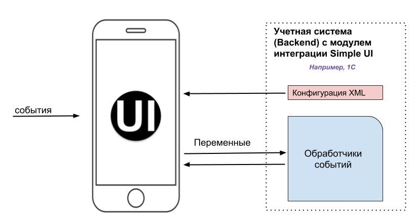
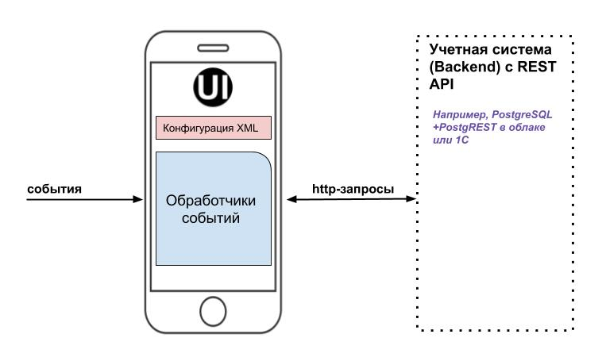

.. SimpleUI documentation master file, created by
   sphinx-quickstart on Sat May 16 14:23:51 2020.
   You can adapt this file completely to your liking, but it should at least
   contain the root `toctree` directive.

О платформе
============

**Simple UI – это бесплатная платформа для создания мобильных рабочих мест на Android. Конструктор позволяет создавать мобильные клиенты для учетных систем и самостоятельные приложения на телефонах, ТСД (терминалах сбора данных), планшетах, электронных киосках и других устройствах. При этом не нужно разбираться в мобильной разработке, Android  SDK ведь основная цель платформы – максимально упростить процесс разработки и поддержки, сделать его визуальным, собирать приложения из готовых блоков с минимумом кода. Причем код обработчиков можно писать на языке учетной системы либо задавать логику обработки событий с помощью команд REST, SQL и визуального конструктора. Проект постоянно развивается изыскивая новые способы упрощения разработки и повышения функционала и является пожалуй самым быстрым способом как создать MVP-проект так и продакшн-систему под конкретное внедрение или тиражный продукт.**

Конструктор применяется для разработки систем управления склада (WMS) и автоматизации производства (ERP), логистических и экспедиторских задач, оформления заказов выездными специалистами, автоматизации мобильной торговли, учета имущества и оборудования, сбора данных с эксплуатируемого оборудования и многих других сценариев применения.

Так как система прежде всего рассчитана как рабочее место для сбора данных, предусмотрены широкие возможности ввода данных и организации интерфейса:

 * Организация экранов со всеми возможными элементами ввода и отображения информации с произвольной разметкой
 * Работа со штрих-кодами аппаратных сканеров или ТСД, в т.ч. подключение Bluetooth-сканеров в режиме SSP
 * Распознавание штрихкодов камерой устройства
 * Распознавание текста (OCR) с камеры с использованием оригинального улучшенного алгоритма
 * Распознавание голоса
 * Синтез речи (воспроизведение текста голосом)
 * Звуковые сигналы		
 * Передачу GPS-координат и расшифровку мест
 * Фотографирование и прикрепление из галереи
 * Ввод рукописной подписи
 * Печать из приложения
 * Прием заказов и команд прямо на встроенный веб-сервис(не Push) напрямую, вззаимодействую я с пользователем в ральном времени
 * Переключение экранов напямую с сервера или по теймеру
 * Организация произвольных  структур (документов) с прикреплением файлов и мультимедиа

Мобильное устройство работает с конфигурацией, которая задает экраны приложения и логику работы интерфейса и обработчиков событий. Конфигурация создается в конструкторе и передается на устройство по воздуху(через веб-сервис) либо через «Магазин приложений» (можно организовать свой магазин приложений). Есть готовые решения котрые можно использовать как есть или доработать под свои нужды либо использовать как примеры разработки. Также есть широкий выбор обучающих демо-конфигураций.

Примеры готовых решений:

`Готовые решения для интеграции с 1С <https://infostart.ru/public/1201444/>`_

`Самостоятельная облачная WMS на PostgreSQL <https://infostart.ru/public/1234475/>`_

Режимы работы
--------------

Приложение на Simple UI может работать в нескольких режимах:

**Он-лайн режим тонкого клиента**, где обработка и управление происходит полностью в бекенде (на стороне учетной системы). Т.е. со стороны учетной системы работает веб сервис, который принимает команды и отдает в ответах управляющие данные. Также сама конфигурация скачивается и обновляется с веб-сервиса каждый раз в момент запуска приложения.  Весь обмен сводится к обмену стеком(массивом) переменных в обе стороны, которые содержат в себе и вводимые/выводимые данные и управляющие команды (например запуск экрана) Так, конструктор сделан в виде конфигурации 1С и может быть установлен на любую конфигурацию 1С в виде расширения или модуля. При этом код обработчиков можно писать прямо в «экранах» конструктора. Хранилищем данных и бекендом таким образом выступает учетная система.

**Самостоятельный режим**, где конфигурация хранится на устройстве и функционирует независимо от бекенда или в гибридном режиме. Обработка событий происходит командами конфигурации на устройстве. При этом приложение может работать как полностью off-line так и обмениваясь информацией с учетной системой через REST-интерфейс, т.е. сочетая различные режимы хранения и передачи данных:
 

* **Off-line работа** с собственной SQL базой используя SQL-команды. При этом с SQL можно взаимодействовать через встроенный в приложение собственный веб-сервис. Т.е. например сделать автономный ТСД на который данные (например справочник товаров) будут передаваться http-запросом со стороны учетной системы и забираться таким же способом. Например в готовых решениях есть офф-лайн решение для инвентаризации
* **HTTP-запросами через REST API**. Т.е. приложение отправляет запросы по событиям интерфейса которые обрабатываются на бекенде синхронно или асинхронно (для больших данных, например картинок).   В конфигурации задаются команды REST, переменные передаются в теле запросов или в параметрах. В качестве бекенда может быть как та же 1С так и напрмиер Postgre SQL. Так, например на PostgreSQL c API PostgREST устроено бесплатное открытое готовое решение  `«Микро-WMS» <https://infostart.ru/public/1234475/>`_  которое работает как самостоятельных промежуточный бекенд между ERP системой и мобильными рабочими местами. Обработка осуществляется отправкой CRUD-команд на добавление, чтение, изменение данных в таблицах облачного бекенда, а логика частично реализована в хранимых процедурах и триггерах и также воспроизводится через RESTful API
* **Совмещение этих двух режимов**, где хранение в том числе происходит в СУБД на клиенте, а также реализована, например асинхронная отправка данных, отложенная отправка или просто обращения к веб сервисам по событиям приложения
* **Документы** – произвольные структуры данных со своим интерфейсом, которые являются одновременно контейнером хранения данных и объектом автоматической синхронизации данных и имеют автоматический интерфейс (или настраиваемые формы). Документами могут быть справочники или документы учетной системы (документы разделены по видам). Разработчик просто определяет структуру возможных и обязательных полей и включает ее в конфигурацию. Документы могут работать как самостоятельные объекты так и использоваться в интерфейсах произвольно (например справочник «Клиенты»). С технической точки зрения это произвольные json-объекты разделенные по видам и некоторым другим разделителям для которых генерируется вся инфраструктура. Так например можно настроить хранение и синхронизацию документов через облачную СУБД Postgre с автоматической синхронизацией между несколькими устройствами одного аккаунта.

