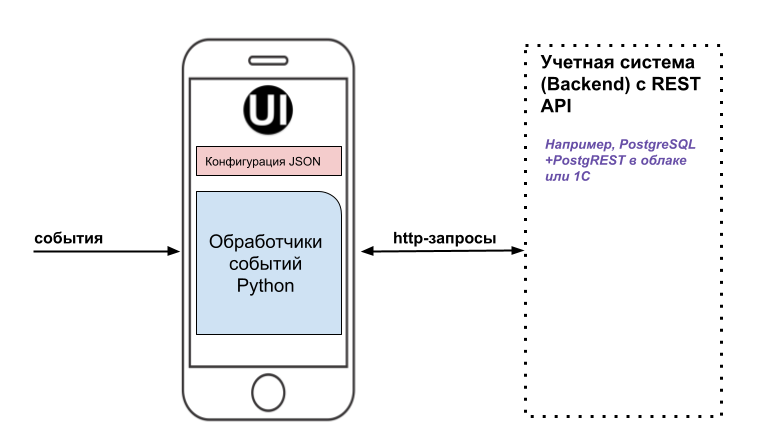
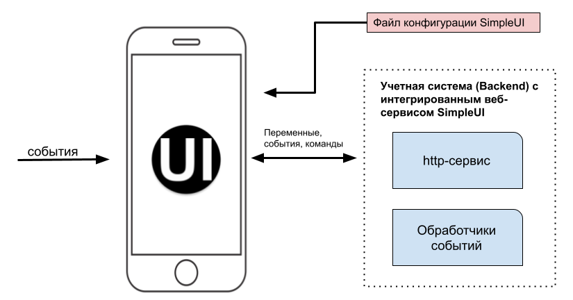

.. SimpleUI documentation master file, created by
   sphinx-quickstart on Sat May 16 14:23:51 2020.
   You can adapt this file completely to your liking, but it should at least
   contain the root `toctree` directive.

О платформе
============

**SimpleUI – это бесплатная платформа-конструктор для создания мобильных рабочих мест на Android и стационарных рабочих мест на десктопных системах (от Raspberry Pi до Windows). Конструктор позволяет создавать клиенты для учетных систем и самостоятельные приложения на телефонах, ТСД (терминалах сбора данных), планшетах, электронных киосках и других устройствах. При этом не нужно разбираться в мобильной разработке, Android SDK ведь основная цель платформы – максимально упростить процесс разработки и поддержки, сделать его визуальным, собирать приложения из готовых блоков с минимумом кода. Причем код обработчиков можно писать на языке учетной системы (выполняемый онлайн через в http) либо на Python (на стороне устройства). Проект постоянно развивается, изыскивая новые способы упрощения разработки и повышения функционала и является пожалуй самым быстрым способом как создать MVP-проект так и продакшн-систему под конкретное внедрение или тиражный продукт.**

Конструктор применяется для разработки систем управления склада (WMS) и автоматизации производства (ERP,MES), логистических и экспедиторских задач, оформления заказов выездными специалистами, автоматизации мобильной торговли и торговых представителей, учета имущества и оборудования, сбора данных с эксплуатируемого оборудования и многих других сценариев применения.

Так как система прежде всего рассчитана как рабочее место (интерфейс пользователя), предусмотрены широкие возможности ввода данных и организации интерфейса:

 * Организация экранов со всеми возможными элементами ввода и отображения информации с произвольной разметкой, различными обработчиками событий, обработчиками в фоне, по расписанию и т.д.
 * Работа со штрих-кодами аппаратных сканеров или ТСД, в т.ч. подключение Bluetooth-сканеров в режиме SSP
 * Распознавание штрихкодов камерой устройства
 * Распознавание текста (OCR) с камеры с использованием оригинального улучшенного алгоритма
 * Режим дополненной реальности Active CV котоый позволяет отказаться от традиционного интерфейса и организовать логику работы с объектами в видеопотоке
 * Распознавание голоса
 * Синтез речи (воспроизведение текста голосом)
 * Звуковые сигналы
 * Передачу GPS-координат и расшифровку мест
 * Фотографирование и прикрепление из галереи – широкие возможности работы с мультимедиа
 * Ввод рукописной подписи
 * Печать из приложения
 * Переключение экранов напрямую с сервера или по таймеру
 * Организация произвольных структур (документов) с прикреплением файлов и мультимедиа
 * Фоновый сервис событий который позволяет выполнять операции параллельно в фоне, например для организации голосового ассистента или периодической проверки сообщений

Мобильное устройство работает с конфигурацией, которая задает экраны приложения и логику работы интерфейса и обработчиков событий. Конфигурация создается в конструкторе и передается на устройство через веб-сервис либо через «Магазин приложений» (можно организовать свой магазин приложений) либо просто в виде текстового файла отправленного на устройство любым способом (например через мессенджер). Конфигурация представляет из себя один большой JSON-объект, который содержит в себе структуру экранов и решения в целом (процессы, меню и т.д.) и необходимые обработчики.

Принципы и режимы работы
------------------------------

Основная цель SimpleUI – реализация принципа **simple** во всем что касается разработки, поддержки и масштабирования решений. И это базируется на простых принципах, заложенных в архитектуру. Несмотря огромные возможности – глубокое задействование возможностей платформы и аппаратных особенностей , использование AI-возможностей и дополненной реальности, ядро всего этого – очень простое и принцип можно сформулировать в нескольких предложениях:

 * Каждая конфигурация состоит из процессов
 * Процессы состоят из экранов (обычные экраны) или шагов (дополненная реальность). Плюс также есть фоновые процессы.
 * Экраны содержат всевозможные элементы, размещенные в контейнерах. Их вид задается в конфигурации, а данные в переменных. Также экраны и платформа генерирует события (нажатия на кнопки, сканирование штрихкода и т.д.).
 * Все данные и все события и все команды записываются и читаются из одного стека переменных. Точнее есть локальные переменные (процесса) и глобальные переменные (для всей конфигурации). Т.е. принцип очень простой – нужно отобразить на экране надпись – вы помещаете ее в переменную например hashMap.put(“caption”, “bla bla”) , в структуре экрана при этом достаточно указать @caption чтобы произошла привязка; генерируется событие например сканера, оно также помещается в стек переменных и его можно прочитать через hashMap.get(key), вам нужно выполнить какую то команду, вы помещаете в стек эту команду hashMap.put(“toast”,”hello word!”)
 * Данные и команды помещаются и извлекаются из стека в обработчиках. Обработчики могут работать на устройстве (python) либо через веб сервис (на стороне вашей системы)

Режимы работы (мобильная платформа)
~~~~~~~~~~~~~~~~~~~~~~~~~~~~~~~~~~~~~~~~~~

Режимы работы определяются местом, где будет выполняться обработчик и где храниться данные:

**Решение (конфигурация) может работать полностью автономно**, выполняя код обработчиков на Python, а данные сохраняя локально в SQL (средствами Python или через ORM Pony), в NoSQL либо каким то другим способом , например в файлах на устройстве. При этом она может отправлять данные в двугие системы различными способами – через http-сервис (requests в Python), через файлы или например через тот же стек переменных задейсвуют обработчики он-лайн. Причем обмен может быть например в фоне и по расписанию

Также  обработчики могут выполняться **на стороне другой системы через веб-сервис онлайн** – т.е. выполнение кода обработчика со всему доступными на клиенте данными происходит на стороне учетной системы. Выполнение кода обработчика осуществляется в рамках синхронного http-запроса. Например на устройстве сканируется штрихкод, в этот момент происходит отправка запроса с данными, он обрабатывается на стороне учетной системы и данные возвращаются в ответе. Все это время система ожидает. Такое решение является чисто онлайновым (тонкий клиент) и его основное достоинство в том, что обработчики выполняются на языке вашей системы, на вашем сервере. Связкой является стек переменных. При этом такой режим можно **совмещать** с обработчиками на Python. Например можно накапливать данные локально, а потом вытаскивать их через он-лайн обработчики если с сервисом есть связь. 

**suip-файлы** Это автономные текстовые файлы определенного формата, которые содержат в себе одновременно структуру и обработчики процесса, и непосредственно данные которые передаются вместе с файлом. Подробнее тут https://uitxt.readthedocs.io/ru/latest/suip.html 

