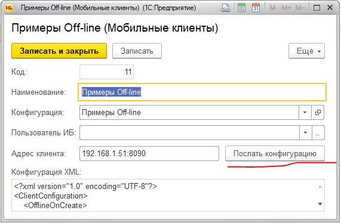
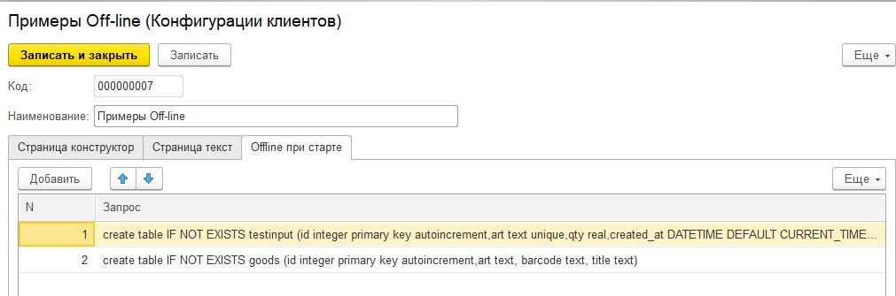
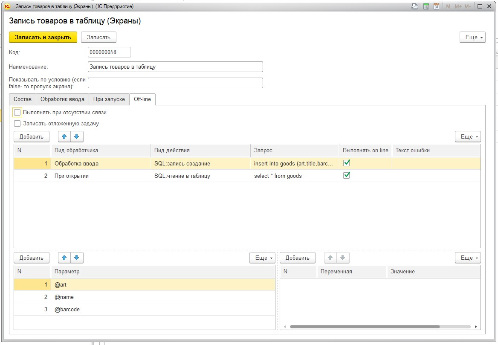
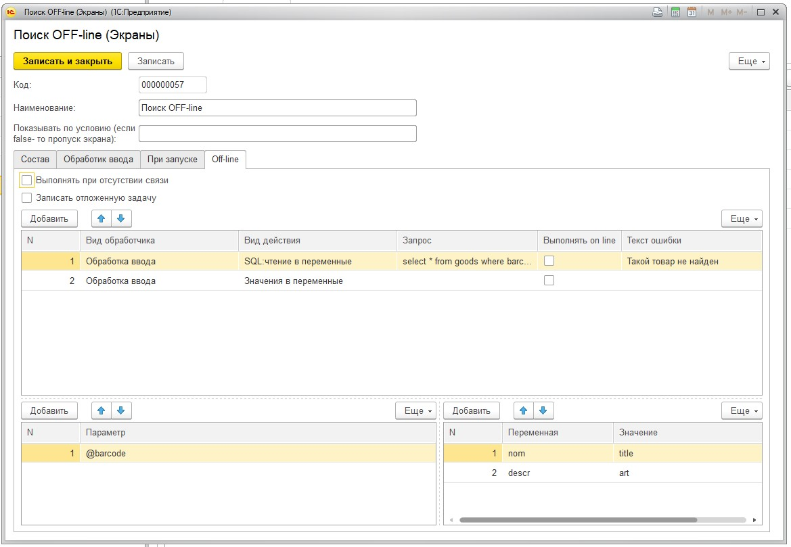
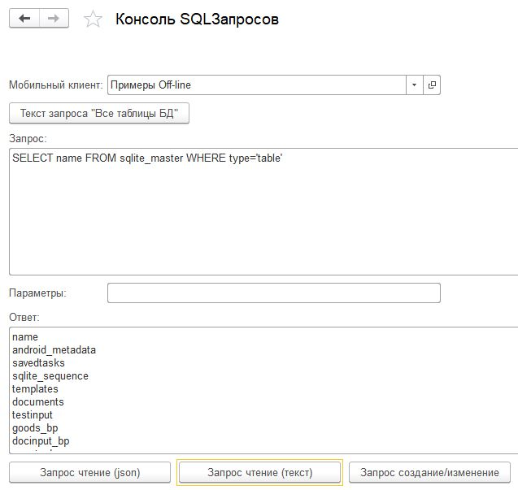
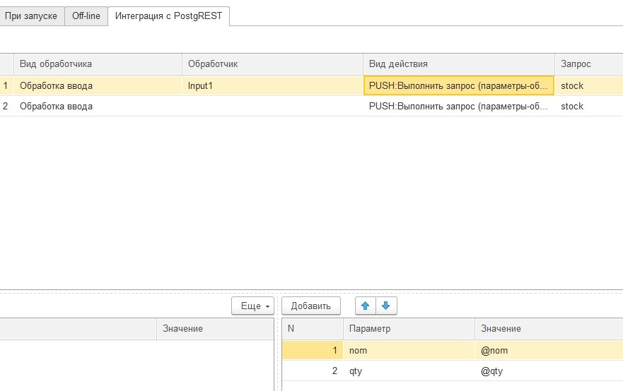
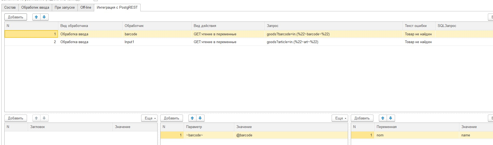
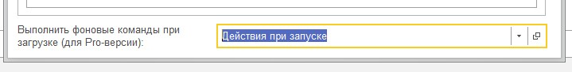

.. SimpleUI documentation master file, created by
   sphinx-quickstart on Sat May 16 14:23:51 2020.
   You can adapt this file completely to your liking, but it should at least
   contain the root `toctree` directive.

Самостоятельный режим
======================

OFFline возможности мобильного клиента
---------------------------------------
 
.. warning:: Важно! Теперь можно использовать Python в обработчиках (и увеличилось количество обработчиков), что существенно расширяет возможности разработки. Рекомедуется прочитать соотвествующий раздел, посмотреть демо-конфигурации и видео по использованию Python прежде чем приступать к разработке офф-лайн.

В Simple WMS можно создавать абсолютно автономные приложения работающие даже без наличия веб-сервера на стороне учетной системы , а так же поддерживающие различные смешанные режимы работы.

.. warning:: Важно! Теперь можно разрабатывать приложения с хранением в SQLite, но и с хранением NoSQL. Подробнее в отдельно разделе "Новая система хранения NoSQL"

В мобильном клиенте встроен SQL-сервер SQlite 3, котрый обеспечивает хранение и выборку данных. Взаимодействие с сервером происходит через встроенный в каждый клиент Simple WMS веб-сервер путем передачи SQL-запросов и ответов. Документацию на SQLite можно почитать тут https://www.sqlite.org. В частности, полезно будет изучить поддерживаемые типы данных.

Мобильный клиент поддерживает несколько режимов работы, связанные с off-line

 * **полностью автономная работа** При таком режиме ставится галка «Off-line» в настройках приложения и устройство не пытается что либо передать и забрать с Веб-сервера учётной системы. Веб-сервера на бекэнде может не быть вовсе. Работа клиента визуально никак не отличается от работы в он-лайн режиме, просто вместо обращения к серверу устройство делает запросы к своему SQL-серверу
 * **офф-лайн с фоновой синхронизацией (эмуляция он-лайн по возможности)** приложение пишет/читает в свою СУБД, но по возможности сразу же отправляет данные на сервер. Если нет связи копит в очереди. 
 * **автоматическое переключение в off-line при отсутствии связи**  Рассмотрим пример: вы сканируете приход (2 экрана: сканирование товара и ввод количества). Вы работаете в онлайн, но отошли от wi-fi и связь прервалась. На экране где идет сканирование товара вам надо распознавать штрихкод и проверять есть ли он в базе. Если в экране определена офф-лайн функция то будет исполнена она и ошибки об обрыве связи не будет. На экране ввода количества уже что то надо записать в базу, но связи нет. Для этого достаточно в конфигурации определить галочку «Записать отложенную задачу». Что произойдет на устройстве? Оно сохранить состояние hashmap (Переменные) в свою БД и потом когда связь появится передаст ее в 1С. Т.е. если в отсутствии связи прошло 5 циклов то клиент запомнит что нужно передать 5 записей. Для обработки отложенных задач теперь есть отдельный веб-сервис и обработчик: галочка **Записать отложенную задачу**, веб сервис **pending_task** и 
 * **Гибридный режим c веб-сервисом он-лайн режима** Запросы могут выполняться в он-лайн режиме например для ускорения и снижения нагрузки на бекенд
 * **Гибридный режим c REST Api** подробно описан в следующем разделе

Передача конфигурации и настроек через текстовый файл
~~~~~~~~~~~~~~~~~~~~~~~~~~~~~~~~~~~~~~~~~~~~~~~~~~~~~~

Simple UI прописан в ОС как программа, умеющая открывать тестовые файлы и с котрой можно поделиться txt- файлом. Таким образом, можно послать в письме или через мессенджер, отправить ссылку на файл, выложить на своем сайте файл с конфигурацией и он будет обработан. В тестовом файле должен быть JSON-объект определенной структуры. В файле можно задать:

 * настройки программы (те, которые задаются через меню "Настройки")
 * саму конфигурацию целиком - она будет загружена сразу же
 * прописать процесс, который стартует после загрузки конфигурации
 * прописать JSON объект с коллекцией переменных, которые будут переданы процессу котрый откроется по умолчанию

Пример текстового файла - в "Комплекте разработчика"

Отдельно по тегам (можно писать только те теги, которые нужны - они все необязательные):

"onlineURL", "onlineUser","onlineCode","onlinePass" - настройки для онлайн подключения к 1С

"backendURL","backendUser" - настройки для бекенда (Postgre)

"offlineMode"  - самостоятельный режим

"beep" - сигнал при действиях

"offSettings"- Запрет "Настроек" для пользовтаеля. Будет недоступна страница настроек.

"offChat",  "offToDo" - отключение режима чата и задач

"torch" - подсветка штрихкода фонариком

"oDataURL" - URL OData

"gps" - передача GPS

"hardwarescan" - аппаратеный сканер

"configuration" - Если нужно, то добавляется текст XML конфигурации. **Должен быть экранирован, чтобы записался JSON!**

"startProcess" - Если нужно, то процесс из конфигурации кторый можно запустить

"data" - Для процесса можно определить JSON с переменными

Передача конфигурации и настроек через QR - код
~~~~~~~~~~~~~~~~~~~~~~~~~~~~~~~~~~~~~~~~~~~~~~~~~

Настройки, описанные в предудущем разделе можно закодировать в QR-код. При загрузке приложения, когда параметры не заданы на стартовой странице есть кнопка сканирования QR-кода и такая же кнопка есть в экране настроек. Настройки будут загружены и сразу же применены. Это удобно применять для незнакомых пользователей, например посетителей торгового зала. Это касается только настроек, не конфигурации.

Конфигурация слишком большая чтобы ее можно было поместить в QR-код. Для того чтобы можно было сразу грузить конфигурацию и запускать нужный процесс в QR код надо добавить тег **"conf_id"** и поместить в значение какой то ID. В примере у меня ID никак не обрабатывается, но тем не менее можно выполнять дествия в зависимости от ID. Чтобы это все работало нужно иметь бекенд на PostgREST (описано в соотвествующем разделе) и там должна быть хранимая функция которая возвращает 1. саму конфигурацию (может зависеть от ID) 2. процесс и начальные переменные процесса. Пример такой функции есть во вложении. Соответственно настройки подключения к самому бекенду есть в самом QR-коде.

Сам JSON можно сделать в каком нибудь он-лайн редакторе JSON, а QR-код - в он-лайн редакторе QR-кодов.

Передача конфигурации на устройство в режиме OFF-line через прямой запрос на сервер
~~~~~~~~~~~~~~~~~~~~~~~~~~~~~~~~~~~~~~~~~~~~~~~~~~~~~~~~~~~~~~~~~~~~~~~~~~~~~~~~~~~~

При работе через веб-сервер на стороне учетной системы, каждый раз когда скачивается конфигурация, она сохраняется на мобильном устройстве. При этом в настройках можно увидеть дату последнего скачивания (last update)

Если же работа не предусматривает наличие веб-сревера на стороне бекенда, то можно передать конфигурацию на устройство прямым HTTP-запросом. Для этого надо указать адрес веб сервиса моб. клиента который можно посмотреть в настройках

Разделы конфигурации для работы OFFline
~~~~~~~~~~~~~~~~~~~~~~~~~~~~~~~~~~~~~~~~~~

**Автономный режим**

При этом режиме нужно в настройках мобильного приложения поставить галочку «Самостоятельный режим”

В таком случае приложение не будет пытаться связаться с сервером.

Для того чтобы ваша конфигурация работала с таблицами на устройстве их нужно создать. Для этого на закладке конфигурации «OFF line при старте» надо прописать запросы на создание таблиц. Тут же можно создать и индексы.

В принципе это можно не прописывать на закладке а выполнить через консоль запросов . Это зависит от логики реализации вашего клиента.

Далее нужно прописать запросы для экранов на закладках Off-line&REST

Нужно указать вид обработчика (когда он должен сработать при открытии или при «Далее»)

Вид действия **SQL:запись создание**, **SQL:чтение в переменные**, **SQL:чтение в таблицу** и **Значение в переменные**. Тут указывается запрос. Параметры если есть указываются в виде «?» а сами значения параметров указываюстя в левой нижней связанной табличной части. Как правило это могут быть переменные. Например на картинке это ранее определенные переменные (на этом или предыдущем экране) и они передаются в комманду записи

**Запрос SQL:чтение в переменные** это запрос, который выводит 1-ю строчку в одну или несколько переменных. А если выборка пустая то может генерировать ошибку. Ошибка генерируется если задан текст ошибки. Например тут если по штрихкоду товар не найден то пишется ошибка, если найден то записывается в переменные

Чтение в таблицу также записывает в переменную результат запроса. Записывает в json в формате таблиц описанных в разделе «Работа с произвольными таблицами»

Использование SQL в он-лайн режиме (гибридный режим)
~~~~~~~~~~~~~~~~~~~~~~~~~~~~~~~~~~~~~~~~~~~~~~~~~~~~~~

Запросы с закладки "Обработчик OFFline&REST" могут выполняться в он-лайн режиме . Запрос выполняется ДО логики онлайн (т.е. до отсылки запроса). Поэтому их действие можно потом обрабатывать на стороне бекенда. Например можно искать товары в БД устройства и если уж не нашли то на стороне бекенда.

Запросы напрямую на сторонние сервисы
~~~~~~~~~~~~~~~~~~~~~~~~~~~~~~~~~~~~~~~

Запросы GET,POST и так далее по умолчанию уходят на сервер, заданный в настройках. Однако можно в этой же закладке аналогично прописывать и запросы на любые другие ресурсы. Для этого надо указать полный адрес сервиса с перфиксом ##. Например ##https://www.cbr-xml-daily.ru/daily_json.js. При этом если нужна авторизация - можно поместить ее в параметры запроса. Пример есть в демо базе в "Примеры Simple UI#3"

Режим отложенной отправки
~~~~~~~~~~~~~~~~~~~~~~~~~~

Раздел в стадии наполнения...

Взаимодействие с БД устройства из учетной системы через веб-сервер мобильного приложения
~~~~~~~~~~~~~~~~~~~~~~~~~~~~~~~~~~~~~~~~~~~~~~~~~~~~~~~~~~~~~~~~~~~~~~~~~~~~~~~~~~~~~~~~~~

В демо базе есть консоль для работы с SQLсервером прилоежние через web-сервис и обработка с примерами отправки номенклатуры и других взаимодействий с СУБД.

Для того чтобы извне создать таблицы, индексы, передать данные в эти таблицы и забрать данные на стороне учетной системы отправляются SQL-запросы, посредством HTTP GET запросов. На стороне мобильного приложения все время работает веб-сервер принимающий эти запросы и исполняющий комманду. Т.е. веб сервер устройства принимает команду с SQLзапросом и передает ее SQL серверу. Если это SELECT то результат возвращается в ответе. 

Чтобы отправлять запрос надо знать на какой адрес его слать. У каждого девайса имеется свой сетевой адрес. В 1С артиматически заполняется адрес в справочнике Мобильные клиенты когда происходит запрос конфигурации. Также (если 1С не работаете через Веб-сервер) адрес клиента теперь можно узнать в настройках приложения.

Если поставить галочку «Записать отложенную задачу», то , даже если больше ничего не определено оффлайн, при отсутствии связи на этом действии будет писаться состояние переменных(hashmap) в таблицу savedtasks . Далее в сервисе регулярно каждые 5 минут будет проверяться не восстановилась ли связь и можно ли отправить эту задачу. Отправка идет на отдельный сервис pending_task и обрабатывается отдельным обработчиков процесса «Отложенная задача». В запросе идет имя процесса с которого произошла отложенная задача и выполнятся обработчик этого процесса. Например при отсутствии связи были отсканированы приемка и отгрузка, значит отложенные задачи должны быть обработаны в процессах «Приемка» и «Отгрузка» . В демо базе есть пример «Отложенные задачи при обрыве связи» для его проверки надо начать работать при онлайн, но потом например вырубить соединение на моб. Устройстве и продолжить работу. А потом включить обратно и посмотреть что получится

Естественно эти запросы можно отдавать не только со стороны 1С а можно отправлять хоть из браузера. Но в 1С для этого есть удобная функция обертка.

Например этот запрос создает таблицу товаров:

``Запрос = "create table IF NOT EXISTS goods (id integer primary key autoincrement,art text unique, barcode text, title text)";	
ПараметрыЗапроса  = "";
СтрокаОтвета = Справочники.scМобильныеКлиенты.ОтправитьSQLЗапросМобильныйКлиент(URLМобильногоУстройства,"ExecSQL","","&query="+Запрос+"&params="+ПараметрыЗапроса);``

Этим запросом запрашиваются отсканированные товары.

``ПараметрыЗапроса="";	
Запрос = "SELECT * FROM testinput";
СтрокаОтвета = Справочники.scМобильныеКлиенты.ОтправитьSQLЗапросМобильныйКлиент(URLМобильногоУстройства,"SQLQuery","","&query="+Запрос+"&params="+ПараметрыЗапроса);
Ответ = СтрокаОтвета;``

В запросах нужно указывать команду для веб сервера. Это связано с некоторыми особенностями реализации SQL в андроид  - нельзя одной командой выполнить SELECT и CRUD-операции

Команды такие:

**ExecSQL** -  все команды изменения данных (т.н. CRUD)

**SQLQuery** – запрос выборки (SELECT) возвращает ответ в json в том же формате, в котром описываются таблицы

**SQLQueryText** – тоже запрос выборки, но ответ приходит в виде текста с разделителями для удобства просмотра

В демо базе для работы с устройством добавлены две обработки : *КонсольSQLЗапросов* и *ПримерОбработкиВзаимодействияOFFLineБезСервера*

Взаимодействие с БД устройства через текстовые файлы
~~~~~~~~~~~~~~~~~~~~~~~~~~~~~~~~~~~~~~~~~~~~~~~~~~~~~~~~

В случае, если с устройством невозможно взаимодействовать через веб-сервер приложения (нет сети вообще) предлагается режим взаимодействия через файлы. Все команды взаимодействия с СУБД приложения, описанные в предыдущем примере могут быть записаны в файлы и переданы приложению через папку, определенную в настройках. Ответы (результаты запросов и ошибки и статусы исполнения запросов) также записываются в папку и могут быть прочитаны. В таком случа учетная система будет работать через запись/чтение файлов в устройство, подключенное в режиме флешки.

В папке обмена нужно положить 2 текстовых файла select.txt и execute.txt примеры котрых есть в комплекте разработчика. Это просто файлы с разделителем строк с обычными SQL-запросами

Более подробно можно посмотреть в этом видео: <https://youtu.be/aKVWIEfqi0c>`_

Команды в офлайн-режиме
~~~~~~~~~~~~~~~~~~~~~~~~

В офлайн также можно выполнять различные команды:

 * команды работы с встроенным SQL(описаны выше)
 * команды взаимодействия с REST интерфейсом
 * переключать экран
 * запускать экран диалога и получать событие от него
 * создавать json-переменные
 * вычислить выражение (В режиме офлайн можно вычислять математические выражения и записывать в переменную командой «Вычислить выражение» . операнды, являющиеся перменными должны быть заключены между «%» например %a%+1 -прибавит к переменной 1
 * завершать процесс с предупреждением и без
 * вычислять произвольные логические выражения и переходы

Связь с бекендом через REST интерфейс
======================================
Клиенты на SimpleUI могут использовать CRUD-операции для полноценной независимой работы с привязкой к БД PostgreSQL через RESTful интерфейс с помощью сервера API PostgREST. Т.е. можно организовать свой бекенд к которому будут подключены все клиенты и 1С. Инструкция по установке и работы с API тут: http://postgrest.org/en/v6.0/tutorials/tut0.html

.. hint:: Также можно использовать данный инструментарий для подключения к любому другому REST-интерфейсу. Все необходимые функции GET, POST,PATCH,DELETE есть. Установка заголовков и параметров, обработка ответов – запись в переменные и таблицы – все это не зависит от поставщика API. Таким образом есть альтернатива – подключаться он-лайн или подключаться через REST-команды на клиенте

Для работы с ним должен быть установлен адрес публикуемого сервиса PostgREST в настройках (Postgrest URL). Также в базе со стороны 1С нужно установить  константу «Адрес бекенда»

Также нужно указать «пользователя» - это условный владелец записей, который идет в качестве параметров для условного разделения данных. Например по нему могут быть отобраны документы, задачи, он может прописываться в таблицах в нужные поля. Это не элемент авторизации. При установке в Переменных появляется переменная userPostgre которую можно использовать для установки параметров например.

Настройка команд происходит на закладке «Интеграция с PostgREST»

Для выполнения операций записи, обновления (upsert), и запуска хранимых процедур используется настройка  POST: выполнить запрос. Соотвественно для самого запроса можно установить заголовки, передать параметры из переменных или просто, а также записать результат запроса в переменные. Соответственно в инструкции к API все запросы, которые должны проходить через PUSH выполняются этой командой. Например так:

Т.е. то, что в API передается как JSON в пост запросе определяется в параметрах – программа делает из них JSON и отправляет. 

При вставке новой записи в зарезервированную переменную **LastID** возвращается ID добавленной записи. Это важно, если потом Вы хотите напрмиер работать с этой записью. Например привязать другие записи к ней.

.. hint:: При выполнении операций POST, PATCH, DELETE и хранимых процедур они могут вызывать исключение которое можно переопределить в БД. Например можно поставить триггер на таблицу при добавлении новых строк, для проверки заполнения записей. Пример – триггер в таблице goods в базе проверяет чтобы было заполнено наименование и пишет то что Вы определили в обрбаотчике – «Не заполнено наименование». Это выводится как ошибка и останавливает выполнение процесса. 

**Чтение в переменную** – это выборка данных видом действия GET:чтение в переменные , что соответствует SELECT запросу к базе или в API это запросы чтения к таблицам и views с каким то отбором. Берется 1я строка возвращаемого массива и помещается в переменные. Например так:

Тут важно следующее:

Если в запросе надо прописать параметры, которые надо взять из переменных то их надо как то обозначить. Я выбрал вариант ~Переменная~, но вы можете и по другому это сделать. Смысл в том, чтобы программа сделала текстовую замену для подстановки параметра в текст запроса. Поэтому сочетание символов должно быть уникальным в запросе

Например, goods?barcode=in.(%22~barcode~%22)

В Переменных надо прописать соответствие переменной из JSON и переменной вашей конфигурации.

Аналогично настраивается запрос с выгрузкой в таблицу, только вместо переменных указывается имя переменной – таблицы и вид действия GET:чтение в таблицу

Для выполнения операции UPDATE записи или записей следует использовать метод PATCH

При этом параметры запроса(если они есть) следует заключить между ~… ~ и в этом же табличном поле помимо заполнения параметров надо указать также заполнение полей котрые будут обновляться. В демо базе пример INSERT, UPDATE, DELETE

Для удаления записей (аналог SQL команды DELETE ) следует использовать метод DELETE передав в параметрах отбор по записям которые надо удалить. Без отбора удалится все.

Работа в фоновом режиме для Pro-версии
---------------------------------------

Можно отсылать и получать данные в фоновом потоке (не UI-потоке приложения) – т.е. елси надо скачать или закачать большой объем данных программа будет выполняться без торможения. При этом само приложение может взаимодействовать чисто с собственным SQL полностью автономно (без связи) и при необходимости обмениваться с бекендом в фоне.

Для этого используются виды действий Фоновое чтение в SQL и Фоновая отправка из SQL. Это команды состоящие из 2х частей – PUSH или GET запроса, описанного выше и сразу SQL запроса (в той же строке) описанного в разделе Offline.

Кроме того, можно назначить процессы, которые будут выполняться при запуске конфигурации. Для этого в конфигурации есть реквизит в котром можно указать экран, в котором в свою очередь перечислены команды (в демо базе в качестве примера есть экран «Действия при запуске»). Сам экран не будет выполняться – только команды.

Лента «Задачи»
------------------

В случае, если используется не онлайн режим работы, а например база под.лючена к PostgreSQL также можно формировать для пользователя ленту «Задачи». Для этого в базе надо определить хранимую процедуру get_tasks с параметром user, который модно использовать например для отбора задач для конкретного пользователя. Состав полей, котрый возвращает эта функция регламентирован, он должен быть как в представлении ниже – эти поля задают то, как будут выглядеть «карточки» в программе. При выборе конкретной задачи в переменные записываются order и orderRef этой задачи

В SQL::

CREATE OR REPLACE FUNCTION api.get_tasks(

	"user" character varying)

    RETURNS SETOF api.wms_tasks 

    LANGUAGE 'sql'

    COST 100

    VOLATILE 

    ROWS 1000
 
AS $BODY$

    --Передаю параметр котрый можно указать в условии на всякий случай,он не нужен пока

	SELECT * FROM api.wms_tasks;

$BODY$;

ALTER FUNCTION api.get_tasks(character varying)

    OWNER TO admin;

GRANT EXECUTE ON FUNCTION api.get_tasks(character varying) TO web_anon;

CREATE OR REPLACE VIEW api.wms_tasks

 AS

 SELECT wms_orders_captions.id,

    wms_orders_captions.barcode,

    wms_orders_captions.done,

    wms_orders_captions.doc_date,

    wms_orders_captions.type,

    wms_orders_captions.typeid,

    wms_orders_captions.doc_date_str,

    wms_orders_captions.doc_number,

    wms_orders_captions.contractor,

    wms_orders_captions.description,

    wms_orders_captions.caption,

    wms_orders_captions.action,

    wms_orders_captions.doc_number AS field1,

    'Номер документа'::text AS field1caption,

    wms_orders_captions.contractor AS field2,

    'Поставщик'::text AS field2caption

   FROM api.wms_orders_captions

  WHERE NOT wms_orders_captions.done OR wms_orders_captions.done IS NULL;

ALTER TABLE api.wms_tasks

    OWNER TO admin;

GRANT ALL ON TABLE api.wms_tasks TO admin;

GRANT ALL ON TABLE api.wms_tasks TO web_anon;

Магазин конфигураций
----------------------

Это хранилище конфигураций в облачном бекенде из которого можно скачать и установить либо обновить конфигурацию. Для того чтобы организовать в своем бекенде такой магазин достаточно создать таблицу и дать на нее права:

CREATE TABLE api.ui_configurations

(

name character(100) COLLATE pg_catalog."default",

description text COLLATE pg_catalog."default",

"XML" text COLLATE pg_catalog."default",

id character(100) COLLATE pg_catalog."default" NOT NULL,

CONSTRAINT ui_configurations_pkey PRIMARY KEY (id),

CONSTRAINT id UNIQUE (id)

)

TABLESPACE pg_default;

ALTER TABLE api.ui_configurations

OWNER to admin;

GRANT ALL ON TABLE api.ui_configurations TO admin;

GRANT ALL ON TABLE api.ui_configurations TO web_anon;

GRANT ALL ON TABLE api.ui_configurations TO PUBLIC;

Соответственно, чтобы например отправить конфигурацию нужно отправить PUSH в эту таблицу, при этом важно указать уникальный ID (напрмиер УИД 1С). В поставке в демо базе реализована кнопка отправки конфигурации в магазин.

.. danger:: в конфигурации, которая выполняется без связи с 1С можно установить галочку «Самостоятельный режим». Пользователь конечно сам может поставить ее в настройках, но для удобства в конфигурации можно поставить такую галку (в справочнике), тогда при загрузке из магазина она поставит в настройках эту галку сама. А вот если на этом устройстве потом будет запускаться он-лайн конфигурация, важно не забыть эту галку потом снять!

Синхронизация документов в облаке
-----------------------------------

Через облачный бекенд можно  синхронизировать документы вместе с картинками и файлами. Т.е. это автоматическая фоновая синхронизация в облаке – вы меняете данные на устройстве и оно попадает в Postgre. И наоборот. Соотвественно с  учетной системой документы в таком случае будут поступать уже из PostgeSQL путем REST интерфейса.

Для активации этого режима надо чтобы приложение работало в самостоятельном режиме и был заполнен адрес сервера PostgreSQL и пользователь PostgreSQL в настройках программы. Пользователь тут выполняет функцию «владельца» документов. Документы скачиваются в рамках пользователя и при отправке также прописывается владелец.

Также поддерживается принцип синхронизации между несколькими устройствами в рамках одного аккаунта. Т.е. если например на 3х устройствах указать одинаковое имя пользователя и на одном из них создать документ, то он попадет на остальные 2 вместе в прикрепленными фотографиями и файлами. Любые изменения также будут порождать обмен. 

Для того чтобы программа могла работать с документами в облаке нужно в БД создать следующие объекты (выполнить команды) которые содержатся в прилагаемом файле SQL_документы.

В результате в БД должны появиться объекты:

1)	Расширение pgcrypto – нужно для генерации UID-ов

2)	Таблица documents – собственно сами JSON документы с полями, но картинки в ней – ссылки на другую таблицу

3)	Таблица attachments – хранилище картинок и присоединенных файлов. При добавлении картинки присваивается 36-значный UUID по котрому ее потом можно получить

4)	Таблица uploads – это таблица  в которой устройства отмечают что «документ такой то» аккаунтом таким то и с ИД-устройсства таким то» получил последнюю версию. Соотвественно елси документ меняется каким то устройством то он удаляет всю инфу т.е. программа считает что его надо у себя обновить.

5)	Хр. процедура api.get_docs5 – она выдает документы, которые нужно скачать устройству с определнным аккаунтом. Т.е. изменения, которых нет на этом устройстве.

Пример закачки документов в 1С есть в демо-базе в списке «Документы». Качаются документы с фотографиями.
