.. SimpleUI documentation master file, created by
   sphinx-quickstart on Sat May 16 14:23:51 2020.
   You can adapt this file completely to your liking, but it should at least
   contain the root `toctree` directive.

Экраны, переменные и события
============================

Переменные, глобальные переменные и константы.
-----------------------------------------------

Стек обычных переменных (структура) существует пока запущен процесс. Поместить переменную можно через структуру Переменные, установив имя и значение переменной. Также существуют специальные переменные (например GPS-координаты), управляющие переменные. Также переменные могут быть установлены через поля экрана или контейнера «Записывать в переменную». К такой переменной можно обратиться из кода и или вывести на экран(либо использовать в других местах, например в оффлайн) употребив префикс “@”. 
Но стек переменных перестает существовать когда процесс закрывается. При повторном открытии структура снова пустая.
Глобальные переменные  позволяют организовать общий стек переменных между процессами. Т.е. переменная может быть записана в одном процессе, а прочитана в другом, либо в том же при повторном открытии. Они существуют пока запущено приложение. 
Работать с ними точно также только название самой переменной должно начинаться с «_», напрмиер “_var1”, “_var2”. Обращаться к ним по тому же имени. При обращении через экран это будет соотвественно “@_var1”, “@_var2”. Т.е. программа, если видит что название переменной начинается с символа подчеркивания – просто помещает их в отдельный стек переменных. Для программиста работа с такими переменными больше ничем не отличается
Константы позволяют записывать значения переменных в памяти устройства. Т.е. если закрыть и открыть приложение константа может быть прочитана снова. Таким образом можно организовать например настройки приложения. Поддерживаются строковые константы через которые можно выразить все остальное. Например в демо базе показана работа с флажком (флажок управляется строками “true” /’false”) и со строковой переменной. Но можно хранить и число. 
Для установки константы нужно написать 2 подряд управлящие переменные ``WriteVarString[номер]`` и ``WriteVarStringValue[номер]`` , где номер – просто какой то номер. Суть в том что если надо вставить несколько констант за раз  то в Структуре они должны храниться отдельно, а если вставить несколько раз одинаковую переменную то останется только последнее значение. Поэтому надо написать что то типа

``Переменные.Вставить("WriteVarString1","string_var1");``
``Переменные.Вставить("WriteVarStringValue1",Переменные.string_var1);``

``Переменные.Вставить("WriteVarString2","cb");``
``Переменные.Вставить("WriteVarStringValue2",Переменные.cb);``

Тут видно что в первых двух строчках устанавливается первая константа, в следующих двух – вторая. Константы записываются в хранилище устройства как “string_var1” и ‘cb’

Для чтения констант используется ``ReadVarString[номер]``
Например ранее установленные константы:

``Переменные.Вставить("ReadVarString1","string_var1");
Переменные.Вставить("ReadVarString2","cb");``

Константы хранятся в том же хранилище что и константы приложения. Поэтому не следует называть их также как названы строковые константы приложения: “URL”, “User”, “Pass”, “Code”

Обработка событий в он-лайн режиме
-----------------------------------

Кнопки контейнеров, диалоги ввода, штрихкоды и другие управляющие элементы передают события которые можно использовать в алгоритмах. Как только происходит событие происходит запрос ввода либо обработка оффлайн события

В Переменные пишутся 2 переменные

 * event
 * listener

в *event* пишется тип события: Input (люой ввод – кнопки, штрихкоды и т.д.), onResult(экран диалога) и onStart(запуск экрана)
в *listener* пишется расшифровка- либо переменная (кнопка) либо зарезервированное название операции barcode, signature, photo

Допустим на экране размещен элемент экрана «Штрихкод» и указано «Записывать в переменную» - barcode. Тогда при сканировании штрихкода возникает событие ввода и посылается запрос котрый вызывает выполнение обработчика «Обработчик Online(Обработка ввода)»
Напрмиер, на первом экране вводится штрихкод и записывается в переменную barcode. После чего экран переключается и начинает работать обработчик. В обработчике записано

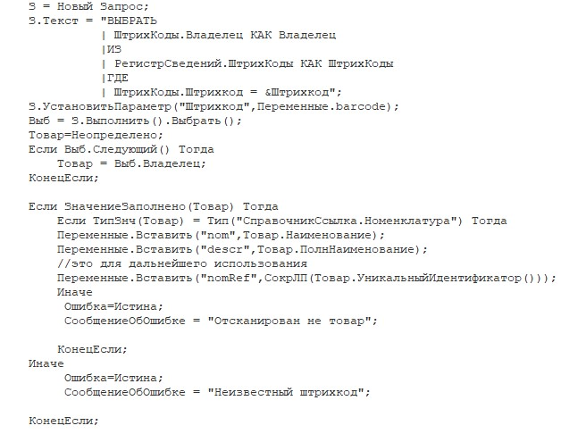

Тут видно, что берется переменная barcode (Переменные.barcode) и запросом ищется Номенклатура с таким штрих кодом. Далее, если все нормально то заполняются переменные nom, descr , nomRef, а если нет – то выводится сообщение об ошибке. Обратите внимание на то что в переменную nomRef записывается УникальныйИдентификатор чтобы потом когда надо будет эту номенклатуру заполнять в документ, ее можно было бы найти по ссылке
А с переменными descr и nom – все просто, раз они заданы в полях надписей, они будут показаны на последующих экранах:

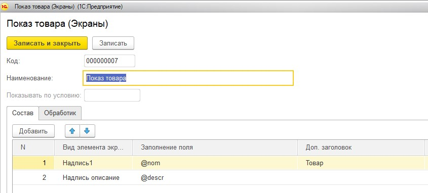

И выглядеть это будет так:

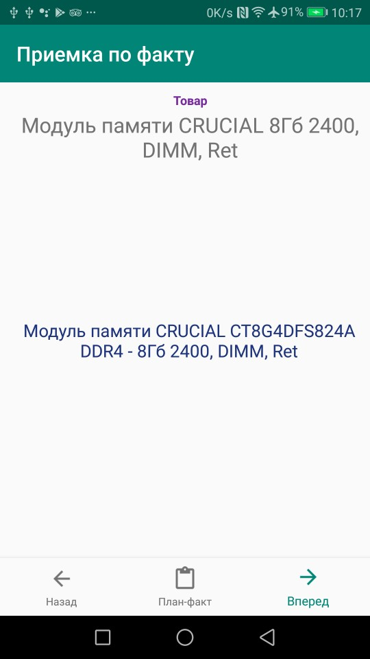

Обработка событий в самостоятельном режиме
-------------------------------------------

Действия пользователя и прочие события в самостоятельном режиме также порождают события. Команды, для обработки событий определяются на закладке Обработчик OFFline & REST. Порядок команд как он задан в табличной части подразумевает порядок обработки событий.

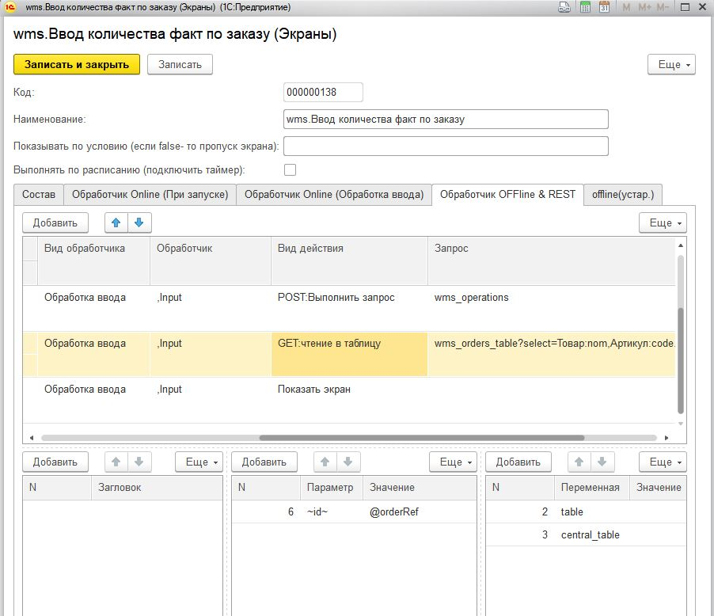

Для того чтобы по событию произошел запуск команды требуется в колонке Вид обработчика указать событие:

* Обработка ввода – любое событие ввод включая штрихкод
* При открытии – при запуске экрана
* Закрытие экрана – закрытие запускаемого экрана (экран диалога) . Подробнее в Запуск эрана диалога

Для события «При запуске» уточнять тип события не нужно – оно всегда одно. А для события ввода могут быть разные события, фильтр по которым задается в колонке «Обработчик»:

**Пустое значение** – нажатие кнопки «Далее» на навигационной панели

**«перемеренная»** - нажатие кнопки или другого управляющего элемента(например списка значений) у которой стоит такая переменная. Например если в кнопке указать переменную btn_ok то при нажатии сгенерится событие с таким именем

**TableClick** – клик по таблице

**BACK_BUTTON** – кнопка назад на стандартной навигационной панели

**barcode, photo, photogallery, signature, spinner** – события при обработке управляющих элементов (см. далее)

**Input1, Input2, Input3, InputDate** -  события при обработке элементов упрощенного режима разметки

События можно перечислять через запятую (в т.ч. «пустую строку»), т.е. указав ``“,barcode`` - можно задать фильтр на события «Далее» и на сканирование штрихкода.

Действия по обработки события задаются с помощью поля Вид действия и других связанных полей

Условный переход в самостоятельном режиме. Когда строки команд добавляются в табличную часть им назначается номер. Для некоего события можно указать  Вид действия – «Проверить условие». Тогда при выполнении этой команды будет проверено условие и выполнится либо команды, перечисленные в поле «Тогда» , либо в «Иначе». Там перечисляются номера строк, через запятую, которые должны выполнится. Условие может быть люой сложности и задано в синтаксисе Java. При этом переменные задаются в обрамлении @имя_переменной@, например @a@>5 – будет проверяться выражение a>5. Или например @a>5@&&@a@<=10 будет проверяться a>5 и a<=10

.. image:: _static/bool_expression.jpg
       :scale: 100%
       :align: center

Общие элементы экранов
-----------------------

Сообщение об ошибке 
~~~~~~~~~~~~~~~~~~~~

В режиме тонкого клиента заполнение переменной СообщениеОбОшибке вызывает прерываение процесса и показ надписи в текстом ошибки внизу экрана. В оффлайн режиме аналогом этого события является наступление ошибки при заполненном поле «Сообщение об ошибке»

Управляющие элементы экранов (запуск действий с парящих кнопок)
~~~~~~~~~~~~~~~~~~~~~~~~~~~~~~~~~~~~~~~~~~~~~~~~~~~~~~~~~~~~~~~~~

Сканирование штрихкода с камеры и с аппаратного сканера
"""""""""""""""""""""""""""""""""""""""""""""""""""""""""

Елси на экране требуется распознавание штрихкода, то необходимо добавить на экран элемент «Штрих-код» и указать переменную, в которую он будет записываться по факту сканирования.

Если на устройстве есть аппаратный сканер, желательно указать галочку «Аппаратный сканер» в настройках. В противном случае на экране будет присутствовать кнопка сканирования через камеру устройства. Соответственно, при сканировании через камеру при добавлении элемента Штрих-код подраздумевается что будет нажиматься парящая кнопка. Также в настройках можно включить подсветку.
Также при использовании Bluetooth сканеров в режиме SSP сопряжения необходимо активировать Использовать Bluetooth и выбрать устройство и суффикс (это все обычно программируется на устройстве штрих-кодами из инструкции). Bluetooth сканеры обычно могут работать и в режиме HID но в таком случае на экране нельзя размещать другие элементы ввода – они будут перехватывать строку.
Аппаратный сканер ТСД должен быть запрограммирован в режиме HID (в разрыв клавиатуры) с суффиксом CR/LF на конце.

Передача картинки на устройство
"""""""""""""""""""""""""""""""""""""

На экране может быть выведена картинка на том месте где находится поле описания. Рекомендую не выводить одновременно с картинкой поле описание, чтобы оставить для нее место. 
В составе этот элемент называется «Картинка»
Картинка передается через обычную переменную в виде строки Base64. Так как 1С может добавлять лишние символы, их надо убрать

``Картинка = Новый Картинка("C:\Users\Дмитрий\Pictures\хорь.jpg");
СтрокаBase64 =Base64Строка(Картинка.ПолучитьДвоичныеДанные());
//Для 1С это надо делать обязательно, иначе картинка невалидная
СтрокаBase64 = СтрЗаменить(СтрокаBase64, Символы.ВК, "");
СтрокаBase64 = СтрЗаменить(СтрокаBase64, Символы.ПС, "");
Переменные.Вставить("image",СтрокаBase64);``

Прием картинки с камеры (фотографирование)
"""""""""""""""""""""""""""""""""""""""""""

В составе экрана можно разместить элемент «Фото с камеры» , тогда на экране появится кнопка камеры. И это изображение можно передавать в переменную base64. В демо базе есть простой пример по приему изображений.

Ввод картинки из галерии
""""""""""""""""""""""""""

Аналогично фотографированию, только ввод - из галереии устройства. Для этого надо расположить элемент "Фото из галереи" и задать переменную в которую будет писаться.

Ввод подписи
"""""""""""""

Добавлена возможность ввода изображения подписи с экрана (пользователь рисует свою подпись на экране) и передача этой подписи в 1С в виде картинки
Для этого необходимо поместить элемент «Подпись» на экран и задать переменную
В демо базе появился пример процесса «Пример подпись»

Голосовой ввод
"""""""""""""""

Элемент экрана «Голосовой ввод» осуществляет запуск распознавания речи от Google (на устройстве должны быть сервисы Google и интернет). Распознанная строка передается в переменную, котрую вы определите в экране.

Распознавание текста
"""""""""""""""""""""

Для использования распознавания текста нужно поместить на экран элемент «Распознавание текста» и заполнить «Настройка распознавания» (обязательно!). Распознавание работает оффлайн. Распознаются буквы и символы толкьо в латинской раскладке и цифры. 
При распознавании строка подбирается из таблице БД на устройстве, т.е. чтобы обеспечить работу этого механизма нужно либо создать таблицу и передать туда объекты либо использовать документы (documents). Например вам нужно обеспечить поиск по товарам по артикулам на рабочем месте. Вы создаете (например через закладку конфигурации «Offline при старте») таблицу «Create table goods if not exist…”, выгружаете туда товары (примеры взаимодействия есть в демо-базе. В товарах должна быть колонка по которой сверять распознанные строки (например артикул) 
В настройке распознавания как минимум надо определить запрос к таблице, поле которое будет проверяться по результатам распознавания и настройку соответствия для заполнения переменных полями таблицы. Напрмиер в приведенном примере поиск идет по полю  таблицы field2 , и в случае успеха заполняются переменные field1,doc и field2
Также для повышения точности поиска можно повысить количество измерений и процент совпадений (минимальная средняя частота). Т.е. например если поставить измерений 10 и частоту 75 то количество измерений будет как минимум 10 (или больше) а победитель должен будет иметь процент совпадений не менее 75%

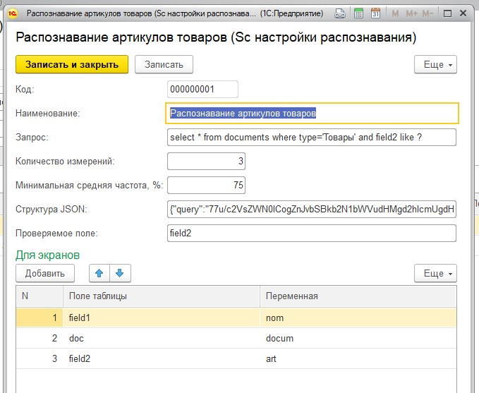

Прочие элементы интерфейса
---------------------------

Синтез речи
~~~~~~~~~~~

Вывод экрана может сопровождать воспроизведение голосом текста. Текст можно задавать в переменной или непосредственно. Для этого нужно разместить на экране элемент «Голос»

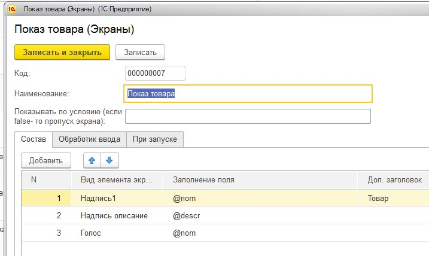

Звуковой сигнал
~~~~~~~~~~~~~~~

Можно воспроизвести "бип" - один из 100, заложенный в Андроиде, если присвоить в переменную ``beep`` значение от 1 до 99, либо оставить пустой - тогда будет звук по умолчанию. Это работает и в онлайн и в оффлай (через присвоение переменных). Пример в базе.
Примеры звуков есть тут:https://developer.android.com/reference/android/media/ToneGenerator#TONE_CDMA_ABBR_REORDER
В онлайн:

``Переменные.Вставить("beep","");``

В оффлайн:

.. image:: _static/beep.jpg
       :scale: 100%
       :align: center

Функции авторизации и загрузки конфигурации.
~~~~~~~~~~~~~~~~~~~~~~~~~~~~~~~~~~~~~~~~~~~~~

Можно организовать экран входа в систему котрый будет запускаться при запуске приложения и пункт основного меню для перелогинивания.  Для того чтобы процесс запускался при входе в приложение нужно поставить галочку «Запустить при старте»
 
Для того, чтобы произошла загрузка нужной конфигурации нужно заполнить переменную «ID» кодом справочника Мобильные клиенты, нужного клиента. Это тот же код который указывается в настройках. Если с терминалом будут работать несколько человек, можно создать конфигурацию, содержащую толкьо процесс «Логин» , и другие клиенты будут подгружаться из нее. 
Также процесс с логином можно добавить во все конфигурации клиентов, в которых нужно перелогиниваться (совместное использование одного терминала)

.. image:: _static/scr_login.jpg
       :scale: 100%
       :align: center

Режим разметки экрана контейнерами (рекомендуется)
---------------------------------------------------

На экранах можно разместить произвольное количество элементов, определив их положение и оформление. Пример произвольной разметки приведен в демо базе в конфигурации «Примеры Simple UI»
Для этого используются **Контейнеры**. 

.. attention:: На экране могут быть либо контейнеры либо упрощенный режим – одновременно они работать не могут так как занимают весь экран. Если вы хотите использовать режим разметки то нужно поместить на экран элемент «Контейнер» и указать тип контейнера а в него уже поместить все остальные визуальные элементы

.. image:: _static/containers_ex.jpg
       :scale: 100%
       :align: center

Контейнеры – это группы элементов. Они могут располагаться либо горизонтально либо вертикально. Ориентация - обязательное свойство.
Также обязательно нужно  указать ширину и высоту. При этом ширину и высоту можно указать в числах, а можно в виде варианта «На весь экран» или «По размеру элементов». На весь экран означает что контейнер будет стараться занять в данном направлении всю площадь до конца экрана (по ширине или по высоте). По размеру элементов – его ширина или высота будет равна сумме размеров элементов.
При этом в контейнере может быть размещено несколько контейнеров. Если каждый из них «По размеру элементов» - то просто будут следовать друг за другом.
Если допустим каждый из них «На весь экран» и не указан «Вес» то первый контейнер займет весь экран и ничего больше не будет видно. Это нормальное поведение для Андроид. Чтобы было видно все контейнеры нужно им назначить «Вес». Допустим нам надо поделить контейнер на 2 равные части по горизонтали. Тогда у каждого нужно поставить Вес=1 и ширину «На весь контейнер». Если допустим нужно один сделать меньше другого в 2 раза то вес нужно поставить 2 у того который больше  - Вес 1 (чем больше вес тем меньше размер – это знаменатель). Сами числа тут не важны – важно соотношение.

Элементы контейнера
~~~~~~~~~~~~~~~~~~~~~

Контейнеры включают в себя собственные визуальные элементы. При этом невизуальные – Голос, ШтрихКод и т.д. могут быть в экране помимо корневого контейнера и использоваться. Обработка переменных происходит в обработчиках экранов. Сколько бы не было вложенных контейнеров все обработчики – в экране.

Элементы контейнера отличаются следующими свойствами:
 * их может быть неограниченное количество каждого типа
 * на каждый из них может быть задано собственное оформление
 * для кнопок есть галочка «Не обновлять экран» - происходит только отправка запроса или выполнение офлайн обработчика. Перерисовка не происходит
 * для полей ввода можно задавать предопределенные значения

**Оформление** – это справочник. По сути соответствует «стилям». Т.е. разные элементы могут использовать один и тот же элемент «Оформление».
 
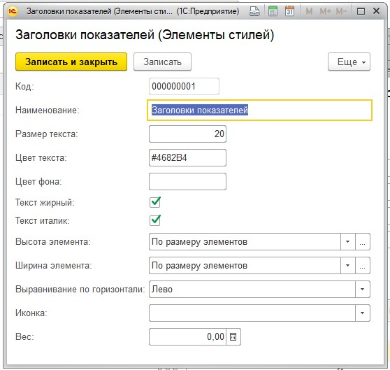

Оформление включат в себя элементы «Высота», «Ширина» и «Вес» - они полностью аналогичны контейнерам. Т.е. например если поставить у кнопки ширину и высоту «На весь контейнер» то она займет весь контейнер.
Также элементы оформления
Цвет фона, цвет текста – установка цветов в HEX кодировке вместе с символом #. Посмотреть палитру можно в интернете. Андроид рекомендует использовать «матириал» цвета например с ними удобно работать вот тут : https://materialuicolors.co/ . Тут прямо можно копировать и вставлять в поля.
Размер текста – числовой размер текста
Выравнивание – Лево, Право, Центр. Выравнивание зависит от ширины и высоты. Например если надпись в контейнере котрый «По размеру элементов» по ширине, то от установки выранивания «По центру» ничего не изменится. Но если  вам надо расположить надпись по центру экрана – вам надо сделать размер контейнера «На весь контейнер» по ширине и поставить Выравнивание «По центру»
Иконка – выбор из нескольких иконок для кнопок.

Для элементов контейнера можно определить условную видимость(поле «Скрыть по условию») – переменную, в которой если будет присвоена строка “true” то этот элемент будет скрыт

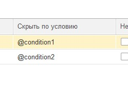
 

Виды элементов контейнера:

**Контейнер** – вложенный контейнер

**Картинка** – картинка в виде строки base 64. Работа аналогична картинкам обычного экрана

**Диаграмма** – диаграмма типа «Круговая», «Столбики» и «Линейная». Установка столбцовой и линейной диаграммы возможна по сериям. Установка значений производится путем передачи json строки и показана в «Примеры Simple UI #2»

**Индикатор** – индикатор со своей шкалой. Возможна установка минимального и максимального значения, границ красной, желтой и зеленой зон и самого значения. Установка происходит через передачу json строки. Пример формата с комментариями – в демо базе «Примеры Simple UI #2»

**Список** – выпадающий список

**Таблица** – таблица на экране. Может быть несколько таблиц расположенных как угодно

**Надпись** – их может быть сколько угодно с любым оформлением

**Кнопка** – в отличии от «упрощенного режима» кнопки не располагаются в блоках а добавляются по одной и каждая вызывает событие при нажатии. 

**Поле ввода число** и **Поле ввода строка** – может быть произвольное количество полей. В отличии от упрощенного режима «Поле ввода» не имеет заголовка. Если нужен заголовок – то рядом нужно поместить «Надпись»
В «Заполнение поля» можно поместить значение или переменную для начального заполнения

**Флажок** – логическое значение. В Переменные записывается “true”/”false” - именно в строковом виде.

**Документ** – можно использовать в качестве поля ввода любой тип документов. В случае использования документа нужно указать «Тип документа» , например «Клиенты». В переменные пишется json выбранного документа.
 
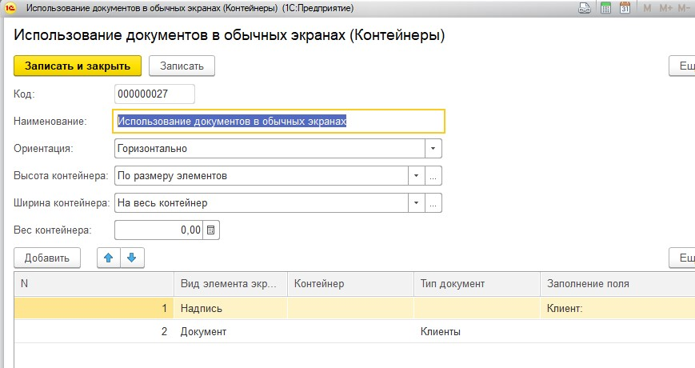

Скрытие панелей кнопок
~~~~~~~~~~~~~~~~~~~~~~

В процессе можно указать галочку «Скрыть панель кнопок» - тогда нижняя панель будет скрыта

Упрощенный режим разметки экрана
-----------------------------------

Упрощенный режим (без контейнеров), предполагает что каждый экран имеет некий шаблон структуры. Это неплоха работает на классических WMS.
Справочник экраны содержит структуру элементов показываемых на экране. В приложении элементы скомпонованы таким образом:

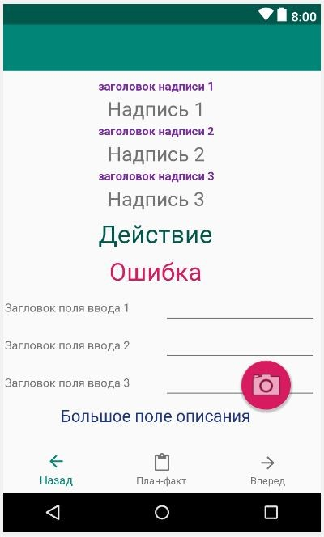

Экран может содержать следующие элементы (вид элемента задаётся в колонке «Вид элемента экрана», кроме ошибки) 

**Надпись, описание, ошибка, поле описание** – это нередактируемые надписи на экране. 

**Надпись1, Надпись2 и Надпись3** вместе с заголовками находятся в верхней части. 

В колонке «Заполнение поля» указывается какой текст будет выведен. Это может быть просто строка надписи, а может быть переменная, передаваемая из обработчика. Переменные задаются с префиксом @. Например на картинке в поле «Надпись1» указана переменная @addr – это значит что на экране ввода адреса, в обработчике в нее заполняется отсканированный адрес.
Для надписей Надпись1, Надпись2 и Надпись3 имеет смысл колонка «Доп. заголовок» - это сиреневые заголовки над надписями
Если на экране должен быть доступен ввод штрихкода то нужно добавить «Штрихкод» в любое место. Если используется аппаратный сканер (галочка в настройках) то значка камеры не будет видно, но будет ожидание сканирования. Штрих-коды должны быть в разрыв клавиатуры (HID) с префиксом #13. Если не аппаратный сканер то будет доступна кнопка камеры.
Если необходимо по событию ввода сразу переключать экран, то надо поставить галку «Переключаться по окончанию ввода». Тогда н надо будет нажимать кнопку «Далее»

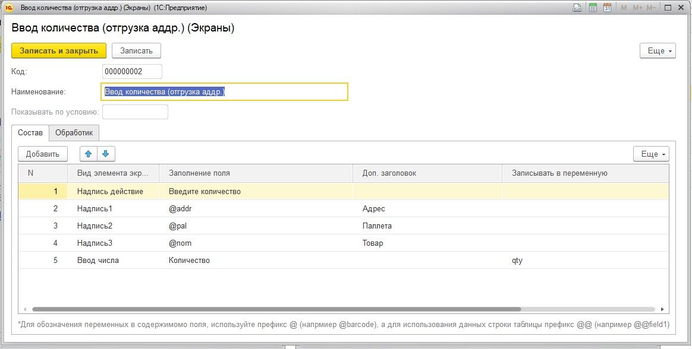
 
Поля ввода бывают двух видов **«Ввод числа»** , **«Ввод строки»** Доступно до 3х полей ввода на одном экране. Их можно комбинировать с Штрих кодом. Например есть пример поиска заказа по штрих-коду и номеру – в демо базе экран Поиск заказа.
У поля ввода заголовок задается в «Заполнении поля». Доп. заголовка у полей ввода нет.

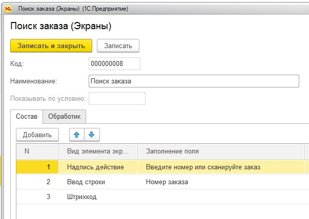

**Поле ввода «Дата»** - доступно одно поле ввода даты на экране.
 
**Диалог и показ по условию** На экране можно разместить диалог с кнопками «Да» и «Нет» и получить результат выбора пользователя. После того как пользователь нажимает одну из кнопок, диалог исчезает и в переменную записывается значение выбора «true» (если выбрано «Да») или «false» если выбрано «Нет» . В демо базе это есть на экране «Результаты поиска заказа». Вот как это может быть обработано:

``Если  Переменные.result="true" Тогда //пользователь ответил «Да» 
НовДок = Документы.ЗаказПокупателя.СоздатьДокумент();
НовДок.Дата = ТекущаяДата();
НовДок.Записать();
Переменные.Вставить("order",СокрЛП(НовДок));
КонецЕсли;``

Для диалога может быть задано условие показа. Если в эту переменную установить “true” то диалог будет показан, если false то нет. Естественно это должно быть задано до показа экрана в одном из обработчиков.
 
 
Элемент управления **«Список значений»** Работу с этим элементом демонстрирует пример в демо-базе. Можно заполнять значения списка непосредственно, либо через переменную. Единственное правило – они должны быть через точку с запятой. По определенным причинам связанным с андроидом первым элементом списка нужно сделать либо пустое поле(пробел) либо что то типа «Выберите…». Первый элемент не будет выбираться – остальные будут. В переменную передается строковое значение списка.
 

Элемент управления **«Список кнопок»** Элемент управления может разместить одну или несколкьо кнопок не экране и передать в базу нажатую кнопку. Для обработки сразу по нажатию надо поставить «Переключаться по нажатию кнопки» как и везде. Работа с данным элементов в принципе аналогична работе со «Список значений» - отличается только способ отображения
 

Элемент экрана **«Список кнопок горизонтально»** Этот элемент полностью аналогичен элементу «Список кнопок», за исключением того что кнопки выводятся горизонтально в строку

Элемент управления **«Повтор экрана»** Иногда требуется оставаться на экране но отсылать запросы в базу. Например ждать когда поймаются спутники или пропустить задание и получить следующее. Для этого можно использовать элемент экрана «Повтор экрана». По середине экрана будет выведена желтая кнопка с текстом который вы указываете в конструкторе. При нажатии на нее происходит отправка запроса как при нажатии кнопки Далее и больше ничего – т.е. экран не меняется.

Переключение экранов Simple UI
-------------------------------

В процессе умолчанию указана галка «Произвольный запуск экранов» У каждого экрана в таком случае будет необходимо прописать действия для переключения или вызова других экранов. Иначе экран просто будет оставаться неподвижным. Даже если не отключена стандартная панель кнопок.
Переключение может происходить через стандартную панель и также можно сделтаь свои кнопки и определить обработчики в них. Собственно говоря как такового «переключения» может не быть – многие приложения состоят из одного экрана, а остальные экраны вызываются по необходимости
Порядок переключения может быть определен через обрабтчики кнопок или стандартных элементов с помощью команды «ShowScreen». Например 

``Переменные.Вставить("ShowScreen","Экран 2 стандартные кнопки");``

Также как альтернатива определить **обработчики в разделе OFF-Line & REST**. Это подойдет как для самостоятельных приложений так и просто для удобства (если например не надо писать условия для переключения экранов, а нужно сделать это безусловно)

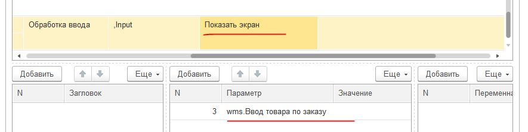

