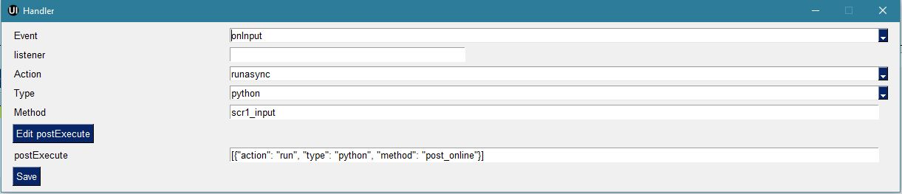

.. SimpleUI documentation master file, created by
   sphinx-quickstart on Sat May 16 14:23:51 2020.
   You can adapt this file completely to your liking, but it should at least
   contain the root `toctree` directive.

Экраны, переменные, события и обработчики
===========================================

Переменные, глобальные переменные и константы.
--------------------------------------------------------------------------------

Стек обычных переменных (структура) существует пока запущен процесс. Стек переменных – это массив «ключ-значение», который в зависимости от обработчика(языка) может быть представлен в различном виде но с одним и тем же смыслом. В Python – это переменная hashMap имеющая типа Java-объектаMap<String, String>  , входящая и исходящая из любого обработчика. В онлайн – это входящий в теле запроса JSON-массив и исходящий массив в ответе. При этом например в обработчиках 1С, это внутри перобразуется в Структуру, и обработчики работают со Структурой, не подозревая о JSON. В будущих дополнительных языках обработчиков это будет также какая то внутренняя структура, hashmap и т.д. 
Также существуют специальные переменные (например GPS-координаты), управляющие переменные-комманды. Т.е. в стеке переменных, помимо данных помещаются команды управления.
К переменной можно обратиться из кода и или вывести на экран(либо использовать в других местах, например в оффлайн) употребив префикс “@”. 
Но стек переменных перестает существовать когда процесс закрывается. При повторном открытии структура снова пустая.
Глобальные переменные  позволяют организовать общий стек переменных между процессами. Т.е. переменная может быть записана в одном процессе, а прочитана в другом, либо в том же при повторном открытии. Они существуют пока запущено приложение. Работать с ними точно также только название самой переменной должно начинаться с «_», напрмиер “_var1”, “_var2”. Обращаться к ним по тому же имени. При обращении через экран это будет соотвественно “@_var1”, “@_var2”. Т.е. программа, если видит что название переменной начинается с символа подчеркивания – просто помещает их в отдельный стек переменных. Для программиста работа с такими переменными больше ничем не отличается
Константы имеет смысл хранить в NoSQL и записывать-получать через put,get

Экраны, процессы 
---------------------------------------------------------------

Каждый экран при открытии генерирует события onStart, onPostStart
При получении события ввода (onInput) обычно происходит перерисовка экрана(если не запретить это), в результате которой опять запускаются обработчики onStart и onInput
В случае если в процессе более одного экрана, нужно прописать действия для переключения или вызова других экранов. Иначе экран просто будет оставаться несменяемым. Даже если не отключена стандартная панель кнопок. 
Переключение может происходить через стандартную панель и также можно сделтаь свои кнопки и определить обработчики в них. Либо переключения могут происходить по каким то событиям – чтение штрихкода, таймер и т.д. Собственно говоря как такового «переключения» может не быть – многие приложения состоят из одного экрана, а остальные экраны вызываются по необходимости
Порядок переключения может быть определен через обработчики кнопок или стандартных элементов с помощью команды «ShowScreen». Например 

``Переменные.Вставить("ShowScreen","Экран 2 стандартные кнопки");``

В обработчиках Python соотвественно надо вставить:

``hashMap.put("ShowScreen","Экран 2 стандартные кнопки");``

Можно запустить экран из фонового сервиса событий, независимо от того, какой процесс запущен, даже если в настоящий момент не запущем вообще никакой процесс командой *ShowProcessScreen*
Можно запускать и останавливать любые процессы из процессов – StartProcess, FinishProcess 

Отрисовка переменных на экране в синхронном и асинхронном режиме
~~~~~~~~~~~~~~~~~~~~~~~~~~~~~~~~~~~~~~~~~~~~~~~~~~~~~~~~~~~~~~~~~~~~
Важно понимать, что событие onStart и отрисовка переменных через @ возникает при обычном запуске пользователем либо выполнении команды ShowScreen – т.е. синхронном выполнении открытия экрана в UI-потоке. Но кроме этого любой обработчик может быть выполнен в асинхронном режиме. Поэтому когда асинхронный обработчик заканчивается, он заканчивается в фоне и ничего не происходит – экран не перерисовывается. Чтобы перерисовать экран и вывести результаты работы асинхронного обработчика есть команда *RefreshScreen*

Таймер экрана
~~~~~~~~~~~~~~~~~~~
На экране можно определить таймер, который будет периодически генерировать событие ввода (частота таймера задается в общих настройках). Данная функция была ввдена до того, как в платформе появились асинхронные обработчики. Большинство сценариев для которых нужен таймер гораздо более эффективно реализуются на асинхроне и системе не нужно постоянно дергать экран, более того это еще и более быстрая реакция. Поэтому прежде чем использовать таймер, рекомендуется посмотреть в сторону асинхронных вызововов экранов или сервиса событий

Общие функции управления элементами экранов  
~~~~~~~~~~~~~~~~~~~~~~~~~~~~~~~~~~~~~~~~~~~~~~~~

Для управления видимостью отдельных элементов экрана следует использовать команду Show_<Идентификатор элемента>, например ``hashMap.put("Show_left","-1") `` , где left - переменная элемента (переменная=идентификатор). Значения могут быть: "1"- виден , "0" - не виден, без освобождения места, "-1" - виден, с освобождением места

Можно использовать команду noRefresh, которая отключает перерисовку элементов - т.е. обновление экрана при выполнении обработчика. Пример: ``hashMap.put("noRefresh","") ``

Можно отключить события по полям ввода, котрые генерируют события при вводе командой **disable_events**, без параметров

Можно использовать подсветку полей ввода бледно-зеленым и бледно-красным цветом.
Для того чтобы обозначить пользователю корректный или некорректный ввод можно выделить неярким красным или зеленым цветом поля ввода списком

 * **SetRed**, <список переменных полей ввода через “;”> - выделяет список полей красным
 * **SetGreen**, <список переменных полей ввода через “;”> - выделяет список полей зеленым

Любой элемент экрана можно получить в виде Java-класса и использовать его методы SDK с помощью команды SimpleUtilites.getView(<Идентификатор элемента>). Подробности в примерах Ноябрь 2022

События и обработчики
---------------------------------------------------------------

Кнопки контейнеров, диалоги ввода, штрихкоды и другие управляющие элементы передают события которые можно использовать в алгоритмах. Как только происходит событие происходит запрос ввода либо обработка оффлайн события

В Переменные пишутся 2 переменные

 * event
 * listener

в *event* пишется тип события: Input (любой ввод – кнопки, штрихкоды и т.д.), onResult(экран диалога) и onStart(запуск экрана) и другие
в *listener* пишется расшифровка- либо переменная (кнопка) либо зарезервированное название операции barcode, signature, photo

Все события в платформе возникают в 3х ключевых точках:

 * События экрана
 * События ActiveCV
 * События системы в целом. 

Также события могут запускаться из кода или например по окончанию каких то фоновых механизмов.
На любое событие платформы в независимости, где это событие происходит (экраны, ActiveCV, общие события платформы) можно подписать любое количество различных любых обработчиков (массив). Этот массив предполагает чередование любого количества обработчиков любых типов и режимов исполнения (синхронные и асинхронные). Этот массив можно определить в конфигурации с помощью конструктора, запустить командой, запустить по псевдониму. Он может состоять из одного действия а может из множества.
Например так это выглядит в конструкторе 

Строковое написание обработчика аналогично определению в конфигураторе, далее я буду использовать строковый синтаксис.
Пример массива из одного простого синхронного обработчика в строковом виде:

``[{"action": "run", "type": "python", "method": "post_online"}]``

В общем случае синтаксис состоит из следующих элементов:

**[{"action":"run|runasync|runprogress","type":"python|online|http|sql|pythonargs|…","method":handlerName|parameters","postExecute":{<handler description>}}]**

, где:

**action** – может быть: **run** - обычный, синхронный запуск, **runasync** – асинхронный запуск в фоне, с возвратом в синхрон, **runprogress** - синхронный запуск с прогресс-баром на время выполнения долгого процесса, рекомендуется для длительных процессов 
**type** – тип интерпретатора (где обработчик будет выполняться). На текущий момент это Python (в двух вариантах python и pythonargs), онлайн (на стороне бекенда), нативная обработка (sql,http,set). В будущем добавятся другие исполнители
**method** – в случае интерпретаторов – это имя функции, также для нативных обработчиков это может быть сразу команда с параметрами
**postExecute** – это поле имеет смысл для асинхронных обработчиков, туда можно вставить массив обработчиков которые будут выполнены по завершению (а в нем может быть еще один массив и т.д. – рекурсия)

Пример обработчика с асинхронным вызовом, по завершению которого вызывается синхронный вызов и асинхронный сразу после. Этот пример есть в демо- конфигурации.

В асинхронной процедуре стоит задержка на 2с. Если вы нажмете Вперед то сразу появится тост, хотя в массиве обработчик идет а 2й строке. Это нормально – асинхронный обработчик запустился первым, но ушел «думать», следом запускается следующий обработчик. В этом и смысл асихрона на экранах и в ActiveCV – не морозить систему пока обработчики «думают»

Общие обработчики системы
~~~~~~~~~~~~~~~~~~~~~~~~~~~~

.. image:: _static/common_handlers.JPG
       :scale: 100%
       :align: center

Система порождает и отлавливает множество событий которые имеют теперь единую точку входа и единый формат обработчиков. В новой архитектуре добавилось несколько новых событий и на базе этого механизма будут появляться новые другие события. 

Вот перечень этих событий:

**onLaunch**  - при запуске перед формированием главного меню. Так как вызывается до формирования меню, то в этом обработчике например можно перерисовать меню или заполнить плитки. По сути заменяет таймер с периодом -1, который также можно использовать для этой цели.
**onIntentBarcode** – получение штрихкода через подписку на Intent на уровне платформы в целом(до экрана). Например может использоваться для работы со сканером без экранов либо для пред проверки штрихкодов. В переменные помещается: listener=”barcode”, barcode=<штрихкод>
**onBluetoothBarcode** – получение штрихкода от подключенного Bluetooth-сканера на уровне платформы в целом. В переменные помещается: listener=”barcode”, barcode=<штрихкод>
**onBackgroundCommand** – получение события onBackgroundCommand в сервисе событий, отправленного из какого то обработчика (командой-переменной BackgroundCommand ) . В listener помещается аргумент команды BackgroundCommand
**onRecognitionListenerResult** – события по результату распознавания речи после использования команды voice в сервисе. В переменные помещается: listener=”voice_success”, voice_result=<распознанная фраза>
**onIntent** – получения сообщения от другого Андроид-приложения (подписка на Intent). Из сообщения извлекаются поле “body” и помещается в переменную. Через него можно передавать данные от другого приложения.
**onWebServiceSyncCommand** – получения команды через встроенный веб-сервер приложения. На адрес веб-сервиса <адрес устройства>:8095 можно послать запрос GET или POST (если нужно передать данные то POST) вида http://<адрес устройства>:8095?mode=SyncCommand&listener=<произвольное название обработчика>. В эжтот момент срабатывает данное событие. Обработчик может что то поместить в переменные и все переменные отправляются назад в виде JSON объекта. Но, можно также не отправлять все переменные а переопределить ответ(напрмиер сделать не JSON а строковый) с помощью команды WSResponse
**onSQLDataChange** и **onError** возникают при выполнении любой записи в SQL если запрос идёт через SQL-провайдера (onError в случае ошибки). Таким образом можно например перехватывать записываемые данные централизованно и помещать их в очередь на отправку.
**onOpenFile** – событие, в котором можно получить файл, открытый приложением. С приложением можно поделиться текстовым файлом любым способом (через Поделиться… и через Открыть с помощью…) даже если приложение не открыто. При этом срабатывает обработчик и в переменные content и extra_text помещается содержимое файла и ссылка на файл.

Подписка сразу на listener
~~~~~~~~~~~~~~~~~~~~~~~~~~~~~~

.. image:: _static/listener.JPG
       :scale: 100%
       :align: center

Теперь необязательно писать в обработчике условие типа Если Переменные.listener=…
, достаточно просто указать в конфигурации в поле listener имя нужного события, например переменную кнопки. Проведя множество код ревью я понял, что конструкции с условиями на listener занимают много лишнего кода, теперь можно обойтись без этого.

При запуске/по расписанию
~~~~~~~~~~~~~~~~~~~~~~~~~~~~~
Может работать как раньше(вызывать процедуры python), но теперь имеется возможность подписать на эти события массив обработчиков, а значит можно например запускать по таймеру и обычный онлайн обработчики, не только питон. Делается это через псевдоним. На закладке общие обработчики можно добавить обработчики без события, но с псевдонимом
При запуске, можно запускать как раньше (с периодом -1), но в большинстве случаев также подойдет общее событие onLaunch которое кстати запускается до формирования меню, но после загрузки конфигурации, а значит меню например можно перерисовать в этот момент. 

Управляющие команды обработчиков
~~~~~~~~~~~~~~~~~~~~~~~~~~~~~~~~~~~~~~~~
**RunEvent** – запускает массив обработчиков вручную

**BreakHandlers** – останавливает выполнение массива после какого то обработчика. Это полезно например для проверки ввода (аналог Отказ в 1С)

**RefreshScreen** – перерисовка текущего экрана без вызова события и обработчиков. Это важная команда для асинхрона – после завершения расчетов, если нужно например что то обновить на экране достаточно вызвать эту команду и все элементы экрана, которые заполнены из @переменная будут обновлены. Если ее не вызывать, то по завершению асинхронно на экране ничего не обновиться.

Общие элементы экранов
-----------------------------------------

Сообщение об ошибке 
~~~~~~~~~~~~~~~~~~~~

В режиме онлайн заполнение переменной СообщениеОбОшибке (ErrorMessage) вызывает показ надписи с текстом ошибки внизу экрана. Прерывание по exception в других обработчиках таже вызывает показ ошибки внизу экрана

Общие управляющие элементы экранов (парящие кнопки)
~~~~~~~~~~~~~~~~~~~~~~~~~~~~~~~~~~~~~~~~~~~~~~~~~~~~~~~~~~~~~~~~~

Сканирование штрихкода с камеры и с аппаратного сканера
"""""""""""""""""""""""""""""""""""""""""""""""""""""""""

Елси на экране требуется распознавание штрихкода, то необходимо добавить на экран элемент «Штрих-код» и указать переменную, в которую он будет записываться по факту сканирования.

Если на устройстве есть аппаратный сканер, желательно указать галочку «Аппаратный сканер» в настройках. В противном случае на экране будет присутствовать кнопка сканирования через камеру устройства. Соответственно, при сканировании через камеру при добавлении элемента Штрих-код подразумевается что будет нажиматься парящая кнопка. Также в настройках можно включить подсветку.
Также при использовании Bluetooth сканеров в режиме SSP сопряжения необходимо активировать Использовать Bluetooth и выбрать устройство и суффикс (это все обычно программируется на устройстве штрих-кодами из инструкции). Bluetooth сканеры обычно могут работать и в режиме HID но в таком случае на экране нельзя размещать другие элементы ввода – они будут перехватывать строку.
Аппаратный сканер ТСД может быть запрограммирован в режиме HID (в разрыв клавиатуры) с суффиксом CR/LF на конце. Либо он может быть запрограммирован на передачу сообщения через подписку на intent. Второй вариант лучше, потому что поля ввода не перехватывают такое сообщение и можно располагать ввод штрихкода с полями ввода на одном экране. Для использования в этом режиме надо включить галку "Использовать подписку на события сканера" и заполнить поля. Заполнение полей индивидульно для разных моделей, информацию ищите в документации либо в ПО ТСД.

Передача картинки на устройство
"""""""""""""""""""""""""""""""""""""

На экране может быть выведена картинка на том месте где находится поле описания. Рекомендую не выводить одновременно с картинкой поле описание, чтобы оставить для нее место. 
В составе этот элемент называется «Картинка»
Картинка передается через обычную переменную в виде строки Base64. Так как 1С может добавлять лишние символы, их надо убрать

``Картинка = Новый Картинка("C:\Users\Дмитрий\Pictures\хорь.jpg");
СтрокаBase64 =Base64Строка(Картинка.ПолучитьДвоичныеДанные());
//Для 1С это надо делать обязательно, иначе картинка невалидная
СтрокаBase64 = СтрЗаменить(СтрокаBase64, Символы.ВК, "");
СтрокаBase64 = СтрЗаменить(СтрокаBase64, Символы.ПС, "");
Переменные.Вставить("image",СтрокаBase64);``

Прием картинки с камеры (фотографирование)
"""""""""""""""""""""""""""""""""""""""""""

В составе экрана можно разместить элемент «Фото с камеры» , тогда на экране появится кнопка камеры. И это изображение можно передавать в переменную base64 либо выдавать ссылку на файл (с флагом mm_local). В демо базе есть простой пример по приему изображений.

Ввод картинки из галереи
""""""""""""""""""""""""""

Аналогично фотографированию, только ввод - из галереи устройства. Для этого надо расположить элемент "Фото из галереи" и задать переменную в которую будет писаться.

Горизонтальная галерея мультимедиа
""""""""""""""""""""""""""""""""""""

Элемент управления "Горизонтальная галерея мультимедиа" это и визуальный и активный элемент, который позволяет упростить работу с изображениями. Он предназначен для визуализации в виде миниатюр массива мультимедиа. Входная переменная - это JSON массив либо идентификаторов файлов (в случае флага mm_local) типа ["id1","id2"] и т.д. либо JSON массив вида [{"uid":"id1","base64":"данные картинки 1"},{"uid":"id2","base64":"данные картинки 2"}] то есть массив, содержащий непосредственно данные. Сам массив формируется когда добавляются мультимедиа с камеры или из галереи, либо удаляются. То есть для функционирования достаточно разместить элемент галереи и "Фото с камеры" или "Фото с галереи" и указать любую переменную. При работе с мультимедиа или удалении будут возникать события ввода, при которых переменную с массивом можно например сохранить. Удобнее всего это делать в режиме NoSQL (именно так устроены примеры в демо-базе). Причем даже если хранение у вас на SQL все разно сами фото можно хранить в объектах NoSQL и ссылаться на них. Для удаление нужно пометить миниатюры долгим тапом.

Галерея слайдер
""""""""""""""""""""

.. image:: _static/slider.PNG
       :scale: 35%
       :align: center

Элемент управления "Галерея слайдер" это визуальный элемент для отображения набора картинок с возможностью пролистывания. Она занимает часть экрана сверху. Нельзя разместить более одной, т.к. она не в контейнере. В качестве источника данных используется точно такая же переменная как горизонтальной переменной, т.е. массив uid-ссылок на картинки.

Режим работы с мультимедиа и файлами по ссылкам (флаг mm_local)
"""""""""""""""""""""""""""""""""""""""""""""""""""""""""""""""""

Можно хранить мультимедиа и галереи в виде base64-строки, но это довольно ресурсозатратный процесс. Вследствие того что кодирование и раскодирование занимает время и место, обычно при таком подходе мультимедиа сильно сжимают и по размеру и по компрессии (а видео например вообще вряд ли можно использовать с таким подходом). Альтернатива этому новый режим который задействуется переменной **mm_local** (Переменные.Вставить("mm_local","")). При таком режиме файлы хранятся на диске, а в Переменных хранятся только их идентификаторы. Т.е. при попадании новой например картинки в устройство он сохраняется на диске, взамен выдается идентификатор, далее операции производятся с идентификатором а когда нужно отправить эту картинку по синхронизации по идентификатору можно получить сам файл. Имя файла совпадает с идентификатором. Файлы хранятся во внутреннем хранилище приложения. Имя файла - сгенерированный uid. картинки можно не сжимать при таком подходе но все равно есть возможность сжимать. Для этого используются флаги **mm_compression** и **mm_size** где в качестве параметра указывается процент от 100% реального размера и 100% качества. Например hashMap.put("mm_compression","70") - это будет компрессия 70%. Использование этих 3х флагов очень простое - если флаги объявлены на экране (в "При открытии" например) то активные элементы (добавление фото, галерея и т.д.) ведут себя соответствующе - возвращают не base64 а ссылки на файлы. Сами ссылки хранятся в СУБД на устройстве в виде пар "идентификатор-путь к файлу" и могут быть получены в люой момент командой "getfiles" (hashMap.put("getfiles","")) и выданы в событии "_results" в переменную "_files". То есть всегда можно узнать абсолютный путь к файлу, получить файл и сделать с ним что угодно. Например наложить фильтры, удалить и т.д. Кроме того при синхронизации (при входящих файлах) следует также использовать специальную команду "addfile_идентификатор, путь к файлу" для того чтобы записать в массив _files идентификатор и путь.

Режим работы с файлами изображений напрямую по абсолютному пути (через ~)
""""""""""""""""""""""""""""""""""""""""""""""""""""""""""""""""""""""""""""

Во всех визуальных элементах (картинка на форме, картинка в карточке, в диалоге, в плитке и т.д.) возможно указание непосредственно файла на диске. Этот подход обеспечивает гораздо более высокую производительность нежели работа через base64. Особенно это заметно в больших списках где используется много изображений. Для передачи в переменную картинки следует использовать путь к файлу в файловой системе устройства с префиксом ~. Абсолютные пути к файлам могут быть доставлены в переменную _files командой getfiles, а также для обработчиков на python доступна коллекция _files через которую можно получить, записать файл по uid.

Также для отправки файлов используются фоновые команды (выполняют обмен в фоне, не блокируя ui-поток):

**post_file_УИДфайла, URL** , где УИДфайла  - уид картинки, url – ссылка на POST команду HTTP сервера на который отправи
тся картинка. Например Переменные.Вставить("post_file_"+стрИД,"http://192.168.1.143:2312/ui2/hs/simplewms/data_upload");

**post_file_array_ПерменнаяМассив, url**, где ПерменнаяМассив – переменная такая, которая используется для галереи, т.е. если напрмиер на экране расположена галерея то дополнительно ничего делать не надо можно просто написать Переменные.Вставить("post_file_array_photoArray","http://192.168.1.143:2312/ui2/hs/simplewms/data_upload")

Awesome-шрифт
""""""""""""""""

Это набор пиктограмм, с помощью которого можно сделать свои красивые кнопки, сделать иконки на карточках, экранах и т.д.Используется бесплатный набор из 1001 иконки (отбор по free + отбор по solid) https://fontawesome.com/v5.15/icons?d=gallery&p=2&s=solid&m=free 
Для того чтобы использовать, надо взять на сайте Unicode -код например f6be и присвоить переменной с префиксом # – т.е. #f6be, который потом указать в заголовке кнопки или надписи. Это можно использовать в элементах экранов, диалогов и т.д.:

 * Кнопка
 * Список кнопок
 * Горизонтальный список кнопок
 * Надпись

Ввод подписи
"""""""""""""

Добавлена возможность ввода изображения подписи с экрана (пользователь рисует свою подпись на экране) и передача этой подписи в 1С в виде картинки
Для этого необходимо поместить элемент «Подпись» на экран и задать переменную
В демо базе появился пример процесса «Пример подпись»

Голосовой ввод
"""""""""""""""

Элемент экрана «Голосовой ввод» осуществляет запуск распознавания речи от Google (на устройстве должны быть сервисы Google и интернет). Распознанная строка передается в переменную, котрую вы определите в экране.

Распознавание текста
""""""""""""""""""""""""

Для использования распознавания текста нужно поместить на экран элемент «Распознавание текста» и заполнить «Настройка распознавания» (обязательно!). Распознавание работает оффлайн, т.е. для проверки гипотез используется поиск либо в таблице СУБД либо в списке. Распознаются буквы и символы толкьо в латинской раскладке и цифры. 
При распознавании строка подбирается из таблице БД на устройстве, т.е. чтобы обеспечить работу этого механизма нужно либо создать таблицу и передать туда объекты либо передать переменную – список с разделителем «;». Например, вам нужно обеспечить поиск по товарам по артикулам на рабочем месте. Вы создаете таблицу «Create table goods if not exist…”, выгружаете туда товары (примеры взаимодействия есть в демо-базе. В товарах должна быть колонка по которой сверять распознанные строки (например артикул) 
В настройке распознавания как минимум надо определить запрос к таблице, поле которое будет проверяться по результатам распознавания и настройку соответствия для заполнения переменных полями таблицы. Напрмиер в приведенном примере поиск идет по полю  таблицы field2 , и в случае успеха заполняются переменные field1,doc и field2
Также для повышения точности поиска можно повысить количество измерений и процент совпадений (минимальная средняя частота). Т.е. например если поставить измерений 10 и частоту 75 то количество измерений будет как минимум 10 (или больше) а победитель должен будет иметь процент совпадений не менее 75%
Для небольших выборок можно просто передавать перменную со списокм с разделителем. Например пример выше годиться для поиска артикулов товара по всему справочнику товаров, а если напрмиер сценарий позволяет предварительно ограничить размер выборки (например только товары в помещении) то можно передать строку с разделителям

.. note:: Данный элемент может быть полностью замещен функционалом ActiveCV, который можно запускать из экрана командой RunCV, а по завершению читать переменные, т.е. ActiveCV может эмулировать эту кнопку. ActiveCV активно развивается, рекомендуется использовать его. Единсвенный минус - чуть дольше запускается.

.. image:: _static/recognition_settings.PNG
       :scale: 100%
       :align: center

Плавающие кнопки (floating action buttons)
"""""""""""""""""""""""""""""""""""""""""""""

В ряду стандартных кнопок экрана можно добавлять свои кнопки (элемент "Плавающая кнопка"). Можно использовать стандартную иконку (выбрать из Иконка), либо установить через "#" Awesome- иконку, аналогично тому, как это сделано в других случаях. В этом случае возможно потребуется дополнительно отцентрировать иконку, для этого после надписи можно указать смещение по горизонтали и вертикали. Например: #f1d8;1;-20

Элементы меню
""""""""""""""""""""

Можно добавить элементы меню в тулбар, при этом можно использовать текст либо Awesome - иконку. Переменная при этому будет вызывать событие ввода.

Прочие элементы интерфейса
---------------------------

Распознавание речи
~~~~~~~~~~~~~~~~~~~~~~

На экране можно размесить элемент Голос, с перменной, в которую будет записываться распознанная строка. По нажатию на кнопку запускается распознавание, когда вы закончите говорить возвращается результат - событие экрана с listener="voice" и результат распознавания в перменной.
Также, можно организовать работу с речью вне экрана (в фоновом Сервисе событий) и например запускать распознавание речи не по кнопке а из кода, командой voice (в случае использования сервиса, результат будет возвращаться в Общие события, на него можно подписаться). В команде voice можно определить период ожидания пользователя. Таким образом команды speak и voice могут быть использованы для сборки голосового ассистента поверх всей системы, но взаимодействующего с логикой приложения и с экранами и общими функциями (из Сервиса событий можно взаимодействовать с экранами) 

Синтез речи
~~~~~~~~~~~

Можно воспроизводить речь, используя команду-перменную **speak** , например hashMap.put("speak","Привет, мир!"). Данная команда работает как в контексте экранов так и в контексте фонового Сервиса событий

В рамках этого раздела рассмотрен режим запуска распознавания речи из парящей кнопки экрана.

Звуковой сигнал
~~~~~~~~~~~~~~~

Можно воспроизвести "бип" - один из 100, заложенный в Андроиде, если присвоить в переменную ``beep`` значение от 1 до 99, либо оставить пустой - тогда будет звук по умолчанию. Это работает и в онлайн и в оффлайн (через присвоение переменных). Пример в базе.
Примеры звуков есть тут:https://developer.android.com/reference/android/media/ToneGenerator#TONE_CDMA_ABBR_REORDER
В онлайн:

``Переменные.Вставить("beep","");``

Функции авторизации и загрузки конфигурации.
~~~~~~~~~~~~~~~~~~~~~~~~~~~~~~~~~~~~~~~~~~~~~

Можно организовать экран входа в систему котрый будет запускаться при запуске приложения и пункт основного меню для перелогинивания.  Для того чтобы процесс запускался при входе в приложение нужно поставить галочку «Запустить при старте»
Начиная с версии 4.2 появились новые функции логина - доступ к настройкам севиса(экран "Настройки") и перезапуску конфигурации. В Переменные по умолчанию записываются переменные CLIENT_CODE, WS_URL, WS_USER, WS_PASS с настройками онлайн-подключения по умолчанию. Также появился элемент контейнера "Поле ввода пароля". Также появились команды RunLogin или RunSaveLogin - первая просто загружает с настройками - вторая- сохраняет настройки. Этим командам надо передать JSON типа {"code":"code","user":"user","password":"pass"} Также в JSON можно передавать  "backendURL" и "backendUser"
Начиная с 11 релиза появилась команда SetSettingsJSON которая загружает любые настройки в виде JSON, как если бы они были переданы через файл или через QR, в т.ч. настройки хостинга конфигурации или сам текст конфигурации ("configuration")
Также есть команды которые позволяют переопредлить любой кусок текста конфигурации setJSONConfiguration (а получить предварительно getJSONConfiguration) таким образом можно например включить/выключить некотрые процессы при загрузке.
Таким образом на экране логина можно управлять загружаемой конфигурацией или переопределять ее. 

Разметка экрана контейнерами 
---------------------------------------------

На экранах можно разместить произвольное количество элементов, определив их положение и оформление. Для этого используются **Контейнеры**. 
Контейнеры – это группы элементов. Они могут располагаться либо горизонтально либо вертикально. Ориентация - обязательное свойство.
Также обязательно нужно  указать ширину и высоту. При этом ширину и высоту можно указать в числах, а можно в виде варианта «На весь экран» или «По размеру элементов». На весь экран означает что контейнер будет стараться занять в данном направлении всю площадь до конца экрана (по ширине или по высоте). По размеру элементов – его ширина или высота будет равна сумме размеров элементов.
При этом в контейнере может быть размещено несколько контейнеров. Если каждый из них «По размеру элементов» - то просто будут следовать друг за другом.
Если допустим каждый из них «На весь экран» и не указан «Вес» то первый контейнер займет весь экран и ничего больше не будет видно. Это нормальное поведение для Андроид. Чтобы было видно все контейнеры нужно им назначить «Вес». Допустим нам надо поделить контейнер на 2 равные части по горизонтали. Тогда у каждого нужно поставить Вес=1 и ширину «На весь контейнер». Если допустим нужно один сделать меньше другого в 2 раза то вес нужно поставить 2 у того который больше  - Вес 1 (чем больше вес тем меньше размер – это знаменатель). Сами числа тут не важны – важно соотношение.

Контейнеры с прокруткой и без прокрутки
~~~~~~~~~~~~~~~~~~~~~~~~~~~~~~~~~~~~~~~~

Контейнер по умолчанию может вместить неограниченное количество элементов т.е. имеет прокрутку содержимого. Но в случае если в нем располагаются элементы, содержащие прокрутку, например таблица или список карточек это ставит систему в неразрешимое противоречие. Таблицу можно разместить в таком контейнере но она не будет  иметь собственную прокрутку содержимого а будет пролистываться с другими элементами. Если нужно разместить эелемент с прокруткой и чтобы она работала(а сам элемент не сдвигался) нужно в экране поставить галочку **Отключить прокрутку для корневого контейнера**

Элементы контейнера
~~~~~~~~~~~~~~~~~~~~~

Контейнеры включают в себя собственные визуальные элементы. При этом невизуальные – Голос, ШтрихКод и т.д. могут быть в экране помимо корневого контейнера и использоваться. Обработка переменных происходит в обработчиках экранов. Сколько бы не было вложенных контейнеров все обработчики – в экране.

Элементы контейнера отличаются следующими свойствами:
 * их может быть неограниченное количество каждого типа
 * на каждый из них может быть задано собственное оформление
 * для кнопок есть галочка «Не обновлять экран» - происходит только отправка запроса или выполнение офлайн обработчика. Перерисовка не происходит
 * для полей ввода можно задавать предопределенные значения

Можно задавать оформление элементов непосредственно в элементах, контейнарах, а можно исопльзовать справочние **Элементы стилей**, как шаблон. Т.е. создать справочник, а потом использовтаь его для заполнения настроек оформления в экранах
 
Оформление включат в себя элементы «Высота», «Ширина» и «Вес» - они полностью аналогичны контейнерам. Т.е. например если поставить у кнопки ширину и высоту «На весь контейнер» то она займет весь контейнер.
Также элементы оформления
Цвет фона, цвет текста – установка цветов в HEX кодировке вместе с символом #. Посмотреть палитру можно в интернете. Андроид рекомендует использовать «матириал» цвета например с ними удобно работать вот тут : https://materialuicolors.co/ . Тут прямо можно копировать и вставлять в поля.
Размер текста – числовой размер текста
Выравнивание – Лево, Право, Центр. Выравнивание зависит от ширины и высоты. Например если надпись в контейнере котрый «По размеру элементов» по ширине, то от установки выранивания «По центру» ничего не изменится. Но если  вам надо расположить надпись по центру экрана – вам надо сделать размер контейнера «На весь контейнер» по ширине и поставить Выравнивание «По центру»
Иконка – выбор из нескольких иконок для кнопок.

Виды элементов контейнера:

**Контейнер** – вложенный контейнер

**Картинка** – картинка в виде строки base 64. Работа аналогична картинкам обычного экрана

**Диаграмма** – диаграмма типа «Круговая», «Столбики» и «Линейная». Установка столбцовой и линейной диаграммы возможна по сериям. Установка значений производится путем передачи json строки и показана в «Примеры Simple UI #2»

**Индикатор** – индикатор со своей шкалой. Возможна установка минимального и максимального значения, границ красной, желтой и зеленой зон и самого значения. Установка происходит через передачу json строки. Пример формата с комментариями – в демо базе «Примеры Simple UI #2»

**Список** – простой выпадающий список. Элементы можно задать в виде строки с разделителем ";" через переменную или прямо в кострукторе. В списке всегда будет выбран первый элемент, поэтому если требуется чтобы по умолчанию было пусто , первым элементом следует определить пустую строку или что то подобное. Например "<Выберите значение>;Первый;Второй". В "Переменную" при этом возвращается выбранное значение. Можно указать *значение по умолчанию* - то значение которое будет выбрано при открытии. Для этого нужно в стек переменных поместить паременную с именем переменной результата.Например, если перменная - res то помещаем в hashMap.put("res","Второй").

**Таблица** – таблица на экране. Может быть несколько таблиц расположенных как угодно  (см. также "Контейнеры без прокрутки")

**Список карточек** – прокручиваемый список карточек (см. также "Списки карточек")

**Плитки** – прокручиваемый список карточек (см. также "Плиточный экран")

**Надпись** – их может быть сколько угодно с любым оформлением

**Кнопка** – в отличии от «упрощенного режима» кнопки не располагаются в блоках а добавляются по одной и каждая вызывает событие при нажатии. 

**Поле ввода число** и **Поле ввода строка** – может быть произвольное количество полей. В отличии от упрощенного режима «Поле ввода» не имеет заголовка. Если нужен заголовок – то рядом нужно поместить «Надпись»
В «Заполнение поля» можно поместить значение или переменную для начального заполнения

**Поле ввода пароля** - поле ввода со скрытым текстом

**Современное поле ввода** - настраиваемое поле ввода (см. "Современное поле ввода")

**Поле ввода автозаполнение списка** - поле ввода с автозаполнением. В "Заполнение поля" надо передать переменную, содержащую список возможных вариантов разделенный ";". В остальном обычное поле ввода. 

**Поле ввода с событием** - обычное текстовое поле,но генерирующее событие ввода при каждом набранном символе. Можно исопльзовать для обновления таблицы на экране, зависимой от ввода например.

**Флажок** – логическое значение. В Переменные записывается “true”/”false” - именно в строковом виде.

Скрытие панелей кнопок и верхней панели
~~~~~~~~~~~~~~~~~~~~~~~~~~~~~~~~~~~~~~~~~

В процессе можно указать галочку «Скрыть панель кнопок» - тогда нижняя панель будет скрыта
Также можно отключить верхний тулбар для расширения зоны экрана

