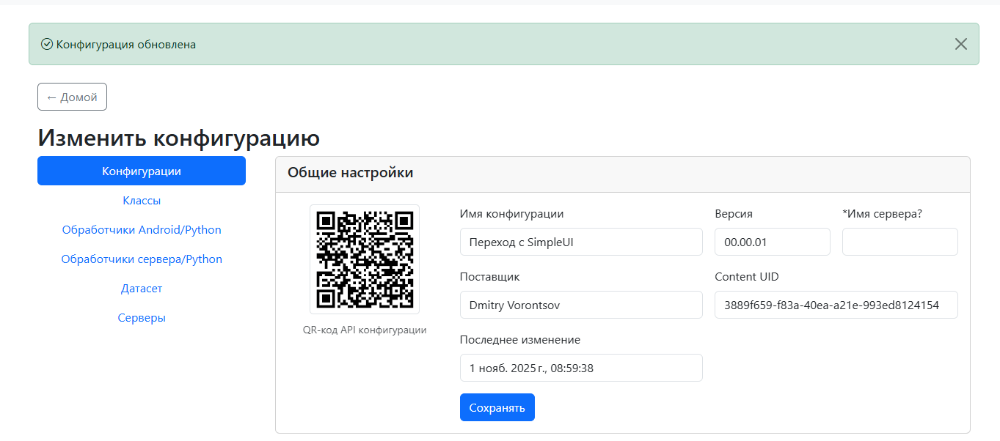
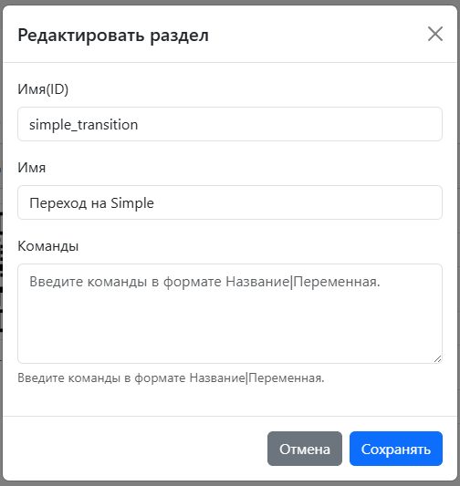
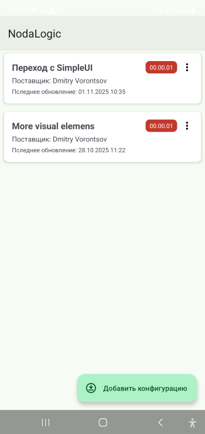
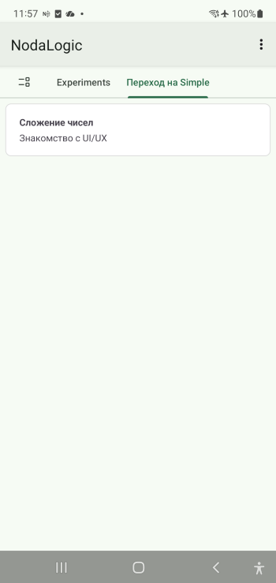
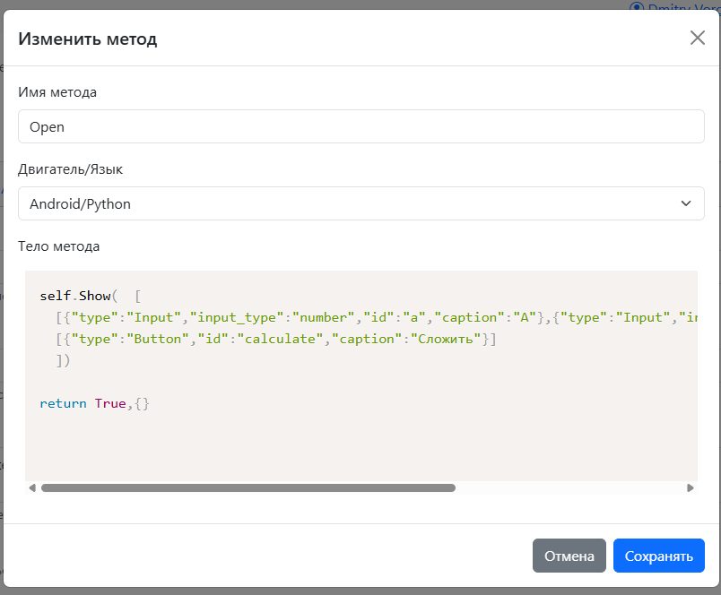
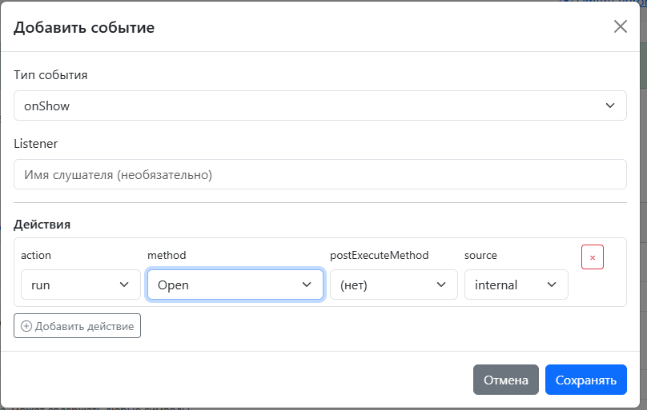
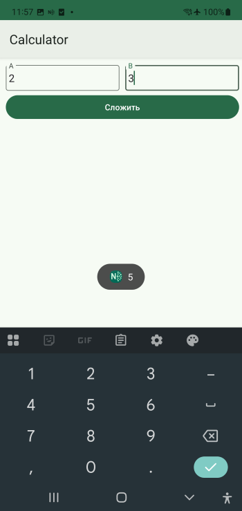
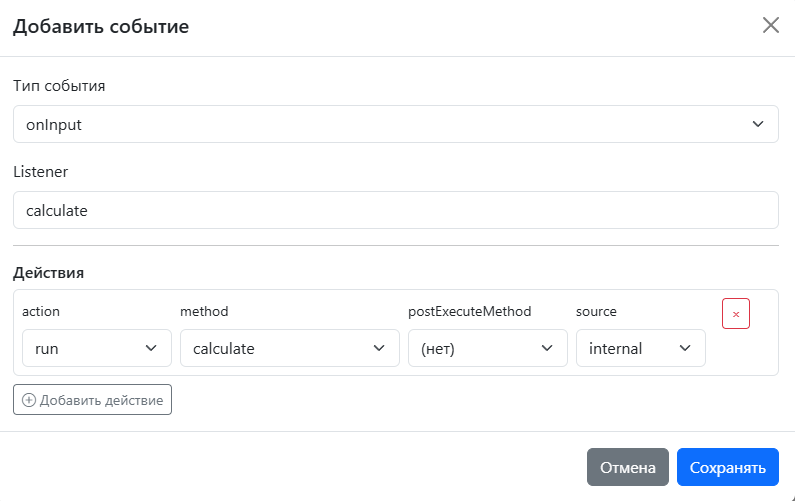
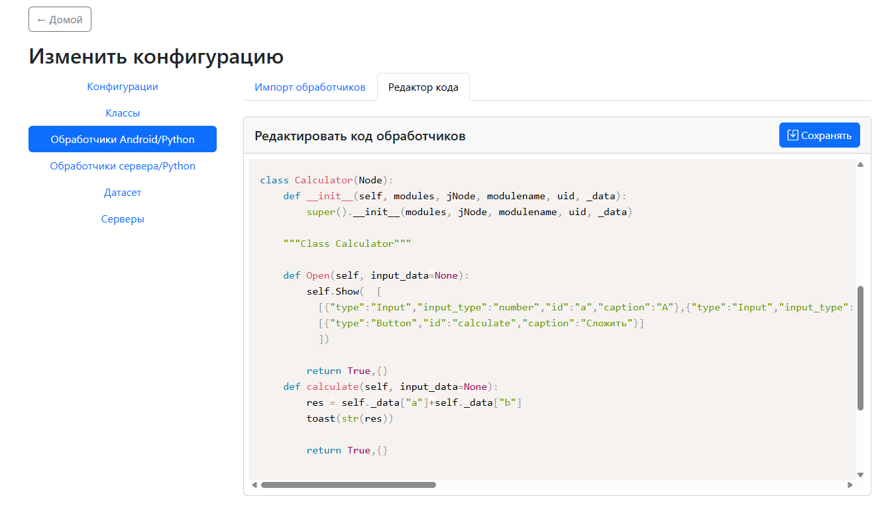

.. SimpleUI documentation master file, created by
   sphinx-quickstart on Sat May 16 14:23:51 2020.
   You can adapt this file completely to your liking, but it should at least
   contain the root `toctree` directive.

Переход с SimpleUI на NodaLogic
===================================

Как автор SimpleUI и новой платформы NodaLogic рекомендую для новых и планирующиеся проектов рассмотреть переход на NodaLogic. Я подготовил этот мини-гайд для тех, кто разрабатывал на Simple чтобы было проще понимать новую платформу в виде сравнения «как было на Simple/как это в Noda»

NodaLogic покрывает больше целей чем SimpleUI, так как SimpleUI – это только мобильный фронт, а Noda – это распределенные приложения с серверами/облаками и возможности Simple являются подмножеством возможностей Noda. Но, в рамках данного гайда я намеренно не буду касаться основных принципов Noda – узлов данных, серверной части.

А что же тогда останется? Оказывается, если это все убрать, то останется в принципе то, чем является SimpleUI. Я даже не буду придумывать примеры а возьму первый пример из «Быстрого старта».

Итак, для начала авторизируемся в https://nmaker.pw/. Я рекомендую также зайти в свой профиль и установить Отображаемое имя – это не обязательно, но будет красиво отображаться в репозитории.
Далее мы создаем новую конфигурацию, зададим ей какое то имя и сохраним его.

И ниже в «Разделы» добавим новый раздел. Кстати, крайне рекомендую посмотреть в примерах использование команд в разделах – очень удобная штука. Можно не заходя в процесс/узел делать какие то вещи. Ну а сейчас мы просто создали раздел

На этом этапе мы уже можем поставить конфигурацию на устройство. Важное отличие в том, что на клиенте одновременно может быть активного сколько угодно конфигураций. Они могут располагаться в разных разделах, в одних и тех же разделах. Они могут быть даже не видны вообще (выполнять какие то действия фоном).

Зайдем в Настройки-Репо конфигураций-Добавить конфигурацию и отсканируем QR-код. В меню есть еще один QR-код, он для rooms, он пока не нужен.

В результате должна загрузиться конфигурация и появиться раздел в котором ничего нет.

Сделаем процесс, который сложит 2 числа в полях ввода:

1.	Зайдем в Классы и создадим класс Calculator. Тип класса – Пользовательский процесс. Это как раз аналог «процесса» в Simple. Это тоже узел, но существующий в единственном экземляре и его не надо создавать – он создается при загрузке конфигурации. Во всех остальных отношениях – это такой же узел как и остальные.

2.	Без обложки классы выглядят непрезентабельно. Обложка как и остальные места где есть UI задаются в виде общей «строковой» разметки. О ней на следующем шаге а пока сделайте вот что: скопируйте текст из подсказки ниже и поправьте примерно так: ``[[{"type":"Text","value":"Сложение чисел","bold":true}],[{"type":"Text","value":"Знакомство с UI/UX"}]]``

Также укажем наш раздел

И надо нажать "Сохранить"

3.	Далее добавим метод, назовем его Open, тип engine – Android/Python

И напишем в нем такую команду

.. code-block:: Python

 self.Show(  [
  [{"type":"Input","input_type":"number","id":"a","caption":"A"},{"type":"Input","input_type":"number","id":"b","caption":"B"}],
  [{"type":"Button","id":"calculate","caption":"Сложить"}]  
  ])

Мы только что сделали команду, которая размещает 2 поля ввода числа и кнопку под ними.

Это так называемая основная («строковая») разметка в Noda. Она везде – в экранах, списках, диалогах, обложках. Есть еще альтернатива – разметка контейнерами, но о ней мы сейчас говорить не будем.

Суть разметки такова:

.. code-block:: Python
 
 [#вертикальный контейнер
 [{объект 1},{ объект 2}], #строка 1 по высоте элементов
 [] #строка 2 по высоте элементов
 …
 ]

Это то, что по умолчанию, свойства строк и объектов (высота/ширина/вес) можно менять + как я уже сказал использовать контейнеры (тоже объекты). Почему так по умолчанию? Это соотвествует наиболее частым задачам.

Почему я использовал динамическую разметку, а в Симпле была статическая в конфигураторе? Вот причины: 1) ее нагляднее читать 2) она проще понимается и генерируется LLM 3)она сразу динамическая, что надо то и нарисуешь. Соответственно экраны можно собирать из переопределяемых блоков. 

.. note:: Кстати об экранах – в Симпле они были, а тут их нет? Да, они логические. Фактически у узла 1 экран на котором можно выводить сколько угодно Show, переключаемых например по кнопке, а для удобство их можно упрятать на разные методы. Посмотрите первый пример из конфигурации Android – там есть 3 экрана.

Но метод еще не все. Мы должны повесить его на событие. Почему в Simple это было вместе, а тут надо делать дополнительное действие? Потому что это более гибкий подход. Например, метод, который мы сделали – его можно вызвать из кода другого обработчика, он сделает то же что и по событию – перерисует экран
Поэтому добавим 

Теперь можно обновить конфу (меню опций - Перезапустить). И посмотреть что получилось.

4.	Кнопка есть, но не работает. Добавим метод calculate. 

С таким кодом:

.. code-block:: Python

 res = self._data["a"]+self._data["b"]
 toast(str(res))

Обратите внимание на то что происходит. self – это сам узел. У узла есть _data – это его динамическая и одновременно хранимая (если сохранять) память. В Simple это hashMap, но в Simple hashMap был строковый, а тут – JSON-совместимый. 

Числа автоматически попадают туда как числа а не как строки, их не надо преобразовывать.

И надо повесить событие. Мы делали кнопку с id=calculate, поэтому мы сделаем соытие onInput с фильтром по listener= calculate

Обновим конфу и проверим как работает. Это все.

.. note:: Но для понимания как все устроено, зайдите в Конфигурация-Обработчики Андроид. Там вы увидите код нашего класса Calculator. Видно что он наследник Node, т.е. может пользоваться методами Node. Еще мы видим то, что это отельный модуль python который грузится когда грузится конфа, т.е. мы можем там размещать глобальные переменные и функции и пользоваться из разных классов. Но при этом редактировать из окна класса. На самом деле можно писать код прямо в модуле (или в своей IDE) – классы его подхватят. Это по сути как python в Simple, но с поведением как у pythonscript
Далее в «Быстром старте» идут примеры по сканированию в таблицу и по датасетам. Они есть в конфигурации Android samples и видео с пояснением.
