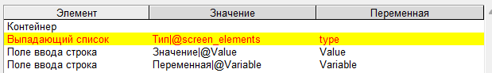
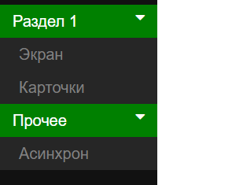

.. SimpleUI documentation master file, created by
   sphinx-quickstart on Sat May 16 14:23:51 2020.
   You can adapt this file completely to your liking, but it should at least
   contain the root `toctree` directive.

SimpleWEB
=======================

**SimpleWEB** это решение для создания десктопных, веб – фронтов, веб-приложений на семантике Simple. В отличии от SimpleUI, который предназначен только для Android, SimpleWEB закрывает все остальные ниши фронт-энд решений – фронты для облачных решений, для клиент-серверных решений, внешние фронты для ERP и т.д.. 

SimpleWEB технически представляет из себя библиотеку Python (uiweb)  которая умеет читать конфигурации в семантике Simple (ui-файлы) и создавать веб приложения, которые могут быть развернуты в локальной сети или у любого хостинг-провайдера, который поддерживает Python. При этом веб приложение использует web-сокеты для обеспечения высокой производительности и отзывчивости интерфейса и реализации более глубокого асинхрона и разнообразного взаимодействия через сокеты (прямое взаимодействие с клиентом от сервера). В процессе работы библиотека генерирует чистый html+CSS+JS/JQuery код и вставляет его динамически, т.е. элементы интерфейса, обработчики событий – все это создается на лету, адресно. 

Веб-приложение состоит из стартового приложения (например app.py), которое вызывает библиотеку uiweb и сервирует веб-сервер (например Flask), имеет некоторые вспомогательные методы (например команды загрузки/выгрузки файлов, редирект на страницу настроек). Библиотека в свою очередь обращается к конфигурации (*.ui) и файлу обработчиков, которые задаются в настройках через панель администрирования (http://localhost:1555/admin). Фактически, после загрузки через панель администрирования конфигурация и файл обработчиков копируются в файлы current_configuration.ui и current_handlers.py в папке приложения и далее библиотека работает уже с ними напрямую. Таким образом отладка и правка кода возможна прямо в current_handlers.py (после чего изменения можно перенести во внешний файл). Правку конфигурации в режиме разработки также проще делать сразу в current_configuration.ui чтобы изменения коммитились сразу в веб-приложение.

Для установки необходимо:
 
 1. Скачать с GitHub папку со стартовым скриптом app.py и развернуть там где она будет запускаться: https://github.com/dvdocumentation/simpleweb
 2. Установить зависимости: 

 ``pip install -r requirements.txt``

 и желательно еще потом обновить саму библиотеку uiweb (которая и есть SimpleWEB:

 ``pip install uiweb –upgrade``

 3. Запустить приложение app.py:

 ``python3 app.py``

 4. Приложение доступно по адресу http://localhost:1555/ после чего можно зайти в админку (http://localhost:1555/admin)  и поставить конфигурацию (ui-файл), при необходимости файл с c обработчиками и путь к веб-сервису если есть. На этом настройка закончена, можно пользоваться.

Отдельного обучения на SimpleWEB нет, т.к. оно мало отличается от SimpleUI. Для начала рекомендуется посмотреть конфигурацию first_configuration https://github.com/dvdocumentation/simpleweb/tree/main/samples/first_configuration

Особенности разработки в SimpleWEB, по сравнению с SimpleUI и основные возможности.
-------------------------------------------------------------------------------------------

Выполнение скриптов при загрузке страницы
~~~~~~~~~~~~~~~~~~~~~~~~~~~~~~~~~~~~~~~~~~~~

Не смотря на то, что в SimpleWEB присутствует событие onLaunch (которое запускается после окончании загрузки сеанса), есть также возможность встраивание кода непосредственно в HTML страницу, секцию head. Это могут быть скрипты, подключение библиотек, все что угодно. И это будет выполнено при загрузке страницы конфигурации (при открытии либо обновлении в браузере). Доступно в он-лайн конструкторе, в разделе "Конфигурация"

Вкладки
~~~~~~~~~~~~
Так как SimpleWEB - это десктопная система то основное действие происходит внутри вкладок, в отличии от SimpleUI где отрисовываются экраны. Но вкладку недостаточно просто открыть – есть еще ситуации, например повторного открытия такой же вкладки, при котором может потребоваться не создавать новую вкладку, а переоткрыть существующую и другие потребности в управлении вкладками.

Вкладка открывается командой **OpenScreen** в которой можно передать процесс и экран из которого будет взят экран для новой вкладке.:

**OpenScreen**, параметры {"process":<процесс> screen":<экран>, ["key":<ключ>], ["reopen":true|false], ["no_close":true|false]}

Также есть необязательные параметры:

 **key** (необязательный) – можно задать уникальный ключ вкладки (например uid документа или название операции) по которому система будет понимать что такая вкладка уже открыта.Вкладки из основного меню, автоматически создаются с key = имени процесса
 
 **reopen** (необязательный)– если задать истина и потом повторно отправить OpenScreen с таким же key то вместо новой вкладки будет переоткрыта/обновлена ранее открытая. Это удобно, т.к. не надо задумываться о том, как найти уже открытую, чтобы не плодить новые вкладки
 
 **no_close** (необязательный) – запрет на ручное закрытие вкладки (убирается крестик)

Закрыть вкладку (помимо ручного закрытия) можно командой **CloseTab**:

**CloseTab**, с пустым параметром – закрывает текущую вкладку. В новой версии предыдущая вкладка становится активной.

**CloseTab**, <ключ> - закрывает вкладку с определенным ключом из пула открытых вкладок

Переключиться на открытую вкладку из кода можно с помощью **SelectTab**:

**SelectTab**, <ключ>

Блокировка/разблокировка всей линейки вкладок:
	
**BlockTabs** – заблокировать все вкладки от пользователя

**UnblockTabs** – разблокировать вкладки

Отслеживание события выбора вкладки пользователем.
"""""""""""""""""""""""""""""""""""""""""""""""""""

Когда пользователь выбирает какую то из открытых вкладок, возникает общее событие **onWEBMainTabSelected**

В стек переменных попадает переменная CurrentTabKey, в которой содержится ключ открытой вкладки и CurrentTabID с внутренним ИД открытой вкладки. listener  = MainTabSelect

Прочие функции для работы с экранами и элементами экрана
~~~~~~~~~~~~~~~~~~~~~~~~~~~~~~~~~~~~~~~~~~~~~~~~~~~~~~~~~~~~~

**RefreshScreen** , без параметра – обновляет текущий экран. В SimpleWEB обновление не идет автоматом после события ввода, его надо запускать по необходимости, либо бользоваться командами SetValues, SetShow и т.п.

**ShowScreen**, имя экрана либо {"process":<процесс>,"screen":<экран>} – выводит на текущей вкладке заданный экран. Экран задается либо просто указанием экрана (из текущего процесса) либо в виде JSON с указанием процесса и экрана.

**Show_<переменная>**,<видимость: "-1","0","1"> - управление видимостью элементов аналогично команде в SimpleUI. Переменная элемента передается в ключе Show_, режим видимости срыт/невидим/виден- "-1"/"0"/"1" в параметре

**SetShow_<переменная>**,<видимость: "-1","0","1"> - управление видимостью, аналогичное Show_ но с той разницей, что изменение происходит не после обновления экрана, а мгновенно

Мгновенное обновление значений без обновления экрана
~~~~~~~~~~~~~~~~~~~~~~~~~~~~~~~~~~~~~~~~~~~~~~~~~~~~~~~~~~~~~

Значения могут быть перечитаны при обновлении вкладки/экрана, но кроме того они могут быть отправлены с сервера напрямую в элемент (через веб-сокеты):

Параметры передаются в виде JSON- массива :

[<переменная>:<новое значение>]

**SetValues** – заменяет текстовые значения (например надписи)

**SetVauesPulse** – заменяет текстовые значения с эффектом затухающей подсветки

**SetValuesTable** – обновляет таблицу

**SetValuesEdit** – обновляет поле ввода (текст в поле ввода)

**SetValuesCards** – обновляет список карточек

**SetValuesHTML** – заменяет HTML элемента с указанной переменной на ваш HTML

Диалоги
~~~~~~~~~~~~~

Поддерживается (синтаксис аналогичен SimpleUI: https://uitxt.readthedocs.io/ru/latest/common_functions.html#id24 ): 

 * ShowDialog
 * ShowDialogStyle
 * ShowDialogLayout

В случае использования ShowDialogLayout данные элементов ввода помещаются в JSON-словарь **dialog_values**
Также для SimpleWEB доступна опция назначать некоторые элементы диалога источниками событий. Это делается командой:

**ShowDialogActive**, <список переменных элементов через ;> - назначает некотрые элементы диалога "активными" - по ним будет генерироваться событие с listener=<имя переменной>.

Файлы
~~~~~~~~~~~

Загрузка файлов.
"""""""""""""""""""

**UploadFile**, [<id>] – команда, инициирующая диалог загрузки, можно передать id
Для загрузки в модуле приложения должна быть функция примерно такого вида:

.. code-block:: Python

  @fapp.route('/upload_file', methods = ['PUT', 'POST'])
  def upload_file_ui():
     file = request.files['file'] 
     if file.filename == '':
              #'No selected file'
              return redirect(request.url)
     if file:
            filename = request.args.get('sid')+"_"+secure_filename(file.filename)
            os.makedirs(PYTHONPATH+os.sep+fapp.config['UPLOAD_FOLDER'],exist_ok=True)
            file.save(PYTHONPATH+os.sep+os.path.join(fapp.config['UPLOAD_FOLDER'], filename))

            user = get_current_connection(request.args.get('sid'))
            user[2].input_event({"data":"upload_file","filename":filename,"source":request.args.get('id')})

После загрузки возникает событие listener = 'upload_file' с переменной 'filename', в которой храниться путь к файлу

Поле Файл на форме диалога
"""""""""""""""""""""""""""""

Для загрузки файла например в составе Диалога с содержимым, можно разместить поле Файл (file) в контейнере. После выбора файла, его содержимое в виде base64 помещается в переменную 'base64'

Скачивание файла через ссылку на экране
"""""""""""""""""""""""""""""""""""""""""

Для этого нужно :

1.	Разместить функцию такого вида:

.. code-block:: Python
 
 @fapp.route('/download_file', methods = ['GET', 'POST'])
 def download_file():
    os.makedirs(PYTHONPATH+os.sep+fapp.config['UPLOAD_FOLDER'],exist_ok=True)
    filename = request.args.get('filename')
    return send_from_directory(PYTHONPATH+os.sep+os.path.join(fapp.config['UPLOAD_FOLDER']), filename, as_attachment=True)

2.	Ссылку надписи сделать вида:

``'Файл можно скачать тут: <a href="/download_file?filename='+Path(filename).name+'" target="_blank">скачать</a>'``

Работа с буфером обмена
~~~~~~~~~~~~~~~~~~~~~~~~~~~~~~~~

Запись текста в буфер обмена
"""""""""""""""""""""""""""""""""""""

**WriteClipboard**,<текст> - копирует текст в буфер обмена. Для всех браузеров.

Чтение текста из текущего буфера обмена
"""""""""""""""""""""""""""""""""""""""""""

**ReadClipboard**,без параметра - читает буфер обмена, помещает в **clipboard_result** и вызывает событие listener=clipboard_result. Работает на Chrome либо в https либо в localhost. 

Работа с cookies
~~~~~~~~~~~~~~~~~~~~~~~~

**SetCookie**, [{"key":<ключ>,"value":<значение>,"expires":<количество дней>}] - устанавливает массив значений cookie для текущего сайта на ткущем компьютере. expires (время действия в днях) можно не задавать.
**GetCookies** - получить все ранее установленные значения cookie

Таблицы
~~~~~~~~~~

Доступны таблицы типа *table* с описанием аналогичным https://uitxt.readthedocs.io/ru/latest/common_functions.html#id2

В веб-версии есть отличия:

 1. Помимо **TableClick** доступен также **TableDoubleClick** – отдельное событие по двойному щелчку мыши
 2. Возможно использование автоматической сортировки , разбивки на страницы, поиска по полям с помощью компонента DataTable для этого надо использовать опцию useDatatable: true

 .. image:: _static/data_table.png
       :scale: 50%
       :align: center

 3. Доступно редактирование прямо в таблице для этого в заголовке надо установить режим "editmode": **"table"** и в полях, в которых требуется редактирование нужно указать тип элемента редактирование в поле **"input"**:

  * "input":"CheckBox"
  * "input":"EditTextText"
  * "input":"EditTextNumeric"

 В результате после редактирования возникнет событие **TableEdit** с доступными переменными **selected_line**, **table_column**, **table_value**

 .. image:: _static/table_edit.png
       :scale: 100%
       :align: center

 4.	Доступно формирование обработчиков для упрощенного добавления/редактирования записей в виде мобальных окон, которые формируются автоматически по полям таблицы. Для этого нужно:

	1.	В таблице указать "editmode": "modal"
	
	2.	указать тип элемента редактирование в поле "input":
		"input":"CheckBox"
		"input":"EditTextText"
		"input":"EditTextNumeric"
	
	3.	Вынести кнопки, в обработчиках которых формируются команды TableAddRow, <имя таблицы> и TableEditRow, <имя таблицы> . По этим кнопкам и будут запускаться диалоги. TableEditRow логичнее повесить на двойной клик например
	
	4.	По результату ввода в мобальном диалоге формируется событие TableEditModal в котором доступны переменные **table_values** и **selected_line**
                    
 .. image:: _static/modal_edit.png
       :scale: 70%
       :align: center

Списки карточек
~~~~~~~~~~~~~~~~~

Списки карточек имею аналогичную функциональность, в т.ч. размещение активных элементов спискам customcards: https://uitxt.readthedocs.io/ru/latest/common_functions.html#id4

Закладки внутри экрана
~~~~~~~~~~~~~~~~~~~~~~~~~~~~~~~

В качестве элементов контейнера можно использовать наборы закладок «Закладки», состоящие из контейнера типа «Закладка»

.. image:: _static/tabs.png
       :scale: 100%
       :align: center

Доступно использование команды **SelectTab**, <переменная закладки> для внутренних вкладок для выбора текущей вкладки

Логин
~~~~~~~~

Доступно использование признака процесса «Запускать при запуске» - тогда при загрузке страницы конфигурации будет запускаться выбранный процесс, при этом остальное меню процессов загружаться не будет, тем самым блокируя доступ к остальным процессам (доступен только процесс логина).
В случае успешного прохождения логина (например, проверки пароля) нужно вызвать команду **LoginCommit** для того чтобы основное меню загрузилось в обычном режиме и можно было продолжить работу с конфигурацией

Асинхронные обработчики
~~~~~~~~~~~~~~~~~~~~~~~~~~~

Асинхронные обработчики возвращают результат в ту вкладку, из которой были запущены.

Стили оформления
~~~~~~~~~~~~~~~~~~~~~

Для элементов доступно задание стиля оформления в виде CSS (через элементы  стилей). Таким образом можно получить доступ к люому оформлению элементов. В элементе стиля надо включить галочку «Использовать как класс» и заполнить поле CSS 

Уведомления, тосты, звуки
~~~~~~~~~~~~~~~~~~~~~~~~~~~~~~

**toast**, <текст сообщения> - всплывающее уведомление, возможно указание в виде HTML

**basic_notification**, {"message":<сообщение>,"title":<заголовок>} – уведомление в отдеьном окне с заголовком

**beep**,пустой параметр – проигрывание звука

Упрощенное определение полей ввода
~~~~~~~~~~~~~~~~~~~~~~~~~~~~~~~~~~~~~~~

Для задания конструкции в виде «Заголовок поля ввода» - «Поле ввода», вместо горизонтального контейнера, надписи и поля ввода для поле типа «Поле ввода текст», «Поле ввода строка», «Поле ввода с автозаполнением», «Выпадающий список» и подобных можно определи конструкцию формата:

<Заголовок поля>|@<значение по умолчанию>

Или для списков:

<заголовок поля>|@<переменная списка>

Расширенная работа с меню.
~~~~~~~~~~~~~~~~~~~~~~~~~~~~~~~

По умолчанию меню формируется по списку процессов (за исключением процессов «Не показывать в меню», «Запускать при запуске»). Также можно сгруппировать меню по разделам. Для этого нужно указать в поле Шаблон меню, структуру меню например в таком формате:

[{"caption":<заголовок раздела>,"elements":[{"caption":<заголовок процесса>,"process":<имя процесса>}]}]

Например:

[{"caption":"Раздел 1","elements":[{"caption":"Экран","process":"экран"},{"caption":"список карточек","process":"список карточек"}]},{"caption":"Прочее","elements":[{"caption":"Асинхрон","process":"Асинхрон"}]}]

Особенности работы с полем HTML
~~~~~~~~~~~~~~~~~~~~~~~~~~~~~~~~~~

Поле HTML позволяет разместить в контейнере любой свой код HTML со скриптами, стилями и т.д. Пример подходит например от https://infostart.ru/1c/articles/1716745/ (накладная) 
Особенность заключается в том, что если вы хотите чтобы клик на элементе обработался стандартным образом, например на кнопке, то нужно указать id, начинающийся с решетки:

``<button id="#btn_1" style="text-align: center;;margin: 3px">Кнопка 1</button>``

Но, также можно вызвать например свою функцию, которая отработает в вашем JS -скрипте.

Штрихкоды
~~~~~~~~~~~~~

Возможно подключение сканера штрих-кодов на клиенте в режиме «разрыв клавиатуры", эмуляция клавиш. Распознавание ведется по принципу определения быстрого ввода (генерация клавиш со сканера происходит быстро, задержка меньше 1 секунды). Генерируется событие barcode которое обрабатывается по тому же принципу что и в SimpleUI

Список общих событий, поддерживаемых SimpleWeb
-------------------------------------------------------

 * onLaunch - событие при загрузке конфигурации
 * onWEBMainTabSelected - событие при активации вкладки

Список поддерживаемых визуальных элементов контейнера
-------------------------------------------------------

 * Закладки, закладка
 * Контейнер
 * Надпись
 * Поле ввода текст 
 * Поле с автозаполнением
 * Поле ввода число
 * Поле ввода пароля
 * Многострочный текст
 * Файл
 * Поле ввода даты
 * Выпадающий список
 * Галочка
 * Кнопка
 * Картинка
 * Таблица
 * Список карточек
 * Поле HTML
