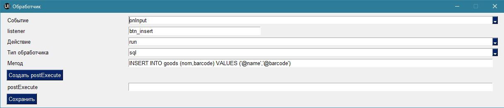
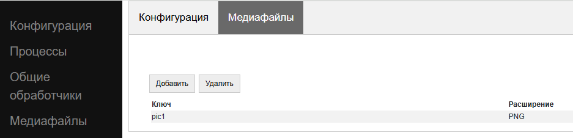

.. SimpleUI documentation master file, created by
   sphinx-quickstart on Sat May 16 14:23:51 2020.
   You can adapt this file completely to your liking, but it should at least
   contain the root `toctree` directive.

Хранение данных (SQL, NoSQL, файлы)
======================================

SQL
------

Стандартным для Android является встроенный SQLite. Его преимущества в том, что это классическая реляционная СУБД – быстрая работа, SQL запросы, агрегирующие функции. Например найти товар по штрихкоду из 1 миллиона записей, да еще по сложному условию -это не сделать быстрее чем на SQL с индексами. Или например посчитать агрегаты – сумму по строкам таблицы. Опять же быстрее SQL с этим никто не справиться.

Можно завести несколько СУБД в рамках приложения.

.. warning::  Особенность SQLite на Android. SQLite на Android плохо реагирует на многопользовательские подключения. А это, к примеру может быть например работа в фоне по расписанию и параллельно какая то запись в базу из экрана. Для этого начиная с релиза 11 все движения с SQL предлагается делать через единую точку подключения (подробнее в статье по 11 релизу)

К SQL можно обращаться из Python напрямую, в т.ч. использую ORM но рекомендуется использовать единую точку входа(SQLProvider) либо через команды перменные(ниже) либо через класс SimpleSQLProvider в Python либо через нативне обработчики (они также используют SimpleSQLProvider).Т.е. при обращаения к SQL используется Java-класс реализующий монопольное подключение к СУБД и общий поток событий.

Можно работать с SQL через команды-переменные либо(если из питон-обработчиков) использовать вызовы специального класса в явном виде. 

Вот справочник команд-переменных:

**SQLConnectDatabase**, имя базы. Так как указывается имя базы предполагается что можно использовать несколько баз, помимо дефолтной.

**SQLExec**,{"query":"SQL statement","params":"parameters with delimiter"} Например {"query":"create table IF NOT EXISTS goods (id integer primary key autoincrement,art text, barcode text, nom text)","params":""}. Выполняет запрос на изменение БД (все кроме SELECT), параметры в запросе указываются в неименованном виде, а в params, перечисляются через запятую. Например:

**SQLExecMany**, ,{"query":"SQL statement","params":"array of parameters"}  – выполняет запрос в  BULK-режиме с массивом из множества записей. Параетры запроса передаются в виде массива записей в неименованном виде (через ?)

Пример:

.. code-block:: Python

  values=[]
  for i in range(1,3):
        record =[]
        record.append("AA"+str(i))
        record.append("22"+str(i))
        record.append("Товар через переменную "+str(i))
        values.append(record)
   
   
  hashMap.put("SQLExecMany",json.dumps({"query":"insert into goods(art,barcode,nom) values(?,?,?)","params":json.dumps(values,ensure_ascii=False)}))

**SQLParameter** – имеет смысл для SQLExecMany для передачи массива записей в качестве параметра из других обработчиков

**SQLQuery** ,{"query":"SQL statement","params":"parameters with delimiter"} – запрос типа SELECT, который пишет выборку в виде JSON-массива в стек переменных в SQLResult

**SQLQueryMany** ,{"query":"SQL statement","params":"parameters with delimiter"} – запрос типа SELECT, который пишет выборку в виде JSON-массива во врменный файл и в параметре SQLResultFile возвращает имя этого файла. Для очень большых выборок (>0.5 млн строк)

Те же функции можно вызывать из импортируемого класса напрямую. Этот вариант хорош тем что результат получаешь сразу а не на конец шага и его лучше использовать в python-обработчиках.

.. code-block:: Python

  from ru.travelfood.simple_ui import SimpleSQLProvider as sqlClass
  sql = sqlClass()
    success=sql.SQLExec("insert into goods(art,barcode,nom) values(?,?,?)","111222,22000332323,Некий товар")
    res = sql.SQLQuery("select * from goods where id=1","")
    if success:    
        hashMap.put("toast",res)

Работа с SQL напрямую через конфигурацию
~~~~~~~~~~~~~~~~~~~~~~~~~~~~~~~~~~~~~~~~~~~

Можно работать с SQL не через команды-переменные и не через Python, а напрямую. Это один из «нативных» обработчиков, работающих через единый провайдер. 
Данный вид обработчика удобно использовать для простых ситуаций – вытащить переменные из SQL по отбору, записать простой insert или update и т.д.
Что например можно делать этим инструментом:

1. Передавать любые поля в запрос из стека переменных через @, также как они передаются на форму например. Например, этот запрос запишет в таблицу name и barcode. Это касается и переменных запроса и условий.

.. image:: _static/sql1.JPG
       :scale: 100%
       :align: center

2. Select распознается как выборка и пишет результат в переменные в виде JSON-массива (такой же как если вызвать это через команду переменные или класс)

3. Но если в select написать limit 1 то обработчик запишет переменные 1й строки сразу в стек переменных. Удобно например при открытии сделать выборку, сразу получить переменные и привязать их на форму – без парсинга и т.е. 

 

ORM
~~~~~

Если же параллельных процессов не планируется, то удобнейшим вариантом работы с СУБД является ORM как концепция в целом, и Pony ORM в частности. Примеры работы с ORM есть во многих демо-конфигурациях, описание непосредственно Pony https://ponyorm.readthedocs.io/en/latest/firststeps.html

NoSQL
--------
 
.. warning::  Параллельно с SQL данные на устройстве теперь можно хранить в NoSQL- СУБД. Этот режим обладает множеством преимуществ, главное из которых - простота разработки. Хранение в NoSQL не исключает хранение в SQL - можно одновременно использовать и то и то.

.. note::  В Simple UI начиная с релиза 11.75 встроено 2 NoSQL: key-value, основанная на Paper (старая) и новая JSON-ориентированная SimpleBase

SimpleBase (JSON СУБД)
~~~~~~~~~~~~~~~~~~~~~~~~~~~~~

SimpleBase - это открытый проект безсерверной JSON-ориентированной СУБД на Python который встроен в SimpleUI в виде Python-библиотеки и параллельно реализован в apk в виде Java-реализации. В SimpleWEB, соотвественно, просто достаточно подключить библиотеку из pip.
Документация: https://simplebase.readthedocs.io/en/latest/# 
GitHub : https://github.com/dvdocumentation/simplebase

Это наиболее простой способ работы с локальным хранением – по сути чистый JSON, для которого не нужно знать SQL, да и вообще -на JSON в стеке симпла буквально все – команды, разметки экрана и перменных. Например: пришли документы из 1С по http – это JSON, его не надо растаскивать по таблицам а можно хранить как есть, работать с ним как есть, выводить на экран, заполнять экранные списки – JSON, обратно отсылать – то же JSON без собирания и упаковки. Получается это намного проще SQL, а из стека нужно знать только работу со словарями и списками  - итерации и вот это вот все.
За счет особой архитектуры работы с данными удалось добиться показателей скорости, сравнимых с SQL в критичных участках: добавление данных, поиск по индексу, текстовый поиск.
Свойства SimpleBase:
 * Мгновенное добавление новых записей в коллекции независимо от размера коллекции благодаря специальной архитектуре хранения.
 * Более быстрая работа с операциями, за счет того, что не требуется кодировать/декодировать всю коллекцию (которая может быть очень большой)
 * Коллекции всегда хранятся в оперативной памяти с отслеживанием изменений одновременно: данные перечитываются с диска только в том случае, если они были изменены другим процессом.
 * ACID для многопользовательской и многопоточной работы
 * Два типа индексов для ключевых типов запросов — хеш-индекс и специальное B-дерево для полнотекстового поиска.
 * Поддержка транзакций (сессий)

Интеграция SimpleBase на уровне Python-библиотеки
~~~~~~~~~~~~~~~~~~~~~~~~~~~~~~~~~~~~~~~~~~~~~~~~~~~~~~~

Базы SimpleBase хранятся в специальном каталоге SimpleBase в папке приложения. Базу можно располагать где угодно, но желательно прописывать путь к этой папке, для того, чтобы нативные функции могли работать с этой базой тоже. 
Для этого есть функция get_simplebase_files в классе SimpleUtilities

Инициализация будет выглядеть так

.. code-block:: Python

  from pysimplebase import SimpleBase

  db = SimpleBase("test_db",path=suClass.get_simplebase_dir(),timeout=200)

Вся остальная работа с СУБД согласно документации к SimpleBase

Интеграция SimpleBase нативными обработчиками и через команды-переменные
~~~~~~~~~~~~~~~~~~~~~~~~~~~~~~~~~~~~~~~~~~~~~~~~~~~~~~~~~~~~~~~~~~~~~~~~~~

Также, помимо python реализована поддержка на уровне приложения – через обработчики типа **nosql** и через команды-переменные. Через команды-переменные можно работать с СУБД онлайн – из 1С например. И также нативные обработчики (аналогично нативным SQL-обработчикам) доступны всегда, а Python доступен только когда приложение запущено в памяти (есть контекст приложения), а например елси приложение в памяти не висит, но при этом все еще доступен фоновый сервис или воркер – то Python в этот момент не доступен, в отличии от нативных обработчиков.

.. warning::  Нативные обработчики поддерживают только базовые CRUD функции + find(базовый) и all, со сложными запросами, индексами, сессиями  следует работать из python-обработчиков

Формат обработчиков типа обработчика nosql:

**<имя базы> <имя коллекции> <команда> <параметр, если есть>**

Например:

 
  ``dbnative test_1 insert {"txt":"Привет мир","count":1}``

Команды при успешном выполнении возвращают результат в переменную **NOSQLResult**
 
Все тоже самое поддерживается через команды-переменные с помощью общей команды "RunSimpleBase"

**RunSimpleBase**, параметр: < [{"database":<имя базы>,"collection":<имя коллекции>,"command":<команда>,"value":<значение>},…] >

Например:

.. code-block:: Python

  hashMap.put("RunSimpleBase",json.dumps([{"database":"dbnative","collection":"test_1","command":"insert","value":{"caption":"Hello world"}}]))

Старая NoSQL (ключ-значение)
~~~~~~~~~~~~~~~~~~~~~~~~~~~~~~~

В NoSQL СУБД данные хранятся в режиме "ключ - значение" а не в таблицах. В любой ключ можно записать любое значение - текст, JSON и т.д. Т.е. работа происходит с неструктурированной информацией. Структуры данных типа документов и справочников удобнее хранить в JSON.

С NoSQL базами можно работать через стек переменных и непосредственно из python– обработчиков. В случае работы через методы класса NoSQL преимуществом является получение результата сразу, также то что просты типы можно использовать как есть, без преобразования в строку.

Работа с NoSQL ключ-значение через методы класса NoSQL из python-обработчиков
"""""""""""""""""""""""""""""""""""""""""""""""""""""""""""""""""""""""""""""""""""

Для работы необходимо подключить класс NoSQL и создать объект. Импортировать класс можно двумя способами:

1-й вариант:

.. code-block:: Python

  from ru.travelfood.simple_ui import NoSQL as noClass
	
2-й варинт:

.. code-block:: Python

  from java import jclass
  
  noClass = jclass("ru.travelfood.simple_ui.NoSQL")

Далее нужно создать объект, указав в качестве параметра имя существующей или новой БД. Она будет создана при необходимости

.. code-block:: Python

  ncl = noClass("test_new_nosql")

Методы объекта:

**put(ключ, значение, регистрировать_в_очереди)** – помещает значение в указанный ключ. Значения типов строка, число, булево – можно помещать как есть. JSON лучше преобразоывать в строку. Пример: ncl.put("k1","Это строка",True)

**get(ключ)** – получает значение по ключу

**delete(ключ)** – удаляет ключ

**destroy()** – уничтожает все ключи базы

**getallkeys()** – получить список всех ключей базы в виде строки формата JSON-массива строк
	
**findJSON(поле,значение)** – медленный поиск среди всех объектов базы которые имеют тип JSON , объектов, в **поле** которых есть **значение**. Возвращает строку с JSON-массивом найденных объектов. Лучше использовать в базах, где мало значений, если значений много -лучше испоьзовтаь поиск с индексом.

Пример:

.. code-block:: Python

  j3 = {"name":"Дарья","surname":"Смирнова"}  
  ncl.put("jk3",json.dumps(j3,ensure_ascii=False),True)  

  #Поиск без индекса
  res = ncl.findJSON("name", "Дарья") 
  jres = json.loads(str(res).encode("utf-8"))   

**run_index** (имя_индекса,поле – создание индекса по JSON-объектам для дальнейшего использования для поиска. Создает, асинхроннно индекс, состоящий из объектов с указанным полем.

**findJSON_index** (имя_индекса, поле, значение)  – поиск по индексу. Возвращает строку с JSON-массивом найденных объектов. Поиск ведется по ключам, в которых записаны JSON-строки объектов.

Работа с NoSQL ключ-значение через стек переменных (команды-переменные)
""""""""""""""""""""""""""""""""""""""""""""""""""""""""""""""""""""""""""

Вся работа происходит через Переменные (в Python - hashMap). Например в Переменные передается команда к СУБД и данные, которые надо вставить. Данные, запрошенные из СУБД также возвращаются в Переменные.

В конфигурации можно определить название СУБД в поле "Имя базы noSQL" , чтобы у каждой конфигурации была собственная СУБД, а можно не использовать разделение, например чтобы можно было использовать общие данные.

1)Запись, чтение, удаление:

 * **(put_ключ, переменная)** - записать данные в СУБД в ключ 
 * **(get_ключ, переменная)** - получить данные из СУБД из ключа в переменную. Если в обработчике есть команды get_, find_ и finindex_ система извлекает данные из СУБД в Переменные, после чего вызывает событие "_results" (как бы новый такт обработчика)
 * **(del_ключ,)** - удалить ключ
 * **(getallkeys, переменная)** -  получить список всех ключей

2)Поиск и индексы:

 * **(find_имяпеременной, имяполя=значение)** - "условно медленный" поиск по объектам в СУБД. в "имяпеременной" возвращается JSON-массив найденных объектов. "имяполя" - имя поля в корне JSON объектов по кторому будет вестись поиск. Вид сравнение можно использовать "="(точное сравнение) или "~"(вхождение подстроки). Значение - значение поиска.
 * **(createindex_имяиндекса, имяполя)** и (findindex_имяиндекса, имяполя=значение). Индексы - загруженные в память таблицы значение - ключ, по которым происходит более быстрый поиск. Т.е. если индекс задать заранее, поиск будет произвдиться очень быстро - ведь это поиск по массивы у памяти а не в СУБД. Поэтому где в начале, возможно при запуске конфигурации, следует создать нужные индексы командой createindex_. Далее использовать команду findindex_, где в качестве параметра поиска уже использовать имя ранее созданного индекса.

3)Очередь

Очередь используется для автоматической фиксации изменённых или добавленных объектов. Это используется например для синхронизации - всегда можно получить список ключей, измененных на устройстве, чтобы выгрузить в основную систему. Очередь пишется автоматически, но ее можно выключить например при загрузке данных из учетной системы командой ("StopQueue","")

 * **_sys_queue** - переменная-очередь, в которой всегда содержится список ключей объектов, разделенных через ";"
 * **(removequeue,ключ)** - удалить ключ из очереди (например, при успешной выгрузке)

Работа с переменными. 
"""""""""""""""""""""""""""""""

Можно просто записать все переменные или список переменных в СУБД, а потом извлечь.

 * **(puthasmap,списокпеременных)** - записать дамп переменных в СУБД, списокпеременных - список имен переменных через ";"
 * **(gethashmap,)** - прочитать дамп переменных из СУБД в Переменные

Файлы
--------

Все файлы хранятся во внутренней папки приложения SimpleUI, которая полностью доступна из самого приложения, но недоступна для других приложений (кроме как через root). С файлами можно выполнять любые операции из обработчиков python  - читать содержимое папки, чистать файлы, записывать и т.д. Т.е. например, можно перехватить картинку, сделанную с камеры и выполнить кроп, сжатие в обработчике python а потом отправить на ресурс.
Например, зная путь к файлу можно его открыть:

.. code-block:: Python

  with open(filename, "rb") as image_file:
        encoded_string = base64.b64encode(image_file.read()).decode('utf-8')

Диалоги открытия и сохранения файла из экрана
~~~~~~~~~~~~~~~~~~~~~~~~~~~~~~~~~~~~~~~~~~~~~~~~~~

Открытие файла через диалог(пикер) состоит из комманды-переменной и обработчика события. 

.. hint:: Можно открывать файлы и не через диалог, а через открытие файла приложением Simple через Открыть (доступен соответствующий общий обработчик). 

**OpenExternalFile** , пустой параметр  – команда запуска диалога, при открытии файла генерируется событие **FileOpen** которое можно перехватить в обработчике типа *pythonbytes* в который попадает байт-массив открытого файла. 

Также доступно сохранение файла.

**SaveExternalFile** , параметр: {"path":<путь к внутреннему файлу>,"default":<имя по умолчанию>} – команда запуска диалога выбора локации сохранения файла и имени файла (можно выбрать имя по умолчанию). При успешном сохранении генерируется событие onInput listener = **FileSave**

Сохранение в Downloads
~~~~~~~~~~~~~~~~~~~~~~~~~~~~~~~~~~~~~~

В Java классе SimpleUtilites появилась функция **download_file(<имя файла>)** которая сохраняет файл (сформированный в папке приложения) во внешнюю паапку Downloads (коллекция Загрузки). 
Таким образом можно сбрасывать информацию в виде файлов безусловно.

Статические ресурсы
~~~~~~~~~~~~~~~~~~~~~~

Различные статические декорации (картинки, выводимые в экранах или меню) имеет смысл передавать вместе с конфигурацией. При загрузке конфигурации они сохраняются во временные файлы под определенным uuid, а для обращения к ним требуется ключ, указанный на закладке Медиафайлы
Если статический ресурс – картинка, то для вывода на форму достаточно указать ее ключ c префиксом **^** . Т.е. у элемента Картинка в «Заполнении поля» будет стоять ``^fire`` , где fire – ключ картинки на закладке Медиафайлы
Любой статический ресурс можно получить по ключу:

.. code-block:: Python

  from ru.travelfood.simple_ui import SimpleUtilites as suClass
  filename = suClass.get_stored_file("key")

Изображения
~~~~~~~~~~~~~~

Файлы, генерируемые на устройстве, это в том числе изображения с камеры или медиагалереи устройства, загружаемые с ключом mm_local, работа с которыми описана в соответствующих разделах. У подобных файлов при сохранении генерируется uuid, по которому к нему можно обратиться. Этот uuid равен имени файла. Можно просто работать с именем файла, запоминая его в своих структурах данных. Например при фотографировании в режиме mm_local в переменную (допустим переменная камеры называется photo) сохраняется абсолютный путь с приставкой _path, то есть в данном случае будет переменная photo_path.
Также, все идентификаторы хранятся в хранилище ключ-значение к которому есть доступ через getfiles. Подробнее об этом написано в графе «Режим работы с мультимедиа и файлами по ссылкам» Возможно этот механизм излишен, учитывая что первично у разработчика всегда есть абсолютный путь к файлу и хранение его он может организовать сам.
Обращаться к там файлам в контейнерах следует через **~** чтобы система поняла что вы передаете картинку в виде файла. Дело в том что по умолчанию она ожидает base64 строку. По возможности используйте файлы а не base64, особенно в карточках списков – это быстрее. Более полробнее это описано в графе «Режим работы с файлами изображений напрямую по абсолютному пути (через ~)»
В пакет приложения включен Pillow которая дает возможность работать с картинками – ресайз и т.д. Вот пример открытия файла, и отправки его запросом

.. code-block:: Python
  
  import json
  import requests
  import base64
  from PIL import Image
  import os
  from pathlib import Path
  from io import BytesIO
  from requests.auth import HTTPBasicAuth

  #...

  filename="path_to_file.jpg"
  if os.path.exists(filename): 
        image = Image.open(filename)
      
        image.resize((500, 500))
        buffered = BytesIO()
        image.save(buffered, format="JPEG")
        img_str = base64.b64encode(buffered.getvalue()).decode('utf-8')

        username=hashMap.get("WS_USER")
        password=hashMap.get("WS_PASS")
        url = hashMap.get("WS_URL")

        r = requests.post(url+'/data_upload', auth=HTTPBasicAuth(username, password,),
	   headers={'Content-type': 'application/json', 'Accept':     'text/plain'},data=json.dumps({"file":filename,"base64":img_str}))

Приведенный выше пример передает содержимое в виде строки base64, однако в случае с файлами, особенно большими лучше использовать вариант с потоковой передачей, которую поддерживает requests:

.. code-block:: Python

  with open('image-1.png', 'rb') as img_1:
      r = requests.post(url, auth=basic, data=img_1, headers=headers)

Полезные утилиты для работы с файлами в SimpleUtilites
~~~~~~~~~~~~~~~~~~~~~~~~~~~~~~~~~~~~~~~~~~~~~~~~~~~~~~~~~~~

Для удобства есть возможность генерировать временные файлы нужного расширения методом **get_temp_file**

.. code-block:: Python

  from ru.travelfood.simple_ui import SimpleUtilites as subclass
  output_file = suClass.get_temp_file("txt")

Получить абсолютный путь к папке, в которой можно хранить свои файлы можно с помощью **get_temp_dir()**

.. code-block:: Python

    targetDir = suClass.get_temp_dir()

