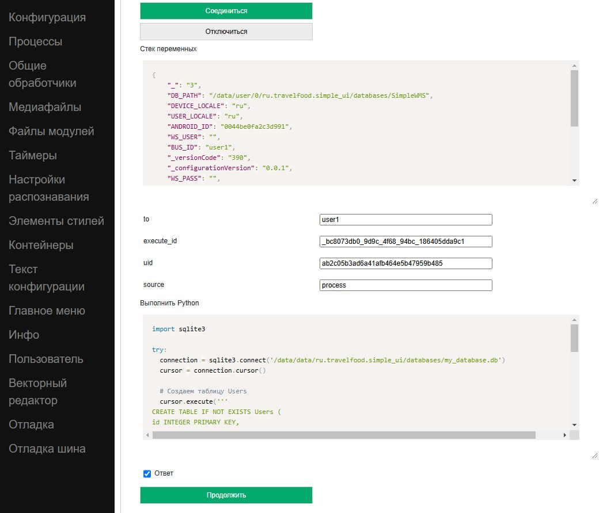

.. SimpleUI documentation master file, created by
   sphinx-quickstart on Sat May 16 14:23:51 2020.
   You can adapt this file completely to your liking, but it should at least
   contain the root `toctree` directive.

Хранение данных на устройстве (key/value, NoSQL, SQL)
========================================================

Рекомендуемые подходы к хранению
------------------------------------------

Актуальная и рекомендуемая конфигурация хранения предполагает использовать следующие инструменты для локального хранения в зависимости от характера данных и предполагаемого сценария использования (можно комбинировать эти инструменты):

 * **датасеты** резидентные в памяти с возможностью сохранить/загрузить локально для хранения **данных внешних систем** – справочников, ссылок и т.д. За счет глубокой интеграции в механизмы кофигурации разработка сильно урощается, а производительность -самая высокая
 * БД **«ключ/значение»** для хранения **простых данных** – например настроек приложения, констант, значений ввода, содержимого экранов
 * **NoSQL Pelican** для **собственных данных и всех остальных задач**. Это JSON-ориентированная СУБД, разработанная специально для Simple, которая в принципе по функционалу конечно же может заменить два предыдущих пункта, но датасеты имеют козырь в виде мощной интеграции в механизмы, а ключ/значение проще для ситуаций когда нужно просто положить/прочитать значение типа константы

Датасеты
~~~~~~~~~~~~~~~~~~~~

Описание готовится…

«Ключ/значение»
~~~~~~~~~~~~~~~~~~~~~~

Ключ значение в python-обработчиках (pythonscript, python, pythonargs)
"""""""""""""""""""""""""""""""""""""""""""""""""""""""""""""""""""""""""""

БД умеет хранить следующие значения:
 * Простые типы (стока, число, булево)
 * Словарь и список (dict и list) без предварительного преобразования
 * Типы данных Java, например hashMap без преобразования

Данные хранятся в БД для каждой конфигурации отдельно (т.е. разделены по uid-ам конфигураций). Для доступа ко функциям в модуле android используется объект **_local** (в pythonscript он уже импортирован из android) со следующими методами:
 * **put(<ключ>,<значение>)** – сохранить значение
 * **get(<ключ>)** – получить значение
 * **delete(<ключ>)** – удалить ключ
 * **destroy()** – удалить всю БД конфигурации
 * **keys()** – получить все ключи конфигурации в виде списка

Примеры (для pythonscript _local уже импортирован)

.. code-block:: Python

  
 #можно сохранять примитивные типы
 _local.put("my","hello")
 _local.put("number",25.4)
 _local.put("setting1",True)
  
 #можно сохранять dict и list
 my_object = {"name":"Jhon"}
 _local.put("j2",my_object )
  
 #можно сохранить стек переменных
 _local.put("map",hashMap)
  
 #получение значений
 toast(_local.get("my"))
 #получить все ключи
 keys = _local.keys()
 toast("Всего ключей:"+str(len(keys)))
 #получение объекта 
 j = _local.get("j2")
 if not j==None:
 	toast(str(j["name"]))

Ключ-значение в javascript-обработчиках
""""""""""""""""""""""""""""""""""""""""""""

Для хранения доступны примитивные типы (JSON придется преобразовать в строку и обратно)

Доступны команды: 
 * NoSQLPut(String database, String key,String value) – поместить значение в указанную БД
 * NoSQLGet(String database, String key) – получить значение
 * NoSQLDelete(String database, String key) – удалить значение
 * NoSQLGetAllKeys(String database) – получить массив ключей

Пример:

.. code-block:: JavaScript

 //Сохранение
 android.NoSQLPut("my_book","val1",hashMap.val1);
 android.toast("Сохранили");
 //Получение
 var val1=android.NoSQLGet("my_book","val1");
 if(val1==null){
 val1="";
 };
 android.toast(val1);

Полные примеры можно посмотреть тут: https://github.com/dvdocumentation/simpleui_samples/tree/main/javascript

Ключ-значение через стек переменных
""""""""""""""""""""""""""""""""""""""""

Следует иметь ввиду, что при работе через стек команды выполняются в конце такта, т.е. команда на получение данных из хранилища не вернет данные в переменную в этом же обработчике (требуется доп. событие). Также, так как стек-переменных строкового типа, доступна работа только со строками. 

 * **(put_ключ, переменная)** - записать данные в СУБД в ключ 
 * **(get_ключ, переменная)** - получить данные из СУБД из ключа в переменную. Если в обработчике есть команды get_ система извлекает данные из СУБД в Переменные, после чего вызывает событие "_results" (как бы новый такт обработчика)
 * **(del_ключ,)** - удалить ключ
 * **(getallkeys, переменная)** -  получить список всех ключей

JSON-ориентированная NoSQL Pelican
~~~~~~~~~~~~~~~~~~~~~~~~~~~~~~~~~~~~~

Pelican - это открытый проект безсерверной JSON-ориентированной СУБД на Python созданный специально для экосистемы Simple. Это наиболее простой способ работы с локальным хранением – по сути чистый JSON, в python это словари и списки. Синтаксис полностью такой же как в MongoDB и ранее созданной СУБД SimpleBase https://simplebase.readthedocs.io/en/latest/ . Т.е. можно сказать что это такой локальный, без сервера аналог MongoDB на устройстве. За счет особой архитектуры работы с данными удалось добиться показателей скорости, сравнимых с SQL и не зависящих от размера коллекции в критичных участках: добавление/изменение(upsert/update)/удаление данных, поиск по индексу, текстовый поиск. 

Свойства Pelican:

 * Мгновенное добавление новых записей/изменение/удаление записей **независимо от размера коллекции** благодаря специальной архитектуре хранения.
 * Более быстрая работа с операциями, за счет того, что не требуется кодировать/декодировать всю коллекцию (которая может быть очень большой)
 * Версионирование объектов 
 * Коллекции всегда хранятся в оперативной памяти с отслеживанием изменений одновременно: данные перечитываются с диска только в том случае, если они были изменены другим процессом.
 * ACID для многопользовательской и многопоточной работы
 * Два типа индексов для ключевых типов запросов — хеш-индекс и специальное B-дерево для полнотекстового поиска.
 * Поддержка транзакций (сессий)

GitHub проекта https://github.com/dvdocumentation/pelican_dbms

Использование в SimpleUI и других системах
"""""""""""""""""""""""""""""""""""""""""""""""

Так как Pelican это python-библиотека, то в общем случае (кроме SimpleUI) для нее требуется установка и далее импорт

``pip install pelicandbms``

далее:

.. code-block:: Python

 from pelicandb import Pelican
 db = Pelican("samples_db1") #опционально можно указать путь (path), работу только в памяти (RAM), работу только с одним потоком (singleton)

Но, в SimpleUI, так как это мобильное приложение Pelican уже встроен и имеются специальные механизмы для ускорения работы. Они заключаются в том, что в конфигурации указываются параметры инициализации баз данных  (массив БД, которые использует конфигурация) с настройками и этот процесс (а он может быть длительный) запускается при старте конфигурации в отдельном потоке, чтобы не тормозить загрузку. На выходе этого процесса получается стек инстансов pelicans к котрому можно обращаться как к БД, не тратя время на инициализацию, подгрузку индексов и т.д., т.е. обратившись к этому стеку мы получаем готовый инстанс БД

Настройки инициализации указываются в поле Pelican инициализация (в Конфигурация)

Тут нужно указать в виде JSON-массива настройки баз данных в виде объектов со следующими ключами:
 * **database** – имя СУБД
 * **initialize** (необязательный) – если True то БД будет инициализирована при старте конфигурации
 * **RAM** (необязатальный) – если True то база будет храниться только в ОЗУ
 * **singleton** (необязатальный) – не будет проверяться модифицированность данных другим процессом, что ускоряет запись данных
 * **data_folder** (необязатальный) – база данных будет размещена в папке Data конфигурации
 * **reindex_hash** (необязатальный) – массив с объектами вида [{<имя коллекции>:<имя ключа>}] для создания hash-индексов
 * **reindex_text** (необязатальный) – массив с объектами вида [{<имя коллекции>:<имя ключа>}] для создания B-tree индексов для текстового поиска

Тогда обращение к базам данных в обработчиках буде такое

.. code-block:: Python

 from pelican import pelicans
 db = pelicans['test'] #получаем готовую к использованию БД где угодно

.. note::  Следует учесть что инициализация, даже если она занимает несколько миллисекунд -не мгновенная, поэтому если вы хотите работать с pelicans в onLaunch то следует понимать, что на onLaunch выполняется в основном потоке, а инициализация – в паралльном, поэтому следут либо подождать (запустить бесконечный цикл ожидание ключа-базы в словаре pelicans) либо (лучшее решение) выполнять свой код после инициализации. Для этого, в процессе и после инициализации в системе возникает несколько общих событий:

 * **onPelicanInitAction** – доступны переменные PelicanInitDatabase и PelicanInitAction – событие по каждой базы из списка инициализации и для каждого шага. Например можно выводить уведомления об этом
 * **onPelicanInitialized** – событие, когда вся инициализаци завершена
 * **onPelicanInitError** – ошибка в процессе инициализации

Небольшой пример работы с библиотекой Pelican (полная версия примеров на все случаи жизни тут https://github.com/dvdocumentation/pelican_dbms/blob/main/samples_pelican_ru.py)

.. code-block:: Python

 from pelicandb import Pelican,DBSession,feed
 import os
 from pathlib import Path
 import os
 
 """
 Базовые примеры : CRUD-операции без транзакций, индексов
 """
 #Инициализация БД (общий случай), path= путь к каталогу БД 
 db = Pelican("samples_db1",path=os.path.dirname(Path(__file__).parent))
 #либо инициализация в SimpleUI через стек pelicans
 #from pelican import pelicans
 #a = pelicans[' samples_db1']
 
 #добавление документа без ИД
 id = db["goods"].insert({"name":"Банан"})
 print("Добавлено:",id,sep=" ")
  
 #добавление документа с ИД
 try:
     id = db["goods"].insert({"name":"Банан", "_id":"1"})
 except:
     print("Такой документ уже есть")    
 
 #Upsert документа
 db["goods"].insert({"name":"Персик", "price":100, "_id":"2"}, upsert=True)
 db["goods"].insert({"name":"Персик", "price":99, "_id":"2"}, upsert=True)
  
 #Добавление набора
 ids = db["goods"].insert([{"name":"Яблоко", "price":60}, {"name":"Груша", "price":70}], upsert=True)
 print("Добавлено:",ids,sep=" ")
  
 #Все документы коллекции
 result = db["goods"].all()
 print(result)
 
 #Получить по id
 result = db["goods"].get("2")
 print(result)
  
 #тоже самое через find
 result = db["goods"].find({"_id":"2"})
 print(result)
  
 #Получить по id конкретную версию документа
 result = db["goods"].get_version("2",0)
 print(result)

Примеры покрывают все сценарии использования и лучше изучать по ним, но также есть документация от SimpleBase (которая подходит к Pelican, отдельная по Pelican пока не готова). В частности может пригодится раздел Запросы (который в свою очередь совпадает с таковым от MongoDB) https://simplebase.readthedocs.io/en/latest/querys.html

С Pelican можно работать:

 * напрямую из обработчиков python (через стек pelicans или через инстанс класса)
 * через стек переменных (для всех не-python обработчиков)
 * через команду feed (для пакетной передачи. Описания нет, только примеры)

Конфигурация с примерами для SimpleUI доступна тут: https://github.com/dvdocumentation/simpleui_samples/tree/main/pelican_simpleui

Все это и другие нюансы рассказаны в видео и разобраны на примерах тут https://youtu.be/aEAzLWPgN2c

Альтернативные подходы к хранению
--------------------------------------------

SQL
~~~~~~

Стандартным для Android является встроенный SQLite. Его преимущества в том, что это классическая реляционная СУБД – быстрая работа, SQL запросы, агрегирующие функции. SQL хорош для устоявшейся архитектуры с множеством таблиц, связанных ключами. Или например посчитать агрегатные функции по большим таблица, например остатки. 

Можно завести несколько СУБД в рамках приложения. Более того, рекомендуется работать не с СУБД по умолчанию, а создать свою.

.. warning::  Особенность SQLite на Android. SQLite на Android плохо реагирует на многопользовательские подключения. А это, к примеру может быть например работа в фоне по расписанию и параллельно какая то запись в базу из экрана. Поэтому пара рекомендаций: 1) используйте для своей конфигурации отдельную базу. Так вы по крайней мере не будете пересекаться с приложением (котрое пишет тоже в свой SQL) 2) старайтесь обращатьсяк БД (даже на чтение) через единую точку подключения (singleton). По умолчанию в SimpleUI есть класс SimpleSQLProvider который реализует данный паттерн, но можно организовать и свой.

C SQLite можно работать:
 * напрямую из Python c помощью sqlite3
 * из Python с помощью ORM Pony
 * через стек переменных (реализовано через SimpleSQLProvider)
 * через singleton-класс SimpleSQLProvider
 * из javascript-обработчика (реализовано через SimpleSQLProvider )

Через sqlite3
""""""""""""""""""

Просто приведу пример, в котором значение имеет строка подключения к БД. Остальное -стандартно

.. code-block:: Python

 import sqlite3
 try:
  connection = sqlite3.connect('/data/data/ru.travelfood.simple_ui/databases/my_database.db')
  cursor = connection.cursor()
  
  # Создаем таблицу Users
  cursor.execute('''
  CREATE TABLE IF NOT EXISTS Users (
  id INTEGER PRIMARY KEY,
  username TEXT NOT NULL,
  email TEXT NOT NULL,
  age INTEGER
  )
  ''')

  # Сохраняем изменения и закрываем соединение
  connection.commit()

  # Добавляем нового пользователя
  cursor.execute('INSERT INTO Users (username, email, age) VALUES (?, ?, ?)', ('newuser', 'newuser@example.com', 28))

  # Сохраняем изменения и закрываем соединение
  connection.commit()
  
  cursor.execute('SELECT * FROM Users')
  users = cursor.fetchall()
  
  res=""
  for user in users:
    res+=str(user)
  
  connection.close()
  
  hashMap.put("result",res)
 except Exception as e:
  toast(str(e)) 

Через стек переменных
""""""""""""""""""""""""""""""""""""

**SQLConnectDatabase**, имя базы. Так как указывается имя базы предполагается что можно использовать несколько баз, помимо дефолтной.

.. code-block:: Python

 hashMap.put("SQLConnectDatabase","test_perform.DB")

**SQLExec**,{"query":<SQL запрос>,"params":<параметры через запятую либо JSON-массив>} Выполняет запрос на изменение БД (все кроме SELECT), параметры в запросе указываются в неименованном виде, а в params, перечисляются через запятую. Либо можно указать параметры через JSON-массив

Например:

.. code-block:: Python

 hashMap.put("SQLExec",json.dumps({"query":"create table IF NOT EXISTS goods (id integer primary key autoincrement,art text, barcode text, nom text)","params":""}))

**SQLExecMany**, {"query":"SQL statement","params":"array of parameters"}  – выполняет запрос в  BULK-режиме с массивом из множества записей. Параметры запроса передаются в виде массива записей в виде строки – JSON-массива

Пример:

.. code-block:: Python

  values=[]
  for i in range(1,3):
        record =[]
        record.append("AA"+str(i))
        record.append("22"+str(i))
        record.append("Товар через переменную "+str(i))
        values.append(record)
   
   
  hashMap.put("SQLExecMany",json.dumps({"query":"insert into goods(art,barcode,nom) values(?,?,?)","params":json.dumps(values,ensure_ascii=False)}))

**SQLParameter** – имеет смысл для SQLExecMany для передачи массива записей в качестве параметра из других обработчиков

**SQLQuery** ,{"query":"SQL statement","params":"parameters with delimiter"} – запрос типа SELECT, который пишет выборку в виде JSON-массива в стек переменных в SQLResult

**SQLQueryMany** ,{"query":"SQL statement","params":"parameters with delimiter"} – запрос типа SELECT, который пишет выборку в виде JSON-массива во врменный файл и в параметре 
**SQLResultFile** возвращает имя этого файла. Для очень большых выборок (>0.5 млн строк)

Через SimpleSQLProvider
"""""""""""""""""""""""""""""""

Приведенные выше команды стека переменных можно вызывать непосредственно из объекта класса SimpleSQLProvider. Этот вариант хорош тем что результат получаешь сразу а не на конец шага и его лучше использовать в python-обработчиках.

.. code-block:: Python

  from ru.travelfood.simple_ui import SimpleSQLProvider as sqlClass
  sql = sqlClass()
    success=sql.SQLExec("insert into goods(art,barcode,nom) values(?,?,?)","111222,22000332323,Некий товар")
    res = sql.SQLQuery("select * from goods where id=1","")
    if success:    
        hashMap.put("toast",res)

Использование Pony ORM
""""""""""""""""""""""""""""""""""""

Удобным вариантом работы с СУБД является ORM как концепция в целом, и Pony ORM в частности. Примеры работы с ORM есть во многих демо-конфигурациях, описание непосредственно Pony https://ponyorm.readthedocs.io/en/latest/firststeps.html

Пример можно посмотреть тут(но имейте ввиду, что конфигурация устаревшая): https://github.com/dvdocumentation/simpleui_samples/tree/main/Simple%20Warehouse

Работа с SQLlite в javascript-обработчике
"""""""""""""""""""""""""""""""""""""""""""""""""""""""

Реализован класс-обертка для SimpleSQLProvider  для непосредственного обращения к SQLite 

Актуальные примеры можно посмотреть тут. https://github.com/dvdocumentation/simpleui_samples/tree/main/javascript

Работа с СУБД устройства с компьютера
----------------------------------------------------------

На компьютере можно подключить устройство в режиме отладки (через облачную шину и редактор) и выполнять на конкретном устройстве код python-обработчика, немедленно получая ответы через стек переменных. На этом принципе можно сделать просмотр и манипулирование данными SQL (и других СУБД). Т.е. обработчик подключается к нужной базе, делает запрос, возможно получает ответ и кладет его (в виде строки JSON) в стек переменных, а разработчик просматривает его в JSON-редакторе.

Подробно этот способ описан в этом треде: https://t.me/simpledevchat/4817

